# Fixler Spelling for Plover
A fingerspelling system for the [Plover](https://www.openstenoproject.org/plover/) steno software.

This library currently provides quick access to 1726 characters.


## Design Goals
* provide upper and lowercase English alphabet
* systematize writing many Latin letters with diacritics
* allow use of many diacritics as combining diacritical marks
* systematize writing many ligatures, rotations, inversions, etc.
* include some other alphabets where possible (Greek, Russian, NATO...)


## Table of Contents
This is a long readme. GitHub provides a table of contents under the hamburger menu, at the top right of this readme.

The hamburger menu looks like this:


## Installation

Just save the `fixler-spelling.json` file somewhere locally, probably in your Plover config directory (`File → Open config folder` in Plover). Then add it to your dictionaries in Plover, wherever makes sense to you, or at the top, if you're not sure.

Note: This is not a Python dictionary.


## Notes on Design
### The Core
The core of this system is fingerspelling, and revolves around the Latin letters with diacritics, and alphabets that map well to and from Latin letters. That said, this library is not above including other, fun things that don't exactly fit, but also don't feel terribly out of place here.

### It's Just Outlines
Modifiers are not currently programmatic, and do not look at stroke history. This is not a Plover Python dictionary. The modifier system simply exports a JSON file mapping letters to outlines.

### System Letters
Because letter chords are part of the outlines with their modifiers, you must use the letter chords as defined in this library. This means if you use STK for "z", for example, and this system only exports STKPW, you must use this system's version when composing, e.g., the ẓ ("Z with dot below") character. Currently, the way around this is to modify the Python file, and reexport the dictionary. Note: This system does export both of those chords for Z/z, and their compositions..

### Precomposed Characters
All characters defined in this system, as seen in the "Used by" lists following each modifier in the [Available Diacritics and Other Modifiers](#available-diacritics-and-other-modifiers) section, and in the [All Characters List](#all-characters-list), are "precomposed" characters in Unicode, meaning they have a single code point in The Unicode Standard. Many letters with diacritics, encountered in the wild, are really composed of a base letter, with one or more [combining characters](https://en.wikipedia.org/wiki/Combining_character) following them, and your font rendering system does the work of displaying them in composed form, although they can look different, and may fail to render well, or not at all.

For example, "Z with acute" exists in Unicode (Ź: U+0179, ź: U+017A), and is thus defined in this system, but currently (Unicode v16.0), "Z with grave" does not, so it's **not** defined here. If you see a z with grave, somewhere, it's composed of small letter z (U+007A) followed by the combining grave diacritic (U+0323). Even characters that do have a precomposed (single code point) version often show up in the wild as [composed versions](https://en.wikipedia.org/wiki/Unicode_equivalence) of themselves. (See: [When an é is not an é](https://nation.marketo.com/t5/product-blogs/when-an-e%CC%81-is-not-an-%C3%A9-about-unicode-precomposed-vs-decomposed/ba-p/339051)).

### Stacking Modifiers
Characters with more than one modifier, like "ẫ" ("A with circumflex and tilde"), are made by stroking the letter chord, followed by each modifier chord in sequence. The order of these is based on the Unicode name, where "ẫ" (Unicode code point U+1EAB) is called "LATIN SMALL LETTER A WITH CIRCUMFLEX AND TILDE", and means you stroke the circumflex modifier before the tilde modifier.<BR><BR>Unicode has a collation order for diacritics, based on things like "closeness" to, and position around, the base character, but it's [a bit involved](https://www.unicode.org/reports/tr10/). Ultimately, Unicode doesn't care in what order diacritics are combined, and will normalize multiple diacritics back to a canonical ordering. Side note: The way around this is to use the [combining grapheme joiner](https://en.wikipedia.org/wiki/Combining_grapheme_joiner), but that's currently outside the scope of this system.

### Playing Nice
When coming up with alphabet enders, and the starter for combining diacritics, I tried hard not to stomp on some really great systems in the Plover world, including [Emily's Symbols](https://github.com/EPLHREU/emily-symbols), [Emily's Modifiers](https://github.com/EPLHREU/emily-modifiers), and [Jeff's phrasing system](https://github.com/jthlim/jeff-phrasing).<BR><BR>I also wrote some code to scour Plover's main.json, to find unique enders that don't conflict, when combined with the standard steno alphabet chords. For example,  I wouldn't use -FR as an ender, because AFR is the after– prefix, and EFR is "every". Tons of chords are open on the right-hand side, but are very uncomfortable to stroke. I tried to find things with some mnemonic aspect, that still felt ergonomic. That said, I did not scan everything out there for conflicts, like [Lapwing theory](https://lapwing.aerick.ca/), and [Cocoa theory](https://github.com/Kaoffie/cocoa-specs).


## Modifier Keys
The following 6 keys are used to add diacritics and other modifiers.

See the following section, [Using Modifiers](#using-modifiers), for usage instructions.
```
🅂🅃🄿🄷 🄾 🅵🅿🅻🅃🄳
🅂🄺🅆🅁 🄾 🆁🅱🅶🅂🅉
　　　🄰🄾 🄴🅄
```


## Using Modifiers
Modify base letters by stroking a diacritic or modifier outline, or sequences thereof, immediately after a base letter. See the [Available Diacritics and Other Modifiers](#available-diacritics-and-other-modifiers) section.

#### Examples
* á (A with acute): Stroke letter a, then the acute diacritic
* AE (AE ligature): Stroke a, then e, then the ligature modifier
* ẫ (A with circumflex and tilde) Stroke a, then each diacritic
* ǽ (AE ligature with acute) Stroke a, e, ligature, then acute


## Modifier Tweaks
Tweaks are added to a modifier stroke using the E and U keys.

The descriptions explain the general idea of each, but liberties are taken here and there by some modifiers, to eke more abilities from each, like, in one example, using the I (EU) tweak to mean "italic". See notes with each modifier in the [Available Diacritics and Other Modifiers](#available-diacritics-and-other-modifiers) section.

|Tweak|Description|
|-|-|
|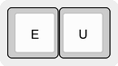|Neither E nor U pressed means no tweak to the modifier stroke.|
|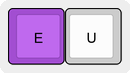|Think of E as meaning "extra". This is added to acute and grave strokes to double them, but also serves as a kind of wildcard when something "extra" is needed from a modifier, whatever that may be.|
|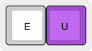|Think of U as meaning "under". This is added to various diacritic strokes to turn them into their "below" versions: breve below, circumflex below, line below, ring below, and tilde below.|
|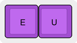|Think of EU (the "i" chord in steno) as meaning "invert".


## Available Diacritics and Other Modifiers

## Diacritics<BR>
In general, the diacritic chords are meant to visually resemble their symbols, to ease recall.

Diacritics are only a part of letter modification. See the rest in the modifiers section.

NOTE: Diacritics and their tweaks are part of the same stroke.

|Chord|Tweak|Notes|
|-|-|-|
|Acute| | |
|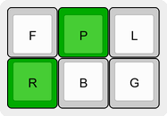||Shaped like the [acute accent](https://en.wikipedia.org/wiki/Acute_accent).<BR><BR>Used in: [Á](#char-latin-capital-letter-a-with-acute) [Ấ](#char-latin-capital-letter-a-with-circumflex-and-acute) [Ắ](#char-latin-capital-letter-a-with-breve-and-acute) [Ć](#char-latin-capital-letter-c-with-acute) [Ḉ](#char-latin-capital-letter-c-with-cedilla-and-acute) [É](#char-latin-capital-letter-e-with-acute) [Ế](#char-latin-capital-letter-e-with-circumflex-and-acute) [Ḗ](#char-latin-capital-letter-e-with-macron-and-acute) [Ǵ](#char-latin-capital-letter-g-with-acute) [Í](#char-latin-capital-letter-i-with-acute) [Ḯ](#char-latin-capital-letter-i-with-diaeresis-and-acute) [Ḱ](#char-latin-capital-letter-k-with-acute) [Ĺ](#char-latin-capital-letter-l-with-acute) [Ḿ](#char-latin-capital-letter-m-with-acute) [Ń](#char-latin-capital-letter-n-with-acute) [Ó](#char-latin-capital-letter-o-with-acute) [Ố](#char-latin-capital-letter-o-with-circumflex-and-acute) [Ṍ](#char-latin-capital-letter-o-with-tilde-and-acute) [Ṓ](#char-latin-capital-letter-o-with-macron-and-acute) [Ớ](#char-latin-capital-letter-o-with-horn-and-acute) [Ṕ](#char-latin-capital-letter-p-with-acute) [Ŕ](#char-latin-capital-letter-r-with-acute) [Ś](#char-latin-capital-letter-s-with-acute) [Ṥ](#char-latin-capital-letter-s-with-acute-and-dot-above) [Ú](#char-latin-capital-letter-u-with-acute) [Ṹ](#char-latin-capital-letter-u-with-tilde-and-acute) [Ǘ](#char-latin-capital-letter-u-with-diaeresis-and-acute) [Ứ](#char-latin-capital-letter-u-with-horn-and-acute) [Ẃ](#char-latin-capital-letter-w-with-acute) [Ý](#char-latin-capital-letter-y-with-acute) [Ź](#char-latin-capital-letter-z-with-acute) [á](#char-latin-small-letter-a-with-acute) [ấ](#char-latin-small-letter-a-with-circumflex-and-acute) [ắ](#char-latin-small-letter-a-with-breve-and-acute) [ć](#char-latin-small-letter-c-with-acute) [ḉ](#char-latin-small-letter-c-with-cedilla-and-acute) [é](#char-latin-small-letter-e-with-acute) [ế](#char-latin-small-letter-e-with-circumflex-and-acute) [ḗ](#char-latin-small-letter-e-with-macron-and-acute) [ǵ](#char-latin-small-letter-g-with-acute) [í](#char-latin-small-letter-i-with-acute) [ḯ](#char-latin-small-letter-i-with-diaeresis-and-acute) [ḱ](#char-latin-small-letter-k-with-acute) [ĺ](#char-latin-small-letter-l-with-acute) [ḿ](#char-latin-small-letter-m-with-acute) [ń](#char-latin-small-letter-n-with-acute) [ó](#char-latin-small-letter-o-with-acute) [ố](#char-latin-small-letter-o-with-circumflex-and-acute) [ṍ](#char-latin-small-letter-o-with-tilde-and-acute) [ṓ](#char-latin-small-letter-o-with-macron-and-acute) [ớ](#char-latin-small-letter-o-with-horn-and-acute) [ṕ](#char-latin-small-letter-p-with-acute) [ŕ](#char-latin-small-letter-r-with-acute) [ś](#char-latin-small-letter-s-with-acute) [ṥ](#char-latin-small-letter-s-with-acute-and-dot-above) [ú](#char-latin-small-letter-u-with-acute) [ṹ](#char-latin-small-letter-u-with-tilde-and-acute) [ǘ](#char-latin-small-letter-u-with-diaeresis-and-acute) [ứ](#char-latin-small-letter-u-with-horn-and-acute) [ẃ](#char-latin-small-letter-w-with-acute) [ý](#char-latin-small-letter-y-with-acute) [ź](#char-latin-small-letter-z-with-acute) [Ǽ](#char-latin-capital-letter-ae-with-acute) [Ǿ](#char-latin-capital-letter-o-with-stroke-and-acute) [ǽ](#char-latin-small-letter-ae-with-acute) [ǿ](#char-latin-small-letter-o-with-stroke-and-acute)|
|Double Acute| | |
|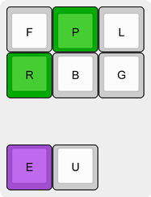||The [double acute accent](https://en.wikipedia.org/wiki/Double_acute_accent) uses the acute modifier shape, with the '[extra](#modifier-tweaks)' tweak.<BR><BR>Used in: [Ő](#char-latin-capital-letter-o-with-double-acute) [Ű](#char-latin-capital-letter-u-with-double-acute) [ő](#char-latin-small-letter-o-with-double-acute) [ű](#char-latin-small-letter-u-with-double-acute) [Ӳ](#char-cyrillic-capital-letter-u-with-double-acute) [ӳ](#char-cyrillic-small-letter-u-with-double-acute)|
|Breve| | |
|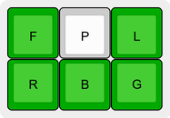||Shaped like the [breve](https://en.wikipedia.org/wiki/Breve).<BR><BR>Used in: [Ă](#char-latin-capital-letter-a-with-breve) [Ằ](#char-latin-capital-letter-a-with-breve-and-grave) [Ắ](#char-latin-capital-letter-a-with-breve-and-acute) [Ẵ](#char-latin-capital-letter-a-with-breve-and-tilde) [Ẳ](#char-latin-capital-letter-a-with-breve-and-hook-above) [Ặ](#char-latin-capital-letter-a-with-breve-and-dot-below) [Ĕ](#char-latin-capital-letter-e-with-breve) [Ḝ](#char-latin-capital-letter-e-with-cedilla-and-breve) [Ğ](#char-latin-capital-letter-g-with-breve) [Ĭ](#char-latin-capital-letter-i-with-breve) [Ŏ](#char-latin-capital-letter-o-with-breve) [Ŭ](#char-latin-capital-letter-u-with-breve) [ă](#char-latin-small-letter-a-with-breve) [ằ](#char-latin-small-letter-a-with-breve-and-grave) [ắ](#char-latin-small-letter-a-with-breve-and-acute) [ẵ](#char-latin-small-letter-a-with-breve-and-tilde) [ẳ](#char-latin-small-letter-a-with-breve-and-hook-above) [ặ](#char-latin-small-letter-a-with-breve-and-dot-below) [ĕ](#char-latin-small-letter-e-with-breve) [ḝ](#char-latin-small-letter-e-with-cedilla-and-breve) [ğ](#char-latin-small-letter-g-with-breve) [ĭ](#char-latin-small-letter-i-with-breve) [ŏ](#char-latin-small-letter-o-with-breve) [ŭ](#char-latin-small-letter-u-with-breve)|
|Breve Below| | |
|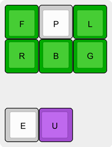||The [breve below](https://en.wikipedia.org/wiki/Breve#Breve_below) uses the breve modifier shape, with the '[under](#modifier-tweaks)' tweak.<BR><BR>Used in: [Ḫ](#char-latin-capital-letter-h-with-breve-below) [ḫ](#char-latin-small-letter-h-with-breve-below)|
|Breve Inverted| | |
|||Shaped like the [inverted breve](https://en.wikipedia.org/wiki/Inverted_breve) symbol.<BR><BR>Used in: [Ȃ](#char-latin-capital-letter-a-with-inverted-breve) [Ȇ](#char-latin-capital-letter-e-with-inverted-breve) [Ȋ](#char-latin-capital-letter-i-with-inverted-breve) [Ȏ](#char-latin-capital-letter-o-with-inverted-breve) [Ȓ](#char-latin-capital-letter-r-with-inverted-breve) [Ȗ](#char-latin-capital-letter-u-with-inverted-breve) [ȃ](#char-latin-small-letter-a-with-inverted-breve) [ȇ](#char-latin-small-letter-e-with-inverted-breve) [ȋ](#char-latin-small-letter-i-with-inverted-breve) [ȏ](#char-latin-small-letter-o-with-inverted-breve) [ȓ](#char-latin-small-letter-r-with-inverted-breve) [ȗ](#char-latin-small-letter-u-with-inverted-breve)|
|Caron| | |
|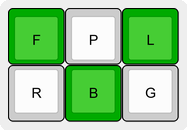||Shaped like the [caron](https://en.wikipedia.org/wiki/Caron).<BR><BR>Used in: [Ǎ](#char-latin-capital-letter-a-with-caron) [Č](#char-latin-capital-letter-c-with-caron) [Ď](#char-latin-capital-letter-d-with-caron) [Ě](#char-latin-capital-letter-e-with-caron) [Ǧ](#char-latin-capital-letter-g-with-caron) [Ȟ](#char-latin-capital-letter-h-with-caron) [Ǐ](#char-latin-capital-letter-i-with-caron) [Ǩ](#char-latin-capital-letter-k-with-caron) [Ľ](#char-latin-capital-letter-l-with-caron) [Ň](#char-latin-capital-letter-n-with-caron) [Ǒ](#char-latin-capital-letter-o-with-caron) [Ř](#char-latin-capital-letter-r-with-caron) [Ŝ](#char-latin-capital-letter-s-with-circumflex) [Š](#char-latin-capital-letter-s-with-caron) [Ṧ](#char-latin-capital-letter-s-with-caron-and-dot-above) [Ť](#char-latin-capital-letter-t-with-caron) [Ǔ](#char-latin-capital-letter-u-with-caron) [Ž](#char-latin-capital-letter-z-with-caron) [ǎ](#char-latin-small-letter-a-with-caron) [č](#char-latin-small-letter-c-with-caron) [ď](#char-latin-small-letter-d-with-caron) [ě](#char-latin-small-letter-e-with-caron) [ǧ](#char-latin-small-letter-g-with-caron) [ȟ](#char-latin-small-letter-h-with-caron) [ǐ](#char-latin-small-letter-i-with-caron) [ǰ](#char-latin-small-letter-j-with-caron) [ǩ](#char-latin-small-letter-k-with-caron) [ľ](#char-latin-small-letter-l-with-caron) [ň](#char-latin-small-letter-n-with-caron) [ǒ](#char-latin-small-letter-o-with-caron) [ř](#char-latin-small-letter-r-with-caron) [ŝ](#char-latin-small-letter-s-with-circumflex) [š](#char-latin-small-letter-s-with-caron) [ṧ](#char-latin-small-letter-s-with-caron-and-dot-above) [ť](#char-latin-small-letter-t-with-caron) [ǔ](#char-latin-small-letter-u-with-caron) [ž](#char-latin-small-letter-z-with-caron)|
|Cedilla| | |
|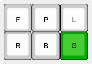||The [cedilla](https://en.wikipedia.org/wiki/Cedilla) is based on the "comma below" modifier stroke, with the '[extra](#modifier-tweaks)' tweak, because it's like a comma, but a little bit more than a comma.<BR><BR>Used in: [Ç](#char-latin-capital-letter-c-with-cedilla) [Ḉ](#char-latin-capital-letter-c-with-cedilla-and-acute) [Ḑ](#char-latin-capital-letter-d-with-cedilla) [Ȩ](#char-latin-capital-letter-e-with-cedilla) [Ḝ](#char-latin-capital-letter-e-with-cedilla-and-breve) [Ģ](#char-latin-capital-letter-g-with-cedilla) [Ḩ](#char-latin-capital-letter-h-with-cedilla) [Ķ](#char-latin-capital-letter-k-with-cedilla) [Ļ](#char-latin-capital-letter-l-with-cedilla) [Ņ](#char-latin-capital-letter-n-with-cedilla) [Ŗ](#char-latin-capital-letter-r-with-cedilla) [Ş](#char-latin-capital-letter-s-with-cedilla) [Ţ](#char-latin-capital-letter-t-with-cedilla) [ç](#char-latin-small-letter-c-with-cedilla) [ḉ](#char-latin-small-letter-c-with-cedilla-and-acute) [ḑ](#char-latin-small-letter-d-with-cedilla) [ȩ](#char-latin-small-letter-e-with-cedilla) [ḝ](#char-latin-small-letter-e-with-cedilla-and-breve) [ģ](#char-latin-small-letter-g-with-cedilla) [ḩ](#char-latin-small-letter-h-with-cedilla) [ķ](#char-latin-small-letter-k-with-cedilla) [ļ](#char-latin-small-letter-l-with-cedilla) [ņ](#char-latin-small-letter-n-with-cedilla) [ŗ](#char-latin-small-letter-r-with-cedilla) [ş](#char-latin-small-letter-s-with-cedilla) [ţ](#char-latin-small-letter-t-with-cedilla)|
|Circumflex| | |
|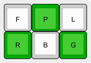||Shaped like the [circumflex](https://en.wikipedia.org/wiki/Circumflex).<BR><BR>Used in: [Â](#char-latin-capital-letter-a-with-circumflex) [Ầ](#char-latin-capital-letter-a-with-circumflex-and-grave) [Ấ](#char-latin-capital-letter-a-with-circumflex-and-acute) [Ẫ](#char-latin-capital-letter-a-with-circumflex-and-tilde) [Ẩ](#char-latin-capital-letter-a-with-circumflex-and-hook-above) [Ậ](#char-latin-capital-letter-a-with-circumflex-and-dot-below) [Ĉ](#char-latin-capital-letter-c-with-circumflex) [Ḓ](#char-latin-capital-letter-d-with-circumflex-below) [Ê](#char-latin-capital-letter-e-with-circumflex) [Ề](#char-latin-capital-letter-e-with-circumflex-and-grave) [Ế](#char-latin-capital-letter-e-with-circumflex-and-acute) [Ễ](#char-latin-capital-letter-e-with-circumflex-and-tilde) [Ể](#char-latin-capital-letter-e-with-circumflex-and-hook-above) [Ệ](#char-latin-capital-letter-e-with-circumflex-and-dot-below) [Ĝ](#char-latin-capital-letter-g-with-circumflex) [Ĥ](#char-latin-capital-letter-h-with-circumflex) [Î](#char-latin-capital-letter-i-with-circumflex) [Ĵ](#char-latin-capital-letter-j-with-circumflex) [Ḽ](#char-latin-capital-letter-l-with-circumflex-below) [Ṋ](#char-latin-capital-letter-n-with-circumflex-below) [Ô](#char-latin-capital-letter-o-with-circumflex) [Ồ](#char-latin-capital-letter-o-with-circumflex-and-grave) [Ố](#char-latin-capital-letter-o-with-circumflex-and-acute) [Ỗ](#char-latin-capital-letter-o-with-circumflex-and-tilde) [Ổ](#char-latin-capital-letter-o-with-circumflex-and-hook-above) [Ộ](#char-latin-capital-letter-o-with-circumflex-and-dot-below) [Ṱ](#char-latin-capital-letter-t-with-circumflex-below) [Û](#char-latin-capital-letter-u-with-circumflex) [Ŵ](#char-latin-capital-letter-w-with-circumflex) [Ŷ](#char-latin-capital-letter-y-with-circumflex) [Ẑ](#char-latin-capital-letter-z-with-circumflex) [â](#char-latin-small-letter-a-with-circumflex) [ầ](#char-latin-small-letter-a-with-circumflex-and-grave) [ấ](#char-latin-small-letter-a-with-circumflex-and-acute) [ẫ](#char-latin-small-letter-a-with-circumflex-and-tilde) [ẩ](#char-latin-small-letter-a-with-circumflex-and-hook-above) [ậ](#char-latin-small-letter-a-with-circumflex-and-dot-below) [ĉ](#char-latin-small-letter-c-with-circumflex) [ḓ](#char-latin-small-letter-d-with-circumflex-below) [ê](#char-latin-small-letter-e-with-circumflex) [ề](#char-latin-small-letter-e-with-circumflex-and-grave) [ế](#char-latin-small-letter-e-with-circumflex-and-acute) [ễ](#char-latin-small-letter-e-with-circumflex-and-tilde) [ể](#char-latin-small-letter-e-with-circumflex-and-hook-above) [ệ](#char-latin-small-letter-e-with-circumflex-and-dot-below) [ĝ](#char-latin-small-letter-g-with-circumflex) [ĥ](#char-latin-small-letter-h-with-circumflex) [î](#char-latin-small-letter-i-with-circumflex) [ĵ](#char-latin-small-letter-j-with-circumflex) [ḽ](#char-latin-small-letter-l-with-circumflex-below) [ṋ](#char-latin-small-letter-n-with-circumflex-below) [ô](#char-latin-small-letter-o-with-circumflex) [ồ](#char-latin-small-letter-o-with-circumflex-and-grave) [ố](#char-latin-small-letter-o-with-circumflex-and-acute) [ỗ](#char-latin-small-letter-o-with-circumflex-and-tilde) [ổ](#char-latin-small-letter-o-with-circumflex-and-hook-above) [ộ](#char-latin-small-letter-o-with-circumflex-and-dot-below) [ṱ](#char-latin-small-letter-t-with-circumflex-below) [û](#char-latin-small-letter-u-with-circumflex) [ŵ](#char-latin-small-letter-w-with-circumflex) [ŷ](#char-latin-small-letter-y-with-circumflex) [ẑ](#char-latin-small-letter-z-with-circumflex)|
|Circumflex Below| | |
|||The [circumflex below](https://en.wikipedia.org/wiki/Circumflex#Circumflex_below) uses the circumflex modifier shape, with the '[under](#modifier-tweaks)' tweak.<BR><BR>Used in: [Ḙ](#char-latin-capital-letter-e-with-circumflex-below) [Ṷ](#char-latin-capital-letter-u-with-circumflex-below) [ḙ](#char-latin-small-letter-e-with-circumflex-below) [ṷ](#char-latin-small-letter-u-with-circumflex-below)|
|Comma Below| | |
|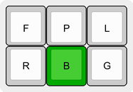||The [comma below](https://en.wikipedia.org/wiki/Comma#Diacritical_usage) mirrors the shape used for the comma in the [Emily's Symbols](https://github.com/EPLHREU/emily-symbols) plugin.<BR><BR>Used in: [Ș](#char-latin-capital-letter-s-with-comma-below) [Ț](#char-latin-capital-letter-t-with-comma-below) [ș](#char-latin-small-letter-s-with-comma-below) [ț](#char-latin-small-letter-t-with-comma-below)|
|Diaeresis/Umlaut| | |
|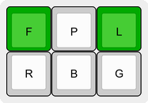||Shaped like the [diaeresis/umlaut](https://en.wikipedia.org/wiki/Two_dots_(diacritic)) symbols.<BR><BR>NOTE: [diaeresis](https://en.wikipedia.org/wiki/Diaeresis_(diacritic)) and [umlaut](https://en.wikipedia.org/wiki/Umlaut_(diacritic)) are distinct concepts, with separate uses, but are represented by the same Unicode code points. They are created via the same outline in this spelling system.<BR><BR>Used in: [Ä](#char-latin-capital-letter-a-with-diaeresis) [Ǟ](#char-latin-capital-letter-a-with-diaeresis-and-macron) [Ë](#char-latin-capital-letter-e-with-diaeresis) [Ḧ](#char-latin-capital-letter-h-with-diaeresis) [Ï](#char-latin-capital-letter-i-with-diaeresis) [Ḯ](#char-latin-capital-letter-i-with-diaeresis-and-acute) [Ṏ](#char-latin-capital-letter-o-with-tilde-and-diaeresis) [Ö](#char-latin-capital-letter-o-with-diaeresis) [Ȫ](#char-latin-capital-letter-o-with-diaeresis-and-macron) [Ṻ](#char-latin-capital-letter-u-with-macron-and-diaeresis) [Ü](#char-latin-capital-letter-u-with-diaeresis) [Ǜ](#char-latin-capital-letter-u-with-diaeresis-and-grave) [Ǘ](#char-latin-capital-letter-u-with-diaeresis-and-acute) [Ǖ](#char-latin-capital-letter-u-with-diaeresis-and-macron) [Ǚ](#char-latin-capital-letter-u-with-diaeresis-and-caron) [Ẅ](#char-latin-capital-letter-w-with-diaeresis) [Ẍ](#char-latin-capital-letter-x-with-diaeresis) [Ÿ](#char-latin-capital-letter-y-with-diaeresis) [ä](#char-latin-small-letter-a-with-diaeresis) [ǟ](#char-latin-small-letter-a-with-diaeresis-and-macron) [ë](#char-latin-small-letter-e-with-diaeresis) [ḧ](#char-latin-small-letter-h-with-diaeresis) [ï](#char-latin-small-letter-i-with-diaeresis) [ḯ](#char-latin-small-letter-i-with-diaeresis-and-acute) [ṏ](#char-latin-small-letter-o-with-tilde-and-diaeresis) [ö](#char-latin-small-letter-o-with-diaeresis) [ȫ](#char-latin-small-letter-o-with-diaeresis-and-macron) [ẗ](#char-latin-small-letter-t-with-diaeresis) [ṻ](#char-latin-small-letter-u-with-macron-and-diaeresis) [ü](#char-latin-small-letter-u-with-diaeresis) [ǜ](#char-latin-small-letter-u-with-diaeresis-and-grave) [ǘ](#char-latin-small-letter-u-with-diaeresis-and-acute) [ǖ](#char-latin-small-letter-u-with-diaeresis-and-macron) [ǚ](#char-latin-small-letter-u-with-diaeresis-and-caron) [ẅ](#char-latin-small-letter-w-with-diaeresis) [ẍ](#char-latin-small-letter-x-with-diaeresis) [ÿ](#char-latin-small-letter-y-with-diaeresis)|
|Diaeresis Below| | |
|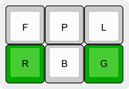||The diaeresis/umlaut shape, but lower.<BR><BR>Used in: [Ṳ](#char-latin-capital-letter-u-with-diaeresis-below) [ṳ](#char-latin-small-letter-u-with-diaeresis-below)|
|Dot Above| | |
|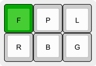||A single key, up high, like a [dot above](https://en.wikipedia.org/wiki/Dot_(diacritic)). See dot below.<BR><BR>Used in: [Ȧ](#char-latin-capital-letter-a-with-dot-above) [Ǡ](#char-latin-capital-letter-a-with-dot-above-and-macron) [Ḃ](#char-latin-capital-letter-b-with-dot-above) [Ċ](#char-latin-capital-letter-c-with-dot-above) [Ḋ](#char-latin-capital-letter-d-with-dot-above) [Ė](#char-latin-capital-letter-e-with-dot-above) [Ḟ](#char-latin-capital-letter-f-with-dot-above) [Ġ](#char-latin-capital-letter-g-with-dot-above) [Ḣ](#char-latin-capital-letter-h-with-dot-above) [İ](#char-latin-capital-letter-i-with-dot-above) [Ṁ](#char-latin-capital-letter-m-with-dot-above) [Ṅ](#char-latin-capital-letter-n-with-dot-above) [Ȯ](#char-latin-capital-letter-o-with-dot-above) [Ȱ](#char-latin-capital-letter-o-with-dot-above-and-macron) [Ṗ](#char-latin-capital-letter-p-with-dot-above) [Ṙ](#char-latin-capital-letter-r-with-dot-above) [Ṥ](#char-latin-capital-letter-s-with-acute-and-dot-above) [Ṡ](#char-latin-capital-letter-s-with-dot-above) [Ṧ](#char-latin-capital-letter-s-with-caron-and-dot-above) [Ṩ](#char-latin-capital-letter-s-with-dot-below-and-dot-above) [Ṫ](#char-latin-capital-letter-t-with-dot-above) [Ẇ](#char-latin-capital-letter-w-with-dot-above) [Ẋ](#char-latin-capital-letter-x-with-dot-above) [Ẏ](#char-latin-capital-letter-y-with-dot-above) [Ż](#char-latin-capital-letter-z-with-dot-above) [ȧ](#char-latin-small-letter-a-with-dot-above) [ǡ](#char-latin-small-letter-a-with-dot-above-and-macron) [ḃ](#char-latin-small-letter-b-with-dot-above) [ċ](#char-latin-small-letter-c-with-dot-above) [ḋ](#char-latin-small-letter-d-with-dot-above) [ė](#char-latin-small-letter-e-with-dot-above) [ḟ](#char-latin-small-letter-f-with-dot-above) [ġ](#char-latin-small-letter-g-with-dot-above) [ḣ](#char-latin-small-letter-h-with-dot-above) [i](#char-latin-small-letter-i) [ṁ](#char-latin-small-letter-m-with-dot-above) [ṅ](#char-latin-small-letter-n-with-dot-above) [ȯ](#char-latin-small-letter-o-with-dot-above) [ȱ](#char-latin-small-letter-o-with-dot-above-and-macron) [ṗ](#char-latin-small-letter-p-with-dot-above) [ṙ](#char-latin-small-letter-r-with-dot-above) [ṥ](#char-latin-small-letter-s-with-acute-and-dot-above) [ṡ](#char-latin-small-letter-s-with-dot-above) [ṧ](#char-latin-small-letter-s-with-caron-and-dot-above) [ṩ](#char-latin-small-letter-s-with-dot-below-and-dot-above) [ṫ](#char-latin-small-letter-t-with-dot-above) [ẇ](#char-latin-small-letter-w-with-dot-above) [ẋ](#char-latin-small-letter-x-with-dot-above) [ẏ](#char-latin-small-letter-y-with-dot-above) [ż](#char-latin-small-letter-z-with-dot-above)|
|Dot Below| | |
|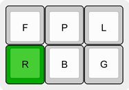||The [dot below](https://en.wikipedia.org/wiki/Dot_(diacritic)) stroke is chosen to mirror the shape used for the period in the [Emily's Symbols](https://github.com/EPLHREU/emily-symbols) plugin. A single key, down low, like a dot below. See dot above.<BR><BR>Used in: [Ạ](#char-latin-capital-letter-a-with-dot-below) [Ậ](#char-latin-capital-letter-a-with-circumflex-and-dot-below) [Ặ](#char-latin-capital-letter-a-with-breve-and-dot-below) [Ḅ](#char-latin-capital-letter-b-with-dot-below) [Ḍ](#char-latin-capital-letter-d-with-dot-below) [Ẹ](#char-latin-capital-letter-e-with-dot-below) [Ệ](#char-latin-capital-letter-e-with-circumflex-and-dot-below) [Ḥ](#char-latin-capital-letter-h-with-dot-below) [Ị](#char-latin-capital-letter-i-with-dot-below) [Ḳ](#char-latin-capital-letter-k-with-dot-below) [Ḷ](#char-latin-capital-letter-l-with-dot-below) [Ḹ](#char-latin-capital-letter-l-with-dot-below-and-macron) [Ṃ](#char-latin-capital-letter-m-with-dot-below) [Ṇ](#char-latin-capital-letter-n-with-dot-below) [Ợ](#char-latin-capital-letter-o-with-horn-and-dot-below) [Ọ](#char-latin-capital-letter-o-with-dot-below) [Ộ](#char-latin-capital-letter-o-with-circumflex-and-dot-below) [Ṛ](#char-latin-capital-letter-r-with-dot-below) [Ṝ](#char-latin-capital-letter-r-with-dot-below-and-macron) [Ṣ](#char-latin-capital-letter-s-with-dot-below) [Ṩ](#char-latin-capital-letter-s-with-dot-below-and-dot-above) [Ș](#char-latin-capital-letter-s-with-comma-below) [Ṭ](#char-latin-capital-letter-t-with-dot-below) [Ự](#char-latin-capital-letter-u-with-horn-and-dot-below) [Ụ](#char-latin-capital-letter-u-with-dot-below) [Ṿ](#char-latin-capital-letter-v-with-dot-below) [Ẉ](#char-latin-capital-letter-w-with-dot-below) [Ỵ](#char-latin-capital-letter-y-with-dot-below) [Ẓ](#char-latin-capital-letter-z-with-dot-below) [ạ](#char-latin-small-letter-a-with-dot-below) [ậ](#char-latin-small-letter-a-with-circumflex-and-dot-below) [ặ](#char-latin-small-letter-a-with-breve-and-dot-below) [ḅ](#char-latin-small-letter-b-with-dot-below) [ḍ](#char-latin-small-letter-d-with-dot-below) [ẹ](#char-latin-small-letter-e-with-dot-below) [ệ](#char-latin-small-letter-e-with-circumflex-and-dot-below) [ḥ](#char-latin-small-letter-h-with-dot-below) [ị](#char-latin-small-letter-i-with-dot-below) [ḳ](#char-latin-small-letter-k-with-dot-below) [ḷ](#char-latin-small-letter-l-with-dot-below) [ḹ](#char-latin-small-letter-l-with-dot-below-and-macron) [ṃ](#char-latin-small-letter-m-with-dot-below) [ṇ](#char-latin-small-letter-n-with-dot-below) [ợ](#char-latin-small-letter-o-with-horn-and-dot-below) [ọ](#char-latin-small-letter-o-with-dot-below) [ộ](#char-latin-small-letter-o-with-circumflex-and-dot-below) [ṛ](#char-latin-small-letter-r-with-dot-below) [ṝ](#char-latin-small-letter-r-with-dot-below-and-macron) [ṣ](#char-latin-small-letter-s-with-dot-below) [ṩ](#char-latin-small-letter-s-with-dot-below-and-dot-above) [ș](#char-latin-small-letter-s-with-comma-below) [ṭ](#char-latin-small-letter-t-with-dot-below) [ự](#char-latin-small-letter-u-with-horn-and-dot-below) [ụ](#char-latin-small-letter-u-with-dot-below) [ṿ](#char-latin-small-letter-v-with-dot-below) [ẉ](#char-latin-small-letter-w-with-dot-below) [ỵ](#char-latin-small-letter-y-with-dot-below) [ẓ](#char-latin-small-letter-z-with-dot-below)|
|Grave| | |
|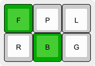||Shaped like the [grave accent](https://en.wikipedia.org/wiki/Grave_accent).<BR><BR>Used in: [À](#char-latin-capital-letter-a-with-grave) [Ầ](#char-latin-capital-letter-a-with-circumflex-and-grave) [Ằ](#char-latin-capital-letter-a-with-breve-and-grave) [È](#char-latin-capital-letter-e-with-grave) [Ề](#char-latin-capital-letter-e-with-circumflex-and-grave) [Ḕ](#char-latin-capital-letter-e-with-macron-and-grave) [Ì](#char-latin-capital-letter-i-with-grave) [Ǹ](#char-latin-capital-letter-n-with-grave) [Ò](#char-latin-capital-letter-o-with-grave) [Ồ](#char-latin-capital-letter-o-with-circumflex-and-grave) [Ṑ](#char-latin-capital-letter-o-with-macron-and-grave) [Ờ](#char-latin-capital-letter-o-with-horn-and-grave) [Ù](#char-latin-capital-letter-u-with-grave) [Ǜ](#char-latin-capital-letter-u-with-diaeresis-and-grave) [Ừ](#char-latin-capital-letter-u-with-horn-and-grave) [Ẁ](#char-latin-capital-letter-w-with-grave) [Ỳ](#char-latin-capital-letter-y-with-grave) [à](#char-latin-small-letter-a-with-grave) [ầ](#char-latin-small-letter-a-with-circumflex-and-grave) [ằ](#char-latin-small-letter-a-with-breve-and-grave) [è](#char-latin-small-letter-e-with-grave) [ề](#char-latin-small-letter-e-with-circumflex-and-grave) [ḕ](#char-latin-small-letter-e-with-macron-and-grave) [ì](#char-latin-small-letter-i-with-grave) [ǹ](#char-latin-small-letter-n-with-grave) [ò](#char-latin-small-letter-o-with-grave) [ồ](#char-latin-small-letter-o-with-circumflex-and-grave) [ṑ](#char-latin-small-letter-o-with-macron-and-grave) [ờ](#char-latin-small-letter-o-with-horn-and-grave) [ù](#char-latin-small-letter-u-with-grave) [ǜ](#char-latin-small-letter-u-with-diaeresis-and-grave) [ừ](#char-latin-small-letter-u-with-horn-and-grave) [ẁ](#char-latin-small-letter-w-with-grave) [ỳ](#char-latin-small-letter-y-with-grave)|
|Double Grave| | |
|||The [double grave](https://en.wikipedia.org/wiki/Double_grave_accent) uses the grave modifier shape, with the '[extra](#modifier-tweaks)' tweak.<BR><BR>Used in: [Ȁ](#char-latin-capital-letter-a-with-double-grave) [Ȅ](#char-latin-capital-letter-e-with-double-grave) [Ȉ](#char-latin-capital-letter-i-with-double-grave) [Ȍ](#char-latin-capital-letter-o-with-double-grave) [Ȑ](#char-latin-capital-letter-r-with-double-grave) [Ȕ](#char-latin-capital-letter-u-with-double-grave) [ȁ](#char-latin-small-letter-a-with-double-grave) [ȅ](#char-latin-small-letter-e-with-double-grave) [ȉ](#char-latin-small-letter-i-with-double-grave) [ȍ](#char-latin-small-letter-o-with-double-grave) [ȑ](#char-latin-small-letter-r-with-double-grave) [ȕ](#char-latin-small-letter-u-with-double-grave)|
|Hook Above| | |
|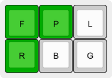||Shaped like the [hook above](https://en.wikipedia.org/wiki/Hook_above) symbol, sticking up, and curling to the left.<BR><BR>Used in: [Ẩ](#char-latin-capital-letter-a-with-circumflex-and-hook-above) [Ẳ](#char-latin-capital-letter-a-with-breve-and-hook-above) [Ả](#char-latin-capital-letter-a-with-hook-above) [Ể](#char-latin-capital-letter-e-with-circumflex-and-hook-above) [Ẻ](#char-latin-capital-letter-e-with-hook-above) [Ỉ](#char-latin-capital-letter-i-with-hook-above) [Ổ](#char-latin-capital-letter-o-with-circumflex-and-hook-above) [Ỏ](#char-latin-capital-letter-o-with-hook-above) [Ở](#char-latin-capital-letter-o-with-horn-and-hook-above) [Ủ](#char-latin-capital-letter-u-with-hook-above) [Ử](#char-latin-capital-letter-u-with-horn-and-hook-above) [Ỷ](#char-latin-capital-letter-y-with-hook-above) [ẩ](#char-latin-small-letter-a-with-circumflex-and-hook-above) [ẳ](#char-latin-small-letter-a-with-breve-and-hook-above) [ả](#char-latin-small-letter-a-with-hook-above) [ể](#char-latin-small-letter-e-with-circumflex-and-hook-above) [ẻ](#char-latin-small-letter-e-with-hook-above) [ỉ](#char-latin-small-letter-i-with-hook-above) [ổ](#char-latin-small-letter-o-with-circumflex-and-hook-above) [ỏ](#char-latin-small-letter-o-with-hook-above) [ở](#char-latin-small-letter-o-with-horn-and-hook-above) [ủ](#char-latin-small-letter-u-with-hook-above) [ử](#char-latin-small-letter-u-with-horn-and-hook-above) [ỷ](#char-latin-small-letter-y-with-hook-above)|
|Hook| | |
|||Distinct from 'hook above', which is a detached diacritic, the [hook](https://en.wikipedia.org/wiki/Hook_(diacritic)) is for characters with an attached hook. The hook modifier shape was chosen to match most of its examples in this system, which either curl up, then to the right, or to the left, then down, which makes the same curve. Imagine the chord shape attaching to some at the −R, and others at the −P. Ultimately, however, this one, of all the diacritic modifier chords, will just need to be memorized, because it doesn't visually match every example.<BR><BR>Used in: [Ɓ](#char-latin-capital-letter-b-with-hook) [Ƈ](#char-latin-capital-letter-c-with-hook) [ƈ](#char-latin-small-letter-c-with-hook) [Ɗ](#char-latin-capital-letter-d-with-hook) [Ƒ](#char-latin-capital-letter-f-with-hook) [ƒ](#char-latin-small-letter-f-with-hook) [Ɠ](#char-latin-capital-letter-g-with-hook) [Ƙ](#char-latin-capital-letter-k-with-hook) [ƙ](#char-latin-small-letter-k-with-hook) [Ƥ](#char-latin-capital-letter-p-with-hook) [ƥ](#char-latin-small-letter-p-with-hook) [Ƭ](#char-latin-capital-letter-t-with-hook) [ƭ](#char-latin-small-letter-t-with-hook) [Ƴ](#char-latin-capital-letter-y-with-hook) [ƴ](#char-latin-small-letter-y-with-hook) [ɓ](#char-latin-small-letter-b-with-hook) [ɗ](#char-latin-small-letter-d-with-hook) [ɠ](#char-latin-small-letter-g-with-hook)|
|Horn| | |
|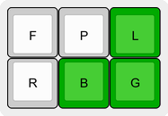||Shaped like the [horn](https://en.wikipedia.org/wiki/Horn_(diacritic)), sticking out to the right and curving upward. The shape is also on the right-hand side of the modifier keys cluster, as the horn attaches to the upper right side of its characters.<BR><BR>Used in: [Ơ](#char-latin-capital-letter-o-with-horn) [Ơ](#char-latin-capital-letter-o-with-horn) [Ờ](#char-latin-capital-letter-o-with-horn-and-grave) [Ớ](#char-latin-capital-letter-o-with-horn-and-acute) [Ỡ](#char-latin-capital-letter-o-with-horn-and-tilde) [Ở](#char-latin-capital-letter-o-with-horn-and-hook-above) [Ợ](#char-latin-capital-letter-o-with-horn-and-dot-below) [Ư](#char-latin-capital-letter-u-with-horn) [Ừ](#char-latin-capital-letter-u-with-horn-and-grave) [Ứ](#char-latin-capital-letter-u-with-horn-and-acute) [Ữ](#char-latin-capital-letter-u-with-horn-and-tilde) [Ử](#char-latin-capital-letter-u-with-horn-and-hook-above) [Ự](#char-latin-capital-letter-u-with-horn-and-dot-below) [ơ](#char-latin-small-letter-o-with-horn) [ơ](#char-latin-small-letter-o-with-horn) [ờ](#char-latin-small-letter-o-with-horn-and-grave) [ớ](#char-latin-small-letter-o-with-horn-and-acute) [ỡ](#char-latin-small-letter-o-with-horn-and-tilde) [ở](#char-latin-small-letter-o-with-horn-and-hook-above) [ợ](#char-latin-small-letter-o-with-horn-and-dot-below) [ư](#char-latin-small-letter-u-with-horn) [ừ](#char-latin-small-letter-u-with-horn-and-grave) [ứ](#char-latin-small-letter-u-with-horn-and-acute) [ữ](#char-latin-small-letter-u-with-horn-and-tilde) [ử](#char-latin-small-letter-u-with-horn-and-hook-above) [ự](#char-latin-small-letter-u-with-horn-and-dot-below)|
|Interpunct| | |
|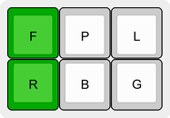||The [interpunct](https://en.wikipedia.org/wiki/Interpunct) is an odd one, which joins the dot above and dot below characters. Think of it as the midpoint of the above and below dots, made by stroking both together.<BR><BR>Used in: [Ŀ](#char-latin-capital-letter-l-with-middle-dot) [ŀ](#char-latin-small-letter-l-with-middle-dot)|
|Line Below| | |
|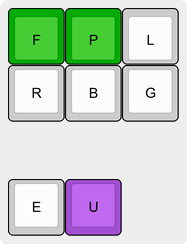||When [line below](https://en.wikipedia.org/wiki/Macron_below) is decomposed into base character + diacritic, the combining character for this set of Unicode composed characters is the macron below. Rather than use the the lower version of the chord, on the bottom row, this uses the '[under](#modifier-tweaks)' tweak with the macron shape, to respect this relation.<BR><BR>Used in: [Ḇ](#char-latin-capital-letter-b-with-line-below) [Ḏ](#char-latin-capital-letter-d-with-line-below) [Ḵ](#char-latin-capital-letter-k-with-line-below) [Ḻ](#char-latin-capital-letter-l-with-line-below) [Ṉ](#char-latin-capital-letter-n-with-line-below) [Ṟ](#char-latin-capital-letter-r-with-line-below) [Ṯ](#char-latin-capital-letter-t-with-line-below) [Ẕ](#char-latin-capital-letter-z-with-line-below) [ḇ](#char-latin-small-letter-b-with-line-below) [ḏ](#char-latin-small-letter-d-with-line-below) [ẖ](#char-latin-small-letter-h-with-line-below) [ḵ](#char-latin-small-letter-k-with-line-below) [ḻ](#char-latin-small-letter-l-with-line-below) [ṉ](#char-latin-small-letter-n-with-line-below) [ṟ](#char-latin-small-letter-r-with-line-below) [ṯ](#char-latin-small-letter-t-with-line-below) [ẕ](#char-latin-small-letter-z-with-line-below)|
|Macron| | |
|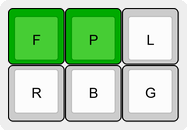||Shaped like the [macron](https://en.wikipedia.org/wiki/Macron_(diacritic)).<BR><BR>Used in: [Ā](#char-latin-capital-letter-a-with-macron) [Ǡ](#char-latin-capital-letter-a-with-dot-above-and-macron) [Ǟ](#char-latin-capital-letter-a-with-diaeresis-and-macron) [Ē](#char-latin-capital-letter-e-with-macron) [Ḕ](#char-latin-capital-letter-e-with-macron-and-grave) [Ḗ](#char-latin-capital-letter-e-with-macron-and-acute) [Ḡ](#char-latin-capital-letter-g-with-macron) [Ī](#char-latin-capital-letter-i-with-macron) [Ḹ](#char-latin-capital-letter-l-with-dot-below-and-macron) [Ȭ](#char-latin-capital-letter-o-with-tilde-and-macron) [Ō](#char-latin-capital-letter-o-with-macron) [Ṑ](#char-latin-capital-letter-o-with-macron-and-grave) [Ṓ](#char-latin-capital-letter-o-with-macron-and-acute) [Ȱ](#char-latin-capital-letter-o-with-dot-above-and-macron) [Ȫ](#char-latin-capital-letter-o-with-diaeresis-and-macron) [Ǭ](#char-latin-capital-letter-o-with-ogonek-and-macron) [Ṝ](#char-latin-capital-letter-r-with-dot-below-and-macron) [Ū](#char-latin-capital-letter-u-with-macron) [Ṻ](#char-latin-capital-letter-u-with-macron-and-diaeresis) [Ǖ](#char-latin-capital-letter-u-with-diaeresis-and-macron) [Ǚ](#char-latin-capital-letter-u-with-diaeresis-and-caron) [Ȳ](#char-latin-capital-letter-y-with-macron) [ā](#char-latin-small-letter-a-with-macron) [ǡ](#char-latin-small-letter-a-with-dot-above-and-macron) [ǟ](#char-latin-small-letter-a-with-diaeresis-and-macron) [ē](#char-latin-small-letter-e-with-macron) [ḕ](#char-latin-small-letter-e-with-macron-and-grave) [ḗ](#char-latin-small-letter-e-with-macron-and-acute) [ḡ](#char-latin-small-letter-g-with-macron) [ī](#char-latin-small-letter-i-with-macron) [ḹ](#char-latin-small-letter-l-with-dot-below-and-macron) [ȭ](#char-latin-small-letter-o-with-tilde-and-macron) [ō](#char-latin-small-letter-o-with-macron) [ṑ](#char-latin-small-letter-o-with-macron-and-grave) [ṓ](#char-latin-small-letter-o-with-macron-and-acute) [ȱ](#char-latin-small-letter-o-with-dot-above-and-macron) [ȫ](#char-latin-small-letter-o-with-diaeresis-and-macron) [ǭ](#char-latin-small-letter-o-with-ogonek-and-macron) [ṝ](#char-latin-small-letter-r-with-dot-below-and-macron) [ū](#char-latin-small-letter-u-with-macron) [ṻ](#char-latin-small-letter-u-with-macron-and-diaeresis) [ǖ](#char-latin-small-letter-u-with-diaeresis-and-macron) [ǚ](#char-latin-small-letter-u-with-diaeresis-and-caron) [ȳ](#char-latin-small-letter-y-with-macron) [Ǣ](#char-latin-capital-letter-ae-with-macron) [ǣ](#char-latin-small-letter-ae-with-macron)|
|Ogonek| | |
|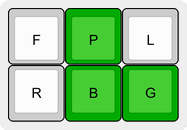||The [ogonek](https://en.wikipedia.org/wiki/Ogonek), meaning 'little tail' in Polish, hangs off the bottom of its character, curling down and to the right.<BR><BR>Used in: [Ą](#char-latin-capital-letter-a-with-ogonek) [Ę](#char-latin-capital-letter-e-with-ogonek) [Į](#char-latin-capital-letter-i-with-ogonek) [Ǫ](#char-latin-capital-letter-o-with-ogonek) [Ǭ](#char-latin-capital-letter-o-with-ogonek-and-macron) [Ų](#char-latin-capital-letter-u-with-ogonek) [ą](#char-latin-small-letter-a-with-ogonek) [ę](#char-latin-small-letter-e-with-ogonek) [į](#char-latin-small-letter-i-with-ogonek) [ǫ](#char-latin-small-letter-o-with-ogonek) [ǭ](#char-latin-small-letter-o-with-ogonek-and-macron) [ų](#char-latin-small-letter-u-with-ogonek)|
|Ring Above| | |
|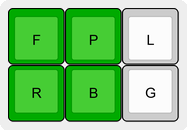||For the [ring above](https://en.wikipedia.org/wiki/Ring_(diacritic)) think of this square of keys like a little circle, or ring.<BR><BR>Used in: [Å](#char-latin-capital-letter-a-with-ring-above) [Ů](#char-latin-capital-letter-u-with-ring-above) [å](#char-latin-small-letter-a-with-ring-above) [ů](#char-latin-small-letter-u-with-ring-above) [ẘ](#char-latin-small-letter-w-with-ring-above) [ẙ](#char-latin-small-letter-y-with-ring-above)|
|Ring Below| | |
|||The [ring below](https://en.wikipedia.org/wiki/Ring_(diacritic)) uses the ring above modifier shape, with the '[under](#modifier-tweaks)' tweak.<BR><BR>Used in: [Ḁ](#char-latin-capital-letter-a-with-ring-below) [ḁ](#char-latin-small-letter-a-with-ring-below)|
|Stroke| | |
|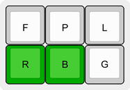||The [stroke](https://en.wikipedia.org/wiki/Bar_(diacritic)), or bar, modifier is like the macron, but lower, because it cuts through the character, rather than flying above it.<BR><BR>Used in: [Đ](#char-latin-capital-letter-d-with-stroke) [đ](#char-latin-small-letter-d-with-stroke) [Ħ](#char-latin-capital-letter-h-with-stroke) [ħ](#char-latin-small-letter-h-with-stroke) [Ŧ](#char-latin-capital-letter-t-with-stroke) [ŧ](#char-latin-small-letter-t-with-stroke) [Ɨ](#char-latin-capital-letter-i-with-stroke) [ƚ](#char-latin-small-letter-l-with-bar) [Ǥ](#char-latin-capital-letter-g-with-stroke) [ǥ](#char-latin-small-letter-g-with-stroke) [Ƚ](#char-latin-capital-letter-l-with-bar) [Ʉ](#char-latin-capital-letter-u-bar) [Ɍ](#char-latin-capital-letter-r-with-stroke) [ɍ](#char-latin-small-letter-r-with-stroke) [ɨ](#char-latin-small-letter-i-with-stroke) [ʉ](#char-latin-small-letter-u-bar)|
|Slash| | |
|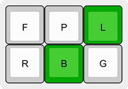||The [slash](https://en.wikipedia.org/wiki/Bar_(diacritic)) is really just a version of the bar, or stroke, but, because certain letters exist in both forms, I gave it its own modifier, to help differentiate between horizontal and vertical strokes/bars. The symbol is like the acute, but shifted, to indicate that it's lower, and cuts through the character. A bit of a stretch, as it's shifted to the right, not down, but other options were used up. Maybe think of it like moving to the right while reading this text, which eventually wraps, and takes you down a line.<BR><BR>Used in: [Ø](#char-latin-capital-letter-o-with-stroke) [Ǿ](#char-latin-capital-letter-o-with-stroke-and-acute) [ø](#char-latin-small-letter-o-with-stroke) [ǿ](#char-latin-small-letter-o-with-stroke-and-acute) [Ł](#char-latin-capital-letter-l-with-stroke) [ł](#char-latin-small-letter-l-with-stroke)|
|Tilde| | |
|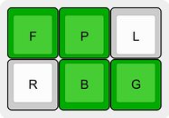||Shaped like the [tilde](https://en.wikipedia.org/wiki/Tilde).<BR><BR>Used in: [Ẫ](#char-latin-capital-letter-a-with-circumflex-and-tilde) [Ã](#char-latin-capital-letter-a-with-tilde) [Ẵ](#char-latin-capital-letter-a-with-breve-and-tilde) [Ễ](#char-latin-capital-letter-e-with-circumflex-and-tilde) [Ẽ](#char-latin-capital-letter-e-with-tilde) [Ĩ](#char-latin-capital-letter-i-with-tilde) [Ñ](#char-latin-capital-letter-n-with-tilde) [Ỗ](#char-latin-capital-letter-o-with-circumflex-and-tilde) [Õ](#char-latin-capital-letter-o-with-tilde) [Ṍ](#char-latin-capital-letter-o-with-tilde-and-acute) [Ȭ](#char-latin-capital-letter-o-with-tilde-and-macron) [Ṏ](#char-latin-capital-letter-o-with-tilde-and-diaeresis) [Ỡ](#char-latin-capital-letter-o-with-horn-and-tilde) [Ũ](#char-latin-capital-letter-u-with-tilde) [Ṹ](#char-latin-capital-letter-u-with-tilde-and-acute) [Ữ](#char-latin-capital-letter-u-with-horn-and-tilde) [Ṽ](#char-latin-capital-letter-v-with-tilde) [Ỹ](#char-latin-capital-letter-y-with-tilde) [ẫ](#char-latin-small-letter-a-with-circumflex-and-tilde) [ã](#char-latin-small-letter-a-with-tilde) [ẵ](#char-latin-small-letter-a-with-breve-and-tilde) [ễ](#char-latin-small-letter-e-with-circumflex-and-tilde) [ẽ](#char-latin-small-letter-e-with-tilde) [ĩ](#char-latin-small-letter-i-with-tilde) [ñ](#char-latin-small-letter-n-with-tilde) [ỗ](#char-latin-small-letter-o-with-circumflex-and-tilde) [õ](#char-latin-small-letter-o-with-tilde) [ṍ](#char-latin-small-letter-o-with-tilde-and-acute) [ȭ](#char-latin-small-letter-o-with-tilde-and-macron) [ṏ](#char-latin-small-letter-o-with-tilde-and-diaeresis) [ỡ](#char-latin-small-letter-o-with-horn-and-tilde) [ũ](#char-latin-small-letter-u-with-tilde) [ṹ](#char-latin-small-letter-u-with-tilde-and-acute) [ữ](#char-latin-small-letter-u-with-horn-and-tilde) [ṽ](#char-latin-small-letter-v-with-tilde) [ỹ](#char-latin-small-letter-y-with-tilde)|
|Tilde Below| | |
|||The tilde modifier shape, with the '[under](#modifier-tweaks)' tweak.<BR><BR>Used in: [Ḛ](#char-latin-capital-letter-e-with-tilde-below) [Ḭ](#char-latin-capital-letter-i-with-tilde-below) [Ṵ](#char-latin-capital-letter-u-with-tilde-below) [ḛ](#char-latin-small-letter-e-with-tilde-below) [ḭ](#char-latin-small-letter-i-with-tilde-below) [ṵ](#char-latin-small-letter-u-with-tilde-below)|
## Modifiers<BR>
Modifiers don't share the same, easy, visual mnemonics of diacritics, but every attempt was made to still make them memorable. See the notes with each.

Modifiers are only a part of letter modification. See the rest in the diacritics section.

NOTE: Diacritics and their tweaks are part of the same stroke.

|Chord|Tweak|Notes|
|-|-|-|
|Ligature| | |
|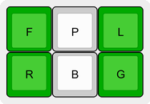||[Ligatures](https://en.wikipedia.org/wiki/Ligature_(writing)) are two or more graphemes joined together, as in Æ. To output an existing ligature, stroke the two letters in left-to-right order, then stroke this modifier to merge them. Think of the two vertical columns as the two graphemes being joined. For characters that modify ligatures, like the AE ligature with circumflex, or the AE ligature turned, create the ligature first, before modifying it further.<BR><BR>Used in: [W](#char-latin-capital-letter-w) [w](#char-latin-small-letter-w) [Æ](#char-latin-capital-letter-ae) [Ǽ](#char-latin-capital-letter-ae-with-acute) [Ǣ](#char-latin-capital-letter-ae-with-macron) [ß](#char-latin-small-letter-sharp-s) [æ](#char-latin-small-letter-ae) [ǽ](#char-latin-small-letter-ae-with-acute) [ǣ](#char-latin-small-letter-ae-with-macron) [Œ](#char-latin-capital-ligature-oe) [œ](#char-latin-small-ligature-oe) [ƕ](#char-latin-small-letter-hv) [Ƕ](#char-latin-capital-letter-hwair) [ᴂ](#char-latin-small-letter-turned-ae) [ᵫ](#char-latin-small-letter-ue) [ẞ](#char-latin-capital-letter-sharp-s) [Ỻ](#char-latin-capital-letter-middle-welsh-ll) [ỻ](#char-latin-small-letter-middle-welsh-ll) [℔](#char-l-b-bar-symbol) [Ꜩ](#char-latin-capital-letter-tz) [ꜩ](#char-latin-small-letter-tz) [Ꜳ](#char-latin-capital-letter-aa) [ꜳ](#char-latin-small-letter-aa) [Ꜵ](#char-latin-capital-letter-ao) [ꜵ](#char-latin-small-letter-ao) [Ꜷ](#char-latin-capital-letter-au) [ꜷ](#char-latin-small-letter-au) [Ꜹ](#char-latin-capital-letter-av) [ꜻ](#char-latin-small-letter-av-with-horizontal-bar) [Ꜽ](#char-latin-capital-letter-ay) [ꜽ](#char-latin-small-letter-ay) [Ꝏ](#char-latin-capital-letter-oo) [ꝏ](#char-latin-small-letter-oo) [Ꝡ](#char-latin-capital-letter-vy) [ꝡ](#char-latin-small-letter-vy) [ꭣ](#char-latin-small-letter-uo) [ff](#char-latin-small-ligature-ff) [fi](#char-latin-small-ligature-fi) [fl](#char-latin-small-ligature-fl) [ffi](#char-latin-small-ligature-ffi) [ffl](#char-latin-small-ligature-ffl) [st](#char-latin-small-ligature-st)|
|Turned/Rotated| | |
|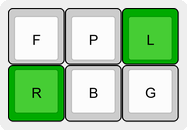||This modifier allows access to characters that are turned, or [rotated](https://en.wikipedia.org/wiki/Rotated_letter).<BR><BR>Used in: [Ə](#char-latin-capital-letter-schwa) [ə](#char-latin-small-letter-schwa) [ᴂ](#char-latin-small-letter-turned-ae) [Ⅎ](#char-turned-capital-f) [ⅎ](#char-turned-small-f)|
|Reversed| | |
|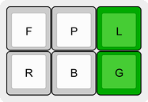||The turned modifier shape, with the '[inverted](#modifier-tweaks)' tweak.<BR><BR>This allows access to characters that are flipped, inverted, or reversed.<BR><BR>Used in: [Ↄ](#char-roman-numeral-reversed-one-hundred) [ↄ](#char-latin-small-letter-reversed-c)|
|Bold| | |
|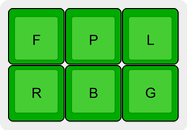||All the keys. So bold.<BR><BR>Used in: [𝐀](#char-mathematical-bold-capital-a) [𝐁](#char-mathematical-bold-capital-b) [𝐂](#char-mathematical-bold-capital-c) [𝐃](#char-mathematical-bold-capital-d) [𝐄](#char-mathematical-bold-capital-e) [𝐅](#char-mathematical-bold-capital-f) [𝐆](#char-mathematical-bold-capital-g) [𝐇](#char-mathematical-bold-capital-h) [𝐈](#char-mathematical-bold-capital-i) [𝐉](#char-mathematical-bold-capital-j) [𝐊](#char-mathematical-bold-capital-k) [𝐋](#char-mathematical-bold-capital-l) [𝐌](#char-mathematical-bold-capital-m) [𝐍](#char-mathematical-bold-capital-n) [𝐎](#char-mathematical-bold-capital-o) [𝐏](#char-mathematical-bold-capital-p) [𝐐](#char-mathematical-bold-capital-q) [𝐑](#char-mathematical-bold-capital-r) [𝐒](#char-mathematical-bold-capital-s) [𝐓](#char-mathematical-bold-capital-t) [𝐔](#char-mathematical-bold-capital-u) [𝐕](#char-mathematical-bold-capital-v) [𝐖](#char-mathematical-bold-capital-w) [𝐗](#char-mathematical-bold-capital-x) [𝐘](#char-mathematical-bold-capital-y) [𝐙](#char-mathematical-bold-capital-z) [𝐚](#char-mathematical-bold-small-a) [𝐛](#char-mathematical-bold-small-b) [𝐜](#char-mathematical-bold-small-c) [𝐝](#char-mathematical-bold-small-d) [𝐞](#char-mathematical-bold-small-e) [𝐟](#char-mathematical-bold-small-f) [𝐠](#char-mathematical-bold-small-g) [𝐡](#char-mathematical-bold-small-h) [𝐢](#char-mathematical-bold-small-i) [𝐣](#char-mathematical-bold-small-j) [𝐤](#char-mathematical-bold-small-k) [𝐥](#char-mathematical-bold-small-l) [𝐦](#char-mathematical-bold-small-m) [𝐧](#char-mathematical-bold-small-n) [𝐨](#char-mathematical-bold-small-o) [𝐩](#char-mathematical-bold-small-p) [𝐪](#char-mathematical-bold-small-q) [𝐫](#char-mathematical-bold-small-r) [𝐬](#char-mathematical-bold-small-s) [𝐭](#char-mathematical-bold-small-t) [𝐮](#char-mathematical-bold-small-u) [𝐯](#char-mathematical-bold-small-v) [𝐰](#char-mathematical-bold-small-w) [𝐱](#char-mathematical-bold-small-x) [𝐲](#char-mathematical-bold-small-y) [𝐳](#char-mathematical-bold-small-z) [𝑨](#char-mathematical-bold-italic-capital-a) [𝑩](#char-mathematical-bold-italic-capital-b) [𝑪](#char-mathematical-bold-italic-capital-c) [𝑫](#char-mathematical-bold-italic-capital-d) [𝑬](#char-mathematical-bold-italic-capital-e) [𝑭](#char-mathematical-bold-italic-capital-f) [𝑮](#char-mathematical-bold-italic-capital-g) [𝑯](#char-mathematical-bold-italic-capital-h) [𝑰](#char-mathematical-bold-italic-capital-i) [𝑱](#char-mathematical-bold-italic-capital-j) [𝑲](#char-mathematical-bold-italic-capital-k) [𝑳](#char-mathematical-bold-italic-capital-l) [𝑴](#char-mathematical-bold-italic-capital-m) [𝑵](#char-mathematical-bold-italic-capital-n) [𝑶](#char-mathematical-bold-italic-capital-o) [𝑷](#char-mathematical-bold-italic-capital-p) [𝑸](#char-mathematical-bold-italic-capital-q) [𝑹](#char-mathematical-bold-italic-capital-r) [𝑺](#char-mathematical-bold-italic-capital-s) [𝑻](#char-mathematical-bold-italic-capital-t) [𝑼](#char-mathematical-bold-italic-capital-u) [𝑽](#char-mathematical-bold-italic-capital-v) [𝑾](#char-mathematical-bold-italic-capital-w) [𝑿](#char-mathematical-bold-italic-capital-x) [𝒀](#char-mathematical-bold-italic-capital-y) [𝒁](#char-mathematical-bold-italic-capital-z) [𝒂](#char-mathematical-bold-italic-small-a) [𝒃](#char-mathematical-bold-italic-small-b) [𝒄](#char-mathematical-bold-italic-small-c) [𝒅](#char-mathematical-bold-italic-small-d) [𝒆](#char-mathematical-bold-italic-small-e) [𝒇](#char-mathematical-bold-italic-small-f) [𝒈](#char-mathematical-bold-italic-small-g) [𝒉](#char-mathematical-bold-italic-small-h) [𝒊](#char-mathematical-bold-italic-small-i) [𝒋](#char-mathematical-bold-italic-small-j) [𝒌](#char-mathematical-bold-italic-small-k) [𝒍](#char-mathematical-bold-italic-small-l) [𝒎](#char-mathematical-bold-italic-small-m) [𝒏](#char-mathematical-bold-italic-small-n) [𝒐](#char-mathematical-bold-italic-small-o) [𝒑](#char-mathematical-bold-italic-small-p) [𝒒](#char-mathematical-bold-italic-small-q) [𝒓](#char-mathematical-bold-italic-small-r) [𝒔](#char-mathematical-bold-italic-small-s) [𝒕](#char-mathematical-bold-italic-small-t) [𝒖](#char-mathematical-bold-italic-small-u) [𝒗](#char-mathematical-bold-italic-small-v) [𝒘](#char-mathematical-bold-italic-small-w) [𝒙](#char-mathematical-bold-italic-small-x) [𝒚](#char-mathematical-bold-italic-small-y) [𝒛](#char-mathematical-bold-italic-small-z) [𝓐](#char-mathematical-bold-script-capital-a) [𝓑](#char-mathematical-bold-script-capital-b) [𝓒](#char-mathematical-bold-script-capital-c) [𝓓](#char-mathematical-bold-script-capital-d) [𝓔](#char-mathematical-bold-script-capital-e) [𝓕](#char-mathematical-bold-script-capital-f) [𝓖](#char-mathematical-bold-script-capital-g) [𝓗](#char-mathematical-bold-script-capital-h) [𝓘](#char-mathematical-bold-script-capital-i) [𝓙](#char-mathematical-bold-script-capital-j) [𝓚](#char-mathematical-bold-script-capital-k) [𝓛](#char-mathematical-bold-script-capital-l) [𝓜](#char-mathematical-bold-script-capital-m) [𝓝](#char-mathematical-bold-script-capital-n) [𝓞](#char-mathematical-bold-script-capital-o) [𝓟](#char-mathematical-bold-script-capital-p) [𝓠](#char-mathematical-bold-script-capital-q) [𝓡](#char-mathematical-bold-script-capital-r) [𝓢](#char-mathematical-bold-script-capital-s) [𝓣](#char-mathematical-bold-script-capital-t) [𝓤](#char-mathematical-bold-script-capital-u) [𝓥](#char-mathematical-bold-script-capital-v) [𝓦](#char-mathematical-bold-script-capital-w) [𝓧](#char-mathematical-bold-script-capital-x) [𝓨](#char-mathematical-bold-script-capital-y) [𝓩](#char-mathematical-bold-script-capital-z) [𝓪](#char-mathematical-bold-script-small-a) [𝓫](#char-mathematical-bold-script-small-b) [𝓬](#char-mathematical-bold-script-small-c) [𝓭](#char-mathematical-bold-script-small-d) [𝓮](#char-mathematical-bold-script-small-e) [𝓯](#char-mathematical-bold-script-small-f) [𝓰](#char-mathematical-bold-script-small-g) [𝓱](#char-mathematical-bold-script-small-h) [𝓲](#char-mathematical-bold-script-small-i) [𝓳](#char-mathematical-bold-script-small-j) [𝓴](#char-mathematical-bold-script-small-k) [𝓵](#char-mathematical-bold-script-small-l) [𝓶](#char-mathematical-bold-script-small-m) [𝓷](#char-mathematical-bold-script-small-n) [𝓸](#char-mathematical-bold-script-small-o) [𝓹](#char-mathematical-bold-script-small-p) [𝓺](#char-mathematical-bold-script-small-q) [𝓻](#char-mathematical-bold-script-small-r) [𝓼](#char-mathematical-bold-script-small-s) [𝓽](#char-mathematical-bold-script-small-t) [𝓾](#char-mathematical-bold-script-small-u) [𝓿](#char-mathematical-bold-script-small-v) [𝔀](#char-mathematical-bold-script-small-w) [𝔁](#char-mathematical-bold-script-small-x) [𝔂](#char-mathematical-bold-script-small-y) [𝔃](#char-mathematical-bold-script-small-z) [𝕬](#char-mathematical-bold-fraktur-capital-a) [𝕭](#char-mathematical-bold-fraktur-capital-b) [𝕮](#char-mathematical-bold-fraktur-capital-c) [𝕯](#char-mathematical-bold-fraktur-capital-d) [𝕰](#char-mathematical-bold-fraktur-capital-e) [𝕱](#char-mathematical-bold-fraktur-capital-f) [𝕲](#char-mathematical-bold-fraktur-capital-g) [𝕳](#char-mathematical-bold-fraktur-capital-h) [𝕴](#char-mathematical-bold-fraktur-capital-i) [𝕵](#char-mathematical-bold-fraktur-capital-j) [𝕶](#char-mathematical-bold-fraktur-capital-k) [𝕷](#char-mathematical-bold-fraktur-capital-l) [𝕸](#char-mathematical-bold-fraktur-capital-m) [𝕹](#char-mathematical-bold-fraktur-capital-n) [𝕺](#char-mathematical-bold-fraktur-capital-o) [𝕻](#char-mathematical-bold-fraktur-capital-p) [𝕼](#char-mathematical-bold-fraktur-capital-q) [𝕽](#char-mathematical-bold-fraktur-capital-r) [𝕾](#char-mathematical-bold-fraktur-capital-s) [𝕿](#char-mathematical-bold-fraktur-capital-t) [𝖀](#char-mathematical-bold-fraktur-capital-u) [𝖁](#char-mathematical-bold-fraktur-capital-v) [𝖂](#char-mathematical-bold-fraktur-capital-w) [𝖃](#char-mathematical-bold-fraktur-capital-x) [𝖄](#char-mathematical-bold-fraktur-capital-y) [𝖅](#char-mathematical-bold-fraktur-capital-z) [𝖆](#char-mathematical-bold-fraktur-small-a) [𝖇](#char-mathematical-bold-fraktur-small-b) [𝖈](#char-mathematical-bold-fraktur-small-c) [𝖉](#char-mathematical-bold-fraktur-small-d) [𝖊](#char-mathematical-bold-fraktur-small-e) [𝖋](#char-mathematical-bold-fraktur-small-f) [𝖌](#char-mathematical-bold-fraktur-small-g) [𝖍](#char-mathematical-bold-fraktur-small-h) [𝖎](#char-mathematical-bold-fraktur-small-i) [𝖏](#char-mathematical-bold-fraktur-small-j) [𝖐](#char-mathematical-bold-fraktur-small-k) [𝖑](#char-mathematical-bold-fraktur-small-l) [𝖒](#char-mathematical-bold-fraktur-small-m) [𝖓](#char-mathematical-bold-fraktur-small-n) [𝖔](#char-mathematical-bold-fraktur-small-o) [𝖕](#char-mathematical-bold-fraktur-small-p) [𝖖](#char-mathematical-bold-fraktur-small-q) [𝖗](#char-mathematical-bold-fraktur-small-r) [𝖘](#char-mathematical-bold-fraktur-small-s) [𝖙](#char-mathematical-bold-fraktur-small-t) [𝖚](#char-mathematical-bold-fraktur-small-u) [𝖛](#char-mathematical-bold-fraktur-small-v) [𝖜](#char-mathematical-bold-fraktur-small-w) [𝖝](#char-mathematical-bold-fraktur-small-x) [𝖞](#char-mathematical-bold-fraktur-small-y) [𝖟](#char-mathematical-bold-fraktur-small-z) [𝗔](#char-mathematical-sans-serif-bold-capital-a) [𝗕](#char-mathematical-sans-serif-bold-capital-b) [𝗖](#char-mathematical-sans-serif-bold-capital-c) [𝗗](#char-mathematical-sans-serif-bold-capital-d) [𝗘](#char-mathematical-sans-serif-bold-capital-e) [𝗙](#char-mathematical-sans-serif-bold-capital-f) [𝗚](#char-mathematical-sans-serif-bold-capital-g) [𝗛](#char-mathematical-sans-serif-bold-capital-h) [𝗜](#char-mathematical-sans-serif-bold-capital-i) [𝗝](#char-mathematical-sans-serif-bold-capital-j) [𝗞](#char-mathematical-sans-serif-bold-capital-k) [𝗟](#char-mathematical-sans-serif-bold-capital-l) [𝗠](#char-mathematical-sans-serif-bold-capital-m) [𝗡](#char-mathematical-sans-serif-bold-capital-n) [𝗢](#char-mathematical-sans-serif-bold-capital-o) [𝗣](#char-mathematical-sans-serif-bold-capital-p) [𝗤](#char-mathematical-sans-serif-bold-capital-q) [𝗥](#char-mathematical-sans-serif-bold-capital-r) [𝗦](#char-mathematical-sans-serif-bold-capital-s) [𝗧](#char-mathematical-sans-serif-bold-capital-t) [𝗨](#char-mathematical-sans-serif-bold-capital-u) [𝗩](#char-mathematical-sans-serif-bold-capital-v) [𝗪](#char-mathematical-sans-serif-bold-capital-w) [𝗫](#char-mathematical-sans-serif-bold-capital-x) [𝗬](#char-mathematical-sans-serif-bold-capital-y) [𝗭](#char-mathematical-sans-serif-bold-capital-z) [𝗮](#char-mathematical-sans-serif-bold-small-a) [𝗯](#char-mathematical-sans-serif-bold-small-b) [𝗰](#char-mathematical-sans-serif-bold-small-c) [𝗱](#char-mathematical-sans-serif-bold-small-d) [𝗲](#char-mathematical-sans-serif-bold-small-e) [𝗳](#char-mathematical-sans-serif-bold-small-f) [𝗴](#char-mathematical-sans-serif-bold-small-g) [𝗵](#char-mathematical-sans-serif-bold-small-h) [𝗶](#char-mathematical-sans-serif-bold-small-i) [𝗷](#char-mathematical-sans-serif-bold-small-j) [𝗸](#char-mathematical-sans-serif-bold-small-k) [𝗹](#char-mathematical-sans-serif-bold-small-l) [𝗺](#char-mathematical-sans-serif-bold-small-m) [𝗻](#char-mathematical-sans-serif-bold-small-n) [𝗼](#char-mathematical-sans-serif-bold-small-o) [𝗽](#char-mathematical-sans-serif-bold-small-p) [𝗾](#char-mathematical-sans-serif-bold-small-q) [𝗿](#char-mathematical-sans-serif-bold-small-r) [𝘀](#char-mathematical-sans-serif-bold-small-s) [𝘁](#char-mathematical-sans-serif-bold-small-t) [𝘂](#char-mathematical-sans-serif-bold-small-u) [𝘃](#char-mathematical-sans-serif-bold-small-v) [𝘄](#char-mathematical-sans-serif-bold-small-w) [𝘅](#char-mathematical-sans-serif-bold-small-x) [𝘆](#char-mathematical-sans-serif-bold-small-y) [𝘇](#char-mathematical-sans-serif-bold-small-z) [𝘼](#char-mathematical-sans-serif-bold-italic-capital-a) [𝘽](#char-mathematical-sans-serif-bold-italic-capital-b) [𝘾](#char-mathematical-sans-serif-bold-italic-capital-c) [𝘿](#char-mathematical-sans-serif-bold-italic-capital-d) [𝙀](#char-mathematical-sans-serif-bold-italic-capital-e) [𝙁](#char-mathematical-sans-serif-bold-italic-capital-f) [𝙂](#char-mathematical-sans-serif-bold-italic-capital-g) [𝙃](#char-mathematical-sans-serif-bold-italic-capital-h) [𝙄](#char-mathematical-sans-serif-bold-italic-capital-i) [𝙅](#char-mathematical-sans-serif-bold-italic-capital-j) [𝙆](#char-mathematical-sans-serif-bold-italic-capital-k) [𝙇](#char-mathematical-sans-serif-bold-italic-capital-l) [𝙈](#char-mathematical-sans-serif-bold-italic-capital-m) [𝙉](#char-mathematical-sans-serif-bold-italic-capital-n) [𝙊](#char-mathematical-sans-serif-bold-italic-capital-o) [𝙋](#char-mathematical-sans-serif-bold-italic-capital-p) [𝙌](#char-mathematical-sans-serif-bold-italic-capital-q) [𝙍](#char-mathematical-sans-serif-bold-italic-capital-r) [𝙎](#char-mathematical-sans-serif-bold-italic-capital-s) [𝙏](#char-mathematical-sans-serif-bold-italic-capital-t) [𝙐](#char-mathematical-sans-serif-bold-italic-capital-u) [𝙑](#char-mathematical-sans-serif-bold-italic-capital-v) [𝙒](#char-mathematical-sans-serif-bold-italic-capital-w) [𝙓](#char-mathematical-sans-serif-bold-italic-capital-x) [𝙔](#char-mathematical-sans-serif-bold-italic-capital-y) [𝙕](#char-mathematical-sans-serif-bold-italic-capital-z) [𝙖](#char-mathematical-sans-serif-bold-italic-small-a) [𝙗](#char-mathematical-sans-serif-bold-italic-small-b) [𝙘](#char-mathematical-sans-serif-bold-italic-small-c) [𝙙](#char-mathematical-sans-serif-bold-italic-small-d) [𝙚](#char-mathematical-sans-serif-bold-italic-small-e) [𝙛](#char-mathematical-sans-serif-bold-italic-small-f) [𝙜](#char-mathematical-sans-serif-bold-italic-small-g) [𝙝](#char-mathematical-sans-serif-bold-italic-small-h) [𝙞](#char-mathematical-sans-serif-bold-italic-small-i) [𝙟](#char-mathematical-sans-serif-bold-italic-small-j) [𝙠](#char-mathematical-sans-serif-bold-italic-small-k) [𝙡](#char-mathematical-sans-serif-bold-italic-small-l) [𝙢](#char-mathematical-sans-serif-bold-italic-small-m) [𝙣](#char-mathematical-sans-serif-bold-italic-small-n) [𝙤](#char-mathematical-sans-serif-bold-italic-small-o) [𝙥](#char-mathematical-sans-serif-bold-italic-small-p) [𝙦](#char-mathematical-sans-serif-bold-italic-small-q) [𝙧](#char-mathematical-sans-serif-bold-italic-small-r) [𝙨](#char-mathematical-sans-serif-bold-italic-small-s) [𝙩](#char-mathematical-sans-serif-bold-italic-small-t) [𝙪](#char-mathematical-sans-serif-bold-italic-small-u) [𝙫](#char-mathematical-sans-serif-bold-italic-small-v) [𝙬](#char-mathematical-sans-serif-bold-italic-small-w) [𝙭](#char-mathematical-sans-serif-bold-italic-small-x) [𝙮](#char-mathematical-sans-serif-bold-italic-small-y) [𝙯](#char-mathematical-sans-serif-bold-italic-small-z) [𝚨](#char-mathematical-bold-capital-alpha) [𝚩](#char-mathematical-bold-capital-beta) [𝚪](#char-mathematical-bold-capital-gamma) [𝚫](#char-mathematical-bold-capital-delta) [𝚬](#char-mathematical-bold-capital-epsilon) [𝚭](#char-mathematical-bold-capital-zeta) [𝚮](#char-mathematical-bold-capital-eta) [𝚯](#char-mathematical-bold-capital-theta) [𝚰](#char-mathematical-bold-capital-iota) [𝚱](#char-mathematical-bold-capital-kappa) [𝚲](#char-mathematical-bold-capital-lamda) [𝚳](#char-mathematical-bold-capital-mu) [𝚴](#char-mathematical-bold-capital-nu) [𝚵](#char-mathematical-bold-capital-xi) [𝚶](#char-mathematical-bold-capital-omicron) [𝚷](#char-mathematical-bold-capital-pi) [𝚸](#char-mathematical-bold-capital-rho) [𝚺](#char-mathematical-bold-capital-sigma) [𝚻](#char-mathematical-bold-capital-tau) [𝚼](#char-mathematical-bold-capital-upsilon) [𝚽](#char-mathematical-bold-capital-phi) [𝚾](#char-mathematical-bold-capital-chi) [𝚿](#char-mathematical-bold-capital-psi) [𝛀](#char-mathematical-bold-capital-omega) [𝛂](#char-mathematical-bold-small-alpha) [𝛃](#char-mathematical-bold-small-beta) [𝛄](#char-mathematical-bold-small-gamma) [𝛅](#char-mathematical-bold-small-delta) [𝛆](#char-mathematical-bold-small-epsilon) [𝛇](#char-mathematical-bold-small-zeta) [𝛈](#char-mathematical-bold-small-eta) [𝛉](#char-mathematical-bold-small-theta) [𝛊](#char-mathematical-bold-small-iota) [𝛋](#char-mathematical-bold-small-kappa) [𝛌](#char-mathematical-bold-small-lamda) [𝛍](#char-mathematical-bold-small-mu) [𝛎](#char-mathematical-bold-small-nu) [𝛏](#char-mathematical-bold-small-xi) [𝛐](#char-mathematical-bold-small-omicron) [𝛑](#char-mathematical-bold-small-pi) [𝛒](#char-mathematical-bold-small-rho) [𝛓](#char-mathematical-bold-small-final-sigma) [𝛔](#char-mathematical-bold-small-sigma) [𝛕](#char-mathematical-bold-small-tau) [𝛖](#char-mathematical-bold-small-upsilon) [𝛗](#char-mathematical-bold-small-phi) [𝛘](#char-mathematical-bold-small-chi) [𝛙](#char-mathematical-bold-small-psi) [𝛚](#char-mathematical-bold-small-omega) [𝜜](#char-mathematical-bold-italic-capital-alpha) [𝜝](#char-mathematical-bold-italic-capital-beta) [𝜞](#char-mathematical-bold-italic-capital-gamma) [𝜟](#char-mathematical-bold-italic-capital-delta) [𝜠](#char-mathematical-bold-italic-capital-epsilon) [𝜡](#char-mathematical-bold-italic-capital-zeta) [𝜢](#char-mathematical-bold-italic-capital-eta) [𝜣](#char-mathematical-bold-italic-capital-theta) [𝜤](#char-mathematical-bold-italic-capital-iota) [𝜥](#char-mathematical-bold-italic-capital-kappa) [𝜦](#char-mathematical-bold-italic-capital-lamda) [𝜧](#char-mathematical-bold-italic-capital-mu) [𝜨](#char-mathematical-bold-italic-capital-nu) [𝜩](#char-mathematical-bold-italic-capital-xi) [𝜪](#char-mathematical-bold-italic-capital-omicron) [𝜫](#char-mathematical-bold-italic-capital-pi) [𝜬](#char-mathematical-bold-italic-capital-rho) [𝜭](#char-mathematical-bold-italic-capital-theta-symbol) [𝜮](#char-mathematical-bold-italic-capital-sigma) [𝜯](#char-mathematical-bold-italic-capital-tau) [𝜰](#char-mathematical-bold-italic-capital-upsilon) [𝜱](#char-mathematical-bold-italic-capital-phi) [𝜲](#char-mathematical-bold-italic-capital-chi) [𝜳](#char-mathematical-bold-italic-capital-psi) [𝜴](#char-mathematical-bold-italic-capital-omega) [𝜶](#char-mathematical-bold-italic-small-alpha) [𝜷](#char-mathematical-bold-italic-small-beta) [𝜸](#char-mathematical-bold-italic-small-gamma) [𝜹](#char-mathematical-bold-italic-small-delta) [𝜺](#char-mathematical-bold-italic-small-epsilon) [𝜻](#char-mathematical-bold-italic-small-zeta) [𝜼](#char-mathematical-bold-italic-small-eta) [𝜽](#char-mathematical-bold-italic-small-theta) [𝜾](#char-mathematical-bold-italic-small-iota) [𝜿](#char-mathematical-bold-italic-small-kappa) [𝝀](#char-mathematical-bold-italic-small-lamda) [𝝁](#char-mathematical-bold-italic-small-mu) [𝝂](#char-mathematical-bold-italic-small-nu) [𝝃](#char-mathematical-bold-italic-small-xi) [𝝄](#char-mathematical-bold-italic-small-omicron) [𝝅](#char-mathematical-bold-italic-small-pi) [𝝆](#char-mathematical-bold-italic-small-rho) [𝝇](#char-mathematical-bold-italic-small-final-sigma) [𝝇](#char-mathematical-bold-italic-small-final-sigma) [𝝈](#char-mathematical-bold-italic-small-sigma) [𝝉](#char-mathematical-bold-italic-small-tau) [𝝊](#char-mathematical-bold-italic-small-upsilon) [𝝋](#char-mathematical-bold-italic-small-phi) [𝝌](#char-mathematical-bold-italic-small-chi) [𝝍](#char-mathematical-bold-italic-small-psi) [𝝎](#char-mathematical-bold-italic-small-omega) [𝝖](#char-mathematical-sans-serif-bold-capital-alpha) [𝝗](#char-mathematical-sans-serif-bold-capital-beta) [𝝘](#char-mathematical-sans-serif-bold-capital-gamma) [𝝙](#char-mathematical-sans-serif-bold-capital-delta) [𝝚](#char-mathematical-sans-serif-bold-capital-epsilon) [𝝛](#char-mathematical-sans-serif-bold-capital-zeta) [𝝜](#char-mathematical-sans-serif-bold-capital-eta) [𝝝](#char-mathematical-sans-serif-bold-capital-theta) [𝝞](#char-mathematical-sans-serif-bold-capital-iota) [𝝟](#char-mathematical-sans-serif-bold-capital-kappa) [𝝠](#char-mathematical-sans-serif-bold-capital-lamda) [𝝡](#char-mathematical-sans-serif-bold-capital-mu) [𝝢](#char-mathematical-sans-serif-bold-capital-nu) [𝝣](#char-mathematical-sans-serif-bold-capital-xi) [𝝤](#char-mathematical-sans-serif-bold-capital-omicron) [𝝥](#char-mathematical-sans-serif-bold-capital-pi) [𝝦](#char-mathematical-sans-serif-bold-capital-rho) [𝝨](#char-mathematical-sans-serif-bold-capital-sigma) [𝝩](#char-mathematical-sans-serif-bold-capital-tau) [𝝪](#char-mathematical-sans-serif-bold-capital-upsilon) [𝝫](#char-mathematical-sans-serif-bold-capital-phi) [𝝬](#char-mathematical-sans-serif-bold-capital-chi) [𝝭](#char-mathematical-sans-serif-bold-capital-psi) [𝝮](#char-mathematical-sans-serif-bold-capital-omega) [𝝰](#char-mathematical-sans-serif-bold-small-alpha) [𝝱](#char-mathematical-sans-serif-bold-small-beta) [𝝲](#char-mathematical-sans-serif-bold-small-gamma) [𝝳](#char-mathematical-sans-serif-bold-small-delta) [𝝴](#char-mathematical-sans-serif-bold-small-epsilon) [𝝵](#char-mathematical-sans-serif-bold-small-zeta) [𝝶](#char-mathematical-sans-serif-bold-small-eta) [𝝷](#char-mathematical-sans-serif-bold-small-theta) [𝝸](#char-mathematical-sans-serif-bold-small-iota) [𝝹](#char-mathematical-sans-serif-bold-small-kappa) [𝝺](#char-mathematical-sans-serif-bold-small-lamda) [𝝻](#char-mathematical-sans-serif-bold-small-mu) [𝝼](#char-mathematical-sans-serif-bold-small-nu) [𝝽](#char-mathematical-sans-serif-bold-small-xi) [𝝾](#char-mathematical-sans-serif-bold-small-omicron) [𝝿](#char-mathematical-sans-serif-bold-small-pi) [𝞀](#char-mathematical-sans-serif-bold-small-rho) [𝞁](#char-mathematical-sans-serif-bold-small-final-sigma) [𝞂](#char-mathematical-sans-serif-bold-small-sigma) [𝞃](#char-mathematical-sans-serif-bold-small-tau) [𝞄](#char-mathematical-sans-serif-bold-small-upsilon) [𝞅](#char-mathematical-sans-serif-bold-small-phi) [𝞆](#char-mathematical-sans-serif-bold-small-chi) [𝞇](#char-mathematical-sans-serif-bold-small-psi) [𝞈](#char-mathematical-sans-serif-bold-small-omega) [𝞐](#char-mathematical-sans-serif-bold-italic-capital-alpha) [𝞑](#char-mathematical-sans-serif-bold-italic-capital-beta) [𝞒](#char-mathematical-sans-serif-bold-italic-capital-gamma) [𝞓](#char-mathematical-sans-serif-bold-italic-capital-delta) [𝞔](#char-mathematical-sans-serif-bold-italic-capital-epsilon) [𝞕](#char-mathematical-sans-serif-bold-italic-capital-zeta) [𝞖](#char-mathematical-sans-serif-bold-italic-capital-eta) [𝞗](#char-mathematical-sans-serif-bold-italic-capital-theta) [𝞘](#char-mathematical-sans-serif-bold-italic-capital-iota) [𝞙](#char-mathematical-sans-serif-bold-italic-capital-kappa) [𝞚](#char-mathematical-sans-serif-bold-italic-capital-lamda) [𝞛](#char-mathematical-sans-serif-bold-italic-capital-mu) [𝞜](#char-mathematical-sans-serif-bold-italic-capital-nu) [𝞝](#char-mathematical-sans-serif-bold-italic-capital-xi) [𝞞](#char-mathematical-sans-serif-bold-italic-capital-omicron) [𝞟](#char-mathematical-sans-serif-bold-italic-capital-pi) [𝞠](#char-mathematical-sans-serif-bold-italic-capital-rho) [𝞡](#char-mathematical-sans-serif-bold-italic-capital-theta-symbol) [𝞢](#char-mathematical-sans-serif-bold-italic-capital-sigma) [𝞣](#char-mathematical-sans-serif-bold-italic-capital-tau) [𝞤](#char-mathematical-sans-serif-bold-italic-capital-upsilon) [𝞥](#char-mathematical-sans-serif-bold-italic-capital-phi) [𝞦](#char-mathematical-sans-serif-bold-italic-capital-chi) [𝞧](#char-mathematical-sans-serif-bold-italic-capital-psi) [𝞨](#char-mathematical-sans-serif-bold-italic-capital-omega) [𝞪](#char-mathematical-sans-serif-bold-italic-small-alpha) [𝞫](#char-mathematical-sans-serif-bold-italic-small-beta) [𝞬](#char-mathematical-sans-serif-bold-italic-small-gamma) [𝞭](#char-mathematical-sans-serif-bold-italic-small-delta) [𝞮](#char-mathematical-sans-serif-bold-italic-small-epsilon) [𝞯](#char-mathematical-sans-serif-bold-italic-small-zeta) [𝞰](#char-mathematical-sans-serif-bold-italic-small-eta) [𝞱](#char-mathematical-sans-serif-bold-italic-small-theta) [𝞲](#char-mathematical-sans-serif-bold-italic-small-iota) [𝞳](#char-mathematical-sans-serif-bold-italic-small-kappa) [𝞴](#char-mathematical-sans-serif-bold-italic-small-lamda) [𝞵](#char-mathematical-sans-serif-bold-italic-small-mu) [𝞶](#char-mathematical-sans-serif-bold-italic-small-nu) [𝞷](#char-mathematical-sans-serif-bold-italic-small-xi) [𝞸](#char-mathematical-sans-serif-bold-italic-small-omicron) [𝞹](#char-mathematical-sans-serif-bold-italic-small-pi) [𝞺](#char-mathematical-sans-serif-bold-italic-small-rho) [𝞻](#char-mathematical-sans-serif-bold-italic-small-final-sigma) [𝞻](#char-mathematical-sans-serif-bold-italic-small-final-sigma) [𝞼](#char-mathematical-sans-serif-bold-italic-small-sigma) [𝞽](#char-mathematical-sans-serif-bold-italic-small-tau) [𝞾](#char-mathematical-sans-serif-bold-italic-small-upsilon) [𝞿](#char-mathematical-sans-serif-bold-italic-small-phi) [𝟀](#char-mathematical-sans-serif-bold-italic-small-chi) [𝟁](#char-mathematical-sans-serif-bold-italic-small-psi) [𝟂](#char-mathematical-sans-serif-bold-italic-small-omega)|
|Italic| | |
|||The bold modifier shape, with the '[inverted](#modifier-tweaks)' tweak. In this case, the I (EU) of the tweak stands for "italic".<BR><BR>Used in: [𝐴](#char-mathematical-italic-capital-a) [𝐵](#char-mathematical-italic-capital-b) [𝐶](#char-mathematical-italic-capital-c) [𝐷](#char-mathematical-italic-capital-d) [𝐸](#char-mathematical-italic-capital-e) [𝐹](#char-mathematical-italic-capital-f) [𝐺](#char-mathematical-italic-capital-g) [𝐻](#char-mathematical-italic-capital-h) [𝐼](#char-mathematical-italic-capital-i) [𝐽](#char-mathematical-italic-capital-j) [𝐾](#char-mathematical-italic-capital-k) [𝐿](#char-mathematical-italic-capital-l) [𝑀](#char-mathematical-italic-capital-m) [𝑁](#char-mathematical-italic-capital-n) [𝑂](#char-mathematical-italic-capital-o) [𝑃](#char-mathematical-italic-capital-p) [𝑄](#char-mathematical-italic-capital-q) [𝑅](#char-mathematical-italic-capital-r) [𝑆](#char-mathematical-italic-capital-s) [𝑇](#char-mathematical-italic-capital-t) [𝑈](#char-mathematical-italic-capital-u) [𝑉](#char-mathematical-italic-capital-v) [𝑊](#char-mathematical-italic-capital-w) [𝑋](#char-mathematical-italic-capital-x) [𝑌](#char-mathematical-italic-capital-y) [𝑍](#char-mathematical-italic-capital-z) [𝑎](#char-mathematical-italic-small-a) [𝑏](#char-mathematical-italic-small-b) [𝑐](#char-mathematical-italic-small-c) [𝑑](#char-mathematical-italic-small-d) [𝑒](#char-mathematical-italic-small-e) [𝑓](#char-mathematical-italic-small-f) [𝑔](#char-mathematical-italic-small-g) [𝑖](#char-mathematical-italic-small-i) [𝑗](#char-mathematical-italic-small-j) [𝑘](#char-mathematical-italic-small-k) [𝑙](#char-mathematical-italic-small-l) [𝑚](#char-mathematical-italic-small-m) [𝑛](#char-mathematical-italic-small-n) [𝑜](#char-mathematical-italic-small-o) [𝑝](#char-mathematical-italic-small-p) [𝑞](#char-mathematical-italic-small-q) [𝑟](#char-mathematical-italic-small-r) [𝑠](#char-mathematical-italic-small-s) [𝑡](#char-mathematical-italic-small-t) [𝑢](#char-mathematical-italic-small-u) [𝑣](#char-mathematical-italic-small-v) [𝑤](#char-mathematical-italic-small-w) [𝑥](#char-mathematical-italic-small-x) [𝑦](#char-mathematical-italic-small-y) [𝑧](#char-mathematical-italic-small-z) [𝑨](#char-mathematical-bold-italic-capital-a) [𝑩](#char-mathematical-bold-italic-capital-b) [𝑪](#char-mathematical-bold-italic-capital-c) [𝑫](#char-mathematical-bold-italic-capital-d) [𝑬](#char-mathematical-bold-italic-capital-e) [𝑭](#char-mathematical-bold-italic-capital-f) [𝑮](#char-mathematical-bold-italic-capital-g) [𝑯](#char-mathematical-bold-italic-capital-h) [𝑯](#char-mathematical-bold-italic-capital-h) [𝑰](#char-mathematical-bold-italic-capital-i) [𝑱](#char-mathematical-bold-italic-capital-j) [𝑲](#char-mathematical-bold-italic-capital-k) [𝑳](#char-mathematical-bold-italic-capital-l) [𝑴](#char-mathematical-bold-italic-capital-m) [𝑵](#char-mathematical-bold-italic-capital-n) [𝑶](#char-mathematical-bold-italic-capital-o) [𝑷](#char-mathematical-bold-italic-capital-p) [𝑸](#char-mathematical-bold-italic-capital-q) [𝑹](#char-mathematical-bold-italic-capital-r) [𝑺](#char-mathematical-bold-italic-capital-s) [𝑻](#char-mathematical-bold-italic-capital-t) [𝑼](#char-mathematical-bold-italic-capital-u) [𝑽](#char-mathematical-bold-italic-capital-v) [𝑾](#char-mathematical-bold-italic-capital-w) [𝑿](#char-mathematical-bold-italic-capital-x) [𝒀](#char-mathematical-bold-italic-capital-y) [𝒁](#char-mathematical-bold-italic-capital-z) [𝒂](#char-mathematical-bold-italic-small-a) [𝒃](#char-mathematical-bold-italic-small-b) [𝒄](#char-mathematical-bold-italic-small-c) [𝒅](#char-mathematical-bold-italic-small-d) [𝒆](#char-mathematical-bold-italic-small-e) [𝒇](#char-mathematical-bold-italic-small-f) [𝒈](#char-mathematical-bold-italic-small-g) [𝒉](#char-mathematical-bold-italic-small-h) [𝒊](#char-mathematical-bold-italic-small-i) [𝒋](#char-mathematical-bold-italic-small-j) [𝒌](#char-mathematical-bold-italic-small-k) [𝒍](#char-mathematical-bold-italic-small-l) [𝒎](#char-mathematical-bold-italic-small-m) [𝒏](#char-mathematical-bold-italic-small-n) [𝒐](#char-mathematical-bold-italic-small-o) [𝒑](#char-mathematical-bold-italic-small-p) [𝒒](#char-mathematical-bold-italic-small-q) [𝒓](#char-mathematical-bold-italic-small-r) [𝒔](#char-mathematical-bold-italic-small-s) [𝒕](#char-mathematical-bold-italic-small-t) [𝒖](#char-mathematical-bold-italic-small-u) [𝒗](#char-mathematical-bold-italic-small-v) [𝒘](#char-mathematical-bold-italic-small-w) [𝒙](#char-mathematical-bold-italic-small-x) [𝒚](#char-mathematical-bold-italic-small-y) [𝒛](#char-mathematical-bold-italic-small-z) [𝘈](#char-mathematical-sans-serif-italic-capital-a) [𝘉](#char-mathematical-sans-serif-italic-capital-b) [𝘊](#char-mathematical-sans-serif-italic-capital-c) [𝘋](#char-mathematical-sans-serif-italic-capital-d) [𝘌](#char-mathematical-sans-serif-italic-capital-e) [𝘍](#char-mathematical-sans-serif-italic-capital-f) [𝘎](#char-mathematical-sans-serif-italic-capital-g) [𝘏](#char-mathematical-sans-serif-italic-capital-h) [𝘐](#char-mathematical-sans-serif-italic-capital-i) [𝘑](#char-mathematical-sans-serif-italic-capital-j) [𝘒](#char-mathematical-sans-serif-italic-capital-k) [𝘓](#char-mathematical-sans-serif-italic-capital-l) [𝘔](#char-mathematical-sans-serif-italic-capital-m) [𝘕](#char-mathematical-sans-serif-italic-capital-n) [𝘖](#char-mathematical-sans-serif-italic-capital-o) [𝘗](#char-mathematical-sans-serif-italic-capital-p) [𝘘](#char-mathematical-sans-serif-italic-capital-q) [𝘙](#char-mathematical-sans-serif-italic-capital-r) [𝘚](#char-mathematical-sans-serif-italic-capital-s) [𝘛](#char-mathematical-sans-serif-italic-capital-t) [𝘜](#char-mathematical-sans-serif-italic-capital-u) [𝘝](#char-mathematical-sans-serif-italic-capital-v) [𝘞](#char-mathematical-sans-serif-italic-capital-w) [𝘟](#char-mathematical-sans-serif-italic-capital-x) [𝘠](#char-mathematical-sans-serif-italic-capital-y) [𝘡](#char-mathematical-sans-serif-italic-capital-z) [𝘢](#char-mathematical-sans-serif-italic-small-a) [𝘣](#char-mathematical-sans-serif-italic-small-b) [𝘤](#char-mathematical-sans-serif-italic-small-c) [𝘥](#char-mathematical-sans-serif-italic-small-d) [𝘦](#char-mathematical-sans-serif-italic-small-e) [𝘧](#char-mathematical-sans-serif-italic-small-f) [𝘨](#char-mathematical-sans-serif-italic-small-g) [𝘩](#char-mathematical-sans-serif-italic-small-h) [𝘪](#char-mathematical-sans-serif-italic-small-i) [𝘫](#char-mathematical-sans-serif-italic-small-j) [𝘬](#char-mathematical-sans-serif-italic-small-k) [𝘭](#char-mathematical-sans-serif-italic-small-l) [𝘮](#char-mathematical-sans-serif-italic-small-m) [𝘯](#char-mathematical-sans-serif-italic-small-n) [𝘰](#char-mathematical-sans-serif-italic-small-o) [𝘱](#char-mathematical-sans-serif-italic-small-p) [𝘲](#char-mathematical-sans-serif-italic-small-q) [𝘳](#char-mathematical-sans-serif-italic-small-r) [𝘴](#char-mathematical-sans-serif-italic-small-s) [𝘵](#char-mathematical-sans-serif-italic-small-t) [𝘶](#char-mathematical-sans-serif-italic-small-u) [𝘷](#char-mathematical-sans-serif-italic-small-v) [𝘸](#char-mathematical-sans-serif-italic-small-w) [𝘹](#char-mathematical-sans-serif-italic-small-x) [𝘺](#char-mathematical-sans-serif-italic-small-y) [𝘻](#char-mathematical-sans-serif-italic-small-z) [𝘼](#char-mathematical-sans-serif-bold-italic-capital-a) [𝘽](#char-mathematical-sans-serif-bold-italic-capital-b) [𝘾](#char-mathematical-sans-serif-bold-italic-capital-c) [𝘿](#char-mathematical-sans-serif-bold-italic-capital-d) [𝙀](#char-mathematical-sans-serif-bold-italic-capital-e) [𝙁](#char-mathematical-sans-serif-bold-italic-capital-f) [𝙂](#char-mathematical-sans-serif-bold-italic-capital-g) [𝙃](#char-mathematical-sans-serif-bold-italic-capital-h) [𝙄](#char-mathematical-sans-serif-bold-italic-capital-i) [𝙅](#char-mathematical-sans-serif-bold-italic-capital-j) [𝙆](#char-mathematical-sans-serif-bold-italic-capital-k) [𝙇](#char-mathematical-sans-serif-bold-italic-capital-l) [𝙈](#char-mathematical-sans-serif-bold-italic-capital-m) [𝙉](#char-mathematical-sans-serif-bold-italic-capital-n) [𝙊](#char-mathematical-sans-serif-bold-italic-capital-o) [𝙋](#char-mathematical-sans-serif-bold-italic-capital-p) [𝙌](#char-mathematical-sans-serif-bold-italic-capital-q) [𝙍](#char-mathematical-sans-serif-bold-italic-capital-r) [𝙎](#char-mathematical-sans-serif-bold-italic-capital-s) [𝙏](#char-mathematical-sans-serif-bold-italic-capital-t) [𝙐](#char-mathematical-sans-serif-bold-italic-capital-u) [𝙑](#char-mathematical-sans-serif-bold-italic-capital-v) [𝙒](#char-mathematical-sans-serif-bold-italic-capital-w) [𝙓](#char-mathematical-sans-serif-bold-italic-capital-x) [𝙔](#char-mathematical-sans-serif-bold-italic-capital-y) [𝙕](#char-mathematical-sans-serif-bold-italic-capital-z) [𝙖](#char-mathematical-sans-serif-bold-italic-small-a) [𝙗](#char-mathematical-sans-serif-bold-italic-small-b) [𝙘](#char-mathematical-sans-serif-bold-italic-small-c) [𝙙](#char-mathematical-sans-serif-bold-italic-small-d) [𝙚](#char-mathematical-sans-serif-bold-italic-small-e) [𝙛](#char-mathematical-sans-serif-bold-italic-small-f) [𝙜](#char-mathematical-sans-serif-bold-italic-small-g) [𝙝](#char-mathematical-sans-serif-bold-italic-small-h) [𝙞](#char-mathematical-sans-serif-bold-italic-small-i) [𝙟](#char-mathematical-sans-serif-bold-italic-small-j) [𝙠](#char-mathematical-sans-serif-bold-italic-small-k) [𝙡](#char-mathematical-sans-serif-bold-italic-small-l) [𝙢](#char-mathematical-sans-serif-bold-italic-small-m) [𝙣](#char-mathematical-sans-serif-bold-italic-small-n) [𝙤](#char-mathematical-sans-serif-bold-italic-small-o) [𝙥](#char-mathematical-sans-serif-bold-italic-small-p) [𝙦](#char-mathematical-sans-serif-bold-italic-small-q) [𝙧](#char-mathematical-sans-serif-bold-italic-small-r) [𝙨](#char-mathematical-sans-serif-bold-italic-small-s) [𝙩](#char-mathematical-sans-serif-bold-italic-small-t) [𝙪](#char-mathematical-sans-serif-bold-italic-small-u) [𝙫](#char-mathematical-sans-serif-bold-italic-small-v) [𝙬](#char-mathematical-sans-serif-bold-italic-small-w) [𝙭](#char-mathematical-sans-serif-bold-italic-small-x) [𝙮](#char-mathematical-sans-serif-bold-italic-small-y) [𝙯](#char-mathematical-sans-serif-bold-italic-small-z) [𝛢](#char-mathematical-italic-capital-alpha) [𝛣](#char-mathematical-italic-capital-beta) [𝛤](#char-mathematical-italic-capital-gamma) [𝛥](#char-mathematical-italic-capital-delta) [𝛦](#char-mathematical-italic-capital-epsilon) [𝛧](#char-mathematical-italic-capital-zeta) [𝛨](#char-mathematical-italic-capital-eta) [𝛩](#char-mathematical-italic-capital-theta) [𝛪](#char-mathematical-italic-capital-iota) [𝛫](#char-mathematical-italic-capital-kappa) [𝛬](#char-mathematical-italic-capital-lamda) [𝛭](#char-mathematical-italic-capital-mu) [𝛮](#char-mathematical-italic-capital-nu) [𝛯](#char-mathematical-italic-capital-xi) [𝛰](#char-mathematical-italic-capital-omicron) [𝛱](#char-mathematical-italic-capital-pi) [𝛲](#char-mathematical-italic-capital-rho) [𝛴](#char-mathematical-italic-capital-sigma) [𝛵](#char-mathematical-italic-capital-tau) [𝛶](#char-mathematical-italic-capital-upsilon) [𝛷](#char-mathematical-italic-capital-phi) [𝛸](#char-mathematical-italic-capital-chi) [𝛹](#char-mathematical-italic-capital-psi) [𝛺](#char-mathematical-italic-capital-omega) [𝛼](#char-mathematical-italic-small-alpha) [𝛽](#char-mathematical-italic-small-beta) [𝛾](#char-mathematical-italic-small-gamma) [𝛿](#char-mathematical-italic-small-delta) [𝜀](#char-mathematical-italic-small-epsilon) [𝜁](#char-mathematical-italic-small-zeta) [𝜂](#char-mathematical-italic-small-eta) [𝜃](#char-mathematical-italic-small-theta) [𝜄](#char-mathematical-italic-small-iota) [𝜅](#char-mathematical-italic-small-kappa) [𝜆](#char-mathematical-italic-small-lamda) [𝜇](#char-mathematical-italic-small-mu) [𝜈](#char-mathematical-italic-small-nu) [𝜉](#char-mathematical-italic-small-xi) [𝜊](#char-mathematical-italic-small-omicron) [𝜋](#char-mathematical-italic-small-pi) [𝜌](#char-mathematical-italic-small-rho) [𝜍](#char-mathematical-italic-small-final-sigma) [𝜎](#char-mathematical-italic-small-sigma) [𝜏](#char-mathematical-italic-small-tau) [𝜐](#char-mathematical-italic-small-upsilon) [𝜑](#char-mathematical-italic-small-phi) [𝜒](#char-mathematical-italic-small-chi) [𝜓](#char-mathematical-italic-small-psi) [𝜔](#char-mathematical-italic-small-omega) [𝜜](#char-mathematical-bold-italic-capital-alpha) [𝜝](#char-mathematical-bold-italic-capital-beta) [𝜞](#char-mathematical-bold-italic-capital-gamma) [𝜟](#char-mathematical-bold-italic-capital-delta) [𝜠](#char-mathematical-bold-italic-capital-epsilon) [𝜡](#char-mathematical-bold-italic-capital-zeta) [𝜢](#char-mathematical-bold-italic-capital-eta) [𝜣](#char-mathematical-bold-italic-capital-theta) [𝜤](#char-mathematical-bold-italic-capital-iota) [𝜥](#char-mathematical-bold-italic-capital-kappa) [𝜦](#char-mathematical-bold-italic-capital-lamda) [𝜧](#char-mathematical-bold-italic-capital-mu) [𝜨](#char-mathematical-bold-italic-capital-nu) [𝜩](#char-mathematical-bold-italic-capital-xi) [𝜪](#char-mathematical-bold-italic-capital-omicron) [𝜫](#char-mathematical-bold-italic-capital-pi) [𝜬](#char-mathematical-bold-italic-capital-rho) [𝜭](#char-mathematical-bold-italic-capital-theta-symbol) [𝜮](#char-mathematical-bold-italic-capital-sigma) [𝜯](#char-mathematical-bold-italic-capital-tau) [𝜰](#char-mathematical-bold-italic-capital-upsilon) [𝜱](#char-mathematical-bold-italic-capital-phi) [𝜲](#char-mathematical-bold-italic-capital-chi) [𝜳](#char-mathematical-bold-italic-capital-psi) [𝜴](#char-mathematical-bold-italic-capital-omega) [𝜶](#char-mathematical-bold-italic-small-alpha) [𝜷](#char-mathematical-bold-italic-small-beta) [𝜸](#char-mathematical-bold-italic-small-gamma) [𝜹](#char-mathematical-bold-italic-small-delta) [𝜺](#char-mathematical-bold-italic-small-epsilon) [𝜻](#char-mathematical-bold-italic-small-zeta) [𝜼](#char-mathematical-bold-italic-small-eta) [𝜽](#char-mathematical-bold-italic-small-theta) [𝜾](#char-mathematical-bold-italic-small-iota) [𝜿](#char-mathematical-bold-italic-small-kappa) [𝝀](#char-mathematical-bold-italic-small-lamda) [𝝁](#char-mathematical-bold-italic-small-mu) [𝝂](#char-mathematical-bold-italic-small-nu) [𝝃](#char-mathematical-bold-italic-small-xi) [𝝄](#char-mathematical-bold-italic-small-omicron) [𝝅](#char-mathematical-bold-italic-small-pi) [𝝆](#char-mathematical-bold-italic-small-rho) [𝝇](#char-mathematical-bold-italic-small-final-sigma) [𝝇](#char-mathematical-bold-italic-small-final-sigma) [𝝈](#char-mathematical-bold-italic-small-sigma) [𝝉](#char-mathematical-bold-italic-small-tau) [𝝊](#char-mathematical-bold-italic-small-upsilon) [𝝋](#char-mathematical-bold-italic-small-phi) [𝝌](#char-mathematical-bold-italic-small-chi) [𝝍](#char-mathematical-bold-italic-small-psi) [𝝎](#char-mathematical-bold-italic-small-omega) [𝞐](#char-mathematical-sans-serif-bold-italic-capital-alpha) [𝞑](#char-mathematical-sans-serif-bold-italic-capital-beta) [𝞒](#char-mathematical-sans-serif-bold-italic-capital-gamma) [𝞓](#char-mathematical-sans-serif-bold-italic-capital-delta) [𝞔](#char-mathematical-sans-serif-bold-italic-capital-epsilon) [𝞕](#char-mathematical-sans-serif-bold-italic-capital-zeta) [𝞖](#char-mathematical-sans-serif-bold-italic-capital-eta) [𝞗](#char-mathematical-sans-serif-bold-italic-capital-theta) [𝞘](#char-mathematical-sans-serif-bold-italic-capital-iota) [𝞙](#char-mathematical-sans-serif-bold-italic-capital-kappa) [𝞚](#char-mathematical-sans-serif-bold-italic-capital-lamda) [𝞛](#char-mathematical-sans-serif-bold-italic-capital-mu) [𝞜](#char-mathematical-sans-serif-bold-italic-capital-nu) [𝞝](#char-mathematical-sans-serif-bold-italic-capital-xi) [𝞞](#char-mathematical-sans-serif-bold-italic-capital-omicron) [𝞟](#char-mathematical-sans-serif-bold-italic-capital-pi) [𝞠](#char-mathematical-sans-serif-bold-italic-capital-rho) [𝞡](#char-mathematical-sans-serif-bold-italic-capital-theta-symbol) [𝞢](#char-mathematical-sans-serif-bold-italic-capital-sigma) [𝞣](#char-mathematical-sans-serif-bold-italic-capital-tau) [𝞤](#char-mathematical-sans-serif-bold-italic-capital-upsilon) [𝞥](#char-mathematical-sans-serif-bold-italic-capital-phi) [𝞦](#char-mathematical-sans-serif-bold-italic-capital-chi) [𝞧](#char-mathematical-sans-serif-bold-italic-capital-psi) [𝞨](#char-mathematical-sans-serif-bold-italic-capital-omega) [𝞪](#char-mathematical-sans-serif-bold-italic-small-alpha) [𝞫](#char-mathematical-sans-serif-bold-italic-small-beta) [𝞬](#char-mathematical-sans-serif-bold-italic-small-gamma) [𝞭](#char-mathematical-sans-serif-bold-italic-small-delta) [𝞮](#char-mathematical-sans-serif-bold-italic-small-epsilon) [𝞯](#char-mathematical-sans-serif-bold-italic-small-zeta) [𝞰](#char-mathematical-sans-serif-bold-italic-small-eta) [𝞱](#char-mathematical-sans-serif-bold-italic-small-theta) [𝞲](#char-mathematical-sans-serif-bold-italic-small-iota) [𝞳](#char-mathematical-sans-serif-bold-italic-small-kappa) [𝞴](#char-mathematical-sans-serif-bold-italic-small-lamda) [𝞵](#char-mathematical-sans-serif-bold-italic-small-mu) [𝞶](#char-mathematical-sans-serif-bold-italic-small-nu) [𝞷](#char-mathematical-sans-serif-bold-italic-small-xi) [𝞸](#char-mathematical-sans-serif-bold-italic-small-omicron) [𝞹](#char-mathematical-sans-serif-bold-italic-small-pi) [𝞺](#char-mathematical-sans-serif-bold-italic-small-rho) [𝞻](#char-mathematical-sans-serif-bold-italic-small-final-sigma) [𝞻](#char-mathematical-sans-serif-bold-italic-small-final-sigma) [𝞼](#char-mathematical-sans-serif-bold-italic-small-sigma) [𝞽](#char-mathematical-sans-serif-bold-italic-small-tau) [𝞾](#char-mathematical-sans-serif-bold-italic-small-upsilon) [𝞿](#char-mathematical-sans-serif-bold-italic-small-phi) [𝟀](#char-mathematical-sans-serif-bold-italic-small-chi) [𝟁](#char-mathematical-sans-serif-bold-italic-small-psi) [𝟂](#char-mathematical-sans-serif-bold-italic-small-omega)|
|Script| | |
|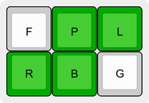||Shaped like an S<BR><BR>Used in: [𝒜](#char-mathematical-script-capital-a) [𝒞](#char-mathematical-script-capital-c) [𝒟](#char-mathematical-script-capital-d) [𝒢](#char-mathematical-script-capital-g) [𝒥](#char-mathematical-script-capital-j) [𝒦](#char-mathematical-script-capital-k) [𝒩](#char-mathematical-script-capital-n) [𝒪](#char-mathematical-script-capital-o) [𝒫](#char-mathematical-script-capital-p) [𝒬](#char-mathematical-script-capital-q) [𝒮](#char-mathematical-script-capital-s) [𝒯](#char-mathematical-script-capital-t) [𝒰](#char-mathematical-script-capital-u) [𝒱](#char-mathematical-script-capital-v) [𝒲](#char-mathematical-script-capital-w) [𝒳](#char-mathematical-script-capital-x) [𝒴](#char-mathematical-script-capital-y) [𝒵](#char-mathematical-script-capital-z) [𝒶](#char-mathematical-script-small-a) [𝒷](#char-mathematical-script-small-b) [𝒸](#char-mathematical-script-small-c) [𝒹](#char-mathematical-script-small-d) [𝒻](#char-mathematical-script-small-f) [𝒽](#char-mathematical-script-small-h) [𝒾](#char-mathematical-script-small-i) [𝒿](#char-mathematical-script-small-j) [𝓀](#char-mathematical-script-small-k) [𝓁](#char-mathematical-script-small-l) [𝓂](#char-mathematical-script-small-m) [𝓃](#char-mathematical-script-small-n) [𝓅](#char-mathematical-script-small-p) [𝓆](#char-mathematical-script-small-q) [𝓇](#char-mathematical-script-small-r) [𝓈](#char-mathematical-script-small-s) [𝓉](#char-mathematical-script-small-t) [𝓊](#char-mathematical-script-small-u) [𝓋](#char-mathematical-script-small-v) [𝓌](#char-mathematical-script-small-w) [𝓍](#char-mathematical-script-small-x) [𝓎](#char-mathematical-script-small-y) [𝓏](#char-mathematical-script-small-z) [𝓐](#char-mathematical-bold-script-capital-a) [𝓑](#char-mathematical-bold-script-capital-b) [𝓑](#char-mathematical-bold-script-capital-b) [𝓒](#char-mathematical-bold-script-capital-c) [𝓓](#char-mathematical-bold-script-capital-d) [𝓔](#char-mathematical-bold-script-capital-e) [𝓔](#char-mathematical-bold-script-capital-e) [𝓔](#char-mathematical-bold-script-capital-e) [𝓕](#char-mathematical-bold-script-capital-f) [𝓕](#char-mathematical-bold-script-capital-f) [𝓖](#char-mathematical-bold-script-capital-g) [𝓖](#char-mathematical-bold-script-capital-g) [𝓗](#char-mathematical-bold-script-capital-h) [𝓗](#char-mathematical-bold-script-capital-h) [𝓘](#char-mathematical-bold-script-capital-i) [𝓘](#char-mathematical-bold-script-capital-i) [𝓙](#char-mathematical-bold-script-capital-j) [𝓚](#char-mathematical-bold-script-capital-k) [𝓛](#char-mathematical-bold-script-capital-l) [𝓛](#char-mathematical-bold-script-capital-l) [𝓜](#char-mathematical-bold-script-capital-m) [𝓜](#char-mathematical-bold-script-capital-m) [𝓝](#char-mathematical-bold-script-capital-n) [𝓞](#char-mathematical-bold-script-capital-o) [𝓞](#char-mathematical-bold-script-capital-o) [𝓟](#char-mathematical-bold-script-capital-p) [𝓠](#char-mathematical-bold-script-capital-q) [𝓡](#char-mathematical-bold-script-capital-r) [𝓡](#char-mathematical-bold-script-capital-r) [𝓢](#char-mathematical-bold-script-capital-s) [𝓣](#char-mathematical-bold-script-capital-t) [𝓤](#char-mathematical-bold-script-capital-u) [𝓥](#char-mathematical-bold-script-capital-v) [𝓦](#char-mathematical-bold-script-capital-w) [𝓧](#char-mathematical-bold-script-capital-x) [𝓨](#char-mathematical-bold-script-capital-y) [𝓩](#char-mathematical-bold-script-capital-z) [𝓪](#char-mathematical-bold-script-small-a) [𝓫](#char-mathematical-bold-script-small-b) [𝓬](#char-mathematical-bold-script-small-c) [𝓭](#char-mathematical-bold-script-small-d) [𝓮](#char-mathematical-bold-script-small-e) [𝓯](#char-mathematical-bold-script-small-f) [𝓰](#char-mathematical-bold-script-small-g) [𝓱](#char-mathematical-bold-script-small-h) [𝓲](#char-mathematical-bold-script-small-i) [𝓳](#char-mathematical-bold-script-small-j) [𝓴](#char-mathematical-bold-script-small-k) [𝓵](#char-mathematical-bold-script-small-l) [𝓶](#char-mathematical-bold-script-small-m) [𝓷](#char-mathematical-bold-script-small-n) [𝓸](#char-mathematical-bold-script-small-o) [𝓹](#char-mathematical-bold-script-small-p) [𝓺](#char-mathematical-bold-script-small-q) [𝓻](#char-mathematical-bold-script-small-r) [𝓼](#char-mathematical-bold-script-small-s) [𝓽](#char-mathematical-bold-script-small-t) [𝓾](#char-mathematical-bold-script-small-u) [𝓿](#char-mathematical-bold-script-small-v) [𝔀](#char-mathematical-bold-script-small-w) [𝔁](#char-mathematical-bold-script-small-x) [𝔂](#char-mathematical-bold-script-small-y) [𝔃](#char-mathematical-bold-script-small-z)|
|Double Struck| | |
|||Two columns, to represent the two strikes, plus the '[extra](#modifier-tweaks)' tweak, to really hammer home the doubleness of it all.<BR><BR>Used in: [𝔸](#char-mathematical-double-struck-capital-a) [𝔹](#char-mathematical-double-struck-capital-b) [𝔻](#char-mathematical-double-struck-capital-d) [𝔼](#char-mathematical-double-struck-capital-e) [𝔽](#char-mathematical-double-struck-capital-f) [𝔾](#char-mathematical-double-struck-capital-g) [𝕀](#char-mathematical-double-struck-capital-i) [𝕁](#char-mathematical-double-struck-capital-j) [𝕂](#char-mathematical-double-struck-capital-k) [𝕃](#char-mathematical-double-struck-capital-l) [𝕄](#char-mathematical-double-struck-capital-m) [𝕆](#char-mathematical-double-struck-capital-o) [𝕊](#char-mathematical-double-struck-capital-s) [𝕋](#char-mathematical-double-struck-capital-t) [𝕌](#char-mathematical-double-struck-capital-u) [𝕍](#char-mathematical-double-struck-capital-v) [𝕎](#char-mathematical-double-struck-capital-w) [𝕏](#char-mathematical-double-struck-capital-x) [𝕐](#char-mathematical-double-struck-capital-y) [𝕒](#char-mathematical-double-struck-small-a) [𝕓](#char-mathematical-double-struck-small-b) [𝕔](#char-mathematical-double-struck-small-c) [𝕕](#char-mathematical-double-struck-small-d) [𝕖](#char-mathematical-double-struck-small-e) [𝕗](#char-mathematical-double-struck-small-f) [𝕘](#char-mathematical-double-struck-small-g) [𝕙](#char-mathematical-double-struck-small-h) [𝕚](#char-mathematical-double-struck-small-i) [𝕛](#char-mathematical-double-struck-small-j) [𝕜](#char-mathematical-double-struck-small-k) [𝕝](#char-mathematical-double-struck-small-l) [𝕞](#char-mathematical-double-struck-small-m) [𝕟](#char-mathematical-double-struck-small-n) [𝕠](#char-mathematical-double-struck-small-o) [𝕡](#char-mathematical-double-struck-small-p) [𝕢](#char-mathematical-double-struck-small-q) [𝕣](#char-mathematical-double-struck-small-r) [𝕤](#char-mathematical-double-struck-small-s) [𝕥](#char-mathematical-double-struck-small-t) [𝕦](#char-mathematical-double-struck-small-u) [𝕧](#char-mathematical-double-struck-small-v) [𝕨](#char-mathematical-double-struck-small-w) [𝕩](#char-mathematical-double-struck-small-x) [𝕪](#char-mathematical-double-struck-small-y) [𝕫](#char-mathematical-double-struck-small-z)|
|Fraktur| | |
|||FR, for "Fraktur", plus the '[extra](#modifier-tweaks)' tweak, for extra frakting, and because FR alone was already in use.<BR><BR>Used in: [𝔄](#char-mathematical-fraktur-capital-a) [𝔅](#char-mathematical-fraktur-capital-b) [𝔇](#char-mathematical-fraktur-capital-d) [𝔈](#char-mathematical-fraktur-capital-e) [𝔉](#char-mathematical-fraktur-capital-f) [𝔊](#char-mathematical-fraktur-capital-g) [𝔍](#char-mathematical-fraktur-capital-j) [𝔎](#char-mathematical-fraktur-capital-k) [𝔏](#char-mathematical-fraktur-capital-l) [𝔐](#char-mathematical-fraktur-capital-m) [𝔑](#char-mathematical-fraktur-capital-n) [𝔒](#char-mathematical-fraktur-capital-o) [𝔓](#char-mathematical-fraktur-capital-p) [𝔔](#char-mathematical-fraktur-capital-q) [𝔖](#char-mathematical-fraktur-capital-s) [𝔗](#char-mathematical-fraktur-capital-t) [𝔘](#char-mathematical-fraktur-capital-u) [𝔙](#char-mathematical-fraktur-capital-v) [𝔚](#char-mathematical-fraktur-capital-w) [𝔛](#char-mathematical-fraktur-capital-x) [𝔜](#char-mathematical-fraktur-capital-y) [𝔞](#char-mathematical-fraktur-small-a) [𝔟](#char-mathematical-fraktur-small-b) [𝔠](#char-mathematical-fraktur-small-c) [𝔡](#char-mathematical-fraktur-small-d) [𝔢](#char-mathematical-fraktur-small-e) [𝔣](#char-mathematical-fraktur-small-f) [𝔤](#char-mathematical-fraktur-small-g) [𝔥](#char-mathematical-fraktur-small-h) [𝔦](#char-mathematical-fraktur-small-i) [𝔧](#char-mathematical-fraktur-small-j) [𝔨](#char-mathematical-fraktur-small-k) [𝔩](#char-mathematical-fraktur-small-l) [𝔪](#char-mathematical-fraktur-small-m) [𝔫](#char-mathematical-fraktur-small-n) [𝔬](#char-mathematical-fraktur-small-o) [𝔭](#char-mathematical-fraktur-small-p) [𝔮](#char-mathematical-fraktur-small-q) [𝔯](#char-mathematical-fraktur-small-r) [𝔰](#char-mathematical-fraktur-small-s) [𝔱](#char-mathematical-fraktur-small-t) [𝔲](#char-mathematical-fraktur-small-u) [𝔳](#char-mathematical-fraktur-small-v) [𝔴](#char-mathematical-fraktur-small-w) [𝔵](#char-mathematical-fraktur-small-x) [𝔶](#char-mathematical-fraktur-small-y) [𝔷](#char-mathematical-fraktur-small-z) [𝕬](#char-mathematical-bold-fraktur-capital-a) [𝕭](#char-mathematical-bold-fraktur-capital-b) [𝕮](#char-mathematical-bold-fraktur-capital-c) [𝕯](#char-mathematical-bold-fraktur-capital-d) [𝕰](#char-mathematical-bold-fraktur-capital-e) [𝕱](#char-mathematical-bold-fraktur-capital-f) [𝕲](#char-mathematical-bold-fraktur-capital-g) [𝕳](#char-mathematical-bold-fraktur-capital-h) [𝕴](#char-mathematical-bold-fraktur-capital-i) [𝕵](#char-mathematical-bold-fraktur-capital-j) [𝕶](#char-mathematical-bold-fraktur-capital-k) [𝕷](#char-mathematical-bold-fraktur-capital-l) [𝕸](#char-mathematical-bold-fraktur-capital-m) [𝕹](#char-mathematical-bold-fraktur-capital-n) [𝕺](#char-mathematical-bold-fraktur-capital-o) [𝕻](#char-mathematical-bold-fraktur-capital-p) [𝕼](#char-mathematical-bold-fraktur-capital-q) [𝕽](#char-mathematical-bold-fraktur-capital-r) [𝕾](#char-mathematical-bold-fraktur-capital-s) [𝕿](#char-mathematical-bold-fraktur-capital-t) [𝖀](#char-mathematical-bold-fraktur-capital-u) [𝖁](#char-mathematical-bold-fraktur-capital-v) [𝖂](#char-mathematical-bold-fraktur-capital-w) [𝖃](#char-mathematical-bold-fraktur-capital-x) [𝖄](#char-mathematical-bold-fraktur-capital-y) [𝖅](#char-mathematical-bold-fraktur-capital-z) [𝖆](#char-mathematical-bold-fraktur-small-a) [𝖇](#char-mathematical-bold-fraktur-small-b) [𝖈](#char-mathematical-bold-fraktur-small-c) [𝖉](#char-mathematical-bold-fraktur-small-d) [𝖊](#char-mathematical-bold-fraktur-small-e) [𝖋](#char-mathematical-bold-fraktur-small-f) [𝖌](#char-mathematical-bold-fraktur-small-g) [𝖍](#char-mathematical-bold-fraktur-small-h) [𝖎](#char-mathematical-bold-fraktur-small-i) [𝖏](#char-mathematical-bold-fraktur-small-j) [𝖐](#char-mathematical-bold-fraktur-small-k) [𝖑](#char-mathematical-bold-fraktur-small-l) [𝖒](#char-mathematical-bold-fraktur-small-m) [𝖓](#char-mathematical-bold-fraktur-small-n) [𝖔](#char-mathematical-bold-fraktur-small-o) [𝖕](#char-mathematical-bold-fraktur-small-p) [𝖖](#char-mathematical-bold-fraktur-small-q) [𝖗](#char-mathematical-bold-fraktur-small-r) [𝖘](#char-mathematical-bold-fraktur-small-s) [𝖙](#char-mathematical-bold-fraktur-small-t) [𝖚](#char-mathematical-bold-fraktur-small-u) [𝖛](#char-mathematical-bold-fraktur-small-v) [𝖜](#char-mathematical-bold-fraktur-small-w) [𝖝](#char-mathematical-bold-fraktur-small-x) [𝖞](#char-mathematical-bold-fraktur-small-y) [𝖟](#char-mathematical-bold-fraktur-small-z)|
|Sans-Serif| | |
|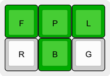||Shaped like a serifed ascender, with the '[under](#modifier-tweaks)' tweak − here, representing "un–", because we're *_not_* seriffing. I apologize for verbing "serif".<BR><BR>Used in: [𝖠](#char-mathematical-sans-serif-capital-a) [𝖡](#char-mathematical-sans-serif-capital-b) [𝖢](#char-mathematical-sans-serif-capital-c) [𝖣](#char-mathematical-sans-serif-capital-d) [𝖤](#char-mathematical-sans-serif-capital-e) [𝖥](#char-mathematical-sans-serif-capital-f) [𝖦](#char-mathematical-sans-serif-capital-g) [𝖧](#char-mathematical-sans-serif-capital-h) [𝖨](#char-mathematical-sans-serif-capital-i) [𝖩](#char-mathematical-sans-serif-capital-j) [𝖪](#char-mathematical-sans-serif-capital-k) [𝖫](#char-mathematical-sans-serif-capital-l) [𝖬](#char-mathematical-sans-serif-capital-m) [𝖭](#char-mathematical-sans-serif-capital-n) [𝖮](#char-mathematical-sans-serif-capital-o) [𝖯](#char-mathematical-sans-serif-capital-p) [𝖰](#char-mathematical-sans-serif-capital-q) [𝖱](#char-mathematical-sans-serif-capital-r) [𝖲](#char-mathematical-sans-serif-capital-s) [𝖳](#char-mathematical-sans-serif-capital-t) [𝖴](#char-mathematical-sans-serif-capital-u) [𝖵](#char-mathematical-sans-serif-capital-v) [𝖶](#char-mathematical-sans-serif-capital-w) [𝖷](#char-mathematical-sans-serif-capital-x) [𝖸](#char-mathematical-sans-serif-capital-y) [𝖹](#char-mathematical-sans-serif-capital-z) [𝖺](#char-mathematical-sans-serif-small-a) [𝖻](#char-mathematical-sans-serif-small-b) [𝖼](#char-mathematical-sans-serif-small-c) [𝖽](#char-mathematical-sans-serif-small-d) [𝖾](#char-mathematical-sans-serif-small-e) [𝖿](#char-mathematical-sans-serif-small-f) [𝗀](#char-mathematical-sans-serif-small-g) [𝗁](#char-mathematical-sans-serif-small-h) [𝗂](#char-mathematical-sans-serif-small-i) [𝗃](#char-mathematical-sans-serif-small-j) [𝗄](#char-mathematical-sans-serif-small-k) [𝗅](#char-mathematical-sans-serif-small-l) [𝗆](#char-mathematical-sans-serif-small-m) [𝗇](#char-mathematical-sans-serif-small-n) [𝗈](#char-mathematical-sans-serif-small-o) [𝗉](#char-mathematical-sans-serif-small-p) [𝗊](#char-mathematical-sans-serif-small-q) [𝗋](#char-mathematical-sans-serif-small-r) [𝗌](#char-mathematical-sans-serif-small-s) [𝗍](#char-mathematical-sans-serif-small-t) [𝗎](#char-mathematical-sans-serif-small-u) [𝗏](#char-mathematical-sans-serif-small-v) [𝗐](#char-mathematical-sans-serif-small-w) [𝗑](#char-mathematical-sans-serif-small-x) [𝗒](#char-mathematical-sans-serif-small-y) [𝗓](#char-mathematical-sans-serif-small-z) [𝗔](#char-mathematical-sans-serif-bold-capital-a) [𝗕](#char-mathematical-sans-serif-bold-capital-b) [𝗖](#char-mathematical-sans-serif-bold-capital-c) [𝗗](#char-mathematical-sans-serif-bold-capital-d) [𝗘](#char-mathematical-sans-serif-bold-capital-e) [𝗙](#char-mathematical-sans-serif-bold-capital-f) [𝗚](#char-mathematical-sans-serif-bold-capital-g) [𝗛](#char-mathematical-sans-serif-bold-capital-h) [𝗜](#char-mathematical-sans-serif-bold-capital-i) [𝗝](#char-mathematical-sans-serif-bold-capital-j) [𝗞](#char-mathematical-sans-serif-bold-capital-k) [𝗟](#char-mathematical-sans-serif-bold-capital-l) [𝗠](#char-mathematical-sans-serif-bold-capital-m) [𝗡](#char-mathematical-sans-serif-bold-capital-n) [𝗢](#char-mathematical-sans-serif-bold-capital-o) [𝗣](#char-mathematical-sans-serif-bold-capital-p) [𝗤](#char-mathematical-sans-serif-bold-capital-q) [𝗥](#char-mathematical-sans-serif-bold-capital-r) [𝗦](#char-mathematical-sans-serif-bold-capital-s) [𝗧](#char-mathematical-sans-serif-bold-capital-t) [𝗨](#char-mathematical-sans-serif-bold-capital-u) [𝗩](#char-mathematical-sans-serif-bold-capital-v) [𝗪](#char-mathematical-sans-serif-bold-capital-w) [𝗫](#char-mathematical-sans-serif-bold-capital-x) [𝗬](#char-mathematical-sans-serif-bold-capital-y) [𝗭](#char-mathematical-sans-serif-bold-capital-z) [𝗮](#char-mathematical-sans-serif-bold-small-a) [𝗯](#char-mathematical-sans-serif-bold-small-b) [𝗰](#char-mathematical-sans-serif-bold-small-c) [𝗱](#char-mathematical-sans-serif-bold-small-d) [𝗲](#char-mathematical-sans-serif-bold-small-e) [𝗳](#char-mathematical-sans-serif-bold-small-f) [𝗴](#char-mathematical-sans-serif-bold-small-g) [𝗵](#char-mathematical-sans-serif-bold-small-h) [𝗶](#char-mathematical-sans-serif-bold-small-i) [𝗷](#char-mathematical-sans-serif-bold-small-j) [𝗸](#char-mathematical-sans-serif-bold-small-k) [𝗹](#char-mathematical-sans-serif-bold-small-l) [𝗺](#char-mathematical-sans-serif-bold-small-m) [𝗻](#char-mathematical-sans-serif-bold-small-n) [𝗼](#char-mathematical-sans-serif-bold-small-o) [𝗽](#char-mathematical-sans-serif-bold-small-p) [𝗾](#char-mathematical-sans-serif-bold-small-q) [𝗿](#char-mathematical-sans-serif-bold-small-r) [𝘀](#char-mathematical-sans-serif-bold-small-s) [𝘁](#char-mathematical-sans-serif-bold-small-t) [𝘂](#char-mathematical-sans-serif-bold-small-u) [𝘃](#char-mathematical-sans-serif-bold-small-v) [𝘄](#char-mathematical-sans-serif-bold-small-w) [𝘅](#char-mathematical-sans-serif-bold-small-x) [𝘆](#char-mathematical-sans-serif-bold-small-y) [𝘇](#char-mathematical-sans-serif-bold-small-z) [𝘈](#char-mathematical-sans-serif-italic-capital-a) [𝘉](#char-mathematical-sans-serif-italic-capital-b) [𝘊](#char-mathematical-sans-serif-italic-capital-c) [𝘋](#char-mathematical-sans-serif-italic-capital-d) [𝘌](#char-mathematical-sans-serif-italic-capital-e) [𝘍](#char-mathematical-sans-serif-italic-capital-f) [𝘎](#char-mathematical-sans-serif-italic-capital-g) [𝘏](#char-mathematical-sans-serif-italic-capital-h) [𝘐](#char-mathematical-sans-serif-italic-capital-i) [𝘑](#char-mathematical-sans-serif-italic-capital-j) [𝘒](#char-mathematical-sans-serif-italic-capital-k) [𝘓](#char-mathematical-sans-serif-italic-capital-l) [𝘔](#char-mathematical-sans-serif-italic-capital-m) [𝘕](#char-mathematical-sans-serif-italic-capital-n) [𝘖](#char-mathematical-sans-serif-italic-capital-o) [𝘗](#char-mathematical-sans-serif-italic-capital-p) [𝘘](#char-mathematical-sans-serif-italic-capital-q) [𝘙](#char-mathematical-sans-serif-italic-capital-r) [𝘚](#char-mathematical-sans-serif-italic-capital-s) [𝘛](#char-mathematical-sans-serif-italic-capital-t) [𝘜](#char-mathematical-sans-serif-italic-capital-u) [𝘝](#char-mathematical-sans-serif-italic-capital-v) [𝘞](#char-mathematical-sans-serif-italic-capital-w) [𝘟](#char-mathematical-sans-serif-italic-capital-x) [𝘠](#char-mathematical-sans-serif-italic-capital-y) [𝘡](#char-mathematical-sans-serif-italic-capital-z) [𝘢](#char-mathematical-sans-serif-italic-small-a) [𝘣](#char-mathematical-sans-serif-italic-small-b) [𝘤](#char-mathematical-sans-serif-italic-small-c) [𝘥](#char-mathematical-sans-serif-italic-small-d) [𝘦](#char-mathematical-sans-serif-italic-small-e) [𝘧](#char-mathematical-sans-serif-italic-small-f) [𝘨](#char-mathematical-sans-serif-italic-small-g) [𝘩](#char-mathematical-sans-serif-italic-small-h) [𝘪](#char-mathematical-sans-serif-italic-small-i) [𝘫](#char-mathematical-sans-serif-italic-small-j) [𝘬](#char-mathematical-sans-serif-italic-small-k) [𝘭](#char-mathematical-sans-serif-italic-small-l) [𝘮](#char-mathematical-sans-serif-italic-small-m) [𝘯](#char-mathematical-sans-serif-italic-small-n) [𝘰](#char-mathematical-sans-serif-italic-small-o) [𝘱](#char-mathematical-sans-serif-italic-small-p) [𝘲](#char-mathematical-sans-serif-italic-small-q) [𝘳](#char-mathematical-sans-serif-italic-small-r) [𝘴](#char-mathematical-sans-serif-italic-small-s) [𝘵](#char-mathematical-sans-serif-italic-small-t) [𝘶](#char-mathematical-sans-serif-italic-small-u) [𝘷](#char-mathematical-sans-serif-italic-small-v) [𝘸](#char-mathematical-sans-serif-italic-small-w) [𝘹](#char-mathematical-sans-serif-italic-small-x) [𝘺](#char-mathematical-sans-serif-italic-small-y) [𝘻](#char-mathematical-sans-serif-italic-small-z) [𝘼](#char-mathematical-sans-serif-bold-italic-capital-a) [𝘽](#char-mathematical-sans-serif-bold-italic-capital-b) [𝘾](#char-mathematical-sans-serif-bold-italic-capital-c) [𝘿](#char-mathematical-sans-serif-bold-italic-capital-d) [𝙀](#char-mathematical-sans-serif-bold-italic-capital-e) [𝙁](#char-mathematical-sans-serif-bold-italic-capital-f) [𝙂](#char-mathematical-sans-serif-bold-italic-capital-g) [𝙃](#char-mathematical-sans-serif-bold-italic-capital-h) [𝙄](#char-mathematical-sans-serif-bold-italic-capital-i) [𝙅](#char-mathematical-sans-serif-bold-italic-capital-j) [𝙆](#char-mathematical-sans-serif-bold-italic-capital-k) [𝙇](#char-mathematical-sans-serif-bold-italic-capital-l) [𝙈](#char-mathematical-sans-serif-bold-italic-capital-m) [𝙉](#char-mathematical-sans-serif-bold-italic-capital-n) [𝙊](#char-mathematical-sans-serif-bold-italic-capital-o) [𝙋](#char-mathematical-sans-serif-bold-italic-capital-p) [𝙌](#char-mathematical-sans-serif-bold-italic-capital-q) [𝙍](#char-mathematical-sans-serif-bold-italic-capital-r) [𝙎](#char-mathematical-sans-serif-bold-italic-capital-s) [𝙏](#char-mathematical-sans-serif-bold-italic-capital-t) [𝙐](#char-mathematical-sans-serif-bold-italic-capital-u) [𝙑](#char-mathematical-sans-serif-bold-italic-capital-v) [𝙒](#char-mathematical-sans-serif-bold-italic-capital-w) [𝙓](#char-mathematical-sans-serif-bold-italic-capital-x) [𝙔](#char-mathematical-sans-serif-bold-italic-capital-y) [𝙕](#char-mathematical-sans-serif-bold-italic-capital-z) [𝙖](#char-mathematical-sans-serif-bold-italic-small-a) [𝙗](#char-mathematical-sans-serif-bold-italic-small-b) [𝙘](#char-mathematical-sans-serif-bold-italic-small-c) [𝙙](#char-mathematical-sans-serif-bold-italic-small-d) [𝙚](#char-mathematical-sans-serif-bold-italic-small-e) [𝙛](#char-mathematical-sans-serif-bold-italic-small-f) [𝙜](#char-mathematical-sans-serif-bold-italic-small-g) [𝙝](#char-mathematical-sans-serif-bold-italic-small-h) [𝙞](#char-mathematical-sans-serif-bold-italic-small-i) [𝙟](#char-mathematical-sans-serif-bold-italic-small-j) [𝙠](#char-mathematical-sans-serif-bold-italic-small-k) [𝙡](#char-mathematical-sans-serif-bold-italic-small-l) [𝙢](#char-mathematical-sans-serif-bold-italic-small-m) [𝙣](#char-mathematical-sans-serif-bold-italic-small-n) [𝙤](#char-mathematical-sans-serif-bold-italic-small-o) [𝙥](#char-mathematical-sans-serif-bold-italic-small-p) [𝙦](#char-mathematical-sans-serif-bold-italic-small-q) [𝙧](#char-mathematical-sans-serif-bold-italic-small-r) [𝙨](#char-mathematical-sans-serif-bold-italic-small-s) [𝙩](#char-mathematical-sans-serif-bold-italic-small-t) [𝙪](#char-mathematical-sans-serif-bold-italic-small-u) [𝙫](#char-mathematical-sans-serif-bold-italic-small-v) [𝙬](#char-mathematical-sans-serif-bold-italic-small-w) [𝙭](#char-mathematical-sans-serif-bold-italic-small-x) [𝙮](#char-mathematical-sans-serif-bold-italic-small-y) [𝙯](#char-mathematical-sans-serif-bold-italic-small-z) [𝝖](#char-mathematical-sans-serif-bold-capital-alpha) [𝝗](#char-mathematical-sans-serif-bold-capital-beta) [𝝘](#char-mathematical-sans-serif-bold-capital-gamma) [𝝙](#char-mathematical-sans-serif-bold-capital-delta) [𝝚](#char-mathematical-sans-serif-bold-capital-epsilon) [𝝛](#char-mathematical-sans-serif-bold-capital-zeta) [𝝜](#char-mathematical-sans-serif-bold-capital-eta) [𝝝](#char-mathematical-sans-serif-bold-capital-theta) [𝝞](#char-mathematical-sans-serif-bold-capital-iota) [𝝟](#char-mathematical-sans-serif-bold-capital-kappa) [𝝠](#char-mathematical-sans-serif-bold-capital-lamda) [𝝡](#char-mathematical-sans-serif-bold-capital-mu) [𝝢](#char-mathematical-sans-serif-bold-capital-nu) [𝝣](#char-mathematical-sans-serif-bold-capital-xi) [𝝤](#char-mathematical-sans-serif-bold-capital-omicron) [𝝥](#char-mathematical-sans-serif-bold-capital-pi) [𝝦](#char-mathematical-sans-serif-bold-capital-rho) [𝝨](#char-mathematical-sans-serif-bold-capital-sigma) [𝝩](#char-mathematical-sans-serif-bold-capital-tau) [𝝪](#char-mathematical-sans-serif-bold-capital-upsilon) [𝝫](#char-mathematical-sans-serif-bold-capital-phi) [𝝬](#char-mathematical-sans-serif-bold-capital-chi) [𝝭](#char-mathematical-sans-serif-bold-capital-psi) [𝝮](#char-mathematical-sans-serif-bold-capital-omega) [𝝰](#char-mathematical-sans-serif-bold-small-alpha) [𝝱](#char-mathematical-sans-serif-bold-small-beta) [𝝲](#char-mathematical-sans-serif-bold-small-gamma) [𝝳](#char-mathematical-sans-serif-bold-small-delta) [𝝴](#char-mathematical-sans-serif-bold-small-epsilon) [𝝵](#char-mathematical-sans-serif-bold-small-zeta) [𝝶](#char-mathematical-sans-serif-bold-small-eta) [𝝷](#char-mathematical-sans-serif-bold-small-theta) [𝝸](#char-mathematical-sans-serif-bold-small-iota) [𝝹](#char-mathematical-sans-serif-bold-small-kappa) [𝝺](#char-mathematical-sans-serif-bold-small-lamda) [𝝻](#char-mathematical-sans-serif-bold-small-mu) [𝝼](#char-mathematical-sans-serif-bold-small-nu) [𝝽](#char-mathematical-sans-serif-bold-small-xi) [𝝾](#char-mathematical-sans-serif-bold-small-omicron) [𝝿](#char-mathematical-sans-serif-bold-small-pi) [𝞀](#char-mathematical-sans-serif-bold-small-rho) [𝞁](#char-mathematical-sans-serif-bold-small-final-sigma) [𝞂](#char-mathematical-sans-serif-bold-small-sigma) [𝞃](#char-mathematical-sans-serif-bold-small-tau) [𝞄](#char-mathematical-sans-serif-bold-small-upsilon) [𝞅](#char-mathematical-sans-serif-bold-small-phi) [𝞆](#char-mathematical-sans-serif-bold-small-chi) [𝞇](#char-mathematical-sans-serif-bold-small-psi) [𝞈](#char-mathematical-sans-serif-bold-small-omega) [𝞐](#char-mathematical-sans-serif-bold-italic-capital-alpha) [𝞑](#char-mathematical-sans-serif-bold-italic-capital-beta) [𝞒](#char-mathematical-sans-serif-bold-italic-capital-gamma) [𝞓](#char-mathematical-sans-serif-bold-italic-capital-delta) [𝞔](#char-mathematical-sans-serif-bold-italic-capital-epsilon) [𝞕](#char-mathematical-sans-serif-bold-italic-capital-zeta) [𝞖](#char-mathematical-sans-serif-bold-italic-capital-eta) [𝞗](#char-mathematical-sans-serif-bold-italic-capital-theta) [𝞘](#char-mathematical-sans-serif-bold-italic-capital-iota) [𝞙](#char-mathematical-sans-serif-bold-italic-capital-kappa) [𝞚](#char-mathematical-sans-serif-bold-italic-capital-lamda) [𝞛](#char-mathematical-sans-serif-bold-italic-capital-mu) [𝞜](#char-mathematical-sans-serif-bold-italic-capital-nu) [𝞝](#char-mathematical-sans-serif-bold-italic-capital-xi) [𝞞](#char-mathematical-sans-serif-bold-italic-capital-omicron) [𝞟](#char-mathematical-sans-serif-bold-italic-capital-pi) [𝞠](#char-mathematical-sans-serif-bold-italic-capital-rho) [𝞡](#char-mathematical-sans-serif-bold-italic-capital-theta-symbol) [𝞢](#char-mathematical-sans-serif-bold-italic-capital-sigma) [𝞣](#char-mathematical-sans-serif-bold-italic-capital-tau) [𝞤](#char-mathematical-sans-serif-bold-italic-capital-upsilon) [𝞥](#char-mathematical-sans-serif-bold-italic-capital-phi) [𝞦](#char-mathematical-sans-serif-bold-italic-capital-chi) [𝞧](#char-mathematical-sans-serif-bold-italic-capital-psi) [𝞨](#char-mathematical-sans-serif-bold-italic-capital-omega) [𝞪](#char-mathematical-sans-serif-bold-italic-small-alpha) [𝞫](#char-mathematical-sans-serif-bold-italic-small-beta) [𝞬](#char-mathematical-sans-serif-bold-italic-small-gamma) [𝞭](#char-mathematical-sans-serif-bold-italic-small-delta) [𝞮](#char-mathematical-sans-serif-bold-italic-small-epsilon) [𝞯](#char-mathematical-sans-serif-bold-italic-small-zeta) [𝞰](#char-mathematical-sans-serif-bold-italic-small-eta) [𝞱](#char-mathematical-sans-serif-bold-italic-small-theta) [𝞲](#char-mathematical-sans-serif-bold-italic-small-iota) [𝞳](#char-mathematical-sans-serif-bold-italic-small-kappa) [𝞴](#char-mathematical-sans-serif-bold-italic-small-lamda) [𝞵](#char-mathematical-sans-serif-bold-italic-small-mu) [𝞶](#char-mathematical-sans-serif-bold-italic-small-nu) [𝞷](#char-mathematical-sans-serif-bold-italic-small-xi) [𝞸](#char-mathematical-sans-serif-bold-italic-small-omicron) [𝞹](#char-mathematical-sans-serif-bold-italic-small-pi) [𝞺](#char-mathematical-sans-serif-bold-italic-small-rho) [𝞻](#char-mathematical-sans-serif-bold-italic-small-final-sigma) [𝞻](#char-mathematical-sans-serif-bold-italic-small-final-sigma) [𝞼](#char-mathematical-sans-serif-bold-italic-small-sigma) [𝞽](#char-mathematical-sans-serif-bold-italic-small-tau) [𝞾](#char-mathematical-sans-serif-bold-italic-small-upsilon) [𝞿](#char-mathematical-sans-serif-bold-italic-small-phi) [𝟀](#char-mathematical-sans-serif-bold-italic-small-chi) [𝟁](#char-mathematical-sans-serif-bold-italic-small-psi) [𝟂](#char-mathematical-sans-serif-bold-italic-small-omega)|
|Monospace| | |
|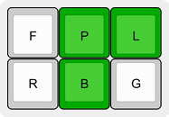||Tough one to think of a chord for. This is just the right-hand side's M and N chords, for "MoNo", superimposed.<BR><BR>Used in: [𝙰](#char-mathematical-monospace-capital-a) [𝙱](#char-mathematical-monospace-capital-b) [𝙲](#char-mathematical-monospace-capital-c) [𝙳](#char-mathematical-monospace-capital-d) [𝙴](#char-mathematical-monospace-capital-e) [𝙵](#char-mathematical-monospace-capital-f) [𝙶](#char-mathematical-monospace-capital-g) [𝙷](#char-mathematical-monospace-capital-h) [𝙸](#char-mathematical-monospace-capital-i) [𝙹](#char-mathematical-monospace-capital-j) [𝙺](#char-mathematical-monospace-capital-k) [𝙻](#char-mathematical-monospace-capital-l) [𝙼](#char-mathematical-monospace-capital-m) [𝙽](#char-mathematical-monospace-capital-n) [𝙾](#char-mathematical-monospace-capital-o) [𝙿](#char-mathematical-monospace-capital-p) [𝚀](#char-mathematical-monospace-capital-q) [𝚁](#char-mathematical-monospace-capital-r) [𝚂](#char-mathematical-monospace-capital-s) [𝚃](#char-mathematical-monospace-capital-t) [𝚄](#char-mathematical-monospace-capital-u) [𝚅](#char-mathematical-monospace-capital-v) [𝚆](#char-mathematical-monospace-capital-w) [𝚇](#char-mathematical-monospace-capital-x) [𝚈](#char-mathematical-monospace-capital-y) [𝚉](#char-mathematical-monospace-capital-z) [𝚊](#char-mathematical-monospace-small-a) [𝚋](#char-mathematical-monospace-small-b) [𝚌](#char-mathematical-monospace-small-c) [𝚍](#char-mathematical-monospace-small-d) [𝚎](#char-mathematical-monospace-small-e) [𝚏](#char-mathematical-monospace-small-f) [𝚐](#char-mathematical-monospace-small-g) [𝚑](#char-mathematical-monospace-small-h) [𝚒](#char-mathematical-monospace-small-i) [𝚓](#char-mathematical-monospace-small-j) [𝚔](#char-mathematical-monospace-small-k) [𝚕](#char-mathematical-monospace-small-l) [𝚖](#char-mathematical-monospace-small-m) [𝚗](#char-mathematical-monospace-small-n) [𝚘](#char-mathematical-monospace-small-o) [𝚙](#char-mathematical-monospace-small-p) [𝚚](#char-mathematical-monospace-small-q) [𝚛](#char-mathematical-monospace-small-r) [𝚜](#char-mathematical-monospace-small-s) [𝚝](#char-mathematical-monospace-small-t) [𝚞](#char-mathematical-monospace-small-u) [𝚟](#char-mathematical-monospace-small-v) [𝚠](#char-mathematical-monospace-small-w) [𝚡](#char-mathematical-monospace-small-x) [𝚢](#char-mathematical-monospace-small-y) [𝚣](#char-mathematical-monospace-small-z)|
|Currency with Bar| | |
|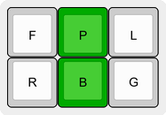||A lot of currency signs [use a bar](https://en.wikipedia.org/wiki/Bar_(diacritic)#Currency_signs_with_bar) through a letter. Not all of them use a vertical bar, but we have to pick a stroke, and this also helps to differentiate this bar from the more typically horizontal bar diacritics through many of the same letters. See Currency with Double Bar.<BR><BR>Used in: [$](#char-dollar-sign) [¢](#char-cent-sign) [£](#char-pound-sign) [৳](#char-bengali-rupee-sign) [฿](#char-thai-currency-symbol-baht) [៛](#char-khmer-currency-symbol-riel) [₣](#char-french-franc-sign) [₥](#char-mill-sign) [₫](#char-dong-sign) [₭](#char-kip-sign) [₲](#char-guarani-sign) [₵](#char-cedi-sign)|
|Currency with Double Bar| | |
|||Like the Currency with Bar characters, but for those with double bars. See Currency with Bar.<BR><BR>Used in: [¥](#char-yen-sign) [֏](#char-armenian-dram-sign) [₡](#char-colon-sign) [₤](#char-lira-sign) [₦](#char-naira-sign) [₩](#char-won-sign) [€](#char-euro-sign) [₮](#char-tugrik-sign) [₱](#char-peso-sign) [₳](#char-austral-sign) [₴](#char-hryvnia-sign) [₹](#char-indian-rupee-sign) [₺](#char-turkish-lira-sign) [₽](#char-ruble-sign) [₾](#char-lari-sign) [₿](#char-bitcoin-sign)|
## All Characters List
Here are [currently] all 1726 characters this library exports, base alphabets first, followed by all composed characters built from them.

Code points currently link to their associated page on [Compart](https://www.compart.com/en/about-compart)'s site. No affiliation; it just showed up in character searches, seems to have all pages, and it's easy to turn Unicode code points into its URLs.

### English Latin Alphabet
Standard English steno enders.<BR>
**Majuscule Ender:** `*P`<BR>
**Minuscule Ender:** `*`<BR>
<BR>
English steno theories come with alphabets, but for sake of completeness...<BR>
|Letter|Code Pt|Name|Stroke(s)|Notes|
|-|-|-|-|-|
|A|[U+0041](https://www.compart.com/en/unicode/U+0041)|LATIN CAPITAL LETTER A|`A*P`||
|a|[U+0061](https://www.compart.com/en/unicode/U+0061)|LATIN SMALL LETTER A|`A*`||
|B|[U+0042](https://www.compart.com/en/unicode/U+0042)|LATIN CAPITAL LETTER B|`PW*P`||
|b|[U+0062](https://www.compart.com/en/unicode/U+0062)|LATIN SMALL LETTER B|`PW*`||
|C|[U+0043](https://www.compart.com/en/unicode/U+0043)|LATIN CAPITAL LETTER C|`KR*P`||
|c|[U+0063](https://www.compart.com/en/unicode/U+0063)|LATIN SMALL LETTER C|`KR*`||
|D|[U+0044](https://www.compart.com/en/unicode/U+0044)|LATIN CAPITAL LETTER D|`TK*P`||
|d|[U+0064](https://www.compart.com/en/unicode/U+0064)|LATIN SMALL LETTER D|`TK*`||
|E|[U+0045](https://www.compart.com/en/unicode/U+0045)|LATIN CAPITAL LETTER E|`*EP`||
|e|[U+0065](https://www.compart.com/en/unicode/U+0065)|LATIN SMALL LETTER E|`*E`||
|F|[U+0046](https://www.compart.com/en/unicode/U+0046)|LATIN CAPITAL LETTER F|`TP*P`||
|f|[U+0066](https://www.compart.com/en/unicode/U+0066)|LATIN SMALL LETTER F|`TP*`||
|G|[U+0047](https://www.compart.com/en/unicode/U+0047)|LATIN CAPITAL LETTER G|`TKPW*P`||
|g|[U+0067](https://www.compart.com/en/unicode/U+0067)|LATIN SMALL LETTER G|`TKPW*`||
|H|[U+0048](https://www.compart.com/en/unicode/U+0048)|LATIN CAPITAL LETTER H|`H*P`||
|h|[U+0068](https://www.compart.com/en/unicode/U+0068)|LATIN SMALL LETTER H|`H*`||
|I|[U+0049](https://www.compart.com/en/unicode/U+0049)|LATIN CAPITAL LETTER I|`*EUP`||
|i|[U+0069](https://www.compart.com/en/unicode/U+0069)|LATIN SMALL LETTER I|`*EU`||
|J|[U+004A](https://www.compart.com/en/unicode/U+004A)|LATIN CAPITAL LETTER J|`SKWR*P`||
|j|[U+006A](https://www.compart.com/en/unicode/U+006A)|LATIN SMALL LETTER J|`SKWR*`||
|K|[U+004B](https://www.compart.com/en/unicode/U+004B)|LATIN CAPITAL LETTER K|`K*P`||
|k|[U+006B](https://www.compart.com/en/unicode/U+006B)|LATIN SMALL LETTER K|`K*`||
|L|[U+004C](https://www.compart.com/en/unicode/U+004C)|LATIN CAPITAL LETTER L|`HR*P`||
|l|[U+006C](https://www.compart.com/en/unicode/U+006C)|LATIN SMALL LETTER L|`HR*`||
|M|[U+004D](https://www.compart.com/en/unicode/U+004D)|LATIN CAPITAL LETTER M|`PH*P`||
|m|[U+006D](https://www.compart.com/en/unicode/U+006D)|LATIN SMALL LETTER M|`PH*`||
|N|[U+004E](https://www.compart.com/en/unicode/U+004E)|LATIN CAPITAL LETTER N|`TPH*P`||
|n|[U+006E](https://www.compart.com/en/unicode/U+006E)|LATIN SMALL LETTER N|`TPH*`||
|O|[U+004F](https://www.compart.com/en/unicode/U+004F)|LATIN CAPITAL LETTER O|`O*P`||
|o|[U+006F](https://www.compart.com/en/unicode/U+006F)|LATIN SMALL LETTER O|`O*`||
|P|[U+0050](https://www.compart.com/en/unicode/U+0050)|LATIN CAPITAL LETTER P|`P*P`||
|p|[U+0070](https://www.compart.com/en/unicode/U+0070)|LATIN SMALL LETTER P|`P*`||
|Q|[U+0051](https://www.compart.com/en/unicode/U+0051)|LATIN CAPITAL LETTER Q|`KW*P`||
|q|[U+0071](https://www.compart.com/en/unicode/U+0071)|LATIN SMALL LETTER Q|`KW*`||
|R|[U+0052](https://www.compart.com/en/unicode/U+0052)|LATIN CAPITAL LETTER R|`R*P`||
|r|[U+0072](https://www.compart.com/en/unicode/U+0072)|LATIN SMALL LETTER R|`R*`||
|S|[U+0053](https://www.compart.com/en/unicode/U+0053)|LATIN CAPITAL LETTER S|`S*P`||
|s|[U+0073](https://www.compart.com/en/unicode/U+0073)|LATIN SMALL LETTER S|`S*`||
|T|[U+0054](https://www.compart.com/en/unicode/U+0054)|LATIN CAPITAL LETTER T|`T*P`||
|t|[U+0074](https://www.compart.com/en/unicode/U+0074)|LATIN SMALL LETTER T|`T*`||
|U|[U+0055](https://www.compart.com/en/unicode/U+0055)|LATIN CAPITAL LETTER U|`*UP`||
|u|[U+0075](https://www.compart.com/en/unicode/U+0075)|LATIN SMALL LETTER U|`*U`||
|V|[U+0056](https://www.compart.com/en/unicode/U+0056)|LATIN CAPITAL LETTER V|`SR*P`||
|v|[U+0076](https://www.compart.com/en/unicode/U+0076)|LATIN SMALL LETTER V|`SR*`||
|W|[U+0057](https://www.compart.com/en/unicode/U+0057)|LATIN CAPITAL LETTER W|`W*P`||
|w|[U+0077](https://www.compart.com/en/unicode/U+0077)|LATIN SMALL LETTER W|`W*`||
|X|[U+0058](https://www.compart.com/en/unicode/U+0058)|LATIN CAPITAL LETTER X|`KP*P`||
|x|[U+0078](https://www.compart.com/en/unicode/U+0078)|LATIN SMALL LETTER X|`KP*`||
|Y|[U+0059](https://www.compart.com/en/unicode/U+0059)|LATIN CAPITAL LETTER Y|`KWR*P`||
|y|[U+0079](https://www.compart.com/en/unicode/U+0079)|LATIN SMALL LETTER Y|`KWR*`||
|Z|[U+005A](https://www.compart.com/en/unicode/U+005A)|LATIN CAPITAL LETTER Z|`STKPW*P`<BR>`STK*P`||
|z|[U+007A](https://www.compart.com/en/unicode/U+007A)|LATIN SMALL LETTER Z|`STKPW*`<BR>`STK*`||
### Greek Alphabet
"For Love of Greece!"<BR>
**Majuscule Ender:** `*FLG`<BR>
**Minuscule Ender:** `-FLG`<BR>
<BR>
Many Greek letters match up nicely with English; some do not. Read the notes for each letter to see how we get around the discrepancies.<BR>
|Letter|Code Pt|Name|Stroke(s)|Notes|
|-|-|-|-|-|
|Α|[U+0391](https://www.compart.com/en/unicode/U+0391)|GREEK CAPITAL LETTER ALPHA|`A*FLG`|Sounds like A.|
|α|[U+03B1](https://www.compart.com/en/unicode/U+03B1)|GREEK SMALL LETTER ALPHA|`AFLG`|Sounds like A.|
|Β|[U+0392](https://www.compart.com/en/unicode/U+0392)|GREEK CAPITAL LETTER BETA|`PW*FLG`|Sounds like B.|
|β|[U+03B2](https://www.compart.com/en/unicode/U+03B2)|GREEK SMALL LETTER BETA|`PW-FLG`|Sounds like B.|
|Γ|[U+0393](https://www.compart.com/en/unicode/U+0393)|GREEK CAPITAL LETTER GAMMA|`TKPW*FLG`|Sounds like G.|
|γ|[U+03B3](https://www.compart.com/en/unicode/U+03B3)|GREEK SMALL LETTER GAMMA|`TKPW-FLG`|Sounds like G.|
|Δ|[U+0394](https://www.compart.com/en/unicode/U+0394)|GREEK CAPITAL LETTER DELTA|`TK*FLG`|Sounds like D.|
|δ|[U+03B4](https://www.compart.com/en/unicode/U+03B4)|GREEK SMALL LETTER DELTA|`TK-FLG`|Sounds like D.|
|Ε|[U+0395](https://www.compart.com/en/unicode/U+0395)|GREEK CAPITAL LETTER EPSILON|`*EFLG`|Sounds like E|
|ε|[U+03B5](https://www.compart.com/en/unicode/U+03B5)|GREEK SMALL LETTER EPSILON|`EFLG`|Sounds like E|
|Ζ|[U+0396](https://www.compart.com/en/unicode/U+0396)|GREEK CAPITAL LETTER ZETA|`STKPW*FLG`|Sounds like Z.|
|ζ|[U+03B6](https://www.compart.com/en/unicode/U+03B6)|GREEK SMALL LETTER ZETA|`STKPW-FLG`|Sounds like Z.|
|Η|[U+0397](https://www.compart.com/en/unicode/U+0397)|GREEK CAPITAL LETTER ETA|`A*EUFLG`|Makes the Ā sound.|
|η|[U+03B7](https://www.compart.com/en/unicode/U+03B7)|GREEK SMALL LETTER ETA|`AEUFLG`|Makes the Ā sound.|
|Θ|[U+0398](https://www.compart.com/en/unicode/U+0398)|GREEK CAPITAL LETTER THETA|`TH*FLG`|Makes the TH sound.|
|θ|[U+03B8](https://www.compart.com/en/unicode/U+03B8)|GREEK SMALL LETTER THETA|`TH-FLG`|Makes the TH sound.|
|Ι|[U+0399](https://www.compart.com/en/unicode/U+0399)|GREEK CAPITAL LETTER IOTA|`*EUFLG`|Sounds like I.|
|ι|[U+03B9](https://www.compart.com/en/unicode/U+03B9)|GREEK SMALL LETTER IOTA|`EUFLG`|Sounds like I.|
|Κ|[U+039A](https://www.compart.com/en/unicode/U+039A)|GREEK CAPITAL LETTER KAPPA|`K*FLG`|Sounds like K.|
|κ|[U+03BA](https://www.compart.com/en/unicode/U+03BA)|GREEK SMALL LETTER KAPPA|`K-FLG`|Sounds like K.|
|Λ|[U+039B](https://www.compart.com/en/unicode/U+039B)|GREEK CAPITAL LETTER LAMDA|`HR*FLG`|Sounds like L.|
|λ|[U+03BB](https://www.compart.com/en/unicode/U+03BB)|GREEK SMALL LETTER LAMDA|`HR-FLG`|Sounds like L.|
|Μ|[U+039C](https://www.compart.com/en/unicode/U+039C)|GREEK CAPITAL LETTER MU|`PH*FLG`|Sounds like M.|
|μ|[U+03BC](https://www.compart.com/en/unicode/U+03BC)|GREEK SMALL LETTER MU|`PH-FLG`|Sounds like M.|
|Ν|[U+039D](https://www.compart.com/en/unicode/U+039D)|GREEK CAPITAL LETTER NU|`TPH*FLG`|We use the N chord, for the sound, even though the lowercase looks like a v.|
|ν|[U+03BD](https://www.compart.com/en/unicode/U+03BD)|GREEK SMALL LETTER NU|`TPH-FLG`|We use the N chord, for the sound, even though the lowercase looks like a v.|
|Ξ|[U+039E](https://www.compart.com/en/unicode/U+039E)|GREEK CAPITAL LETTER XI|`KP*FLG`|Sounds like X.|
|ξ|[U+03BE](https://www.compart.com/en/unicode/U+03BE)|GREEK SMALL LETTER XI|`KP-FLG`|Sounds like X.|
|Ο|[U+039F](https://www.compart.com/en/unicode/U+039F)|GREEK CAPITAL LETTER OMICRON|`O*FLG`|Sounds like O.|
|ο|[U+03BF](https://www.compart.com/en/unicode/U+03BF)|GREEK SMALL LETTER OMICRON|`OFLG`|Sounds like O.|
|Π|[U+03A0](https://www.compart.com/en/unicode/U+03A0)|GREEK CAPITAL LETTER PI|`P*FLG`|Sounds like P.|
|π|[U+03C0](https://www.compart.com/en/unicode/U+03C0)|GREEK SMALL LETTER PI|`P-FLG`|Sounds like P.|
|Ρ|[U+03A1](https://www.compart.com/en/unicode/U+03A1)|GREEK CAPITAL LETTER RHO|`R*FLG`|It looks like a P, but we respect that it sounds like an R.|
|ρ|[U+03C1](https://www.compart.com/en/unicode/U+03C1)|GREEK SMALL LETTER RHO|`R-FLG`|It looks like a P, but we respect that it sounds like an R.|
|Σ|[U+03A3](https://www.compart.com/en/unicode/U+03A3)|GREEK CAPITAL LETTER SIGMA|`S*FLG`|Sounds like S.|
|σ|[U+03C3](https://www.compart.com/en/unicode/U+03C3)|GREEK SMALL LETTER SIGMA|`S-FLG`|Sounds like S.|
|ς|[U+03C2](https://www.compart.com/en/unicode/U+03C2)|GREEK SMALL LETTER FINAL SIGMA|`SEFLG`|This system is built around majuscule/minuscule, but then this weirdo second minuscule sigma comes along. The E in the chord is for "end" (of word), as it's the word-final variant.|
|Τ|[U+03A4](https://www.compart.com/en/unicode/U+03A4)|GREEK CAPITAL LETTER TAU|`T*FLG`|Sounds like T.|
|τ|[U+03C4](https://www.compart.com/en/unicode/U+03C4)|GREEK SMALL LETTER TAU|`T-FLG`|Sounds like T.|
|Υ|[U+03A5](https://www.compart.com/en/unicode/U+03A5)|GREEK CAPITAL LETTER UPSILON|`*UFLG`|The capital looks like a Y, but we respect that it's a U sound.|
|υ|[U+03C5](https://www.compart.com/en/unicode/U+03C5)|GREEK SMALL LETTER UPSILON|`UFLG`|The capital looks like a Y, but we respect that it's a U sound.|
|Φ|[U+03A6](https://www.compart.com/en/unicode/U+03A6)|GREEK CAPITAL LETTER PHI|`TP*FLG`|Sounds like F.|
|φ|[U+03C6](https://www.compart.com/en/unicode/U+03C6)|GREEK SMALL LETTER PHI|`TP-FLG`|Sounds like F.|
|Χ|[U+03A7](https://www.compart.com/en/unicode/U+03A7)|GREEK CAPITAL LETTER CHI|`KH*FLG`|It's actual sound is hard to represent in steno, but CH is a reasonable fit. The Latin English steno X shape is in use by Xi, so we he can't provide it as an orthographic alternate for this one.|
|χ|[U+03C7](https://www.compart.com/en/unicode/U+03C7)|GREEK SMALL LETTER CHI|`KH-FLG`|It's actual sound is hard to represent in steno, but CH is a reasonable fit. The Latin English steno X shape is in use by Xi, so we he can't provide it as an orthographic alternate for this one.|
|Ψ|[U+03A8](https://www.compart.com/en/unicode/U+03A8)|GREEK CAPITAL LETTER PSI|`SP*FLG`|Sounds like PS (as in "lapse"), so we used the swapped form, as we don't have a PS sound on the left-hand side, where the consonants live.|
|ψ|[U+03C8](https://www.compart.com/en/unicode/U+03C8)|GREEK SMALL LETTER PSI|`SP-FLG`|Sounds like PS (as in "lapse"), so we used the swapped form, as we don't have a PS sound on the left-hand side, where the consonants live.|
|Ω|[U+03A9](https://www.compart.com/en/unicode/U+03A9)|GREEK CAPITAL LETTER OMEGA|`O*EFLG`|O is taken by omicron, which people pronounce with an initial long or short O sound, but this one is only ever the long O, so we use OE for this one.|
|ω|[U+03C9](https://www.compart.com/en/unicode/U+03C9)|GREEK SMALL LETTER OMEGA|`OEFLG`|O is taken by omicron, which people pronounce with an initial long or short O sound, but this one is only ever the long O, so we use OE for this one.|
### Russian Cyrillic Alphabet
"Russian is Pretty Good!"<BR>Russians also play a lot of RPGs [citation needed], and shoot a lot of [RPGs](https://en.wikipedia.org/wiki/RPG-7).<BR>
**Majuscule Ender:** `*RPG`<BR>
**Minuscule Ender:** `-RPG`<BR>
<BR>
The Russian alphabet has a number of discrepancies with English. All attempts were made to come up with mnemonically memorable strokes. See the descriptions following each letter.<BR>
|Letter|Code Pt|Name|Stroke(s)|Notes|
|-|-|-|-|-|
|А|[U+0410](https://www.compart.com/en/unicode/U+0410)|CYRILLIC CAPITAL LETTER A|`A*RPG`|Sounds like A.|
|а|[U+0430](https://www.compart.com/en/unicode/U+0430)|CYRILLIC SMALL LETTER A|`ARPG`|Sounds like A.|
|Б|[U+0411](https://www.compart.com/en/unicode/U+0411)|CYRILLIC CAPITAL LETTER BE|`PW*RPG`|Sounds like B.|
|б|[U+0431](https://www.compart.com/en/unicode/U+0431)|CYRILLIC SMALL LETTER BE|`PW-RPG`|Sounds like B.|
|В|[U+0412](https://www.compart.com/en/unicode/U+0412)|CYRILLIC CAPITAL LETTER VE|`SR*RPG`|Sounds like V.|
|в|[U+0432](https://www.compart.com/en/unicode/U+0432)|CYRILLIC SMALL LETTER VE|`SR-RPG`|Sounds like V.|
|Г|[U+0413](https://www.compart.com/en/unicode/U+0413)|CYRILLIC CAPITAL LETTER GHE|`TKPW*RPG`|Sounds like G.|
|г|[U+0433](https://www.compart.com/en/unicode/U+0433)|CYRILLIC SMALL LETTER GHE|`TKPW-RPG`|Sounds like G.|
|Д|[U+0414](https://www.compart.com/en/unicode/U+0414)|CYRILLIC CAPITAL LETTER DE|`TK*RPG`|Sounds like D.|
|д|[U+0434](https://www.compart.com/en/unicode/U+0434)|CYRILLIC SMALL LETTER DE|`TK-RPG`|Sounds like D.|
|Е|[U+0415](https://www.compart.com/en/unicode/U+0415)|CYRILLIC CAPITAL LETTER IE|`KWR*ERPG`|Makes the YE sound, sort of.|
|е|[U+0435](https://www.compart.com/en/unicode/U+0435)|CYRILLIC SMALL LETTER IE|`KWRERPG`|Makes the YE sound, sort of.|
|Ё|[U+0401](https://www.compart.com/en/unicode/U+0401)|CYRILLIC CAPITAL LETTER IO|`KWRO*ERPG`<BR>`KWRO*RPG`|Makes the YŌ sound. Slightly simpler YO alternate provided.|
|ё|[U+0451](https://www.compart.com/en/unicode/U+0451)|CYRILLIC SMALL LETTER IO|`KWROERPG`<BR>`KWRORPG`|Makes the YŌ sound. Slightly simpler YO alternate provided.|
|Ж|[U+0416](https://www.compart.com/en/unicode/U+0416)|CYRILLIC CAPITAL LETTER ZHE|`STKPWH*RPG`<BR>`STKPW*RPG`<BR>`SKWR*RPG`|A literal steno ZH, as when this symbol is transliterated to English, i.e. in "Dr. Zhivago." Alternate, simpler form of Z provided, and an alternate J sound as well.|
|ж|[U+0436](https://www.compart.com/en/unicode/U+0436)|CYRILLIC SMALL LETTER ZHE|`STKPWH-RPG`<BR>`STKPW-RPG`<BR>`SKWR-RPG`|A literal steno ZH, as when this symbol is transliterated to English, i.e. in "Dr. Zhivago." Alternate, simpler form of Z provided, and an alternate J sound as well.|
|З|[U+0417](https://www.compart.com/en/unicode/U+0417)|CYRILLIC CAPITAL LETTER ZE|`STKPW*RPG`|Sounds like Z.|
|з|[U+0437](https://www.compart.com/en/unicode/U+0437)|CYRILLIC SMALL LETTER ZE|`STKPW-RPG`|Sounds like Z.|
|И|[U+0418](https://www.compart.com/en/unicode/U+0418)|CYRILLIC CAPITAL LETTER I|`AO*ERPG`<BR>`*EURPG`|Makes the Ē sound. A simpler I-sound alternate is provided for anyone who can imagine I as a long E sound; in my Spanish dictionary, I just use I (EU) for all letters I, and don't think of it like the English short I when working in that language.|
|и|[U+0438](https://www.compart.com/en/unicode/U+0438)|CYRILLIC SMALL LETTER I|`AOERPG`<BR>`EURPG`|Makes the Ē sound. A simpler I-sound alternate is provided for anyone who can imagine I as a long E sound; in my Spanish dictionary, I just use I (EU) for all letters I, and don't think of it like the English short I when working in that language.|
|Й|[U+0419](https://www.compart.com/en/unicode/U+0419)|CYRILLIC CAPITAL LETTER SHORT I|`KWR*RPG`|Sounds like Y, sort of.|
|й|[U+0439](https://www.compart.com/en/unicode/U+0439)|CYRILLIC SMALL LETTER SHORT I|`KWR-RPG`|Sounds like Y, sort of.|
|К|[U+041A](https://www.compart.com/en/unicode/U+041A)|CYRILLIC CAPITAL LETTER KA|`K*RPG`|Sounds like K.|
|к|[U+043A](https://www.compart.com/en/unicode/U+043A)|CYRILLIC SMALL LETTER KA|`K-RPG`|Sounds like K.|
|Л|[U+041B](https://www.compart.com/en/unicode/U+041B)|CYRILLIC CAPITAL LETTER EL|`HR*RPG`|Sounds like L.|
|л|[U+043B](https://www.compart.com/en/unicode/U+043B)|CYRILLIC SMALL LETTER EL|`HR-RPG`|Sounds like L.|
|М|[U+041C](https://www.compart.com/en/unicode/U+041C)|CYRILLIC CAPITAL LETTER EM|`PH*RPG`|Sounds like M.|
|м|[U+043C](https://www.compart.com/en/unicode/U+043C)|CYRILLIC SMALL LETTER EM|`PH-RPG`|Sounds like M.|
|Н|[U+041D](https://www.compart.com/en/unicode/U+041D)|CYRILLIC CAPITAL LETTER EN|`TPH*RPG`|Sounds like N.|
|н|[U+043D](https://www.compart.com/en/unicode/U+043D)|CYRILLIC SMALL LETTER EN|`TPH-RPG`|Sounds like N.|
|О|[U+041E](https://www.compart.com/en/unicode/U+041E)|CYRILLIC CAPITAL LETTER O|`O*RPG`|Sounds like O.|
|о|[U+043E](https://www.compart.com/en/unicode/U+043E)|CYRILLIC SMALL LETTER O|`ORPG`|Sounds like O.|
|П|[U+041F](https://www.compart.com/en/unicode/U+041F)|CYRILLIC CAPITAL LETTER PE|`P*RPG`|Sounds like P.|
|п|[U+043F](https://www.compart.com/en/unicode/U+043F)|CYRILLIC SMALL LETTER PE|`P-RPG`|Sounds like P.|
|Р|[U+0420](https://www.compart.com/en/unicode/U+0420)|CYRILLIC CAPITAL LETTER ER|`R*RPG`|Sounds like R.|
|р|[U+0440](https://www.compart.com/en/unicode/U+0440)|CYRILLIC SMALL LETTER ER|`R-RPG`|Sounds like R.|
|С|[U+0421](https://www.compart.com/en/unicode/U+0421)|CYRILLIC CAPITAL LETTER ES|`S*RPG`|Sounds like S.|
|с|[U+0441](https://www.compart.com/en/unicode/U+0441)|CYRILLIC SMALL LETTER ES|`S-RPG`|Sounds like S.|
|Т|[U+0422](https://www.compart.com/en/unicode/U+0422)|CYRILLIC CAPITAL LETTER TE|`T*RPG`|Sounds like T.|
|т|[U+0442](https://www.compart.com/en/unicode/U+0442)|CYRILLIC SMALL LETTER TE|`T-RPG`|Sounds like T.|
|У|[U+0423](https://www.compart.com/en/unicode/U+0423)|CYRILLIC CAPITAL LETTER U|`AO*URPG`<BR>`AO*RPG`|Makes the Ū sound, sort of. An alternate form is included, for anyone who wants to think of that sound from the viewpoint of the orthographic AO →"oo" spelling trick in Plover theory.|
|у|[U+0443](https://www.compart.com/en/unicode/U+0443)|CYRILLIC SMALL LETTER U|`AOURPG`<BR>`AORPG`|Makes the Ū sound, sort of. An alternate form is included, for anyone who wants to think of that sound from the viewpoint of the orthographic AO →"oo" spelling trick in Plover theory.|
|Ф|[U+0424](https://www.compart.com/en/unicode/U+0424)|CYRILLIC CAPITAL LETTER EF|`TP*RPG`|Sounds like F.|
|ф|[U+0444](https://www.compart.com/en/unicode/U+0444)|CYRILLIC SMALL LETTER EF|`TP-RPG`|Sounds like F.|
|Х|[U+0425](https://www.compart.com/en/unicode/U+0425)|CYRILLIC CAPITAL LETTER HA|`KP*RPG`|Uses orthography to get around the conflict with Ч/ч, which makes the "ch" sound. As this looks exactly like an X, we go with the steno X chord.|
|х|[U+0445](https://www.compart.com/en/unicode/U+0445)|CYRILLIC SMALL LETTER HA|`KP-RPG`|Uses orthography to get around the conflict with Ч/ч, which makes the "ch" sound. As this looks exactly like an X, we go with the steno X chord.|
|Ц|[U+0426](https://www.compart.com/en/unicode/U+0426)|CYRILLIC CAPITAL LETTER TSE|`ST*RPG`|This is supposed to make the TS sound, as in "cats", but we don't have that chord on the left-hand side of the board, so we employ the Plover theory trick of allowing one adjacent sound swap.|
|ц|[U+0446](https://www.compart.com/en/unicode/U+0446)|CYRILLIC SMALL LETTER TSE|`ST-RPG`|This is supposed to make the TS sound, as in "cats", but we don't have that chord on the left-hand side of the board, so we employ the Plover theory trick of allowing one adjacent sound swap.|
|Ч|[U+0427](https://www.compart.com/en/unicode/U+0427)|CYRILLIC CAPITAL LETTER CHE|`KH*RPG`|Makes the CH sound.|
|ч|[U+0447](https://www.compart.com/en/unicode/U+0447)|CYRILLIC SMALL LETTER CHE|`KH-RPG`|Makes the CH sound.|
|Ш|[U+0428](https://www.compart.com/en/unicode/U+0428)|CYRILLIC CAPITAL LETTER SHA|`SH*RPG`|Makes the SH sound.|
|ш|[U+0448](https://www.compart.com/en/unicode/U+0448)|CYRILLIC SMALL LETTER SHA|`SH-RPG`|Makes the SH sound.|
|Щ|[U+0429](https://www.compart.com/en/unicode/U+0429)|CYRILLIC CAPITAL LETTER SHCHA|`SKH*RPG`|Think of this one as a letter brief. The sound should be SHCH, like the sound between the words in "fresh cheese," but we don't have that in English steno, so we just merge SH and KH (CH).|
|щ|[U+0449](https://www.compart.com/en/unicode/U+0449)|CYRILLIC SMALL LETTER SHCHA|`SKH-RPG`|Think of this one as a letter brief. The sound should be SHCH, like the sound between the words in "fresh cheese," but we don't have that in English steno, so we just merge SH and KH (CH).|
|Ъ|[U+042A](https://www.compart.com/en/unicode/U+042A)|CYRILLIC CAPITAL LETTER HARD SIGN|`PWH*RPG`|This letter looks like the b in the English alphabet. It doesn't have its own sound, so I'm just leaning on what's visually sensible to an English speaker, and adding the H to denote that this is the hard sign (see: мягкий знак (soft sign)).|
|ъ|[U+044A](https://www.compart.com/en/unicode/U+044A)|CYRILLIC SMALL LETTER HARD SIGN|`PWH-RPG`|This letter looks like the b in the English alphabet. It doesn't have its own sound, so I'm just leaning on what's visually sensible to an English speaker, and adding the H to denote that this is the hard sign (see: мягкий знак (soft sign)).|
|Ы|[U+042B](https://www.compart.com/en/unicode/U+042B)|CYRILLIC CAPITAL LETTER YERU|`*URPG`|I'm told this letter makes a sound somewhere between the vowels in "bit" and "put", and my best take on that is the short U sound.|
|ы|[U+044B](https://www.compart.com/en/unicode/U+044B)|CYRILLIC SMALL LETTER YERU|`URPG`|I'm told this letter makes a sound somewhere between the vowels in "bit" and "put", and my best take on that is the short U sound.|
|Ь|[U+042C](https://www.compart.com/en/unicode/U+042C)|CYRILLIC CAPITAL LETTER SOFT SIGN|`PWR*RPG`|Like the hard sign, but with the R instead of the H, to denote the soft sound. The choice of R is positional; H is hard, and R is the soft version below it. (see: твёрдый знак (hard sign)).|
|ь|[U+044C](https://www.compart.com/en/unicode/U+044C)|CYRILLIC SMALL LETTER SOFT SIGN|`PWR-RPG`|Like the hard sign, but with the R instead of the H, to denote the soft sound. The choice of R is positional; H is hard, and R is the soft version below it. (see: твёрдый знак (hard sign)).|
|Э|[U+042D](https://www.compart.com/en/unicode/U+042D)|CYRILLIC CAPITAL LETTER E|`*ERPG`|Sounds like E.|
|э|[U+044D](https://www.compart.com/en/unicode/U+044D)|CYRILLIC SMALL LETTER E|`ERPG`|Sounds like E.|
|Ю|[U+042E](https://www.compart.com/en/unicode/U+042E)|CYRILLIC CAPITAL LETTER YU|`KWRAO*URPG`|Makes the YŪ sound.|
|ю|[U+044E](https://www.compart.com/en/unicode/U+044E)|CYRILLIC SMALL LETTER YU|`KWRAOURPG`|Makes the YŪ sound.|
|Я|[U+042F](https://www.compart.com/en/unicode/U+042F)|CYRILLIC CAPITAL LETTER YA|`KWRA*RPG`|Makes the YA sound.|
|я|[U+044F](https://www.compart.com/en/unicode/U+044F)|CYRILLIC SMALL LETTER YA|`KWRARPG`|Makes the YA sound.|
### All Composed Characters

There are many ways to sort such a list. I opted not to go with Unicode code point, because it ends up somewhat nonsensical. Instead, this uses a custom sort based on a 3-tuple of:

1. lowercase base letter (e.g. "a" for "Â")
2. decomposed, Unicode-ordered, diacritics list
3. True, if base letter is lower, otherwise False

This creates a list that feels at least a bit alphabetical in nature, and positions upper and lowercase letters with the same diacritics together.

|Char|Code Pt|Name + How To Stroke|
|-|-|-|
|<a name="char-dollar-sign"></a>$|[U+0024](https://www.compart.com/en/unicode/U+0024)|DOLLAR SIGN<BR>S + currency|
|<a name="char-latin-capital-letter-a-with-grave"></a>À|[U+00C0](https://www.compart.com/en/unicode/U+00C0)|LATIN CAPITAL LETTER A WITH GRAVE<BR>A + grave|
|<a name="char-latin-small-letter-a-with-grave"></a>à|[U+00E0](https://www.compart.com/en/unicode/U+00E0)|LATIN SMALL LETTER A WITH GRAVE<BR>a + grave|
|<a name="char-latin-capital-letter-a-with-acute"></a>Á|[U+00C1](https://www.compart.com/en/unicode/U+00C1)|LATIN CAPITAL LETTER A WITH ACUTE<BR>A + acute|
|<a name="char-latin-small-letter-a-with-acute"></a>á|[U+00E1](https://www.compart.com/en/unicode/U+00E1)|LATIN SMALL LETTER A WITH ACUTE<BR>a + acute|
|<a name="char-latin-capital-letter-a-with-circumflex"></a>Â|[U+00C2](https://www.compart.com/en/unicode/U+00C2)|LATIN CAPITAL LETTER A WITH CIRCUMFLEX<BR>A + circumflex|
|<a name="char-latin-small-letter-a-with-circumflex"></a>â|[U+00E2](https://www.compart.com/en/unicode/U+00E2)|LATIN SMALL LETTER A WITH CIRCUMFLEX<BR>a + circumflex|
|<a name="char-latin-capital-letter-a-with-circumflex-and-grave"></a>Ầ|[U+1EA6](https://www.compart.com/en/unicode/U+1EA6)|LATIN CAPITAL LETTER A WITH CIRCUMFLEX AND GRAVE<BR>A + circumflex + grave|
|<a name="char-latin-small-letter-a-with-circumflex-and-grave"></a>ầ|[U+1EA7](https://www.compart.com/en/unicode/U+1EA7)|LATIN SMALL LETTER A WITH CIRCUMFLEX AND GRAVE<BR>a + circumflex + grave|
|<a name="char-latin-capital-letter-a-with-circumflex-and-acute"></a>Ấ|[U+1EA4](https://www.compart.com/en/unicode/U+1EA4)|LATIN CAPITAL LETTER A WITH CIRCUMFLEX AND ACUTE<BR>A + circumflex + acute|
|<a name="char-latin-small-letter-a-with-circumflex-and-acute"></a>ấ|[U+1EA5](https://www.compart.com/en/unicode/U+1EA5)|LATIN SMALL LETTER A WITH CIRCUMFLEX AND ACUTE<BR>a + circumflex + acute|
|<a name="char-latin-capital-letter-a-with-circumflex-and-tilde"></a>Ẫ|[U+1EAA](https://www.compart.com/en/unicode/U+1EAA)|LATIN CAPITAL LETTER A WITH CIRCUMFLEX AND TILDE<BR>A + circumflex + tilde|
|<a name="char-latin-small-letter-a-with-circumflex-and-tilde"></a>ẫ|[U+1EAB](https://www.compart.com/en/unicode/U+1EAB)|LATIN SMALL LETTER A WITH CIRCUMFLEX AND TILDE<BR>a + circumflex + tilde|
|<a name="char-latin-capital-letter-a-with-circumflex-and-hook-above"></a>Ẩ|[U+1EA8](https://www.compart.com/en/unicode/U+1EA8)|LATIN CAPITAL LETTER A WITH CIRCUMFLEX AND HOOK ABOVE<BR>A + circumflex + hookAbove|
|<a name="char-latin-small-letter-a-with-circumflex-and-hook-above"></a>ẩ|[U+1EA9](https://www.compart.com/en/unicode/U+1EA9)|LATIN SMALL LETTER A WITH CIRCUMFLEX AND HOOK ABOVE<BR>a + circumflex + hookAbove|
|<a name="char-latin-capital-letter-a-with-tilde"></a>Ã|[U+00C3](https://www.compart.com/en/unicode/U+00C3)|LATIN CAPITAL LETTER A WITH TILDE<BR>A + tilde|
|<a name="char-latin-small-letter-a-with-tilde"></a>ã|[U+00E3](https://www.compart.com/en/unicode/U+00E3)|LATIN SMALL LETTER A WITH TILDE<BR>a + tilde|
|<a name="char-latin-capital-letter-a-with-macron"></a>Ā|[U+0100](https://www.compart.com/en/unicode/U+0100)|LATIN CAPITAL LETTER A WITH MACRON<BR>A + macron|
|<a name="char-latin-small-letter-a-with-macron"></a>ā|[U+0101](https://www.compart.com/en/unicode/U+0101)|LATIN SMALL LETTER A WITH MACRON<BR>a + macron|
|<a name="char-latin-capital-letter-a-with-breve"></a>Ă|[U+0102](https://www.compart.com/en/unicode/U+0102)|LATIN CAPITAL LETTER A WITH BREVE<BR>A + breve|
|<a name="char-latin-small-letter-a-with-breve"></a>ă|[U+0103](https://www.compart.com/en/unicode/U+0103)|LATIN SMALL LETTER A WITH BREVE<BR>a + breve|
|<a name="char-latin-capital-letter-a-with-breve-and-grave"></a>Ằ|[U+1EB0](https://www.compart.com/en/unicode/U+1EB0)|LATIN CAPITAL LETTER A WITH BREVE AND GRAVE<BR>A + breve + grave|
|<a name="char-latin-small-letter-a-with-breve-and-grave"></a>ằ|[U+1EB1](https://www.compart.com/en/unicode/U+1EB1)|LATIN SMALL LETTER A WITH BREVE AND GRAVE<BR>a + breve + grave|
|<a name="char-latin-capital-letter-a-with-breve-and-acute"></a>Ắ|[U+1EAE](https://www.compart.com/en/unicode/U+1EAE)|LATIN CAPITAL LETTER A WITH BREVE AND ACUTE<BR>A + breve + acute|
|<a name="char-latin-small-letter-a-with-breve-and-acute"></a>ắ|[U+1EAF](https://www.compart.com/en/unicode/U+1EAF)|LATIN SMALL LETTER A WITH BREVE AND ACUTE<BR>A + breve + acute|
|<a name="char-latin-capital-letter-a-with-breve-and-tilde"></a>Ẵ|[U+1EB4](https://www.compart.com/en/unicode/U+1EB4)|LATIN CAPITAL LETTER A WITH BREVE AND TILDE<BR>A + breve + tilde|
|<a name="char-latin-small-letter-a-with-breve-and-tilde"></a>ẵ|[U+1EB5](https://www.compart.com/en/unicode/U+1EB5)|LATIN SMALL LETTER A WITH BREVE AND TILDE<BR>a + breve + tilde|
|<a name="char-latin-capital-letter-a-with-breve-and-hook-above"></a>Ẳ|[U+1EB2](https://www.compart.com/en/unicode/U+1EB2)|LATIN CAPITAL LETTER A WITH BREVE AND HOOK ABOVE<BR>A + breve + hookAbove|
|<a name="char-latin-small-letter-a-with-breve-and-hook-above"></a>ẳ|[U+1EB3](https://www.compart.com/en/unicode/U+1EB3)|LATIN SMALL LETTER A WITH BREVE AND HOOK ABOVE<BR>a + breve + hookAbove|
|<a name="char-latin-capital-letter-a-with-dot-above"></a>Ȧ|[U+0226](https://www.compart.com/en/unicode/U+0226)|LATIN CAPITAL LETTER A WITH DOT ABOVE<BR>A + dotAbove|
|<a name="char-latin-small-letter-a-with-dot-above"></a>ȧ|[U+0227](https://www.compart.com/en/unicode/U+0227)|LATIN SMALL LETTER A WITH DOT ABOVE<BR>a + dotAbove|
|<a name="char-latin-capital-letter-a-with-dot-above-and-macron"></a>Ǡ|[U+01E0](https://www.compart.com/en/unicode/U+01E0)|LATIN CAPITAL LETTER A WITH DOT ABOVE AND MACRON<BR>A + dotAbove + macron|
|<a name="char-latin-small-letter-a-with-dot-above-and-macron"></a>ǡ|[U+01E1](https://www.compart.com/en/unicode/U+01E1)|LATIN SMALL LETTER A WITH DOT ABOVE AND MACRON<BR>a + dotAbove + macron|
|<a name="char-latin-capital-letter-a-with-diaeresis"></a>Ä|[U+00C4](https://www.compart.com/en/unicode/U+00C4)|LATIN CAPITAL LETTER A WITH DIAERESIS<BR>A + diaeresis|
|<a name="char-latin-small-letter-a-with-diaeresis"></a>ä|[U+00E4](https://www.compart.com/en/unicode/U+00E4)|LATIN SMALL LETTER A WITH DIAERESIS<BR>a + diaeresis|
|<a name="char-latin-capital-letter-a-with-diaeresis-and-macron"></a>Ǟ|[U+01DE](https://www.compart.com/en/unicode/U+01DE)|LATIN CAPITAL LETTER A WITH DIAERESIS AND MACRON<BR>A + diaeresis + macron|
|<a name="char-latin-small-letter-a-with-diaeresis-and-macron"></a>ǟ|[U+01DF](https://www.compart.com/en/unicode/U+01DF)|LATIN SMALL LETTER A WITH DIAERESIS AND MACRON<BR>a + diaeresis + macron|
|<a name="char-latin-capital-letter-a-with-hook-above"></a>Ả|[U+1EA2](https://www.compart.com/en/unicode/U+1EA2)|LATIN CAPITAL LETTER A WITH HOOK ABOVE<BR>A + hookAbove|
|<a name="char-latin-small-letter-a-with-hook-above"></a>ả|[U+1EA3](https://www.compart.com/en/unicode/U+1EA3)|LATIN SMALL LETTER A WITH HOOK ABOVE<BR>a + hookAbove|
|<a name="char-latin-capital-letter-a-with-ring-above"></a>Å|[U+00C5](https://www.compart.com/en/unicode/U+00C5)|LATIN CAPITAL LETTER A WITH RING ABOVE<BR>A + ringAbove|
|<a name="char-latin-small-letter-a-with-ring-above"></a>å|[U+00E5](https://www.compart.com/en/unicode/U+00E5)|LATIN SMALL LETTER A WITH RING ABOVE<BR>a + ringAbove|
|<a name="char-latin-capital-letter-a-with-caron"></a>Ǎ|[U+01CD](https://www.compart.com/en/unicode/U+01CD)|LATIN CAPITAL LETTER A WITH CARON<BR>A + caron|
|<a name="char-latin-small-letter-a-with-caron"></a>ǎ|[U+01CE](https://www.compart.com/en/unicode/U+01CE)|LATIN SMALL LETTER A WITH CARON<BR>a + caron|
|<a name="char-latin-capital-letter-a-with-double-grave"></a>Ȁ|[U+0200](https://www.compart.com/en/unicode/U+0200)|LATIN CAPITAL LETTER A WITH DOUBLE GRAVE<BR>A + graveDoubled|
|<a name="char-latin-small-letter-a-with-double-grave"></a>ȁ|[U+0201](https://www.compart.com/en/unicode/U+0201)|LATIN SMALL LETTER A WITH DOUBLE GRAVE<BR>a + graveDoubled|
|<a name="char-latin-capital-letter-a-with-inverted-breve"></a>Ȃ|[U+0202](https://www.compart.com/en/unicode/U+0202)|LATIN CAPITAL LETTER A WITH INVERTED BREVE<BR>A + breveInverted|
|<a name="char-latin-small-letter-a-with-inverted-breve"></a>ȃ|[U+0203](https://www.compart.com/en/unicode/U+0203)|LATIN SMALL LETTER A WITH INVERTED BREVE<BR>a + breveInverted|
|<a name="char-latin-capital-letter-a-with-dot-below"></a>Ạ|[U+1EA0](https://www.compart.com/en/unicode/U+1EA0)|LATIN CAPITAL LETTER A WITH DOT BELOW<BR>A + dotBelow|
|<a name="char-latin-small-letter-a-with-dot-below"></a>ạ|[U+1EA1](https://www.compart.com/en/unicode/U+1EA1)|LATIN SMALL LETTER A WITH DOT BELOW<BR>a + dotBelow|
|<a name="char-latin-capital-letter-a-with-circumflex-and-dot-below"></a>Ậ|[U+1EAC](https://www.compart.com/en/unicode/U+1EAC)|LATIN CAPITAL LETTER A WITH CIRCUMFLEX AND DOT BELOW<BR>A + circumflex + dotBelow|
|<a name="char-latin-small-letter-a-with-circumflex-and-dot-below"></a>ậ|[U+1EAD](https://www.compart.com/en/unicode/U+1EAD)|LATIN SMALL LETTER A WITH CIRCUMFLEX AND DOT BELOW<BR>a + circumflex + dotBelow|
|<a name="char-latin-capital-letter-a-with-breve-and-dot-below"></a>Ặ|[U+1EB6](https://www.compart.com/en/unicode/U+1EB6)|LATIN CAPITAL LETTER A WITH BREVE AND DOT BELOW<BR>A + breve + dotBelow|
|<a name="char-latin-small-letter-a-with-breve-and-dot-below"></a>ặ|[U+1EB7](https://www.compart.com/en/unicode/U+1EB7)|LATIN SMALL LETTER A WITH BREVE AND DOT BELOW<BR>a + breve + dotBelow|
|<a name="char-latin-capital-letter-a-with-ring-below"></a>Ḁ|[U+1E00](https://www.compart.com/en/unicode/U+1E00)|LATIN CAPITAL LETTER A WITH RING BELOW<BR>A + ringBelow|
|<a name="char-latin-small-letter-a-with-ring-below"></a>ḁ|[U+1E01](https://www.compart.com/en/unicode/U+1E01)|LATIN SMALL LETTER A WITH RING BELOW<BR>a + ringBelow|
|<a name="char-latin-capital-letter-a-with-ogonek"></a>Ą|[U+0104](https://www.compart.com/en/unicode/U+0104)|LATIN CAPITAL LETTER A WITH OGONEK<BR>A + ogonek|
|<a name="char-latin-small-letter-a-with-ogonek"></a>ą|[U+0105](https://www.compart.com/en/unicode/U+0105)|LATIN SMALL LETTER A WITH OGONEK<BR>a + ogonek|
|<a name="char-latin-capital-letter-b-with-dot-above"></a>Ḃ|[U+1E02](https://www.compart.com/en/unicode/U+1E02)|LATIN CAPITAL LETTER B WITH DOT ABOVE<BR>B + dotAbove|
|<a name="char-latin-small-letter-b-with-dot-above"></a>ḃ|[U+1E03](https://www.compart.com/en/unicode/U+1E03)|LATIN SMALL LETTER B WITH DOT ABOVE<BR>b + dotAbove|
|<a name="char-latin-capital-letter-b-with-dot-below"></a>Ḅ|[U+1E04](https://www.compart.com/en/unicode/U+1E04)|LATIN CAPITAL LETTER B WITH DOT BELOW<BR>B + dotBelow|
|<a name="char-latin-small-letter-b-with-dot-below"></a>ḅ|[U+1E05](https://www.compart.com/en/unicode/U+1E05)|LATIN SMALL LETTER B WITH DOT BELOW<BR>b + dotBelow|
|<a name="char-latin-capital-letter-b-with-line-below"></a>Ḇ|[U+1E06](https://www.compart.com/en/unicode/U+1E06)|LATIN CAPITAL LETTER B WITH LINE BELOW<BR>B + lineBelow|
|<a name="char-latin-small-letter-b-with-line-below"></a>ḇ|[U+1E07](https://www.compart.com/en/unicode/U+1E07)|LATIN SMALL LETTER B WITH LINE BELOW<BR>b + lineBelow|
|<a name="char-latin-capital-letter-c-with-acute"></a>Ć|[U+0106](https://www.compart.com/en/unicode/U+0106)|LATIN CAPITAL LETTER C WITH ACUTE<BR>C + acute|
|<a name="char-latin-small-letter-c-with-acute"></a>ć|[U+0107](https://www.compart.com/en/unicode/U+0107)|LATIN SMALL LETTER C WITH ACUTE<BR>c + acute|
|<a name="char-latin-capital-letter-c-with-circumflex"></a>Ĉ|[U+0108](https://www.compart.com/en/unicode/U+0108)|LATIN CAPITAL LETTER C WITH CIRCUMFLEX<BR>C + circumflex|
|<a name="char-latin-small-letter-c-with-circumflex"></a>ĉ|[U+0109](https://www.compart.com/en/unicode/U+0109)|LATIN SMALL LETTER C WITH CIRCUMFLEX<BR>c + circumflex|
|<a name="char-latin-capital-letter-c-with-dot-above"></a>Ċ|[U+010A](https://www.compart.com/en/unicode/U+010A)|LATIN CAPITAL LETTER C WITH DOT ABOVE<BR>C + dotAbove|
|<a name="char-latin-small-letter-c-with-dot-above"></a>ċ|[U+010B](https://www.compart.com/en/unicode/U+010B)|LATIN SMALL LETTER C WITH DOT ABOVE<BR>c + dotAbove|
|<a name="char-latin-capital-letter-c-with-caron"></a>Č|[U+010C](https://www.compart.com/en/unicode/U+010C)|LATIN CAPITAL LETTER C WITH CARON<BR>C + caron|
|<a name="char-latin-small-letter-c-with-caron"></a>č|[U+010D](https://www.compart.com/en/unicode/U+010D)|LATIN SMALL LETTER C WITH CARON<BR>c + caron|
|<a name="char-latin-capital-letter-c-with-cedilla"></a>Ç|[U+00C7](https://www.compart.com/en/unicode/U+00C7)|LATIN CAPITAL LETTER C WITH CEDILLA<BR>C + cedilla|
|<a name="char-latin-small-letter-c-with-cedilla"></a>ç|[U+00E7](https://www.compart.com/en/unicode/U+00E7)|LATIN SMALL LETTER C WITH CEDILLA<BR>c + cedilla|
|<a name="char-latin-capital-letter-c-with-cedilla-and-acute"></a>Ḉ|[U+1E08](https://www.compart.com/en/unicode/U+1E08)|LATIN CAPITAL LETTER C WITH CEDILLA AND ACUTE<BR>C + cedilla + acute|
|<a name="char-latin-small-letter-c-with-cedilla-and-acute"></a>ḉ|[U+1E09](https://www.compart.com/en/unicode/U+1E09)|LATIN SMALL LETTER C WITH CEDILLA AND ACUTE<BR>c + cedilla + acute|
|<a name="char-latin-capital-letter-d-with-dot-above"></a>Ḋ|[U+1E0A](https://www.compart.com/en/unicode/U+1E0A)|LATIN CAPITAL LETTER D WITH DOT ABOVE<BR>D + dotAbove|
|<a name="char-latin-small-letter-d-with-dot-above"></a>ḋ|[U+1E0B](https://www.compart.com/en/unicode/U+1E0B)|LATIN SMALL LETTER D WITH DOT ABOVE<BR>d + dotAbove|
|<a name="char-latin-capital-letter-d-with-caron"></a>Ď|[U+010E](https://www.compart.com/en/unicode/U+010E)|LATIN CAPITAL LETTER D WITH CARON<BR>D + caron|
|<a name="char-latin-small-letter-d-with-caron"></a>ď|[U+010F](https://www.compart.com/en/unicode/U+010F)|LATIN SMALL LETTER D WITH CARON<BR>d + caron|
|<a name="char-latin-capital-letter-d-with-dot-below"></a>Ḍ|[U+1E0C](https://www.compart.com/en/unicode/U+1E0C)|LATIN CAPITAL LETTER D WITH DOT BELOW<BR>D + dotBelow|
|<a name="char-latin-small-letter-d-with-dot-below"></a>ḍ|[U+1E0D](https://www.compart.com/en/unicode/U+1E0D)|LATIN SMALL LETTER D WITH DOT BELOW<BR>d + dotBelow|
|<a name="char-latin-capital-letter-d-with-cedilla"></a>Ḑ|[U+1E10](https://www.compart.com/en/unicode/U+1E10)|LATIN CAPITAL LETTER D WITH CEDILLA<BR>D + cedilla|
|<a name="char-latin-small-letter-d-with-cedilla"></a>ḑ|[U+1E11](https://www.compart.com/en/unicode/U+1E11)|LATIN SMALL LETTER D WITH CEDILLA<BR>d + cedilla|
|<a name="char-latin-capital-letter-d-with-circumflex-below"></a>Ḓ|[U+1E12](https://www.compart.com/en/unicode/U+1E12)|LATIN CAPITAL LETTER D WITH CIRCUMFLEX BELOW<BR>D + circumflex|
|<a name="char-latin-small-letter-d-with-circumflex-below"></a>ḓ|[U+1E13](https://www.compart.com/en/unicode/U+1E13)|LATIN SMALL LETTER D WITH CIRCUMFLEX BELOW<BR>d + circumflex|
|<a name="char-latin-capital-letter-d-with-line-below"></a>Ḏ|[U+1E0E](https://www.compart.com/en/unicode/U+1E0E)|LATIN CAPITAL LETTER D WITH LINE BELOW<BR>D + lineBelow|
|<a name="char-latin-small-letter-d-with-line-below"></a>ḏ|[U+1E0F](https://www.compart.com/en/unicode/U+1E0F)|LATIN SMALL LETTER D WITH LINE BELOW<BR>d + lineBelow|
|<a name="char-latin-capital-letter-e-with-grave"></a>È|[U+00C8](https://www.compart.com/en/unicode/U+00C8)|LATIN CAPITAL LETTER E WITH GRAVE<BR>E + grave|
|<a name="char-latin-small-letter-e-with-grave"></a>è|[U+00E8](https://www.compart.com/en/unicode/U+00E8)|LATIN SMALL LETTER E WITH GRAVE<BR>e + grave|
|<a name="char-latin-capital-letter-e-with-acute"></a>É|[U+00C9](https://www.compart.com/en/unicode/U+00C9)|LATIN CAPITAL LETTER E WITH ACUTE<BR>E + acute|
|<a name="char-latin-small-letter-e-with-acute"></a>é|[U+00E9](https://www.compart.com/en/unicode/U+00E9)|LATIN SMALL LETTER E WITH ACUTE<BR>e + acute|
|<a name="char-latin-capital-letter-e-with-circumflex"></a>Ê|[U+00CA](https://www.compart.com/en/unicode/U+00CA)|LATIN CAPITAL LETTER E WITH CIRCUMFLEX<BR>E + circumflex|
|<a name="char-latin-small-letter-e-with-circumflex"></a>ê|[U+00EA](https://www.compart.com/en/unicode/U+00EA)|LATIN SMALL LETTER E WITH CIRCUMFLEX<BR>e + circumflex|
|<a name="char-latin-capital-letter-e-with-circumflex-and-grave"></a>Ề|[U+1EC0](https://www.compart.com/en/unicode/U+1EC0)|LATIN CAPITAL LETTER E WITH CIRCUMFLEX AND GRAVE<BR>E + circumflex + grave|
|<a name="char-latin-small-letter-e-with-circumflex-and-grave"></a>ề|[U+1EC1](https://www.compart.com/en/unicode/U+1EC1)|LATIN SMALL LETTER E WITH CIRCUMFLEX AND GRAVE<BR>e + circumflex + grave|
|<a name="char-latin-capital-letter-e-with-circumflex-and-acute"></a>Ế|[U+1EBE](https://www.compart.com/en/unicode/U+1EBE)|LATIN CAPITAL LETTER E WITH CIRCUMFLEX AND ACUTE<BR>E + circumflex + acute|
|<a name="char-latin-small-letter-e-with-circumflex-and-acute"></a>ế|[U+1EBF](https://www.compart.com/en/unicode/U+1EBF)|LATIN SMALL LETTER E WITH CIRCUMFLEX AND ACUTE<BR>e + circumflex + acute|
|<a name="char-latin-capital-letter-e-with-circumflex-and-tilde"></a>Ễ|[U+1EC4](https://www.compart.com/en/unicode/U+1EC4)|LATIN CAPITAL LETTER E WITH CIRCUMFLEX AND TILDE<BR>E + circumflex + tilde|
|<a name="char-latin-small-letter-e-with-circumflex-and-tilde"></a>ễ|[U+1EC5](https://www.compart.com/en/unicode/U+1EC5)|LATIN SMALL LETTER E WITH CIRCUMFLEX AND TILDE<BR>e + circumflex + tilde|
|<a name="char-latin-capital-letter-e-with-circumflex-and-hook-above"></a>Ể|[U+1EC2](https://www.compart.com/en/unicode/U+1EC2)|LATIN CAPITAL LETTER E WITH CIRCUMFLEX AND HOOK ABOVE<BR>E + circumflex + hookAbove|
|<a name="char-latin-small-letter-e-with-circumflex-and-hook-above"></a>ể|[U+1EC3](https://www.compart.com/en/unicode/U+1EC3)|LATIN SMALL LETTER E WITH CIRCUMFLEX AND HOOK ABOVE<BR>e + circumflex + hookAbove|
|<a name="char-latin-capital-letter-e-with-tilde"></a>Ẽ|[U+1EBC](https://www.compart.com/en/unicode/U+1EBC)|LATIN CAPITAL LETTER E WITH TILDE<BR>E + tilde|
|<a name="char-latin-small-letter-e-with-tilde"></a>ẽ|[U+1EBD](https://www.compart.com/en/unicode/U+1EBD)|LATIN SMALL LETTER E WITH TILDE<BR>e + tilde|
|<a name="char-latin-capital-letter-e-with-macron"></a>Ē|[U+0112](https://www.compart.com/en/unicode/U+0112)|LATIN CAPITAL LETTER E WITH MACRON<BR>E + macron|
|<a name="char-latin-small-letter-e-with-macron"></a>ē|[U+0113](https://www.compart.com/en/unicode/U+0113)|LATIN SMALL LETTER E WITH MACRON<BR>e + macron|
|<a name="char-latin-capital-letter-e-with-macron-and-grave"></a>Ḕ|[U+1E14](https://www.compart.com/en/unicode/U+1E14)|LATIN CAPITAL LETTER E WITH MACRON AND GRAVE<BR>E + macron + grave|
|<a name="char-latin-small-letter-e-with-macron-and-grave"></a>ḕ|[U+1E15](https://www.compart.com/en/unicode/U+1E15)|LATIN SMALL LETTER E WITH MACRON AND GRAVE<BR>e + macron + grave|
|<a name="char-latin-capital-letter-e-with-macron-and-acute"></a>Ḗ|[U+1E16](https://www.compart.com/en/unicode/U+1E16)|LATIN CAPITAL LETTER E WITH MACRON AND ACUTE<BR>E + macron + acute|
|<a name="char-latin-small-letter-e-with-macron-and-acute"></a>ḗ|[U+1E17](https://www.compart.com/en/unicode/U+1E17)|LATIN SMALL LETTER E WITH MACRON AND ACUTE<BR>e + macron + acute|
|<a name="char-latin-capital-letter-e-with-breve"></a>Ĕ|[U+0114](https://www.compart.com/en/unicode/U+0114)|LATIN CAPITAL LETTER E WITH BREVE<BR>E + breve|
|<a name="char-latin-small-letter-e-with-breve"></a>ĕ|[U+0115](https://www.compart.com/en/unicode/U+0115)|LATIN SMALL LETTER E WITH BREVE<BR>e + breve|
|<a name="char-latin-capital-letter-e-with-dot-above"></a>Ė|[U+0116](https://www.compart.com/en/unicode/U+0116)|LATIN CAPITAL LETTER E WITH DOT ABOVE<BR>E + dotAbove|
|<a name="char-latin-small-letter-e-with-dot-above"></a>ė|[U+0117](https://www.compart.com/en/unicode/U+0117)|LATIN SMALL LETTER E WITH DOT ABOVE<BR>e + dotAbove|
|<a name="char-latin-capital-letter-e-with-diaeresis"></a>Ë|[U+00CB](https://www.compart.com/en/unicode/U+00CB)|LATIN CAPITAL LETTER E WITH DIAERESIS<BR>E + diaeresis|
|<a name="char-latin-small-letter-e-with-diaeresis"></a>ë|[U+00EB](https://www.compart.com/en/unicode/U+00EB)|LATIN SMALL LETTER E WITH DIAERESIS<BR>e + diaeresis|
|<a name="char-latin-capital-letter-e-with-hook-above"></a>Ẻ|[U+1EBA](https://www.compart.com/en/unicode/U+1EBA)|LATIN CAPITAL LETTER E WITH HOOK ABOVE<BR>E + hookAbove|
|<a name="char-latin-small-letter-e-with-hook-above"></a>ẻ|[U+1EBB](https://www.compart.com/en/unicode/U+1EBB)|LATIN SMALL LETTER E WITH HOOK ABOVE<BR>e + hookAbove|
|<a name="char-latin-capital-letter-e-with-caron"></a>Ě|[U+011A](https://www.compart.com/en/unicode/U+011A)|LATIN CAPITAL LETTER E WITH CARON<BR>E + caron|
|<a name="char-latin-small-letter-e-with-caron"></a>ě|[U+011B](https://www.compart.com/en/unicode/U+011B)|LATIN SMALL LETTER E WITH CARON<BR>e + caron|
|<a name="char-latin-capital-letter-e-with-double-grave"></a>Ȅ|[U+0204](https://www.compart.com/en/unicode/U+0204)|LATIN CAPITAL LETTER E WITH DOUBLE GRAVE<BR>E + graveDoubled|
|<a name="char-latin-small-letter-e-with-double-grave"></a>ȅ|[U+0205](https://www.compart.com/en/unicode/U+0205)|LATIN SMALL LETTER E WITH DOUBLE GRAVE<BR>e + graveDoubled|
|<a name="char-latin-capital-letter-e-with-inverted-breve"></a>Ȇ|[U+0206](https://www.compart.com/en/unicode/U+0206)|LATIN CAPITAL LETTER E WITH INVERTED BREVE<BR>E + breveInverted|
|<a name="char-latin-small-letter-e-with-inverted-breve"></a>ȇ|[U+0207](https://www.compart.com/en/unicode/U+0207)|LATIN SMALL LETTER E WITH INVERTED BREVE<BR>e + breveInverted|
|<a name="char-latin-capital-letter-e-with-dot-below"></a>Ẹ|[U+1EB8](https://www.compart.com/en/unicode/U+1EB8)|LATIN CAPITAL LETTER E WITH DOT BELOW<BR>E + dotBelow|
|<a name="char-latin-small-letter-e-with-dot-below"></a>ẹ|[U+1EB9](https://www.compart.com/en/unicode/U+1EB9)|LATIN SMALL LETTER E WITH DOT BELOW<BR>e + dotBelow|
|<a name="char-latin-capital-letter-e-with-circumflex-and-dot-below"></a>Ệ|[U+1EC6](https://www.compart.com/en/unicode/U+1EC6)|LATIN CAPITAL LETTER E WITH CIRCUMFLEX AND DOT BELOW<BR>E + circumflex + dotBelow|
|<a name="char-latin-small-letter-e-with-circumflex-and-dot-below"></a>ệ|[U+1EC7](https://www.compart.com/en/unicode/U+1EC7)|LATIN SMALL LETTER E WITH CIRCUMFLEX AND DOT BELOW<BR>e + circumflex + dotBelow|
|<a name="char-latin-capital-letter-e-with-cedilla"></a>Ȩ|[U+0228](https://www.compart.com/en/unicode/U+0228)|LATIN CAPITAL LETTER E WITH CEDILLA<BR>E + cedilla|
|<a name="char-latin-small-letter-e-with-cedilla"></a>ȩ|[U+0229](https://www.compart.com/en/unicode/U+0229)|LATIN SMALL LETTER E WITH CEDILLA<BR>e + cedilla|
|<a name="char-latin-capital-letter-e-with-cedilla-and-breve"></a>Ḝ|[U+1E1C](https://www.compart.com/en/unicode/U+1E1C)|LATIN CAPITAL LETTER E WITH CEDILLA AND BREVE<BR>E + cedilla + breve|
|<a name="char-latin-small-letter-e-with-cedilla-and-breve"></a>ḝ|[U+1E1D](https://www.compart.com/en/unicode/U+1E1D)|LATIN SMALL LETTER E WITH CEDILLA AND BREVE<BR>e + cedilla + breve|
|<a name="char-latin-capital-letter-e-with-ogonek"></a>Ę|[U+0118](https://www.compart.com/en/unicode/U+0118)|LATIN CAPITAL LETTER E WITH OGONEK<BR>E + ogonek|
|<a name="char-latin-small-letter-e-with-ogonek"></a>ę|[U+0119](https://www.compart.com/en/unicode/U+0119)|LATIN SMALL LETTER E WITH OGONEK<BR>e + ogonek|
|<a name="char-latin-capital-letter-e-with-circumflex-below"></a>Ḙ|[U+1E18](https://www.compart.com/en/unicode/U+1E18)|LATIN CAPITAL LETTER E WITH CIRCUMFLEX BELOW<BR>E + circumflexBelow|
|<a name="char-latin-small-letter-e-with-circumflex-below"></a>ḙ|[U+1E19](https://www.compart.com/en/unicode/U+1E19)|LATIN SMALL LETTER E WITH CIRCUMFLEX BELOW<BR>e + circumflexBelow|
|<a name="char-latin-capital-letter-e-with-tilde-below"></a>Ḛ|[U+1E1A](https://www.compart.com/en/unicode/U+1E1A)|LATIN CAPITAL LETTER E WITH TILDE BELOW<BR>E + tildeBelow|
|<a name="char-latin-small-letter-e-with-tilde-below"></a>ḛ|[U+1E1B](https://www.compart.com/en/unicode/U+1E1B)|LATIN SMALL LETTER E WITH TILDE BELOW<BR>e + tildeBelow|
|<a name="char-latin-capital-letter-f-with-dot-above"></a>Ḟ|[U+1E1E](https://www.compart.com/en/unicode/U+1E1E)|LATIN CAPITAL LETTER F WITH DOT ABOVE<BR>F + dotAbove|
|<a name="char-latin-small-letter-f-with-dot-above"></a>ḟ|[U+1E1F](https://www.compart.com/en/unicode/U+1E1F)|LATIN SMALL LETTER F WITH DOT ABOVE<BR>f + dotAbove|
|<a name="char-latin-capital-letter-g-with-acute"></a>Ǵ|[U+01F4](https://www.compart.com/en/unicode/U+01F4)|LATIN CAPITAL LETTER G WITH ACUTE<BR>G + acute|
|<a name="char-latin-small-letter-g-with-acute"></a>ǵ|[U+01F5](https://www.compart.com/en/unicode/U+01F5)|LATIN SMALL LETTER G WITH ACUTE<BR>g + acute|
|<a name="char-latin-capital-letter-g-with-circumflex"></a>Ĝ|[U+011C](https://www.compart.com/en/unicode/U+011C)|LATIN CAPITAL LETTER G WITH CIRCUMFLEX<BR>G + circumflex|
|<a name="char-latin-small-letter-g-with-circumflex"></a>ĝ|[U+011D](https://www.compart.com/en/unicode/U+011D)|LATIN SMALL LETTER G WITH CIRCUMFLEX<BR>g + circumflex|
|<a name="char-latin-capital-letter-g-with-macron"></a>Ḡ|[U+1E20](https://www.compart.com/en/unicode/U+1E20)|LATIN CAPITAL LETTER G WITH MACRON<BR>G + macron|
|<a name="char-latin-small-letter-g-with-macron"></a>ḡ|[U+1E21](https://www.compart.com/en/unicode/U+1E21)|LATIN SMALL LETTER G WITH MACRON<BR>g + macron|
|<a name="char-latin-capital-letter-g-with-breve"></a>Ğ|[U+011E](https://www.compart.com/en/unicode/U+011E)|LATIN CAPITAL LETTER G WITH BREVE<BR>G + breve|
|<a name="char-latin-small-letter-g-with-breve"></a>ğ|[U+011F](https://www.compart.com/en/unicode/U+011F)|LATIN SMALL LETTER G WITH BREVE<BR>g + breve|
|<a name="char-latin-capital-letter-g-with-dot-above"></a>Ġ|[U+0120](https://www.compart.com/en/unicode/U+0120)|LATIN CAPITAL LETTER G WITH DOT ABOVE<BR>G + dotAbove|
|<a name="char-latin-small-letter-g-with-dot-above"></a>ġ|[U+0121](https://www.compart.com/en/unicode/U+0121)|LATIN SMALL LETTER G WITH DOT ABOVE<BR>g + dotAbove|
|<a name="char-latin-capital-letter-g-with-caron"></a>Ǧ|[U+01E6](https://www.compart.com/en/unicode/U+01E6)|LATIN CAPITAL LETTER G WITH CARON<BR>G + caron|
|<a name="char-latin-small-letter-g-with-caron"></a>ǧ|[U+01E7](https://www.compart.com/en/unicode/U+01E7)|LATIN SMALL LETTER G WITH CARON<BR>g + caron|
|<a name="char-latin-capital-letter-g-with-cedilla"></a>Ģ|[U+0122](https://www.compart.com/en/unicode/U+0122)|LATIN CAPITAL LETTER G WITH CEDILLA<BR>G + cedilla|
|<a name="char-latin-small-letter-g-with-cedilla"></a>ģ|[U+0123](https://www.compart.com/en/unicode/U+0123)|LATIN SMALL LETTER G WITH CEDILLA<BR>g + cedilla|
|<a name="char-latin-capital-letter-h-with-circumflex"></a>Ĥ|[U+0124](https://www.compart.com/en/unicode/U+0124)|LATIN CAPITAL LETTER H WITH CIRCUMFLEX<BR>H + circumflex|
|<a name="char-latin-small-letter-h-with-circumflex"></a>ĥ|[U+0125](https://www.compart.com/en/unicode/U+0125)|LATIN SMALL LETTER H WITH CIRCUMFLEX<BR>h + circumflex|
|<a name="char-latin-capital-letter-h-with-dot-above"></a>Ḣ|[U+1E22](https://www.compart.com/en/unicode/U+1E22)|LATIN CAPITAL LETTER H WITH DOT ABOVE<BR>H + dotAbove|
|<a name="char-latin-small-letter-h-with-dot-above"></a>ḣ|[U+1E23](https://www.compart.com/en/unicode/U+1E23)|LATIN SMALL LETTER H WITH DOT ABOVE<BR>h + dotAbove|
|<a name="char-latin-capital-letter-h-with-diaeresis"></a>Ḧ|[U+1E26](https://www.compart.com/en/unicode/U+1E26)|LATIN CAPITAL LETTER H WITH DIAERESIS<BR>H + diaeresis|
|<a name="char-latin-small-letter-h-with-diaeresis"></a>ḧ|[U+1E27](https://www.compart.com/en/unicode/U+1E27)|LATIN SMALL LETTER H WITH DIAERESIS<BR>h + diaeresis|
|<a name="char-latin-capital-letter-h-with-caron"></a>Ȟ|[U+021E](https://www.compart.com/en/unicode/U+021E)|LATIN CAPITAL LETTER H WITH CARON<BR>H + caron|
|<a name="char-latin-small-letter-h-with-caron"></a>ȟ|[U+021F](https://www.compart.com/en/unicode/U+021F)|LATIN SMALL LETTER H WITH CARON<BR>h + caron|
|<a name="char-latin-capital-letter-h-with-dot-below"></a>Ḥ|[U+1E24](https://www.compart.com/en/unicode/U+1E24)|LATIN CAPITAL LETTER H WITH DOT BELOW<BR>H + dotBelow|
|<a name="char-latin-small-letter-h-with-dot-below"></a>ḥ|[U+1E25](https://www.compart.com/en/unicode/U+1E25)|LATIN SMALL LETTER H WITH DOT BELOW<BR>h + dotBelow|
|<a name="char-latin-capital-letter-h-with-cedilla"></a>Ḩ|[U+1E28](https://www.compart.com/en/unicode/U+1E28)|LATIN CAPITAL LETTER H WITH CEDILLA<BR>H + cedilla|
|<a name="char-latin-small-letter-h-with-cedilla"></a>ḩ|[U+1E29](https://www.compart.com/en/unicode/U+1E29)|LATIN SMALL LETTER H WITH CEDILLA<BR>h + cedilla|
|<a name="char-latin-capital-letter-h-with-breve-below"></a>Ḫ|[U+1E2A](https://www.compart.com/en/unicode/U+1E2A)|LATIN CAPITAL LETTER H WITH BREVE BELOW<BR>H + breveBelow|
|<a name="char-latin-small-letter-h-with-breve-below"></a>ḫ|[U+1E2B](https://www.compart.com/en/unicode/U+1E2B)|LATIN SMALL LETTER H WITH BREVE BELOW<BR>h + breveBelow|
|<a name="char-latin-small-letter-h-with-line-below"></a>ẖ|[U+1E96](https://www.compart.com/en/unicode/U+1E96)|LATIN SMALL LETTER H WITH LINE BELOW<BR>h + lineBelow|
|<a name="char-latin-small-letter-i"></a>i|[U+0069](https://www.compart.com/en/unicode/U+0069)|LATIN SMALL LETTER I<BR>i + dotAbove|
|<a name="char-latin-capital-letter-i-with-grave"></a>Ì|[U+00CC](https://www.compart.com/en/unicode/U+00CC)|LATIN CAPITAL LETTER I WITH GRAVE<BR>I + grave|
|<a name="char-latin-small-letter-i-with-grave"></a>ì|[U+00EC](https://www.compart.com/en/unicode/U+00EC)|LATIN SMALL LETTER I WITH GRAVE<BR>i + grave|
|<a name="char-latin-capital-letter-i-with-acute"></a>Í|[U+00CD](https://www.compart.com/en/unicode/U+00CD)|LATIN CAPITAL LETTER I WITH ACUTE<BR>I + acute|
|<a name="char-latin-small-letter-i-with-acute"></a>í|[U+00ED](https://www.compart.com/en/unicode/U+00ED)|LATIN SMALL LETTER I WITH ACUTE<BR>i + acute|
|<a name="char-latin-capital-letter-i-with-circumflex"></a>Î|[U+00CE](https://www.compart.com/en/unicode/U+00CE)|LATIN CAPITAL LETTER I WITH CIRCUMFLEX<BR>I + circumflex|
|<a name="char-latin-small-letter-i-with-circumflex"></a>î|[U+00EE](https://www.compart.com/en/unicode/U+00EE)|LATIN SMALL LETTER I WITH CIRCUMFLEX<BR>i + circumflex|
|<a name="char-latin-capital-letter-i-with-tilde"></a>Ĩ|[U+0128](https://www.compart.com/en/unicode/U+0128)|LATIN CAPITAL LETTER I WITH TILDE<BR>I + tilde|
|<a name="char-latin-small-letter-i-with-tilde"></a>ĩ|[U+0129](https://www.compart.com/en/unicode/U+0129)|LATIN SMALL LETTER I WITH TILDE<BR>i + tilde|
|<a name="char-latin-capital-letter-i-with-macron"></a>Ī|[U+012A](https://www.compart.com/en/unicode/U+012A)|LATIN CAPITAL LETTER I WITH MACRON<BR>I + macron|
|<a name="char-latin-small-letter-i-with-macron"></a>ī|[U+012B](https://www.compart.com/en/unicode/U+012B)|LATIN SMALL LETTER I WITH MACRON<BR>i + macron|
|<a name="char-latin-capital-letter-i-with-breve"></a>Ĭ|[U+012C](https://www.compart.com/en/unicode/U+012C)|LATIN CAPITAL LETTER I WITH BREVE<BR>I + breve|
|<a name="char-latin-small-letter-i-with-breve"></a>ĭ|[U+012D](https://www.compart.com/en/unicode/U+012D)|LATIN SMALL LETTER I WITH BREVE<BR>i + breve|
|<a name="char-latin-capital-letter-i-with-dot-above"></a>İ|[U+0130](https://www.compart.com/en/unicode/U+0130)|LATIN CAPITAL LETTER I WITH DOT ABOVE<BR>I + dotAbove|
|<a name="char-latin-capital-letter-i-with-diaeresis"></a>Ï|[U+00CF](https://www.compart.com/en/unicode/U+00CF)|LATIN CAPITAL LETTER I WITH DIAERESIS<BR>I + diaeresis|
|<a name="char-latin-small-letter-i-with-diaeresis"></a>ï|[U+00EF](https://www.compart.com/en/unicode/U+00EF)|LATIN SMALL LETTER I WITH DIAERESIS<BR>i + diaeresis|
|<a name="char-latin-capital-letter-i-with-diaeresis-and-acute"></a>Ḯ|[U+1E2E](https://www.compart.com/en/unicode/U+1E2E)|LATIN CAPITAL LETTER I WITH DIAERESIS AND ACUTE<BR>I + diaeresis + acute|
|<a name="char-latin-small-letter-i-with-diaeresis-and-acute"></a>ḯ|[U+1E2F](https://www.compart.com/en/unicode/U+1E2F)|LATIN SMALL LETTER I WITH DIAERESIS AND ACUTE<BR>i + diaeresis + acute|
|<a name="char-latin-capital-letter-i-with-hook-above"></a>Ỉ|[U+1EC8](https://www.compart.com/en/unicode/U+1EC8)|LATIN CAPITAL LETTER I WITH HOOK ABOVE<BR>I + hookAbove|
|<a name="char-latin-small-letter-i-with-hook-above"></a>ỉ|[U+1EC9](https://www.compart.com/en/unicode/U+1EC9)|LATIN SMALL LETTER I WITH HOOK ABOVE<BR>i + hookAbove|
|<a name="char-latin-capital-letter-i-with-caron"></a>Ǐ|[U+01CF](https://www.compart.com/en/unicode/U+01CF)|LATIN CAPITAL LETTER I WITH CARON<BR>I + caron|
|<a name="char-latin-small-letter-i-with-caron"></a>ǐ|[U+01D0](https://www.compart.com/en/unicode/U+01D0)|LATIN SMALL LETTER I WITH CARON<BR>i + caron|
|<a name="char-latin-capital-letter-i-with-double-grave"></a>Ȉ|[U+0208](https://www.compart.com/en/unicode/U+0208)|LATIN CAPITAL LETTER I WITH DOUBLE GRAVE<BR>I + graveDoubled|
|<a name="char-latin-small-letter-i-with-double-grave"></a>ȉ|[U+0209](https://www.compart.com/en/unicode/U+0209)|LATIN SMALL LETTER I WITH DOUBLE GRAVE<BR>i + graveDoubled|
|<a name="char-latin-capital-letter-i-with-inverted-breve"></a>Ȋ|[U+020A](https://www.compart.com/en/unicode/U+020A)|LATIN CAPITAL LETTER I WITH INVERTED BREVE<BR>I + breveInverted|
|<a name="char-latin-small-letter-i-with-inverted-breve"></a>ȋ|[U+020B](https://www.compart.com/en/unicode/U+020B)|LATIN SMALL LETTER I WITH INVERTED BREVE<BR>i + breveInverted|
|<a name="char-latin-capital-letter-i-with-dot-below"></a>Ị|[U+1ECA](https://www.compart.com/en/unicode/U+1ECA)|LATIN CAPITAL LETTER I WITH DOT BELOW<BR>I + dotBelow|
|<a name="char-latin-small-letter-i-with-dot-below"></a>ị|[U+1ECB](https://www.compart.com/en/unicode/U+1ECB)|LATIN SMALL LETTER I WITH DOT BELOW<BR>i + dotBelow|
|<a name="char-latin-capital-letter-i-with-ogonek"></a>Į|[U+012E](https://www.compart.com/en/unicode/U+012E)|LATIN CAPITAL LETTER I WITH OGONEK<BR>I + ogonek|
|<a name="char-latin-small-letter-i-with-ogonek"></a>į|[U+012F](https://www.compart.com/en/unicode/U+012F)|LATIN SMALL LETTER I WITH OGONEK<BR>i + ogonek|
|<a name="char-latin-capital-letter-i-with-tilde-below"></a>Ḭ|[U+1E2C](https://www.compart.com/en/unicode/U+1E2C)|LATIN CAPITAL LETTER I WITH TILDE BELOW<BR>I + tildeBelow|
|<a name="char-latin-small-letter-i-with-tilde-below"></a>ḭ|[U+1E2D](https://www.compart.com/en/unicode/U+1E2D)|LATIN SMALL LETTER I WITH TILDE BELOW<BR>I + tildeBelow|
|<a name="char-latin-capital-letter-j-with-circumflex"></a>Ĵ|[U+0134](https://www.compart.com/en/unicode/U+0134)|LATIN CAPITAL LETTER J WITH CIRCUMFLEX<BR>J + circumflex|
|<a name="char-latin-small-letter-j-with-circumflex"></a>ĵ|[U+0135](https://www.compart.com/en/unicode/U+0135)|LATIN SMALL LETTER J WITH CIRCUMFLEX<BR>j + circumflex|
|<a name="char-latin-small-letter-j-with-caron"></a>ǰ|[U+01F0](https://www.compart.com/en/unicode/U+01F0)|LATIN SMALL LETTER J WITH CARON<BR>j + caron|
|<a name="char-latin-capital-letter-k-with-acute"></a>Ḱ|[U+1E30](https://www.compart.com/en/unicode/U+1E30)|LATIN CAPITAL LETTER K WITH ACUTE<BR>K + acute|
|<a name="char-latin-small-letter-k-with-acute"></a>ḱ|[U+1E31](https://www.compart.com/en/unicode/U+1E31)|LATIN SMALL LETTER K WITH ACUTE<BR>k + acute|
|<a name="char-latin-capital-letter-k-with-caron"></a>Ǩ|[U+01E8](https://www.compart.com/en/unicode/U+01E8)|LATIN CAPITAL LETTER K WITH CARON<BR>K + caron|
|<a name="char-latin-small-letter-k-with-caron"></a>ǩ|[U+01E9](https://www.compart.com/en/unicode/U+01E9)|LATIN SMALL LETTER K WITH CARON<BR>k + caron|
|<a name="char-latin-capital-letter-k-with-dot-below"></a>Ḳ|[U+1E32](https://www.compart.com/en/unicode/U+1E32)|LATIN CAPITAL LETTER K WITH DOT BELOW<BR>K + dotBelow|
|<a name="char-latin-small-letter-k-with-dot-below"></a>ḳ|[U+1E33](https://www.compart.com/en/unicode/U+1E33)|LATIN SMALL LETTER K WITH DOT BELOW<BR>k + dotBelow|
|<a name="char-latin-capital-letter-k-with-cedilla"></a>Ķ|[U+0136](https://www.compart.com/en/unicode/U+0136)|LATIN CAPITAL LETTER K WITH CEDILLA<BR>K + cedilla|
|<a name="char-latin-small-letter-k-with-cedilla"></a>ķ|[U+0137](https://www.compart.com/en/unicode/U+0137)|LATIN SMALL LETTER K WITH CEDILLA<BR>k + cedilla|
|<a name="char-latin-capital-letter-k-with-line-below"></a>Ḵ|[U+1E34](https://www.compart.com/en/unicode/U+1E34)|LATIN CAPITAL LETTER K WITH LINE BELOW<BR>K + lineBelow|
|<a name="char-latin-small-letter-k-with-line-below"></a>ḵ|[U+1E35](https://www.compart.com/en/unicode/U+1E35)|LATIN SMALL LETTER K WITH LINE BELOW<BR>k + lineBelow|
|<a name="char-latin-capital-letter-l-with-acute"></a>Ĺ|[U+0139](https://www.compart.com/en/unicode/U+0139)|LATIN CAPITAL LETTER L WITH ACUTE<BR>L + acute|
|<a name="char-latin-small-letter-l-with-acute"></a>ĺ|[U+013A](https://www.compart.com/en/unicode/U+013A)|LATIN SMALL LETTER L WITH ACUTE<BR>l + acute|
|<a name="char-latin-capital-letter-l-with-caron"></a>Ľ|[U+013D](https://www.compart.com/en/unicode/U+013D)|LATIN CAPITAL LETTER L WITH CARON<BR>L + caron|
|<a name="char-latin-small-letter-l-with-caron"></a>ľ|[U+013E](https://www.compart.com/en/unicode/U+013E)|LATIN SMALL LETTER L WITH CARON<BR>l + caron|
|<a name="char-latin-capital-letter-l-with-dot-below"></a>Ḷ|[U+1E36](https://www.compart.com/en/unicode/U+1E36)|LATIN CAPITAL LETTER L WITH DOT BELOW<BR>L + dotBelow|
|<a name="char-latin-small-letter-l-with-dot-below"></a>ḷ|[U+1E37](https://www.compart.com/en/unicode/U+1E37)|LATIN SMALL LETTER L WITH DOT BELOW<BR>l + dotBelow|
|<a name="char-latin-capital-letter-l-with-dot-below-and-macron"></a>Ḹ|[U+1E38](https://www.compart.com/en/unicode/U+1E38)|LATIN CAPITAL LETTER L WITH DOT BELOW AND MACRON<BR>L + dotBelow + macron|
|<a name="char-latin-small-letter-l-with-dot-below-and-macron"></a>ḹ|[U+1E39](https://www.compart.com/en/unicode/U+1E39)|LATIN SMALL LETTER L WITH DOT BELOW AND MACRON<BR>l + dotBelow + macron|
|<a name="char-latin-capital-letter-l-with-cedilla"></a>Ļ|[U+013B](https://www.compart.com/en/unicode/U+013B)|LATIN CAPITAL LETTER L WITH CEDILLA<BR>L + cedilla|
|<a name="char-latin-small-letter-l-with-cedilla"></a>ļ|[U+013C](https://www.compart.com/en/unicode/U+013C)|LATIN SMALL LETTER L WITH CEDILLA<BR>l + cedilla|
|<a name="char-latin-capital-letter-l-with-circumflex-below"></a>Ḽ|[U+1E3C](https://www.compart.com/en/unicode/U+1E3C)|LATIN CAPITAL LETTER L WITH CIRCUMFLEX BELOW<BR>L + circumflex|
|<a name="char-latin-small-letter-l-with-circumflex-below"></a>ḽ|[U+1E3D](https://www.compart.com/en/unicode/U+1E3D)|LATIN SMALL LETTER L WITH CIRCUMFLEX BELOW<BR>l + circumflex|
|<a name="char-latin-capital-letter-l-with-line-below"></a>Ḻ|[U+1E3A](https://www.compart.com/en/unicode/U+1E3A)|LATIN CAPITAL LETTER L WITH LINE BELOW<BR>L + lineBelow|
|<a name="char-latin-small-letter-l-with-line-below"></a>ḻ|[U+1E3B](https://www.compart.com/en/unicode/U+1E3B)|LATIN SMALL LETTER L WITH LINE BELOW<BR>l + lineBelow|
|<a name="char-latin-capital-letter-m-with-acute"></a>Ḿ|[U+1E3E](https://www.compart.com/en/unicode/U+1E3E)|LATIN CAPITAL LETTER M WITH ACUTE<BR>M + acute|
|<a name="char-latin-small-letter-m-with-acute"></a>ḿ|[U+1E3F](https://www.compart.com/en/unicode/U+1E3F)|LATIN SMALL LETTER M WITH ACUTE<BR>m + acute|
|<a name="char-latin-capital-letter-m-with-dot-above"></a>Ṁ|[U+1E40](https://www.compart.com/en/unicode/U+1E40)|LATIN CAPITAL LETTER M WITH DOT ABOVE<BR>M + dotAbove|
|<a name="char-latin-small-letter-m-with-dot-above"></a>ṁ|[U+1E41](https://www.compart.com/en/unicode/U+1E41)|LATIN SMALL LETTER M WITH DOT ABOVE<BR>m + dotAbove|
|<a name="char-latin-capital-letter-m-with-dot-below"></a>Ṃ|[U+1E42](https://www.compart.com/en/unicode/U+1E42)|LATIN CAPITAL LETTER M WITH DOT BELOW<BR>M + dotBelow|
|<a name="char-latin-small-letter-m-with-dot-below"></a>ṃ|[U+1E43](https://www.compart.com/en/unicode/U+1E43)|LATIN SMALL LETTER M WITH DOT BELOW<BR>m + dotBelow|
|<a name="char-latin-capital-letter-n-with-grave"></a>Ǹ|[U+01F8](https://www.compart.com/en/unicode/U+01F8)|LATIN CAPITAL LETTER N WITH GRAVE<BR>N + grave|
|<a name="char-latin-small-letter-n-with-grave"></a>ǹ|[U+01F9](https://www.compart.com/en/unicode/U+01F9)|LATIN SMALL LETTER N WITH GRAVE<BR>n + grave|
|<a name="char-latin-capital-letter-n-with-acute"></a>Ń|[U+0143](https://www.compart.com/en/unicode/U+0143)|LATIN CAPITAL LETTER N WITH ACUTE<BR>N + acute|
|<a name="char-latin-small-letter-n-with-acute"></a>ń|[U+0144](https://www.compart.com/en/unicode/U+0144)|LATIN SMALL LETTER N WITH ACUTE<BR>n + acute|
|<a name="char-latin-capital-letter-n-with-tilde"></a>Ñ|[U+00D1](https://www.compart.com/en/unicode/U+00D1)|LATIN CAPITAL LETTER N WITH TILDE<BR>N + tilde|
|<a name="char-latin-small-letter-n-with-tilde"></a>ñ|[U+00F1](https://www.compart.com/en/unicode/U+00F1)|LATIN SMALL LETTER N WITH TILDE<BR>n + tilde|
|<a name="char-latin-capital-letter-n-with-dot-above"></a>Ṅ|[U+1E44](https://www.compart.com/en/unicode/U+1E44)|LATIN CAPITAL LETTER N WITH DOT ABOVE<BR>N + dotAbove|
|<a name="char-latin-small-letter-n-with-dot-above"></a>ṅ|[U+1E45](https://www.compart.com/en/unicode/U+1E45)|LATIN SMALL LETTER N WITH DOT ABOVE<BR>n + dotAbove|
|<a name="char-latin-capital-letter-n-with-caron"></a>Ň|[U+0147](https://www.compart.com/en/unicode/U+0147)|LATIN CAPITAL LETTER N WITH CARON<BR>N + caron|
|<a name="char-latin-small-letter-n-with-caron"></a>ň|[U+0148](https://www.compart.com/en/unicode/U+0148)|LATIN SMALL LETTER N WITH CARON<BR>n + caron|
|<a name="char-latin-capital-letter-n-with-dot-below"></a>Ṇ|[U+1E46](https://www.compart.com/en/unicode/U+1E46)|LATIN CAPITAL LETTER N WITH DOT BELOW<BR>N + dotBelow|
|<a name="char-latin-small-letter-n-with-dot-below"></a>ṇ|[U+1E47](https://www.compart.com/en/unicode/U+1E47)|LATIN SMALL LETTER N WITH DOT BELOW<BR>n + dotBelow|
|<a name="char-latin-capital-letter-n-with-cedilla"></a>Ņ|[U+0145](https://www.compart.com/en/unicode/U+0145)|LATIN CAPITAL LETTER N WITH CEDILLA<BR>N + cedilla|
|<a name="char-latin-small-letter-n-with-cedilla"></a>ņ|[U+0146](https://www.compart.com/en/unicode/U+0146)|LATIN SMALL LETTER N WITH CEDILLA<BR>n + cedilla|
|<a name="char-latin-capital-letter-n-with-circumflex-below"></a>Ṋ|[U+1E4A](https://www.compart.com/en/unicode/U+1E4A)|LATIN CAPITAL LETTER N WITH CIRCUMFLEX BELOW<BR>N + circumflex|
|<a name="char-latin-small-letter-n-with-circumflex-below"></a>ṋ|[U+1E4B](https://www.compart.com/en/unicode/U+1E4B)|LATIN SMALL LETTER N WITH CIRCUMFLEX BELOW<BR>n + circumflex|
|<a name="char-latin-capital-letter-n-with-line-below"></a>Ṉ|[U+1E48](https://www.compart.com/en/unicode/U+1E48)|LATIN CAPITAL LETTER N WITH LINE BELOW<BR>N + lineBelow|
|<a name="char-latin-small-letter-n-with-line-below"></a>ṉ|[U+1E49](https://www.compart.com/en/unicode/U+1E49)|LATIN SMALL LETTER N WITH LINE BELOW<BR>n + lineBelow|
|<a name="char-latin-capital-letter-o-with-grave"></a>Ò|[U+00D2](https://www.compart.com/en/unicode/U+00D2)|LATIN CAPITAL LETTER O WITH GRAVE<BR>O + grave|
|<a name="char-latin-small-letter-o-with-grave"></a>ò|[U+00F2](https://www.compart.com/en/unicode/U+00F2)|LATIN SMALL LETTER O WITH GRAVE<BR>o + grave|
|<a name="char-latin-capital-letter-o-with-acute"></a>Ó|[U+00D3](https://www.compart.com/en/unicode/U+00D3)|LATIN CAPITAL LETTER O WITH ACUTE<BR>O + acute|
|<a name="char-latin-small-letter-o-with-acute"></a>ó|[U+00F3](https://www.compart.com/en/unicode/U+00F3)|LATIN SMALL LETTER O WITH ACUTE<BR>o + acute|
|<a name="char-latin-capital-letter-o-with-circumflex"></a>Ô|[U+00D4](https://www.compart.com/en/unicode/U+00D4)|LATIN CAPITAL LETTER O WITH CIRCUMFLEX<BR>O + circumflex|
|<a name="char-latin-small-letter-o-with-circumflex"></a>ô|[U+00F4](https://www.compart.com/en/unicode/U+00F4)|LATIN SMALL LETTER O WITH CIRCUMFLEX<BR>o + circumflex|
|<a name="char-latin-capital-letter-o-with-circumflex-and-grave"></a>Ồ|[U+1ED2](https://www.compart.com/en/unicode/U+1ED2)|LATIN CAPITAL LETTER O WITH CIRCUMFLEX AND GRAVE<BR>O + circumflex + grave|
|<a name="char-latin-small-letter-o-with-circumflex-and-grave"></a>ồ|[U+1ED3](https://www.compart.com/en/unicode/U+1ED3)|LATIN SMALL LETTER O WITH CIRCUMFLEX AND GRAVE<BR>o + circumflex + grave|
|<a name="char-latin-capital-letter-o-with-circumflex-and-acute"></a>Ố|[U+1ED0](https://www.compart.com/en/unicode/U+1ED0)|LATIN CAPITAL LETTER O WITH CIRCUMFLEX AND ACUTE<BR>O + circumflex + acute|
|<a name="char-latin-small-letter-o-with-circumflex-and-acute"></a>ố|[U+1ED1](https://www.compart.com/en/unicode/U+1ED1)|LATIN SMALL LETTER O WITH CIRCUMFLEX AND ACUTE<BR>o + circumflex + acute|
|<a name="char-latin-capital-letter-o-with-circumflex-and-tilde"></a>Ỗ|[U+1ED6](https://www.compart.com/en/unicode/U+1ED6)|LATIN CAPITAL LETTER O WITH CIRCUMFLEX AND TILDE<BR>O + circumflex + tilde|
|<a name="char-latin-small-letter-o-with-circumflex-and-tilde"></a>ỗ|[U+1ED7](https://www.compart.com/en/unicode/U+1ED7)|LATIN SMALL LETTER O WITH CIRCUMFLEX AND TILDE<BR>o + circumflex + tilde|
|<a name="char-latin-capital-letter-o-with-circumflex-and-hook-above"></a>Ổ|[U+1ED4](https://www.compart.com/en/unicode/U+1ED4)|LATIN CAPITAL LETTER O WITH CIRCUMFLEX AND HOOK ABOVE<BR>O + circumflex + hookAbove|
|<a name="char-latin-small-letter-o-with-circumflex-and-hook-above"></a>ổ|[U+1ED5](https://www.compart.com/en/unicode/U+1ED5)|LATIN SMALL LETTER O WITH CIRCUMFLEX AND HOOK ABOVE<BR>o + circumflex + hookAbove|
|<a name="char-latin-capital-letter-o-with-tilde"></a>Õ|[U+00D5](https://www.compart.com/en/unicode/U+00D5)|LATIN CAPITAL LETTER O WITH TILDE<BR>O + tilde|
|<a name="char-latin-small-letter-o-with-tilde"></a>õ|[U+00F5](https://www.compart.com/en/unicode/U+00F5)|LATIN SMALL LETTER O WITH TILDE<BR>o + tilde|
|<a name="char-latin-capital-letter-o-with-tilde-and-acute"></a>Ṍ|[U+1E4C](https://www.compart.com/en/unicode/U+1E4C)|LATIN CAPITAL LETTER O WITH TILDE AND ACUTE<BR>O + tilde + acute|
|<a name="char-latin-small-letter-o-with-tilde-and-acute"></a>ṍ|[U+1E4D](https://www.compart.com/en/unicode/U+1E4D)|LATIN SMALL LETTER O WITH TILDE AND ACUTE<BR>o + tilde + acute|
|<a name="char-latin-capital-letter-o-with-tilde-and-macron"></a>Ȭ|[U+022C](https://www.compart.com/en/unicode/U+022C)|LATIN CAPITAL LETTER O WITH TILDE AND MACRON<BR>O + tilde + macron|
|<a name="char-latin-small-letter-o-with-tilde-and-macron"></a>ȭ|[U+022D](https://www.compart.com/en/unicode/U+022D)|LATIN SMALL LETTER O WITH TILDE AND MACRON<BR>o + tilde + macron|
|<a name="char-latin-capital-letter-o-with-tilde-and-diaeresis"></a>Ṏ|[U+1E4E](https://www.compart.com/en/unicode/U+1E4E)|LATIN CAPITAL LETTER O WITH TILDE AND DIAERESIS<BR>O + tilde + diaeresis|
|<a name="char-latin-small-letter-o-with-tilde-and-diaeresis"></a>ṏ|[U+1E4F](https://www.compart.com/en/unicode/U+1E4F)|LATIN SMALL LETTER O WITH TILDE AND DIAERESIS<BR>o + tilde + diaeresis|
|<a name="char-latin-capital-letter-o-with-macron"></a>Ō|[U+014C](https://www.compart.com/en/unicode/U+014C)|LATIN CAPITAL LETTER O WITH MACRON<BR>O + macron|
|<a name="char-latin-small-letter-o-with-macron"></a>ō|[U+014D](https://www.compart.com/en/unicode/U+014D)|LATIN SMALL LETTER O WITH MACRON<BR>o + macron|
|<a name="char-latin-capital-letter-o-with-macron-and-grave"></a>Ṑ|[U+1E50](https://www.compart.com/en/unicode/U+1E50)|LATIN CAPITAL LETTER O WITH MACRON AND GRAVE<BR>O + macron + grave|
|<a name="char-latin-small-letter-o-with-macron-and-grave"></a>ṑ|[U+1E51](https://www.compart.com/en/unicode/U+1E51)|LATIN SMALL LETTER O WITH MACRON AND GRAVE<BR>o + macron + grave|
|<a name="char-latin-capital-letter-o-with-macron-and-acute"></a>Ṓ|[U+1E52](https://www.compart.com/en/unicode/U+1E52)|LATIN CAPITAL LETTER O WITH MACRON AND ACUTE<BR>O + macron + acute|
|<a name="char-latin-small-letter-o-with-macron-and-acute"></a>ṓ|[U+1E53](https://www.compart.com/en/unicode/U+1E53)|LATIN SMALL LETTER O WITH MACRON AND ACUTE<BR>o + macron + acute|
|<a name="char-latin-capital-letter-o-with-breve"></a>Ŏ|[U+014E](https://www.compart.com/en/unicode/U+014E)|LATIN CAPITAL LETTER O WITH BREVE<BR>O + breve|
|<a name="char-latin-small-letter-o-with-breve"></a>ŏ|[U+014F](https://www.compart.com/en/unicode/U+014F)|LATIN SMALL LETTER O WITH BREVE<BR>o + breve|
|<a name="char-latin-capital-letter-o-with-dot-above"></a>Ȯ|[U+022E](https://www.compart.com/en/unicode/U+022E)|LATIN CAPITAL LETTER O WITH DOT ABOVE<BR>O + dotAbove|
|<a name="char-latin-small-letter-o-with-dot-above"></a>ȯ|[U+022F](https://www.compart.com/en/unicode/U+022F)|LATIN SMALL LETTER O WITH DOT ABOVE<BR>o + dotAbove|
|<a name="char-latin-capital-letter-o-with-dot-above-and-macron"></a>Ȱ|[U+0230](https://www.compart.com/en/unicode/U+0230)|LATIN CAPITAL LETTER O WITH DOT ABOVE AND MACRON<BR>O + dotAbove + macron|
|<a name="char-latin-small-letter-o-with-dot-above-and-macron"></a>ȱ|[U+0231](https://www.compart.com/en/unicode/U+0231)|LATIN SMALL LETTER O WITH DOT ABOVE AND MACRON<BR>o + dotAbove + macron|
|<a name="char-latin-capital-letter-o-with-diaeresis"></a>Ö|[U+00D6](https://www.compart.com/en/unicode/U+00D6)|LATIN CAPITAL LETTER O WITH DIAERESIS<BR>O + diaeresis|
|<a name="char-latin-small-letter-o-with-diaeresis"></a>ö|[U+00F6](https://www.compart.com/en/unicode/U+00F6)|LATIN SMALL LETTER O WITH DIAERESIS<BR>o + diaeresis|
|<a name="char-latin-capital-letter-o-with-diaeresis-and-macron"></a>Ȫ|[U+022A](https://www.compart.com/en/unicode/U+022A)|LATIN CAPITAL LETTER O WITH DIAERESIS AND MACRON<BR>O + diaeresis + macron|
|<a name="char-latin-small-letter-o-with-diaeresis-and-macron"></a>ȫ|[U+022B](https://www.compart.com/en/unicode/U+022B)|LATIN SMALL LETTER O WITH DIAERESIS AND MACRON<BR>o + diaeresis + macron|
|<a name="char-latin-capital-letter-o-with-hook-above"></a>Ỏ|[U+1ECE](https://www.compart.com/en/unicode/U+1ECE)|LATIN CAPITAL LETTER O WITH HOOK ABOVE<BR>O + hookAbove|
|<a name="char-latin-small-letter-o-with-hook-above"></a>ỏ|[U+1ECF](https://www.compart.com/en/unicode/U+1ECF)|LATIN SMALL LETTER O WITH HOOK ABOVE<BR>o + hookAbove|
|<a name="char-latin-capital-letter-o-with-double-acute"></a>Ő|[U+0150](https://www.compart.com/en/unicode/U+0150)|LATIN CAPITAL LETTER O WITH DOUBLE ACUTE<BR>O + acuteDoubled|
|<a name="char-latin-small-letter-o-with-double-acute"></a>ő|[U+0151](https://www.compart.com/en/unicode/U+0151)|LATIN SMALL LETTER O WITH DOUBLE ACUTE<BR>o + acuteDoubled|
|<a name="char-latin-capital-letter-o-with-caron"></a>Ǒ|[U+01D1](https://www.compart.com/en/unicode/U+01D1)|LATIN CAPITAL LETTER O WITH CARON<BR>O + caron|
|<a name="char-latin-small-letter-o-with-caron"></a>ǒ|[U+01D2](https://www.compart.com/en/unicode/U+01D2)|LATIN SMALL LETTER O WITH CARON<BR>o + caron|
|<a name="char-latin-capital-letter-o-with-double-grave"></a>Ȍ|[U+020C](https://www.compart.com/en/unicode/U+020C)|LATIN CAPITAL LETTER O WITH DOUBLE GRAVE<BR>O + graveDoubled|
|<a name="char-latin-small-letter-o-with-double-grave"></a>ȍ|[U+020D](https://www.compart.com/en/unicode/U+020D)|LATIN SMALL LETTER O WITH DOUBLE GRAVE<BR>o + graveDoubled|
|<a name="char-latin-capital-letter-o-with-inverted-breve"></a>Ȏ|[U+020E](https://www.compart.com/en/unicode/U+020E)|LATIN CAPITAL LETTER O WITH INVERTED BREVE<BR>O + breveInverted|
|<a name="char-latin-small-letter-o-with-inverted-breve"></a>ȏ|[U+020F](https://www.compart.com/en/unicode/U+020F)|LATIN SMALL LETTER O WITH INVERTED BREVE<BR>o + breveInverted|
|<a name="char-latin-capital-letter-o-with-horn"></a>Ơ|[U+01A0](https://www.compart.com/en/unicode/U+01A0)|LATIN CAPITAL LETTER O WITH HORN<BR>O + horn|
|<a name="char-latin-capital-letter-o-with-horn"></a>Ơ|[U+01A0](https://www.compart.com/en/unicode/U+01A0)|LATIN CAPITAL LETTER O WITH HORN<BR>O + horn|
|<a name="char-latin-small-letter-o-with-horn"></a>ơ|[U+01A1](https://www.compart.com/en/unicode/U+01A1)|LATIN SMALL LETTER O WITH HORN<BR>o + horn|
|<a name="char-latin-small-letter-o-with-horn"></a>ơ|[U+01A1](https://www.compart.com/en/unicode/U+01A1)|LATIN SMALL LETTER O WITH HORN<BR>o + horn|
|<a name="char-latin-capital-letter-o-with-horn-and-grave"></a>Ờ|[U+1EDC](https://www.compart.com/en/unicode/U+1EDC)|LATIN CAPITAL LETTER O WITH HORN AND GRAVE<BR>O + horn + grave|
|<a name="char-latin-small-letter-o-with-horn-and-grave"></a>ờ|[U+1EDD](https://www.compart.com/en/unicode/U+1EDD)|LATIN SMALL LETTER O WITH HORN AND GRAVE<BR>o + horn + grave|
|<a name="char-latin-capital-letter-o-with-horn-and-acute"></a>Ớ|[U+1EDA](https://www.compart.com/en/unicode/U+1EDA)|LATIN CAPITAL LETTER O WITH HORN AND ACUTE<BR>O + horn + acute|
|<a name="char-latin-small-letter-o-with-horn-and-acute"></a>ớ|[U+1EDB](https://www.compart.com/en/unicode/U+1EDB)|LATIN SMALL LETTER O WITH HORN AND ACUTE<BR>o + horn + acute|
|<a name="char-latin-capital-letter-o-with-horn-and-tilde"></a>Ỡ|[U+1EE0](https://www.compart.com/en/unicode/U+1EE0)|LATIN CAPITAL LETTER O WITH HORN AND TILDE<BR>O + horn + tilde|
|<a name="char-latin-small-letter-o-with-horn-and-tilde"></a>ỡ|[U+1EE1](https://www.compart.com/en/unicode/U+1EE1)|LATIN SMALL LETTER O WITH HORN AND TILDE<BR>o + horn + tilde|
|<a name="char-latin-capital-letter-o-with-horn-and-hook-above"></a>Ở|[U+1EDE](https://www.compart.com/en/unicode/U+1EDE)|LATIN CAPITAL LETTER O WITH HORN AND HOOK ABOVE<BR>O + horn + hookAbove|
|<a name="char-latin-small-letter-o-with-horn-and-hook-above"></a>ở|[U+1EDF](https://www.compart.com/en/unicode/U+1EDF)|LATIN SMALL LETTER O WITH HORN AND HOOK ABOVE<BR>o + horn + hookAbove|
|<a name="char-latin-capital-letter-o-with-horn-and-dot-below"></a>Ợ|[U+1EE2](https://www.compart.com/en/unicode/U+1EE2)|LATIN CAPITAL LETTER O WITH HORN AND DOT BELOW<BR>O + horn + dotBelow|
|<a name="char-latin-small-letter-o-with-horn-and-dot-below"></a>ợ|[U+1EE3](https://www.compart.com/en/unicode/U+1EE3)|LATIN SMALL LETTER O WITH HORN AND DOT BELOW<BR>o + horn + dotBelow|
|<a name="char-latin-capital-letter-o-with-dot-below"></a>Ọ|[U+1ECC](https://www.compart.com/en/unicode/U+1ECC)|LATIN CAPITAL LETTER O WITH DOT BELOW<BR>O + dotBelow|
|<a name="char-latin-small-letter-o-with-dot-below"></a>ọ|[U+1ECD](https://www.compart.com/en/unicode/U+1ECD)|LATIN SMALL LETTER O WITH DOT BELOW<BR>o + dotBelow|
|<a name="char-latin-capital-letter-o-with-circumflex-and-dot-below"></a>Ộ|[U+1ED8](https://www.compart.com/en/unicode/U+1ED8)|LATIN CAPITAL LETTER O WITH CIRCUMFLEX AND DOT BELOW<BR>O + circumflex + dotBelow|
|<a name="char-latin-small-letter-o-with-circumflex-and-dot-below"></a>ộ|[U+1ED9](https://www.compart.com/en/unicode/U+1ED9)|LATIN SMALL LETTER O WITH CIRCUMFLEX AND DOT BELOW<BR>o + circumflex + dotBelow|
|<a name="char-latin-capital-letter-o-with-ogonek"></a>Ǫ|[U+01EA](https://www.compart.com/en/unicode/U+01EA)|LATIN CAPITAL LETTER O WITH OGONEK<BR>O + ogonek|
|<a name="char-latin-small-letter-o-with-ogonek"></a>ǫ|[U+01EB](https://www.compart.com/en/unicode/U+01EB)|LATIN SMALL LETTER O WITH OGONEK<BR>o + ogonek|
|<a name="char-latin-capital-letter-o-with-ogonek-and-macron"></a>Ǭ|[U+01EC](https://www.compart.com/en/unicode/U+01EC)|LATIN CAPITAL LETTER O WITH OGONEK AND MACRON<BR>O + ogonek + macron|
|<a name="char-latin-small-letter-o-with-ogonek-and-macron"></a>ǭ|[U+01ED](https://www.compart.com/en/unicode/U+01ED)|LATIN SMALL LETTER O WITH OGONEK AND MACRON<BR>o + ogonek + macron|
|<a name="char-latin-capital-letter-p-with-acute"></a>Ṕ|[U+1E54](https://www.compart.com/en/unicode/U+1E54)|LATIN CAPITAL LETTER P WITH ACUTE<BR>P + acute|
|<a name="char-latin-small-letter-p-with-acute"></a>ṕ|[U+1E55](https://www.compart.com/en/unicode/U+1E55)|LATIN SMALL LETTER P WITH ACUTE<BR>p + acute|
|<a name="char-latin-capital-letter-p-with-dot-above"></a>Ṗ|[U+1E56](https://www.compart.com/en/unicode/U+1E56)|LATIN CAPITAL LETTER P WITH DOT ABOVE<BR>P + dotAbove|
|<a name="char-latin-small-letter-p-with-dot-above"></a>ṗ|[U+1E57](https://www.compart.com/en/unicode/U+1E57)|LATIN SMALL LETTER P WITH DOT ABOVE<BR>p + dotAbove|
|<a name="char-latin-capital-letter-r-with-acute"></a>Ŕ|[U+0154](https://www.compart.com/en/unicode/U+0154)|LATIN CAPITAL LETTER R WITH ACUTE<BR>R + acute|
|<a name="char-latin-small-letter-r-with-acute"></a>ŕ|[U+0155](https://www.compart.com/en/unicode/U+0155)|LATIN SMALL LETTER R WITH ACUTE<BR>r + acute|
|<a name="char-latin-capital-letter-r-with-dot-above"></a>Ṙ|[U+1E58](https://www.compart.com/en/unicode/U+1E58)|LATIN CAPITAL LETTER R WITH DOT ABOVE<BR>R + dotAbove|
|<a name="char-latin-small-letter-r-with-dot-above"></a>ṙ|[U+1E59](https://www.compart.com/en/unicode/U+1E59)|LATIN SMALL LETTER R WITH DOT ABOVE<BR>r + dotAbove|
|<a name="char-latin-capital-letter-r-with-caron"></a>Ř|[U+0158](https://www.compart.com/en/unicode/U+0158)|LATIN CAPITAL LETTER R WITH CARON<BR>R + caron|
|<a name="char-latin-small-letter-r-with-caron"></a>ř|[U+0159](https://www.compart.com/en/unicode/U+0159)|LATIN SMALL LETTER R WITH CARON<BR>r + caron|
|<a name="char-latin-capital-letter-r-with-double-grave"></a>Ȑ|[U+0210](https://www.compart.com/en/unicode/U+0210)|LATIN CAPITAL LETTER R WITH DOUBLE GRAVE<BR>R + graveDoubled|
|<a name="char-latin-small-letter-r-with-double-grave"></a>ȑ|[U+0211](https://www.compart.com/en/unicode/U+0211)|LATIN SMALL LETTER R WITH DOUBLE GRAVE<BR>r + graveDoubled|
|<a name="char-latin-capital-letter-r-with-inverted-breve"></a>Ȓ|[U+0212](https://www.compart.com/en/unicode/U+0212)|LATIN CAPITAL LETTER R WITH INVERTED BREVE<BR>R + breveInverted|
|<a name="char-latin-small-letter-r-with-inverted-breve"></a>ȓ|[U+0213](https://www.compart.com/en/unicode/U+0213)|LATIN SMALL LETTER R WITH INVERTED BREVE<BR>r + breveInverted|
|<a name="char-latin-capital-letter-r-with-dot-below"></a>Ṛ|[U+1E5A](https://www.compart.com/en/unicode/U+1E5A)|LATIN CAPITAL LETTER R WITH DOT BELOW<BR>R + dotBelow|
|<a name="char-latin-small-letter-r-with-dot-below"></a>ṛ|[U+1E5B](https://www.compart.com/en/unicode/U+1E5B)|LATIN SMALL LETTER R WITH DOT BELOW<BR>r + dotBelow|
|<a name="char-latin-capital-letter-r-with-dot-below-and-macron"></a>Ṝ|[U+1E5C](https://www.compart.com/en/unicode/U+1E5C)|LATIN CAPITAL LETTER R WITH DOT BELOW AND MACRON<BR>R + dotBelow + macron|
|<a name="char-latin-small-letter-r-with-dot-below-and-macron"></a>ṝ|[U+1E5D](https://www.compart.com/en/unicode/U+1E5D)|LATIN SMALL LETTER R WITH DOT BELOW AND MACRON<BR>r + dotBelow + macron|
|<a name="char-latin-capital-letter-r-with-cedilla"></a>Ŗ|[U+0156](https://www.compart.com/en/unicode/U+0156)|LATIN CAPITAL LETTER R WITH CEDILLA<BR>R + cedilla|
|<a name="char-latin-small-letter-r-with-cedilla"></a>ŗ|[U+0157](https://www.compart.com/en/unicode/U+0157)|LATIN SMALL LETTER R WITH CEDILLA<BR>r + cedilla|
|<a name="char-latin-capital-letter-r-with-line-below"></a>Ṟ|[U+1E5E](https://www.compart.com/en/unicode/U+1E5E)|LATIN CAPITAL LETTER R WITH LINE BELOW<BR>R + lineBelow|
|<a name="char-latin-small-letter-r-with-line-below"></a>ṟ|[U+1E5F](https://www.compart.com/en/unicode/U+1E5F)|LATIN SMALL LETTER R WITH LINE BELOW<BR>r + lineBelow|
|<a name="char-latin-capital-letter-s-with-acute"></a>Ś|[U+015A](https://www.compart.com/en/unicode/U+015A)|LATIN CAPITAL LETTER S WITH ACUTE<BR>S + acute|
|<a name="char-latin-small-letter-s-with-acute"></a>ś|[U+015B](https://www.compart.com/en/unicode/U+015B)|LATIN SMALL LETTER S WITH ACUTE<BR>s + acute|
|<a name="char-latin-capital-letter-s-with-acute-and-dot-above"></a>Ṥ|[U+1E64](https://www.compart.com/en/unicode/U+1E64)|LATIN CAPITAL LETTER S WITH ACUTE AND DOT ABOVE<BR>S + acute + dotAbove|
|<a name="char-latin-small-letter-s-with-acute-and-dot-above"></a>ṥ|[U+1E65](https://www.compart.com/en/unicode/U+1E65)|LATIN SMALL LETTER S WITH ACUTE AND DOT ABOVE<BR>s + acute + dotAbove|
|<a name="char-latin-capital-letter-s-with-circumflex"></a>Ŝ|[U+015C](https://www.compart.com/en/unicode/U+015C)|LATIN CAPITAL LETTER S WITH CIRCUMFLEX<BR>S + caron|
|<a name="char-latin-small-letter-s-with-circumflex"></a>ŝ|[U+015D](https://www.compart.com/en/unicode/U+015D)|LATIN SMALL LETTER S WITH CIRCUMFLEX<BR>s + caron|
|<a name="char-latin-capital-letter-s-with-dot-above"></a>Ṡ|[U+1E60](https://www.compart.com/en/unicode/U+1E60)|LATIN CAPITAL LETTER S WITH DOT ABOVE<BR>S + dotAbove|
|<a name="char-latin-small-letter-s-with-dot-above"></a>ṡ|[U+1E61](https://www.compart.com/en/unicode/U+1E61)|LATIN SMALL LETTER S WITH DOT ABOVE<BR>s + dotAbove|
|<a name="char-latin-capital-letter-s-with-caron"></a>Š|[U+0160](https://www.compart.com/en/unicode/U+0160)|LATIN CAPITAL LETTER S WITH CARON<BR>S + caron|
|<a name="char-latin-small-letter-s-with-caron"></a>š|[U+0161](https://www.compart.com/en/unicode/U+0161)|LATIN SMALL LETTER S WITH CARON<BR>s + caron|
|<a name="char-latin-capital-letter-s-with-caron-and-dot-above"></a>Ṧ|[U+1E66](https://www.compart.com/en/unicode/U+1E66)|LATIN CAPITAL LETTER S WITH CARON AND DOT ABOVE<BR>S + caron + dotAbove|
|<a name="char-latin-small-letter-s-with-caron-and-dot-above"></a>ṧ|[U+1E67](https://www.compart.com/en/unicode/U+1E67)|LATIN SMALL LETTER S WITH CARON AND DOT ABOVE<BR>s + caron + dotAbove|
|<a name="char-latin-capital-letter-s-with-dot-below"></a>Ṣ|[U+1E62](https://www.compart.com/en/unicode/U+1E62)|LATIN CAPITAL LETTER S WITH DOT BELOW<BR>S + dotBelow|
|<a name="char-latin-small-letter-s-with-dot-below"></a>ṣ|[U+1E63](https://www.compart.com/en/unicode/U+1E63)|LATIN SMALL LETTER S WITH DOT BELOW<BR>s + dotBelow|
|<a name="char-latin-capital-letter-s-with-dot-below-and-dot-above"></a>Ṩ|[U+1E68](https://www.compart.com/en/unicode/U+1E68)|LATIN CAPITAL LETTER S WITH DOT BELOW AND DOT ABOVE<BR>S + dotBelow + dotAbove|
|<a name="char-latin-small-letter-s-with-dot-below-and-dot-above"></a>ṩ|[U+1E69](https://www.compart.com/en/unicode/U+1E69)|LATIN SMALL LETTER S WITH DOT BELOW AND DOT ABOVE<BR>s + dotBelow + dotAbove|
|<a name="char-latin-capital-letter-s-with-comma-below"></a>Ș|[U+0218](https://www.compart.com/en/unicode/U+0218)|LATIN CAPITAL LETTER S WITH COMMA BELOW<BR>S + dotBelow|
|<a name="char-latin-capital-letter-s-with-comma-below"></a>Ș|[U+0218](https://www.compart.com/en/unicode/U+0218)|LATIN CAPITAL LETTER S WITH COMMA BELOW<BR>S + dotBelow|
|<a name="char-latin-small-letter-s-with-comma-below"></a>ș|[U+0219](https://www.compart.com/en/unicode/U+0219)|LATIN SMALL LETTER S WITH COMMA BELOW<BR>s + dotBelow|
|<a name="char-latin-small-letter-s-with-comma-below"></a>ș|[U+0219](https://www.compart.com/en/unicode/U+0219)|LATIN SMALL LETTER S WITH COMMA BELOW<BR>s + dotBelow|
|<a name="char-latin-capital-letter-s-with-cedilla"></a>Ş|[U+015E](https://www.compart.com/en/unicode/U+015E)|LATIN CAPITAL LETTER S WITH CEDILLA<BR>S + cedilla|
|<a name="char-latin-small-letter-s-with-cedilla"></a>ş|[U+015F](https://www.compart.com/en/unicode/U+015F)|LATIN SMALL LETTER S WITH CEDILLA<BR>s + cedilla|
|<a name="char-latin-capital-letter-t-with-dot-above"></a>Ṫ|[U+1E6A](https://www.compart.com/en/unicode/U+1E6A)|LATIN CAPITAL LETTER T WITH DOT ABOVE<BR>T + dotAbove|
|<a name="char-latin-small-letter-t-with-dot-above"></a>ṫ|[U+1E6B](https://www.compart.com/en/unicode/U+1E6B)|LATIN SMALL LETTER T WITH DOT ABOVE<BR>t + dotAbove|
|<a name="char-latin-small-letter-t-with-diaeresis"></a>ẗ|[U+1E97](https://www.compart.com/en/unicode/U+1E97)|LATIN SMALL LETTER T WITH DIAERESIS<BR>t + diaeresis|
|<a name="char-latin-capital-letter-t-with-caron"></a>Ť|[U+0164](https://www.compart.com/en/unicode/U+0164)|LATIN CAPITAL LETTER T WITH CARON<BR>T + caron|
|<a name="char-latin-small-letter-t-with-caron"></a>ť|[U+0165](https://www.compart.com/en/unicode/U+0165)|LATIN SMALL LETTER T WITH CARON<BR>t + caron|
|<a name="char-latin-capital-letter-t-with-dot-below"></a>Ṭ|[U+1E6C](https://www.compart.com/en/unicode/U+1E6C)|LATIN CAPITAL LETTER T WITH DOT BELOW<BR>T + dotBelow|
|<a name="char-latin-small-letter-t-with-dot-below"></a>ṭ|[U+1E6D](https://www.compart.com/en/unicode/U+1E6D)|LATIN SMALL LETTER T WITH DOT BELOW<BR>t + dotBelow|
|<a name="char-latin-capital-letter-t-with-comma-below"></a>Ț|[U+021A](https://www.compart.com/en/unicode/U+021A)|LATIN CAPITAL LETTER T WITH COMMA BELOW<BR>T + commaBelow|
|<a name="char-latin-small-letter-t-with-comma-below"></a>ț|[U+021B](https://www.compart.com/en/unicode/U+021B)|LATIN SMALL LETTER T WITH COMMA BELOW<BR>t + commaBelow|
|<a name="char-latin-capital-letter-t-with-cedilla"></a>Ţ|[U+0162](https://www.compart.com/en/unicode/U+0162)|LATIN CAPITAL LETTER T WITH CEDILLA<BR>T + cedilla|
|<a name="char-latin-small-letter-t-with-cedilla"></a>ţ|[U+0163](https://www.compart.com/en/unicode/U+0163)|LATIN SMALL LETTER T WITH CEDILLA<BR>t + cedilla|
|<a name="char-latin-capital-letter-t-with-circumflex-below"></a>Ṱ|[U+1E70](https://www.compart.com/en/unicode/U+1E70)|LATIN CAPITAL LETTER T WITH CIRCUMFLEX BELOW<BR>T + circumflex|
|<a name="char-latin-small-letter-t-with-circumflex-below"></a>ṱ|[U+1E71](https://www.compart.com/en/unicode/U+1E71)|LATIN SMALL LETTER T WITH CIRCUMFLEX BELOW<BR>t + circumflex|
|<a name="char-latin-capital-letter-t-with-line-below"></a>Ṯ|[U+1E6E](https://www.compart.com/en/unicode/U+1E6E)|LATIN CAPITAL LETTER T WITH LINE BELOW<BR>T + lineBelow|
|<a name="char-latin-small-letter-t-with-line-below"></a>ṯ|[U+1E6F](https://www.compart.com/en/unicode/U+1E6F)|LATIN SMALL LETTER T WITH LINE BELOW<BR>t + lineBelow|
|<a name="char-latin-capital-letter-u-with-grave"></a>Ù|[U+00D9](https://www.compart.com/en/unicode/U+00D9)|LATIN CAPITAL LETTER U WITH GRAVE<BR>U + grave|
|<a name="char-latin-small-letter-u-with-grave"></a>ù|[U+00F9](https://www.compart.com/en/unicode/U+00F9)|LATIN SMALL LETTER U WITH GRAVE<BR>u + grave|
|<a name="char-latin-capital-letter-u-with-acute"></a>Ú|[U+00DA](https://www.compart.com/en/unicode/U+00DA)|LATIN CAPITAL LETTER U WITH ACUTE<BR>U + acute|
|<a name="char-latin-small-letter-u-with-acute"></a>ú|[U+00FA](https://www.compart.com/en/unicode/U+00FA)|LATIN SMALL LETTER U WITH ACUTE<BR>u + acute|
|<a name="char-latin-capital-letter-u-with-circumflex"></a>Û|[U+00DB](https://www.compart.com/en/unicode/U+00DB)|LATIN CAPITAL LETTER U WITH CIRCUMFLEX<BR>U + circumflex|
|<a name="char-latin-small-letter-u-with-circumflex"></a>û|[U+00FB](https://www.compart.com/en/unicode/U+00FB)|LATIN SMALL LETTER U WITH CIRCUMFLEX<BR>u + circumflex|
|<a name="char-latin-capital-letter-u-with-tilde"></a>Ũ|[U+0168](https://www.compart.com/en/unicode/U+0168)|LATIN CAPITAL LETTER U WITH TILDE<BR>U + tilde|
|<a name="char-latin-small-letter-u-with-tilde"></a>ũ|[U+0169](https://www.compart.com/en/unicode/U+0169)|LATIN SMALL LETTER U WITH TILDE<BR>u + tilde|
|<a name="char-latin-capital-letter-u-with-tilde-and-acute"></a>Ṹ|[U+1E78](https://www.compart.com/en/unicode/U+1E78)|LATIN CAPITAL LETTER U WITH TILDE AND ACUTE<BR>U + tilde + acute|
|<a name="char-latin-small-letter-u-with-tilde-and-acute"></a>ṹ|[U+1E79](https://www.compart.com/en/unicode/U+1E79)|LATIN SMALL LETTER U WITH TILDE AND ACUTE<BR>u + tilde + acute|
|<a name="char-latin-capital-letter-u-with-macron"></a>Ū|[U+016A](https://www.compart.com/en/unicode/U+016A)|LATIN CAPITAL LETTER U WITH MACRON<BR>U + macron|
|<a name="char-latin-small-letter-u-with-macron"></a>ū|[U+016B](https://www.compart.com/en/unicode/U+016B)|LATIN SMALL LETTER U WITH MACRON<BR>u + macron|
|<a name="char-latin-capital-letter-u-with-macron-and-diaeresis"></a>Ṻ|[U+1E7A](https://www.compart.com/en/unicode/U+1E7A)|LATIN CAPITAL LETTER U WITH MACRON AND DIAERESIS<BR>U + macron + diaeresis|
|<a name="char-latin-small-letter-u-with-macron-and-diaeresis"></a>ṻ|[U+1E7B](https://www.compart.com/en/unicode/U+1E7B)|LATIN SMALL LETTER U WITH MACRON AND DIAERESIS<BR>u + macron + diaeresis|
|<a name="char-latin-capital-letter-u-with-breve"></a>Ŭ|[U+016C](https://www.compart.com/en/unicode/U+016C)|LATIN CAPITAL LETTER U WITH BREVE<BR>U + breve|
|<a name="char-latin-small-letter-u-with-breve"></a>ŭ|[U+016D](https://www.compart.com/en/unicode/U+016D)|LATIN SMALL LETTER U WITH BREVE<BR>u + breve|
|<a name="char-latin-capital-letter-u-with-diaeresis"></a>Ü|[U+00DC](https://www.compart.com/en/unicode/U+00DC)|LATIN CAPITAL LETTER U WITH DIAERESIS<BR>U + diaeresis|
|<a name="char-latin-small-letter-u-with-diaeresis"></a>ü|[U+00FC](https://www.compart.com/en/unicode/U+00FC)|LATIN SMALL LETTER U WITH DIAERESIS<BR>u + diaeresis|
|<a name="char-latin-capital-letter-u-with-diaeresis-and-grave"></a>Ǜ|[U+01DB](https://www.compart.com/en/unicode/U+01DB)|LATIN CAPITAL LETTER U WITH DIAERESIS AND GRAVE<BR>U + diaeresis + grave|
|<a name="char-latin-small-letter-u-with-diaeresis-and-grave"></a>ǜ|[U+01DC](https://www.compart.com/en/unicode/U+01DC)|LATIN SMALL LETTER U WITH DIAERESIS AND GRAVE<BR>u + diaeresis + grave|
|<a name="char-latin-capital-letter-u-with-diaeresis-and-acute"></a>Ǘ|[U+01D7](https://www.compart.com/en/unicode/U+01D7)|LATIN CAPITAL LETTER U WITH DIAERESIS AND ACUTE<BR>U + diaeresis + acute|
|<a name="char-latin-small-letter-u-with-diaeresis-and-acute"></a>ǘ|[U+01D8](https://www.compart.com/en/unicode/U+01D8)|LATIN SMALL LETTER U WITH DIAERESIS AND ACUTE<BR>u + diaeresis + acute|
|<a name="char-latin-capital-letter-u-with-diaeresis-and-macron"></a>Ǖ|[U+01D5](https://www.compart.com/en/unicode/U+01D5)|LATIN CAPITAL LETTER U WITH DIAERESIS AND MACRON<BR>U + diaeresis + macron|
|<a name="char-latin-small-letter-u-with-diaeresis-and-macron"></a>ǖ|[U+01D6](https://www.compart.com/en/unicode/U+01D6)|LATIN SMALL LETTER U WITH DIAERESIS AND MACRON<BR>u + diaeresis + macron|
|<a name="char-latin-capital-letter-u-with-diaeresis-and-caron"></a>Ǚ|[U+01D9](https://www.compart.com/en/unicode/U+01D9)|LATIN CAPITAL LETTER U WITH DIAERESIS AND CARON<BR>U + diaeresis + macron|
|<a name="char-latin-small-letter-u-with-diaeresis-and-caron"></a>ǚ|[U+01DA](https://www.compart.com/en/unicode/U+01DA)|LATIN SMALL LETTER U WITH DIAERESIS AND CARON<BR>u + diaeresis + macron|
|<a name="char-latin-capital-letter-u-with-hook-above"></a>Ủ|[U+1EE6](https://www.compart.com/en/unicode/U+1EE6)|LATIN CAPITAL LETTER U WITH HOOK ABOVE<BR>U + hookAbove|
|<a name="char-latin-small-letter-u-with-hook-above"></a>ủ|[U+1EE7](https://www.compart.com/en/unicode/U+1EE7)|LATIN SMALL LETTER U WITH HOOK ABOVE<BR>u + hookAbove|
|<a name="char-latin-capital-letter-u-with-ring-above"></a>Ů|[U+016E](https://www.compart.com/en/unicode/U+016E)|LATIN CAPITAL LETTER U WITH RING ABOVE<BR>U + ringAbove|
|<a name="char-latin-small-letter-u-with-ring-above"></a>ů|[U+016F](https://www.compart.com/en/unicode/U+016F)|LATIN SMALL LETTER U WITH RING ABOVE<BR>u + ringAbove|
|<a name="char-latin-capital-letter-u-with-double-acute"></a>Ű|[U+0170](https://www.compart.com/en/unicode/U+0170)|LATIN CAPITAL LETTER U WITH DOUBLE ACUTE<BR>U + acuteDoubled|
|<a name="char-latin-small-letter-u-with-double-acute"></a>ű|[U+0171](https://www.compart.com/en/unicode/U+0171)|LATIN SMALL LETTER U WITH DOUBLE ACUTE<BR>u + acuteDoubled|
|<a name="char-latin-capital-letter-u-with-caron"></a>Ǔ|[U+01D3](https://www.compart.com/en/unicode/U+01D3)|LATIN CAPITAL LETTER U WITH CARON<BR>U + caron|
|<a name="char-latin-small-letter-u-with-caron"></a>ǔ|[U+01D4](https://www.compart.com/en/unicode/U+01D4)|LATIN SMALL LETTER U WITH CARON<BR>u + caron|
|<a name="char-latin-capital-letter-u-with-double-grave"></a>Ȕ|[U+0214](https://www.compart.com/en/unicode/U+0214)|LATIN CAPITAL LETTER U WITH DOUBLE GRAVE<BR>U + graveDoubled|
|<a name="char-latin-small-letter-u-with-double-grave"></a>ȕ|[U+0215](https://www.compart.com/en/unicode/U+0215)|LATIN SMALL LETTER U WITH DOUBLE GRAVE<BR>u + graveDoubled|
|<a name="char-latin-capital-letter-u-with-inverted-breve"></a>Ȗ|[U+0216](https://www.compart.com/en/unicode/U+0216)|LATIN CAPITAL LETTER U WITH INVERTED BREVE<BR>U + breveInverted|
|<a name="char-latin-small-letter-u-with-inverted-breve"></a>ȗ|[U+0217](https://www.compart.com/en/unicode/U+0217)|LATIN SMALL LETTER U WITH INVERTED BREVE<BR>u + breveInverted|
|<a name="char-latin-capital-letter-u-with-horn"></a>Ư|[U+01AF](https://www.compart.com/en/unicode/U+01AF)|LATIN CAPITAL LETTER U WITH HORN<BR>U + horn|
|<a name="char-latin-small-letter-u-with-horn"></a>ư|[U+01B0](https://www.compart.com/en/unicode/U+01B0)|LATIN SMALL LETTER U WITH HORN<BR>u + horn|
|<a name="char-latin-capital-letter-u-with-horn-and-grave"></a>Ừ|[U+1EEA](https://www.compart.com/en/unicode/U+1EEA)|LATIN CAPITAL LETTER U WITH HORN AND GRAVE<BR>U + horn + grave|
|<a name="char-latin-small-letter-u-with-horn-and-grave"></a>ừ|[U+1EEB](https://www.compart.com/en/unicode/U+1EEB)|LATIN SMALL LETTER U WITH HORN AND GRAVE<BR>u + horn + grave|
|<a name="char-latin-capital-letter-u-with-horn-and-acute"></a>Ứ|[U+1EE8](https://www.compart.com/en/unicode/U+1EE8)|LATIN CAPITAL LETTER U WITH HORN AND ACUTE<BR>U + horn + acute|
|<a name="char-latin-small-letter-u-with-horn-and-acute"></a>ứ|[U+1EE9](https://www.compart.com/en/unicode/U+1EE9)|LATIN SMALL LETTER U WITH HORN AND ACUTE<BR>u + horn + acute|
|<a name="char-latin-capital-letter-u-with-horn-and-tilde"></a>Ữ|[U+1EEE](https://www.compart.com/en/unicode/U+1EEE)|LATIN CAPITAL LETTER U WITH HORN AND TILDE<BR>U + horn + tilde|
|<a name="char-latin-small-letter-u-with-horn-and-tilde"></a>ữ|[U+1EEF](https://www.compart.com/en/unicode/U+1EEF)|LATIN SMALL LETTER U WITH HORN AND TILDE<BR>u + horn + tilde|
|<a name="char-latin-capital-letter-u-with-horn-and-hook-above"></a>Ử|[U+1EEC](https://www.compart.com/en/unicode/U+1EEC)|LATIN CAPITAL LETTER U WITH HORN AND HOOK ABOVE<BR>U + horn + hookAbove|
|<a name="char-latin-small-letter-u-with-horn-and-hook-above"></a>ử|[U+1EED](https://www.compart.com/en/unicode/U+1EED)|LATIN SMALL LETTER U WITH HORN AND HOOK ABOVE<BR>u + horn + hookAbove|
|<a name="char-latin-capital-letter-u-with-horn-and-dot-below"></a>Ự|[U+1EF0](https://www.compart.com/en/unicode/U+1EF0)|LATIN CAPITAL LETTER U WITH HORN AND DOT BELOW<BR>U + horn + dotBelow|
|<a name="char-latin-small-letter-u-with-horn-and-dot-below"></a>ự|[U+1EF1](https://www.compart.com/en/unicode/U+1EF1)|LATIN SMALL LETTER U WITH HORN AND DOT BELOW<BR>u + horn + dotBelow|
|<a name="char-latin-capital-letter-u-with-dot-below"></a>Ụ|[U+1EE4](https://www.compart.com/en/unicode/U+1EE4)|LATIN CAPITAL LETTER U WITH DOT BELOW<BR>U + dotBelow|
|<a name="char-latin-small-letter-u-with-dot-below"></a>ụ|[U+1EE5](https://www.compart.com/en/unicode/U+1EE5)|LATIN SMALL LETTER U WITH DOT BELOW<BR>u + dotBelow|
|<a name="char-latin-capital-letter-u-with-diaeresis-below"></a>Ṳ|[U+1E72](https://www.compart.com/en/unicode/U+1E72)|LATIN CAPITAL LETTER U WITH DIAERESIS BELOW<BR>U + diaeresisBelow|
|<a name="char-latin-small-letter-u-with-diaeresis-below"></a>ṳ|[U+1E73](https://www.compart.com/en/unicode/U+1E73)|LATIN SMALL LETTER U WITH DIAERESIS BELOW<BR>u + diaeresisBelow|
|<a name="char-latin-capital-letter-u-with-ogonek"></a>Ų|[U+0172](https://www.compart.com/en/unicode/U+0172)|LATIN CAPITAL LETTER U WITH OGONEK<BR>U + ogonek|
|<a name="char-latin-small-letter-u-with-ogonek"></a>ų|[U+0173](https://www.compart.com/en/unicode/U+0173)|LATIN SMALL LETTER U WITH OGONEK<BR>u + ogonek|
|<a name="char-latin-capital-letter-u-with-circumflex-below"></a>Ṷ|[U+1E76](https://www.compart.com/en/unicode/U+1E76)|LATIN CAPITAL LETTER U WITH CIRCUMFLEX BELOW<BR>U + circumflexBelow|
|<a name="char-latin-small-letter-u-with-circumflex-below"></a>ṷ|[U+1E77](https://www.compart.com/en/unicode/U+1E77)|LATIN SMALL LETTER U WITH CIRCUMFLEX BELOW<BR>u + circumflexBelow|
|<a name="char-latin-capital-letter-u-with-tilde-below"></a>Ṵ|[U+1E74](https://www.compart.com/en/unicode/U+1E74)|LATIN CAPITAL LETTER U WITH TILDE BELOW<BR>U + tildeBelow|
|<a name="char-latin-small-letter-u-with-tilde-below"></a>ṵ|[U+1E75](https://www.compart.com/en/unicode/U+1E75)|LATIN SMALL LETTER U WITH TILDE BELOW<BR>u + tildeBelow|
|<a name="char-latin-capital-letter-v-with-tilde"></a>Ṽ|[U+1E7C](https://www.compart.com/en/unicode/U+1E7C)|LATIN CAPITAL LETTER V WITH TILDE<BR>V + tilde|
|<a name="char-latin-small-letter-v-with-tilde"></a>ṽ|[U+1E7D](https://www.compart.com/en/unicode/U+1E7D)|LATIN SMALL LETTER V WITH TILDE<BR>v + tilde|
|<a name="char-latin-capital-letter-v-with-dot-below"></a>Ṿ|[U+1E7E](https://www.compart.com/en/unicode/U+1E7E)|LATIN CAPITAL LETTER V WITH DOT BELOW<BR>V + dotBelow|
|<a name="char-latin-small-letter-v-with-dot-below"></a>ṿ|[U+1E7F](https://www.compart.com/en/unicode/U+1E7F)|LATIN SMALL LETTER V WITH DOT BELOW<BR>v + dotBelow|
|<a name="char-latin-capital-letter-w"></a>W|[U+0057](https://www.compart.com/en/unicode/U+0057)|LATIN CAPITAL LETTER W<BR>VV + ligature|
|<a name="char-latin-small-letter-w"></a>w|[U+0077](https://www.compart.com/en/unicode/U+0077)|LATIN SMALL LETTER W<BR>vv + ligature|
|<a name="char-latin-capital-letter-w-with-grave"></a>Ẁ|[U+1E80](https://www.compart.com/en/unicode/U+1E80)|LATIN CAPITAL LETTER W WITH GRAVE<BR>W + grave|
|<a name="char-latin-small-letter-w-with-grave"></a>ẁ|[U+1E81](https://www.compart.com/en/unicode/U+1E81)|LATIN SMALL LETTER W WITH GRAVE<BR>w + grave|
|<a name="char-latin-capital-letter-w-with-acute"></a>Ẃ|[U+1E82](https://www.compart.com/en/unicode/U+1E82)|LATIN CAPITAL LETTER W WITH ACUTE<BR>W + acute|
|<a name="char-latin-small-letter-w-with-acute"></a>ẃ|[U+1E83](https://www.compart.com/en/unicode/U+1E83)|LATIN SMALL LETTER W WITH ACUTE<BR>w + acute|
|<a name="char-latin-capital-letter-w-with-circumflex"></a>Ŵ|[U+0174](https://www.compart.com/en/unicode/U+0174)|LATIN CAPITAL LETTER W WITH CIRCUMFLEX<BR>W + circumflex|
|<a name="char-latin-small-letter-w-with-circumflex"></a>ŵ|[U+0175](https://www.compart.com/en/unicode/U+0175)|LATIN SMALL LETTER W WITH CIRCUMFLEX<BR>w + circumflex|
|<a name="char-latin-capital-letter-w-with-dot-above"></a>Ẇ|[U+1E86](https://www.compart.com/en/unicode/U+1E86)|LATIN CAPITAL LETTER W WITH DOT ABOVE<BR>W + dotAbove|
|<a name="char-latin-small-letter-w-with-dot-above"></a>ẇ|[U+1E87](https://www.compart.com/en/unicode/U+1E87)|LATIN SMALL LETTER W WITH DOT ABOVE<BR>w + dotAbove|
|<a name="char-latin-capital-letter-w-with-diaeresis"></a>Ẅ|[U+1E84](https://www.compart.com/en/unicode/U+1E84)|LATIN CAPITAL LETTER W WITH DIAERESIS<BR>W + diaeresis|
|<a name="char-latin-small-letter-w-with-diaeresis"></a>ẅ|[U+1E85](https://www.compart.com/en/unicode/U+1E85)|LATIN SMALL LETTER W WITH DIAERESIS<BR>w + diaeresis|
|<a name="char-latin-small-letter-w-with-ring-above"></a>ẘ|[U+1E98](https://www.compart.com/en/unicode/U+1E98)|LATIN SMALL LETTER W WITH RING ABOVE<BR>w + ringAbove|
|<a name="char-latin-capital-letter-w-with-dot-below"></a>Ẉ|[U+1E88](https://www.compart.com/en/unicode/U+1E88)|LATIN CAPITAL LETTER W WITH DOT BELOW<BR>W + dotBelow|
|<a name="char-latin-small-letter-w-with-dot-below"></a>ẉ|[U+1E89](https://www.compart.com/en/unicode/U+1E89)|LATIN SMALL LETTER W WITH DOT BELOW<BR>w + dotBelow|
|<a name="char-latin-capital-letter-x-with-dot-above"></a>Ẋ|[U+1E8A](https://www.compart.com/en/unicode/U+1E8A)|LATIN CAPITAL LETTER X WITH DOT ABOVE<BR>X + dotAbove|
|<a name="char-latin-small-letter-x-with-dot-above"></a>ẋ|[U+1E8B](https://www.compart.com/en/unicode/U+1E8B)|LATIN SMALL LETTER X WITH DOT ABOVE<BR>x + dotAbove|
|<a name="char-latin-capital-letter-x-with-diaeresis"></a>Ẍ|[U+1E8C](https://www.compart.com/en/unicode/U+1E8C)|LATIN CAPITAL LETTER X WITH DIAERESIS<BR>X + diaeresis|
|<a name="char-latin-small-letter-x-with-diaeresis"></a>ẍ|[U+1E8D](https://www.compart.com/en/unicode/U+1E8D)|LATIN SMALL LETTER X WITH DIAERESIS<BR>x + diaeresis|
|<a name="char-latin-capital-letter-y-with-grave"></a>Ỳ|[U+1EF2](https://www.compart.com/en/unicode/U+1EF2)|LATIN CAPITAL LETTER Y WITH GRAVE<BR>Y + grave|
|<a name="char-latin-small-letter-y-with-grave"></a>ỳ|[U+1EF3](https://www.compart.com/en/unicode/U+1EF3)|LATIN SMALL LETTER Y WITH GRAVE<BR>y + grave|
|<a name="char-latin-capital-letter-y-with-acute"></a>Ý|[U+00DD](https://www.compart.com/en/unicode/U+00DD)|LATIN CAPITAL LETTER Y WITH ACUTE<BR>Y + acute|
|<a name="char-latin-small-letter-y-with-acute"></a>ý|[U+00FD](https://www.compart.com/en/unicode/U+00FD)|LATIN SMALL LETTER Y WITH ACUTE<BR>y + acute|
|<a name="char-latin-capital-letter-y-with-circumflex"></a>Ŷ|[U+0176](https://www.compart.com/en/unicode/U+0176)|LATIN CAPITAL LETTER Y WITH CIRCUMFLEX<BR>Y + circumflex|
|<a name="char-latin-small-letter-y-with-circumflex"></a>ŷ|[U+0177](https://www.compart.com/en/unicode/U+0177)|LATIN SMALL LETTER Y WITH CIRCUMFLEX<BR>y + circumflex|
|<a name="char-latin-capital-letter-y-with-tilde"></a>Ỹ|[U+1EF8](https://www.compart.com/en/unicode/U+1EF8)|LATIN CAPITAL LETTER Y WITH TILDE<BR>Y + tilde|
|<a name="char-latin-small-letter-y-with-tilde"></a>ỹ|[U+1EF9](https://www.compart.com/en/unicode/U+1EF9)|LATIN SMALL LETTER Y WITH TILDE<BR>y + tilde|
|<a name="char-latin-capital-letter-y-with-macron"></a>Ȳ|[U+0232](https://www.compart.com/en/unicode/U+0232)|LATIN CAPITAL LETTER Y WITH MACRON<BR>Y + macron|
|<a name="char-latin-small-letter-y-with-macron"></a>ȳ|[U+0233](https://www.compart.com/en/unicode/U+0233)|LATIN SMALL LETTER Y WITH MACRON<BR>y + macron|
|<a name="char-latin-capital-letter-y-with-dot-above"></a>Ẏ|[U+1E8E](https://www.compart.com/en/unicode/U+1E8E)|LATIN CAPITAL LETTER Y WITH DOT ABOVE<BR>Y + dotAbove|
|<a name="char-latin-small-letter-y-with-dot-above"></a>ẏ|[U+1E8F](https://www.compart.com/en/unicode/U+1E8F)|LATIN SMALL LETTER Y WITH DOT ABOVE<BR>y + dotAbove|
|<a name="char-latin-capital-letter-y-with-diaeresis"></a>Ÿ|[U+0178](https://www.compart.com/en/unicode/U+0178)|LATIN CAPITAL LETTER Y WITH DIAERESIS<BR>Y + diaeresis|
|<a name="char-latin-small-letter-y-with-diaeresis"></a>ÿ|[U+00FF](https://www.compart.com/en/unicode/U+00FF)|LATIN SMALL LETTER Y WITH DIAERESIS<BR>y + diaeresis|
|<a name="char-latin-capital-letter-y-with-hook-above"></a>Ỷ|[U+1EF6](https://www.compart.com/en/unicode/U+1EF6)|LATIN CAPITAL LETTER Y WITH HOOK ABOVE<BR>Y + hookAbove|
|<a name="char-latin-small-letter-y-with-hook-above"></a>ỷ|[U+1EF7](https://www.compart.com/en/unicode/U+1EF7)|LATIN SMALL LETTER Y WITH HOOK ABOVE<BR>y + hookAbove|
|<a name="char-latin-small-letter-y-with-ring-above"></a>ẙ|[U+1E99](https://www.compart.com/en/unicode/U+1E99)|LATIN SMALL LETTER Y WITH RING ABOVE<BR>y + ringAbove|
|<a name="char-latin-capital-letter-y-with-dot-below"></a>Ỵ|[U+1EF4](https://www.compart.com/en/unicode/U+1EF4)|LATIN CAPITAL LETTER Y WITH DOT BELOW<BR>Y + dotBelow|
|<a name="char-latin-small-letter-y-with-dot-below"></a>ỵ|[U+1EF5](https://www.compart.com/en/unicode/U+1EF5)|LATIN SMALL LETTER Y WITH DOT BELOW<BR>y + dotBelow|
|<a name="char-latin-capital-letter-z-with-acute"></a>Ź|[U+0179](https://www.compart.com/en/unicode/U+0179)|LATIN CAPITAL LETTER Z WITH ACUTE<BR>Z + acute|
|<a name="char-latin-small-letter-z-with-acute"></a>ź|[U+017A](https://www.compart.com/en/unicode/U+017A)|LATIN SMALL LETTER Z WITH ACUTE<BR>z + acute|
|<a name="char-latin-capital-letter-z-with-circumflex"></a>Ẑ|[U+1E90](https://www.compart.com/en/unicode/U+1E90)|LATIN CAPITAL LETTER Z WITH CIRCUMFLEX<BR>Z + circumflex|
|<a name="char-latin-small-letter-z-with-circumflex"></a>ẑ|[U+1E91](https://www.compart.com/en/unicode/U+1E91)|LATIN SMALL LETTER Z WITH CIRCUMFLEX<BR>z + circumflex|
|<a name="char-latin-capital-letter-z-with-dot-above"></a>Ż|[U+017B](https://www.compart.com/en/unicode/U+017B)|LATIN CAPITAL LETTER Z WITH DOT ABOVE<BR>Z + dotAbove|
|<a name="char-latin-small-letter-z-with-dot-above"></a>ż|[U+017C](https://www.compart.com/en/unicode/U+017C)|LATIN SMALL LETTER Z WITH DOT ABOVE<BR>z + dotAbove|
|<a name="char-latin-capital-letter-z-with-caron"></a>Ž|[U+017D](https://www.compart.com/en/unicode/U+017D)|LATIN CAPITAL LETTER Z WITH CARON<BR>Z + caron|
|<a name="char-latin-small-letter-z-with-caron"></a>ž|[U+017E](https://www.compart.com/en/unicode/U+017E)|LATIN SMALL LETTER Z WITH CARON<BR>z + caron|
|<a name="char-latin-capital-letter-z-with-dot-below"></a>Ẓ|[U+1E92](https://www.compart.com/en/unicode/U+1E92)|LATIN CAPITAL LETTER Z WITH DOT BELOW<BR>Z + dotBelow|
|<a name="char-latin-small-letter-z-with-dot-below"></a>ẓ|[U+1E93](https://www.compart.com/en/unicode/U+1E93)|LATIN SMALL LETTER Z WITH DOT BELOW<BR>z + dotBelow|
|<a name="char-latin-capital-letter-z-with-line-below"></a>Ẕ|[U+1E94](https://www.compart.com/en/unicode/U+1E94)|LATIN CAPITAL LETTER Z WITH LINE BELOW<BR>Z + lineBelow|
|<a name="char-latin-small-letter-z-with-line-below"></a>ẕ|[U+1E95](https://www.compart.com/en/unicode/U+1E95)|LATIN SMALL LETTER Z WITH LINE BELOW<BR>z + lineBelow|
|<a name="char-cent-sign"></a>¢|[U+00A2](https://www.compart.com/en/unicode/U+00A2)|CENT SIGN<BR>c + currency|
|<a name="char-pound-sign"></a>£|[U+00A3](https://www.compart.com/en/unicode/U+00A3)|POUND SIGN<BR>L + currency|
|<a name="char-yen-sign"></a>¥|[U+00A5](https://www.compart.com/en/unicode/U+00A5)|YEN SIGN<BR>Y + doubleCurrency|
|<a name="char-latin-capital-letter-sharp-s"></a>ẞ|[U+1E9E](https://www.compart.com/en/unicode/U+1E9E)|LATIN CAPITAL LETTER SHARP S<BR>SZ + ligature|
|<a name="char-latin-small-letter-sharp-s"></a>ß|[U+00DF](https://www.compart.com/en/unicode/U+00DF)|LATIN SMALL LETTER SHARP S<BR>sz + ligature|
|<a name="char-latin-capital-letter-ae"></a>Æ|[U+00C6](https://www.compart.com/en/unicode/U+00C6)|LATIN CAPITAL LETTER AE<BR>AE + ligature|
|<a name="char-latin-small-letter-ae"></a>æ|[U+00E6](https://www.compart.com/en/unicode/U+00E6)|LATIN SMALL LETTER AE<BR>ae + ligature|
|<a name="char-latin-capital-letter-ae-with-acute"></a>Ǽ|[U+01FC](https://www.compart.com/en/unicode/U+01FC)|LATIN CAPITAL LETTER AE WITH ACUTE<BR>AE + ligature + acute|
|<a name="char-latin-small-letter-ae-with-acute"></a>ǽ|[U+01FD](https://www.compart.com/en/unicode/U+01FD)|LATIN SMALL LETTER AE WITH ACUTE<BR>ae + ligature + acute|
|<a name="char-latin-capital-letter-ae-with-macron"></a>Ǣ|[U+01E2](https://www.compart.com/en/unicode/U+01E2)|LATIN CAPITAL LETTER AE WITH MACRON<BR>AE + ligature + macron|
|<a name="char-latin-small-letter-ae-with-macron"></a>ǣ|[U+01E3](https://www.compart.com/en/unicode/U+01E3)|LATIN SMALL LETTER AE WITH MACRON<BR>ae + ligature + macron|
|<a name="char-latin-capital-letter-o-with-stroke"></a>Ø|[U+00D8](https://www.compart.com/en/unicode/U+00D8)|LATIN CAPITAL LETTER O WITH STROKE<BR>O + slash|
|<a name="char-latin-small-letter-o-with-stroke"></a>ø|[U+00F8](https://www.compart.com/en/unicode/U+00F8)|LATIN SMALL LETTER O WITH STROKE<BR>o + slash|
|<a name="char-latin-capital-letter-o-with-stroke-and-acute"></a>Ǿ|[U+01FE](https://www.compart.com/en/unicode/U+01FE)|LATIN CAPITAL LETTER O WITH STROKE AND ACUTE<BR>O + slash + acute|
|<a name="char-latin-small-letter-o-with-stroke-and-acute"></a>ǿ|[U+01FF](https://www.compart.com/en/unicode/U+01FF)|LATIN SMALL LETTER O WITH STROKE AND ACUTE<BR>o + slash + acute|
|<a name="char-latin-capital-letter-d-with-stroke"></a>Đ|[U+0110](https://www.compart.com/en/unicode/U+0110)|LATIN CAPITAL LETTER D WITH STROKE<BR>D + stroke|
|<a name="char-latin-small-letter-d-with-stroke"></a>đ|[U+0111](https://www.compart.com/en/unicode/U+0111)|LATIN SMALL LETTER D WITH STROKE<BR>d + stroke|
|<a name="char-latin-capital-letter-h-with-stroke"></a>Ħ|[U+0126](https://www.compart.com/en/unicode/U+0126)|LATIN CAPITAL LETTER H WITH STROKE<BR>H + stroke|
|<a name="char-latin-small-letter-h-with-stroke"></a>ħ|[U+0127](https://www.compart.com/en/unicode/U+0127)|LATIN SMALL LETTER H WITH STROKE<BR>h + stroke|
|<a name="char-latin-capital-letter-l-with-middle-dot"></a>Ŀ|[U+013F](https://www.compart.com/en/unicode/U+013F)|LATIN CAPITAL LETTER L WITH MIDDLE DOT<BR>L + interpunct|
|<a name="char-latin-small-letter-l-with-middle-dot"></a>ŀ|[U+0140](https://www.compart.com/en/unicode/U+0140)|LATIN SMALL LETTER L WITH MIDDLE DOT<BR>l + interpunct|
|<a name="char-latin-capital-letter-l-with-stroke"></a>Ł|[U+0141](https://www.compart.com/en/unicode/U+0141)|LATIN CAPITAL LETTER L WITH STROKE<BR>L + slash|
|<a name="char-latin-small-letter-l-with-stroke"></a>ł|[U+0142](https://www.compart.com/en/unicode/U+0142)|LATIN SMALL LETTER L WITH STROKE<BR>l + slash|
|<a name="char-latin-capital-ligature-oe"></a>Œ|[U+0152](https://www.compart.com/en/unicode/U+0152)|LATIN CAPITAL LIGATURE OE<BR>OE + ligature|
|<a name="char-latin-small-ligature-oe"></a>œ|[U+0153](https://www.compart.com/en/unicode/U+0153)|LATIN SMALL LIGATURE OE<BR>oe + ligature|
|<a name="char-latin-capital-letter-t-with-stroke"></a>Ŧ|[U+0166](https://www.compart.com/en/unicode/U+0166)|LATIN CAPITAL LETTER T WITH STROKE<BR>T + stroke|
|<a name="char-latin-small-letter-t-with-stroke"></a>ŧ|[U+0167](https://www.compart.com/en/unicode/U+0167)|LATIN SMALL LETTER T WITH STROKE<BR>t + stroke|
|<a name="char-latin-capital-letter-c-with-hook"></a>Ƈ|[U+0187](https://www.compart.com/en/unicode/U+0187)|LATIN CAPITAL LETTER C WITH HOOK<BR>C + hook|
|<a name="char-latin-small-letter-c-with-hook"></a>ƈ|[U+0188](https://www.compart.com/en/unicode/U+0188)|LATIN SMALL LETTER C WITH HOOK<BR>c + hook|
|<a name="char-latin-capital-letter-f-with-hook"></a>Ƒ|[U+0191](https://www.compart.com/en/unicode/U+0191)|LATIN CAPITAL LETTER F WITH HOOK<BR>F + hook|
|<a name="char-latin-small-letter-f-with-hook"></a>ƒ|[U+0192](https://www.compart.com/en/unicode/U+0192)|LATIN SMALL LETTER F WITH HOOK<BR>f + hook|
|<a name="char-latin-capital-letter-hwair"></a>Ƕ|[U+01F6](https://www.compart.com/en/unicode/U+01F6)|LATIN CAPITAL LETTER HWAIR<BR>Hv + ligature|
|<a name="char-latin-small-letter-hv"></a>ƕ|[U+0195](https://www.compart.com/en/unicode/U+0195)|LATIN SMALL LETTER HV<BR>hv + ligature|
|<a name="char-latin-capital-letter-k-with-hook"></a>Ƙ|[U+0198](https://www.compart.com/en/unicode/U+0198)|LATIN CAPITAL LETTER K WITH HOOK<BR>K + hook|
|<a name="char-latin-small-letter-k-with-hook"></a>ƙ|[U+0199](https://www.compart.com/en/unicode/U+0199)|LATIN SMALL LETTER K WITH HOOK<BR>k + hook|
|<a name="char-latin-capital-letter-l-with-bar"></a>Ƚ|[U+023D](https://www.compart.com/en/unicode/U+023D)|LATIN CAPITAL LETTER L WITH BAR<BR>L + stroke|
|<a name="char-latin-small-letter-l-with-bar"></a>ƚ|[U+019A](https://www.compart.com/en/unicode/U+019A)|LATIN SMALL LETTER L WITH BAR<BR>l + stroke|
|<a name="char-latin-capital-letter-p-with-hook"></a>Ƥ|[U+01A4](https://www.compart.com/en/unicode/U+01A4)|LATIN CAPITAL LETTER P WITH HOOK<BR>P + hook|
|<a name="char-latin-small-letter-p-with-hook"></a>ƥ|[U+01A5](https://www.compart.com/en/unicode/U+01A5)|LATIN SMALL LETTER P WITH HOOK<BR>p + hook|
|<a name="char-latin-capital-letter-t-with-hook"></a>Ƭ|[U+01AC](https://www.compart.com/en/unicode/U+01AC)|LATIN CAPITAL LETTER T WITH HOOK<BR>T + hook|
|<a name="char-latin-small-letter-t-with-hook"></a>ƭ|[U+01AD](https://www.compart.com/en/unicode/U+01AD)|LATIN SMALL LETTER T WITH HOOK<BR>t + hook|
|<a name="char-latin-capital-letter-y-with-hook"></a>Ƴ|[U+01B3](https://www.compart.com/en/unicode/U+01B3)|LATIN CAPITAL LETTER Y WITH HOOK<BR>Y + hook|
|<a name="char-latin-small-letter-y-with-hook"></a>ƴ|[U+01B4](https://www.compart.com/en/unicode/U+01B4)|LATIN SMALL LETTER Y WITH HOOK<BR>y + hook|
|<a name="char-latin-capital-letter-g-with-stroke"></a>Ǥ|[U+01E4](https://www.compart.com/en/unicode/U+01E4)|LATIN CAPITAL LETTER G WITH STROKE<BR>G + stroke|
|<a name="char-latin-small-letter-g-with-stroke"></a>ǥ|[U+01E5](https://www.compart.com/en/unicode/U+01E5)|LATIN SMALL LETTER G WITH STROKE<BR>g + stroke|
|<a name="char-latin-capital-letter-r-with-stroke"></a>Ɍ|[U+024C](https://www.compart.com/en/unicode/U+024C)|LATIN CAPITAL LETTER R WITH STROKE<BR>R + stroke|
|<a name="char-latin-small-letter-r-with-stroke"></a>ɍ|[U+024D](https://www.compart.com/en/unicode/U+024D)|LATIN SMALL LETTER R WITH STROKE<BR>r + stroke|
|<a name="char-latin-capital-letter-b-with-hook"></a>Ɓ|[U+0181](https://www.compart.com/en/unicode/U+0181)|LATIN CAPITAL LETTER B WITH HOOK<BR>B + hook|
|<a name="char-latin-small-letter-b-with-hook"></a>ɓ|[U+0253](https://www.compart.com/en/unicode/U+0253)|LATIN SMALL LETTER B WITH HOOK<BR>b + hook|
|<a name="char-latin-capital-letter-d-with-hook"></a>Ɗ|[U+018A](https://www.compart.com/en/unicode/U+018A)|LATIN CAPITAL LETTER D WITH HOOK<BR>D + hook|
|<a name="char-latin-small-letter-d-with-hook"></a>ɗ|[U+0257](https://www.compart.com/en/unicode/U+0257)|LATIN SMALL LETTER D WITH HOOK<BR>d + hook|
|<a name="char-latin-capital-letter-schwa"></a>Ə|[U+018F](https://www.compart.com/en/unicode/U+018F)|LATIN CAPITAL LETTER SCHWA<BR>E + turned|
|<a name="char-latin-small-letter-schwa"></a>ə|[U+0259](https://www.compart.com/en/unicode/U+0259)|LATIN SMALL LETTER SCHWA<BR>e + turned|
|<a name="char-latin-capital-letter-g-with-hook"></a>Ɠ|[U+0193](https://www.compart.com/en/unicode/U+0193)|LATIN CAPITAL LETTER G WITH HOOK<BR>G + hook|
|<a name="char-latin-small-letter-g-with-hook"></a>ɠ|[U+0260](https://www.compart.com/en/unicode/U+0260)|LATIN SMALL LETTER G WITH HOOK<BR>g + hook|
|<a name="char-latin-capital-letter-i-with-stroke"></a>Ɨ|[U+0197](https://www.compart.com/en/unicode/U+0197)|LATIN CAPITAL LETTER I WITH STROKE<BR>I + stroke|
|<a name="char-latin-small-letter-i-with-stroke"></a>ɨ|[U+0268](https://www.compart.com/en/unicode/U+0268)|LATIN SMALL LETTER I WITH STROKE<BR>i + stroke|
|<a name="char-latin-capital-letter-u-bar"></a>Ʉ|[U+0244](https://www.compart.com/en/unicode/U+0244)|LATIN CAPITAL LETTER U BAR<BR>U + stroke|
|<a name="char-latin-small-letter-u-bar"></a>ʉ|[U+0289](https://www.compart.com/en/unicode/U+0289)|LATIN SMALL LETTER U BAR<BR>u + stroke|
|<a name="char-cyrillic-capital-letter-u-with-double-acute"></a>Ӳ|[U+04F2](https://www.compart.com/en/unicode/U+04F2)|CYRILLIC CAPITAL LETTER U WITH DOUBLE ACUTE<BR>Y + acuteDoubled|
|<a name="char-cyrillic-small-letter-u-with-double-acute"></a>ӳ|[U+04F3](https://www.compart.com/en/unicode/U+04F3)|CYRILLIC SMALL LETTER U WITH DOUBLE ACUTE<BR>y + acuteDoubled|
|<a name="char-armenian-dram-sign"></a>֏|[U+058F](https://www.compart.com/en/unicode/U+058F)|ARMENIAN DRAM SIGN<BR>D + doubleCurrency|
|<a name="char-bengali-rupee-sign"></a>৳|[U+09F3](https://www.compart.com/en/unicode/U+09F3)|BENGALI RUPEE SIGN<BR>t + currency|
|<a name="char-thai-currency-symbol-baht"></a>฿|[U+0E3F](https://www.compart.com/en/unicode/U+0E3F)|THAI CURRENCY SYMBOL BAHT<BR>B + currency|
|<a name="char-khmer-currency-symbol-riel"></a>៛|[U+17DB](https://www.compart.com/en/unicode/U+17DB)|KHMER CURRENCY SYMBOL RIEL<BR>r + currency|
|<a name="char-latin-small-letter-turned-ae"></a>ᴂ|[U+1D02](https://www.compart.com/en/unicode/U+1D02)|LATIN SMALL LETTER TURNED AE<BR>ae + ligature + turned|
|<a name="char-latin-small-letter-ue"></a>ᵫ|[U+1D6B](https://www.compart.com/en/unicode/U+1D6B)|LATIN SMALL LETTER UE<BR>ue + ligature|
|<a name="char-latin-capital-letter-middle-welsh-ll"></a>Ỻ|[U+1EFA](https://www.compart.com/en/unicode/U+1EFA)|LATIN CAPITAL LETTER MIDDLE-WELSH LL<BR>IL + ligature|
|<a name="char-latin-small-letter-middle-welsh-ll"></a>ỻ|[U+1EFB](https://www.compart.com/en/unicode/U+1EFB)|LATIN SMALL LETTER MIDDLE-WELSH LL<BR>il + ligature|
|<a name="char-colon-sign"></a>₡|[U+20A1](https://www.compart.com/en/unicode/U+20A1)|COLON SIGN<BR>C + doubleCurrency|
|<a name="char-french-franc-sign"></a>₣|[U+20A3](https://www.compart.com/en/unicode/U+20A3)|FRENCH FRANC SIGN<BR>F + currency|
|<a name="char-lira-sign"></a>₤|[U+20A4](https://www.compart.com/en/unicode/U+20A4)|LIRA SIGN<BR>L + doubleCurrency|
|<a name="char-mill-sign"></a>₥|[U+20A5](https://www.compart.com/en/unicode/U+20A5)|MILL SIGN<BR>m + currency|
|<a name="char-naira-sign"></a>₦|[U+20A6](https://www.compart.com/en/unicode/U+20A6)|NAIRA SIGN<BR>N + doubleCurrency|
|<a name="char-won-sign"></a>₩|[U+20A9](https://www.compart.com/en/unicode/U+20A9)|WON SIGN<BR>W + doubleCurrency|
|<a name="char-dong-sign"></a>₫|[U+20AB](https://www.compart.com/en/unicode/U+20AB)|DONG SIGN<BR>d + currency|
|<a name="char-euro-sign"></a>€|[U+20AC](https://www.compart.com/en/unicode/U+20AC)|EURO SIGN<BR>E + doubleCurrency|
|<a name="char-kip-sign"></a>₭|[U+20AD](https://www.compart.com/en/unicode/U+20AD)|KIP SIGN<BR>K + currency|
|<a name="char-tugrik-sign"></a>₮|[U+20AE](https://www.compart.com/en/unicode/U+20AE)|TUGRIK SIGN<BR>T + doubleCurrency|
|<a name="char-peso-sign"></a>₱|[U+20B1](https://www.compart.com/en/unicode/U+20B1)|PESO SIGN<BR>P + doubleCurrency|
|<a name="char-guarani-sign"></a>₲|[U+20B2](https://www.compart.com/en/unicode/U+20B2)|GUARANI SIGN<BR>G + currency|
|<a name="char-austral-sign"></a>₳|[U+20B3](https://www.compart.com/en/unicode/U+20B3)|AUSTRAL SIGN<BR>A + doubleCurrency|
|<a name="char-hryvnia-sign"></a>₴|[U+20B4](https://www.compart.com/en/unicode/U+20B4)|HRYVNIA SIGN<BR>S + doubleCurrency|
|<a name="char-cedi-sign"></a>₵|[U+20B5](https://www.compart.com/en/unicode/U+20B5)|CEDI SIGN<BR>C + currency|
|<a name="char-indian-rupee-sign"></a>₹|[U+20B9](https://www.compart.com/en/unicode/U+20B9)|INDIAN RUPEE SIGN<BR>R + doubleCurrency|
|<a name="char-turkish-lira-sign"></a>₺|[U+20BA](https://www.compart.com/en/unicode/U+20BA)|TURKISH LIRA SIGN<BR>l + doubleCurrency|
|<a name="char-ruble-sign"></a>₽|[U+20BD](https://www.compart.com/en/unicode/U+20BD)|RUBLE SIGN<BR>Р + doubleCurrency|
|<a name="char-lari-sign"></a>₾|[U+20BE](https://www.compart.com/en/unicode/U+20BE)|LARI SIGN<BR>C + doubleCurrency|
|<a name="char-bitcoin-sign"></a>₿|[U+20BF](https://www.compart.com/en/unicode/U+20BF)|BITCOIN SIGN<BR>B + doubleCurrency|
|<a name="char-l-b-bar-symbol"></a>℔|[U+2114](https://www.compart.com/en/unicode/U+2114)|L B BAR SYMBOL<BR>lb + ligature|
|<a name="char-turned-capital-f"></a>Ⅎ|[U+2132](https://www.compart.com/en/unicode/U+2132)|TURNED CAPITAL F<BR>F + turned|
|<a name="char-turned-small-f"></a>ⅎ|[U+214E](https://www.compart.com/en/unicode/U+214E)|TURNED SMALL F<BR>f + turned|
|<a name="char-roman-numeral-reversed-one-hundred"></a>Ↄ|[U+2183](https://www.compart.com/en/unicode/U+2183)|ROMAN NUMERAL REVERSED ONE HUNDRED<BR>C + reversed|
|<a name="char-latin-small-letter-reversed-c"></a>ↄ|[U+2184](https://www.compart.com/en/unicode/U+2184)|LATIN SMALL LETTER REVERSED C<BR>c + reversed|
|<a name="char-latin-capital-letter-tz"></a>Ꜩ|[U+A728](https://www.compart.com/en/unicode/U+A728)|LATIN CAPITAL LETTER TZ<BR>TZ + ligature|
|<a name="char-latin-small-letter-tz"></a>ꜩ|[U+A729](https://www.compart.com/en/unicode/U+A729)|LATIN SMALL LETTER TZ<BR>tz + ligature|
|<a name="char-latin-capital-letter-aa"></a>Ꜳ|[U+A732](https://www.compart.com/en/unicode/U+A732)|LATIN CAPITAL LETTER AA<BR>AA + ligature|
|<a name="char-latin-small-letter-aa"></a>ꜳ|[U+A733](https://www.compart.com/en/unicode/U+A733)|LATIN SMALL LETTER AA<BR>aa + ligature|
|<a name="char-latin-capital-letter-ao"></a>Ꜵ|[U+A734](https://www.compart.com/en/unicode/U+A734)|LATIN CAPITAL LETTER AO<BR>AO + ligature|
|<a name="char-latin-small-letter-ao"></a>ꜵ|[U+A735](https://www.compart.com/en/unicode/U+A735)|LATIN SMALL LETTER AO<BR>ao + ligature|
|<a name="char-latin-capital-letter-au"></a>Ꜷ|[U+A736](https://www.compart.com/en/unicode/U+A736)|LATIN CAPITAL LETTER AU<BR>AU + ligature|
|<a name="char-latin-small-letter-au"></a>ꜷ|[U+A737](https://www.compart.com/en/unicode/U+A737)|LATIN SMALL LETTER AU<BR>au + ligature|
|<a name="char-latin-capital-letter-av"></a>Ꜹ|[U+A738](https://www.compart.com/en/unicode/U+A738)|LATIN CAPITAL LETTER AV<BR>AV + ligature|
|<a name="char-latin-small-letter-av-with-horizontal-bar"></a>ꜻ|[U+A73B](https://www.compart.com/en/unicode/U+A73B)|LATIN SMALL LETTER AV WITH HORIZONTAL BAR<BR>av + ligature|
|<a name="char-latin-capital-letter-ay"></a>Ꜽ|[U+A73C](https://www.compart.com/en/unicode/U+A73C)|LATIN CAPITAL LETTER AY<BR>AY + ligature|
|<a name="char-latin-small-letter-ay"></a>ꜽ|[U+A73D](https://www.compart.com/en/unicode/U+A73D)|LATIN SMALL LETTER AY<BR>ay + ligature|
|<a name="char-latin-capital-letter-oo"></a>Ꝏ|[U+A74E](https://www.compart.com/en/unicode/U+A74E)|LATIN CAPITAL LETTER OO<BR>OO + ligature|
|<a name="char-latin-small-letter-oo"></a>ꝏ|[U+A74F](https://www.compart.com/en/unicode/U+A74F)|LATIN SMALL LETTER OO<BR>oo + ligature|
|<a name="char-latin-capital-letter-vy"></a>Ꝡ|[U+A760](https://www.compart.com/en/unicode/U+A760)|LATIN CAPITAL LETTER VY<BR>VY + ligature|
|<a name="char-latin-small-letter-vy"></a>ꝡ|[U+A761](https://www.compart.com/en/unicode/U+A761)|LATIN SMALL LETTER VY<BR>vy + ligature|
|<a name="char-latin-small-letter-uo"></a>ꭣ|[U+AB63](https://www.compart.com/en/unicode/U+AB63)|LATIN SMALL LETTER UO<BR>uo + ligature|
|<a name="char-latin-small-ligature-ff"></a>ff|[U+FB00](https://www.compart.com/en/unicode/U+FB00)|LATIN SMALL LIGATURE FF<BR>ff + ligature|
|<a name="char-latin-small-ligature-fi"></a>fi|[U+FB01](https://www.compart.com/en/unicode/U+FB01)|LATIN SMALL LIGATURE FI<BR>fi + ligature|
|<a name="char-latin-small-ligature-fl"></a>fl|[U+FB02](https://www.compart.com/en/unicode/U+FB02)|LATIN SMALL LIGATURE FL<BR>fl + ligature|
|<a name="char-latin-small-ligature-ffi"></a>ffi|[U+FB03](https://www.compart.com/en/unicode/U+FB03)|LATIN SMALL LIGATURE FFI<BR>ffi + ligature|
|<a name="char-latin-small-ligature-ffl"></a>ffl|[U+FB04](https://www.compart.com/en/unicode/U+FB04)|LATIN SMALL LIGATURE FFL<BR>ffl + ligature|
|<a name="char-latin-small-ligature-st"></a>st|[U+FB06](https://www.compart.com/en/unicode/U+FB06)|LATIN SMALL LIGATURE ST<BR>st + ligature|
|<a name="char-mathematical-bold-capital-a"></a>𝐀|[U+D400](https://www.compart.com/en/unicode/U+D400)|MATHEMATICAL BOLD CAPITAL A<BR>A + bold|
|<a name="char-mathematical-bold-capital-b"></a>𝐁|[U+D401](https://www.compart.com/en/unicode/U+D401)|MATHEMATICAL BOLD CAPITAL B<BR>B + bold|
|<a name="char-mathematical-bold-capital-c"></a>𝐂|[U+D402](https://www.compart.com/en/unicode/U+D402)|MATHEMATICAL BOLD CAPITAL C<BR>C + bold|
|<a name="char-mathematical-bold-capital-d"></a>𝐃|[U+D403](https://www.compart.com/en/unicode/U+D403)|MATHEMATICAL BOLD CAPITAL D<BR>D + bold|
|<a name="char-mathematical-bold-capital-e"></a>𝐄|[U+D404](https://www.compart.com/en/unicode/U+D404)|MATHEMATICAL BOLD CAPITAL E<BR>E + bold|
|<a name="char-mathematical-bold-capital-f"></a>𝐅|[U+D405](https://www.compart.com/en/unicode/U+D405)|MATHEMATICAL BOLD CAPITAL F<BR>F + bold|
|<a name="char-mathematical-bold-capital-g"></a>𝐆|[U+D406](https://www.compart.com/en/unicode/U+D406)|MATHEMATICAL BOLD CAPITAL G<BR>G + bold|
|<a name="char-mathematical-bold-capital-h"></a>𝐇|[U+D407](https://www.compart.com/en/unicode/U+D407)|MATHEMATICAL BOLD CAPITAL H<BR>H + bold|
|<a name="char-mathematical-bold-capital-i"></a>𝐈|[U+D408](https://www.compart.com/en/unicode/U+D408)|MATHEMATICAL BOLD CAPITAL I<BR>I + bold|
|<a name="char-mathematical-bold-capital-j"></a>𝐉|[U+D409](https://www.compart.com/en/unicode/U+D409)|MATHEMATICAL BOLD CAPITAL J<BR>J + bold|
|<a name="char-mathematical-bold-capital-k"></a>𝐊|[U+D40A](https://www.compart.com/en/unicode/U+D40A)|MATHEMATICAL BOLD CAPITAL K<BR>K + bold|
|<a name="char-mathematical-bold-capital-l"></a>𝐋|[U+D40B](https://www.compart.com/en/unicode/U+D40B)|MATHEMATICAL BOLD CAPITAL L<BR>L + bold|
|<a name="char-mathematical-bold-capital-m"></a>𝐌|[U+D40C](https://www.compart.com/en/unicode/U+D40C)|MATHEMATICAL BOLD CAPITAL M<BR>M + bold|
|<a name="char-mathematical-bold-capital-n"></a>𝐍|[U+D40D](https://www.compart.com/en/unicode/U+D40D)|MATHEMATICAL BOLD CAPITAL N<BR>N + bold|
|<a name="char-mathematical-bold-capital-o"></a>𝐎|[U+D40E](https://www.compart.com/en/unicode/U+D40E)|MATHEMATICAL BOLD CAPITAL O<BR>O + bold|
|<a name="char-mathematical-bold-capital-p"></a>𝐏|[U+D40F](https://www.compart.com/en/unicode/U+D40F)|MATHEMATICAL BOLD CAPITAL P<BR>P + bold|
|<a name="char-mathematical-bold-capital-q"></a>𝐐|[U+D410](https://www.compart.com/en/unicode/U+D410)|MATHEMATICAL BOLD CAPITAL Q<BR>Q + bold|
|<a name="char-mathematical-bold-capital-r"></a>𝐑|[U+D411](https://www.compart.com/en/unicode/U+D411)|MATHEMATICAL BOLD CAPITAL R<BR>R + bold|
|<a name="char-mathematical-bold-capital-s"></a>𝐒|[U+D412](https://www.compart.com/en/unicode/U+D412)|MATHEMATICAL BOLD CAPITAL S<BR>S + bold|
|<a name="char-mathematical-bold-capital-t"></a>𝐓|[U+D413](https://www.compart.com/en/unicode/U+D413)|MATHEMATICAL BOLD CAPITAL T<BR>T + bold|
|<a name="char-mathematical-bold-capital-u"></a>𝐔|[U+D414](https://www.compart.com/en/unicode/U+D414)|MATHEMATICAL BOLD CAPITAL U<BR>U + bold|
|<a name="char-mathematical-bold-capital-v"></a>𝐕|[U+D415](https://www.compart.com/en/unicode/U+D415)|MATHEMATICAL BOLD CAPITAL V<BR>V + bold|
|<a name="char-mathematical-bold-capital-w"></a>𝐖|[U+D416](https://www.compart.com/en/unicode/U+D416)|MATHEMATICAL BOLD CAPITAL W<BR>W + bold|
|<a name="char-mathematical-bold-capital-x"></a>𝐗|[U+D417](https://www.compart.com/en/unicode/U+D417)|MATHEMATICAL BOLD CAPITAL X<BR>X + bold|
|<a name="char-mathematical-bold-capital-y"></a>𝐘|[U+D418](https://www.compart.com/en/unicode/U+D418)|MATHEMATICAL BOLD CAPITAL Y<BR>Y + bold|
|<a name="char-mathematical-bold-capital-z"></a>𝐙|[U+D419](https://www.compart.com/en/unicode/U+D419)|MATHEMATICAL BOLD CAPITAL Z<BR>Z + bold|
|<a name="char-mathematical-bold-small-a"></a>𝐚|[U+D41A](https://www.compart.com/en/unicode/U+D41A)|MATHEMATICAL BOLD SMALL A<BR>a + bold|
|<a name="char-mathematical-bold-small-b"></a>𝐛|[U+D41B](https://www.compart.com/en/unicode/U+D41B)|MATHEMATICAL BOLD SMALL B<BR>b + bold|
|<a name="char-mathematical-bold-small-c"></a>𝐜|[U+D41C](https://www.compart.com/en/unicode/U+D41C)|MATHEMATICAL BOLD SMALL C<BR>c + bold|
|<a name="char-mathematical-bold-small-d"></a>𝐝|[U+D41D](https://www.compart.com/en/unicode/U+D41D)|MATHEMATICAL BOLD SMALL D<BR>d + bold|
|<a name="char-mathematical-bold-small-e"></a>𝐞|[U+D41E](https://www.compart.com/en/unicode/U+D41E)|MATHEMATICAL BOLD SMALL E<BR>e + bold|
|<a name="char-mathematical-bold-small-f"></a>𝐟|[U+D41F](https://www.compart.com/en/unicode/U+D41F)|MATHEMATICAL BOLD SMALL F<BR>f + bold|
|<a name="char-mathematical-bold-small-g"></a>𝐠|[U+D420](https://www.compart.com/en/unicode/U+D420)|MATHEMATICAL BOLD SMALL G<BR>g + bold|
|<a name="char-mathematical-bold-small-h"></a>𝐡|[U+D421](https://www.compart.com/en/unicode/U+D421)|MATHEMATICAL BOLD SMALL H<BR>h + bold|
|<a name="char-mathematical-bold-small-i"></a>𝐢|[U+D422](https://www.compart.com/en/unicode/U+D422)|MATHEMATICAL BOLD SMALL I<BR>i + bold|
|<a name="char-mathematical-bold-small-j"></a>𝐣|[U+D423](https://www.compart.com/en/unicode/U+D423)|MATHEMATICAL BOLD SMALL J<BR>j + bold|
|<a name="char-mathematical-bold-small-k"></a>𝐤|[U+D424](https://www.compart.com/en/unicode/U+D424)|MATHEMATICAL BOLD SMALL K<BR>k + bold|
|<a name="char-mathematical-bold-small-l"></a>𝐥|[U+D425](https://www.compart.com/en/unicode/U+D425)|MATHEMATICAL BOLD SMALL L<BR>l + bold|
|<a name="char-mathematical-bold-small-m"></a>𝐦|[U+D426](https://www.compart.com/en/unicode/U+D426)|MATHEMATICAL BOLD SMALL M<BR>m + bold|
|<a name="char-mathematical-bold-small-n"></a>𝐧|[U+D427](https://www.compart.com/en/unicode/U+D427)|MATHEMATICAL BOLD SMALL N<BR>n + bold|
|<a name="char-mathematical-bold-small-o"></a>𝐨|[U+D428](https://www.compart.com/en/unicode/U+D428)|MATHEMATICAL BOLD SMALL O<BR>o + bold|
|<a name="char-mathematical-bold-small-p"></a>𝐩|[U+D429](https://www.compart.com/en/unicode/U+D429)|MATHEMATICAL BOLD SMALL P<BR>p + bold|
|<a name="char-mathematical-bold-small-q"></a>𝐪|[U+D42A](https://www.compart.com/en/unicode/U+D42A)|MATHEMATICAL BOLD SMALL Q<BR>q + bold|
|<a name="char-mathematical-bold-small-r"></a>𝐫|[U+D42B](https://www.compart.com/en/unicode/U+D42B)|MATHEMATICAL BOLD SMALL R<BR>r + bold|
|<a name="char-mathematical-bold-small-s"></a>𝐬|[U+D42C](https://www.compart.com/en/unicode/U+D42C)|MATHEMATICAL BOLD SMALL S<BR>s + bold|
|<a name="char-mathematical-bold-small-t"></a>𝐭|[U+D42D](https://www.compart.com/en/unicode/U+D42D)|MATHEMATICAL BOLD SMALL T<BR>t + bold|
|<a name="char-mathematical-bold-small-u"></a>𝐮|[U+D42E](https://www.compart.com/en/unicode/U+D42E)|MATHEMATICAL BOLD SMALL U<BR>u + bold|
|<a name="char-mathematical-bold-small-v"></a>𝐯|[U+D42F](https://www.compart.com/en/unicode/U+D42F)|MATHEMATICAL BOLD SMALL V<BR>v + bold|
|<a name="char-mathematical-bold-small-w"></a>𝐰|[U+D430](https://www.compart.com/en/unicode/U+D430)|MATHEMATICAL BOLD SMALL W<BR>w + bold|
|<a name="char-mathematical-bold-small-x"></a>𝐱|[U+D431](https://www.compart.com/en/unicode/U+D431)|MATHEMATICAL BOLD SMALL X<BR>x + bold|
|<a name="char-mathematical-bold-small-y"></a>𝐲|[U+D432](https://www.compart.com/en/unicode/U+D432)|MATHEMATICAL BOLD SMALL Y<BR>y + bold|
|<a name="char-mathematical-bold-small-z"></a>𝐳|[U+D433](https://www.compart.com/en/unicode/U+D433)|MATHEMATICAL BOLD SMALL Z<BR>z + bold|
|<a name="char-mathematical-italic-capital-a"></a>𝐴|[U+D434](https://www.compart.com/en/unicode/U+D434)|MATHEMATICAL ITALIC CAPITAL A<BR>A + italic|
|<a name="char-mathematical-italic-capital-b"></a>𝐵|[U+D435](https://www.compart.com/en/unicode/U+D435)|MATHEMATICAL ITALIC CAPITAL B<BR>B + italic|
|<a name="char-mathematical-italic-capital-c"></a>𝐶|[U+D436](https://www.compart.com/en/unicode/U+D436)|MATHEMATICAL ITALIC CAPITAL C<BR>C + italic|
|<a name="char-mathematical-italic-capital-d"></a>𝐷|[U+D437](https://www.compart.com/en/unicode/U+D437)|MATHEMATICAL ITALIC CAPITAL D<BR>D + italic|
|<a name="char-mathematical-italic-capital-e"></a>𝐸|[U+D438](https://www.compart.com/en/unicode/U+D438)|MATHEMATICAL ITALIC CAPITAL E<BR>E + italic|
|<a name="char-mathematical-italic-capital-f"></a>𝐹|[U+D439](https://www.compart.com/en/unicode/U+D439)|MATHEMATICAL ITALIC CAPITAL F<BR>F + italic|
|<a name="char-mathematical-italic-capital-g"></a>𝐺|[U+D43A](https://www.compart.com/en/unicode/U+D43A)|MATHEMATICAL ITALIC CAPITAL G<BR>G + italic|
|<a name="char-mathematical-italic-capital-h"></a>𝐻|[U+D43B](https://www.compart.com/en/unicode/U+D43B)|MATHEMATICAL ITALIC CAPITAL H<BR>H + italic|
|<a name="char-mathematical-italic-capital-i"></a>𝐼|[U+D43C](https://www.compart.com/en/unicode/U+D43C)|MATHEMATICAL ITALIC CAPITAL I<BR>I + italic|
|<a name="char-mathematical-italic-capital-j"></a>𝐽|[U+D43D](https://www.compart.com/en/unicode/U+D43D)|MATHEMATICAL ITALIC CAPITAL J<BR>J + italic|
|<a name="char-mathematical-italic-capital-k"></a>𝐾|[U+D43E](https://www.compart.com/en/unicode/U+D43E)|MATHEMATICAL ITALIC CAPITAL K<BR>K + italic|
|<a name="char-mathematical-italic-capital-l"></a>𝐿|[U+D43F](https://www.compart.com/en/unicode/U+D43F)|MATHEMATICAL ITALIC CAPITAL L<BR>L + italic|
|<a name="char-mathematical-italic-capital-m"></a>𝑀|[U+D440](https://www.compart.com/en/unicode/U+D440)|MATHEMATICAL ITALIC CAPITAL M<BR>M + italic|
|<a name="char-mathematical-italic-capital-n"></a>𝑁|[U+D441](https://www.compart.com/en/unicode/U+D441)|MATHEMATICAL ITALIC CAPITAL N<BR>N + italic|
|<a name="char-mathematical-italic-capital-o"></a>𝑂|[U+D442](https://www.compart.com/en/unicode/U+D442)|MATHEMATICAL ITALIC CAPITAL O<BR>O + italic|
|<a name="char-mathematical-italic-capital-p"></a>𝑃|[U+D443](https://www.compart.com/en/unicode/U+D443)|MATHEMATICAL ITALIC CAPITAL P<BR>P + italic|
|<a name="char-mathematical-italic-capital-q"></a>𝑄|[U+D444](https://www.compart.com/en/unicode/U+D444)|MATHEMATICAL ITALIC CAPITAL Q<BR>Q + italic|
|<a name="char-mathematical-italic-capital-r"></a>𝑅|[U+D445](https://www.compart.com/en/unicode/U+D445)|MATHEMATICAL ITALIC CAPITAL R<BR>R + italic|
|<a name="char-mathematical-italic-capital-s"></a>𝑆|[U+D446](https://www.compart.com/en/unicode/U+D446)|MATHEMATICAL ITALIC CAPITAL S<BR>S + italic|
|<a name="char-mathematical-italic-capital-t"></a>𝑇|[U+D447](https://www.compart.com/en/unicode/U+D447)|MATHEMATICAL ITALIC CAPITAL T<BR>T + italic|
|<a name="char-mathematical-italic-capital-u"></a>𝑈|[U+D448](https://www.compart.com/en/unicode/U+D448)|MATHEMATICAL ITALIC CAPITAL U<BR>U + italic|
|<a name="char-mathematical-italic-capital-v"></a>𝑉|[U+D449](https://www.compart.com/en/unicode/U+D449)|MATHEMATICAL ITALIC CAPITAL V<BR>V + italic|
|<a name="char-mathematical-italic-capital-w"></a>𝑊|[U+D44A](https://www.compart.com/en/unicode/U+D44A)|MATHEMATICAL ITALIC CAPITAL W<BR>W + italic|
|<a name="char-mathematical-italic-capital-x"></a>𝑋|[U+D44B](https://www.compart.com/en/unicode/U+D44B)|MATHEMATICAL ITALIC CAPITAL X<BR>X + italic|
|<a name="char-mathematical-italic-capital-y"></a>𝑌|[U+D44C](https://www.compart.com/en/unicode/U+D44C)|MATHEMATICAL ITALIC CAPITAL Y<BR>Y + italic|
|<a name="char-mathematical-italic-capital-z"></a>𝑍|[U+D44D](https://www.compart.com/en/unicode/U+D44D)|MATHEMATICAL ITALIC CAPITAL Z<BR>Z + italic|
|<a name="char-mathematical-italic-small-a"></a>𝑎|[U+D44E](https://www.compart.com/en/unicode/U+D44E)|MATHEMATICAL ITALIC SMALL A<BR>a + italic|
|<a name="char-mathematical-italic-small-b"></a>𝑏|[U+D44F](https://www.compart.com/en/unicode/U+D44F)|MATHEMATICAL ITALIC SMALL B<BR>b + italic|
|<a name="char-mathematical-italic-small-c"></a>𝑐|[U+D450](https://www.compart.com/en/unicode/U+D450)|MATHEMATICAL ITALIC SMALL C<BR>c + italic|
|<a name="char-mathematical-italic-small-d"></a>𝑑|[U+D451](https://www.compart.com/en/unicode/U+D451)|MATHEMATICAL ITALIC SMALL D<BR>d + italic|
|<a name="char-mathematical-italic-small-e"></a>𝑒|[U+D452](https://www.compart.com/en/unicode/U+D452)|MATHEMATICAL ITALIC SMALL E<BR>e + italic|
|<a name="char-mathematical-italic-small-f"></a>𝑓|[U+D453](https://www.compart.com/en/unicode/U+D453)|MATHEMATICAL ITALIC SMALL F<BR>f + italic|
|<a name="char-mathematical-italic-small-g"></a>𝑔|[U+D454](https://www.compart.com/en/unicode/U+D454)|MATHEMATICAL ITALIC SMALL G<BR>g + italic|
|<a name="char-mathematical-italic-small-i"></a>𝑖|[U+D456](https://www.compart.com/en/unicode/U+D456)|MATHEMATICAL ITALIC SMALL I<BR>i + italic|
|<a name="char-mathematical-italic-small-j"></a>𝑗|[U+D457](https://www.compart.com/en/unicode/U+D457)|MATHEMATICAL ITALIC SMALL J<BR>j + italic|
|<a name="char-mathematical-italic-small-k"></a>𝑘|[U+D458](https://www.compart.com/en/unicode/U+D458)|MATHEMATICAL ITALIC SMALL K<BR>k + italic|
|<a name="char-mathematical-italic-small-l"></a>𝑙|[U+D459](https://www.compart.com/en/unicode/U+D459)|MATHEMATICAL ITALIC SMALL L<BR>l + italic|
|<a name="char-mathematical-italic-small-m"></a>𝑚|[U+D45A](https://www.compart.com/en/unicode/U+D45A)|MATHEMATICAL ITALIC SMALL M<BR>m + italic|
|<a name="char-mathematical-italic-small-n"></a>𝑛|[U+D45B](https://www.compart.com/en/unicode/U+D45B)|MATHEMATICAL ITALIC SMALL N<BR>n + italic|
|<a name="char-mathematical-italic-small-o"></a>𝑜|[U+D45C](https://www.compart.com/en/unicode/U+D45C)|MATHEMATICAL ITALIC SMALL O<BR>o + italic|
|<a name="char-mathematical-italic-small-p"></a>𝑝|[U+D45D](https://www.compart.com/en/unicode/U+D45D)|MATHEMATICAL ITALIC SMALL P<BR>p + italic|
|<a name="char-mathematical-italic-small-q"></a>𝑞|[U+D45E](https://www.compart.com/en/unicode/U+D45E)|MATHEMATICAL ITALIC SMALL Q<BR>q + italic|
|<a name="char-mathematical-italic-small-r"></a>𝑟|[U+D45F](https://www.compart.com/en/unicode/U+D45F)|MATHEMATICAL ITALIC SMALL R<BR>r + italic|
|<a name="char-mathematical-italic-small-s"></a>𝑠|[U+D460](https://www.compart.com/en/unicode/U+D460)|MATHEMATICAL ITALIC SMALL S<BR>s + italic|
|<a name="char-mathematical-italic-small-t"></a>𝑡|[U+D461](https://www.compart.com/en/unicode/U+D461)|MATHEMATICAL ITALIC SMALL T<BR>t + italic|
|<a name="char-mathematical-italic-small-u"></a>𝑢|[U+D462](https://www.compart.com/en/unicode/U+D462)|MATHEMATICAL ITALIC SMALL U<BR>u + italic|
|<a name="char-mathematical-italic-small-v"></a>𝑣|[U+D463](https://www.compart.com/en/unicode/U+D463)|MATHEMATICAL ITALIC SMALL V<BR>v + italic|
|<a name="char-mathematical-italic-small-w"></a>𝑤|[U+D464](https://www.compart.com/en/unicode/U+D464)|MATHEMATICAL ITALIC SMALL W<BR>w + italic|
|<a name="char-mathematical-italic-small-x"></a>𝑥|[U+D465](https://www.compart.com/en/unicode/U+D465)|MATHEMATICAL ITALIC SMALL X<BR>x + italic|
|<a name="char-mathematical-italic-small-y"></a>𝑦|[U+D466](https://www.compart.com/en/unicode/U+D466)|MATHEMATICAL ITALIC SMALL Y<BR>y + italic|
|<a name="char-mathematical-italic-small-z"></a>𝑧|[U+D467](https://www.compart.com/en/unicode/U+D467)|MATHEMATICAL ITALIC SMALL Z<BR>z + italic|
|<a name="char-mathematical-bold-italic-capital-a"></a>𝑨|[U+D468](https://www.compart.com/en/unicode/U+D468)|MATHEMATICAL BOLD ITALIC CAPITAL A<BR>A + bold + italic|
|<a name="char-mathematical-bold-italic-capital-b"></a>𝑩|[U+D469](https://www.compart.com/en/unicode/U+D469)|MATHEMATICAL BOLD ITALIC CAPITAL B<BR>B + bold + italic|
|<a name="char-mathematical-bold-italic-capital-c"></a>𝑪|[U+D46A](https://www.compart.com/en/unicode/U+D46A)|MATHEMATICAL BOLD ITALIC CAPITAL C<BR>C + bold + italic|
|<a name="char-mathematical-bold-italic-capital-d"></a>𝑫|[U+D46B](https://www.compart.com/en/unicode/U+D46B)|MATHEMATICAL BOLD ITALIC CAPITAL D<BR>D + bold + italic|
|<a name="char-mathematical-bold-italic-capital-e"></a>𝑬|[U+D46C](https://www.compart.com/en/unicode/U+D46C)|MATHEMATICAL BOLD ITALIC CAPITAL E<BR>E + bold + italic|
|<a name="char-mathematical-bold-italic-capital-f"></a>𝑭|[U+D46D](https://www.compart.com/en/unicode/U+D46D)|MATHEMATICAL BOLD ITALIC CAPITAL F<BR>F + bold + italic|
|<a name="char-mathematical-bold-italic-capital-g"></a>𝑮|[U+D46E](https://www.compart.com/en/unicode/U+D46E)|MATHEMATICAL BOLD ITALIC CAPITAL G<BR>G + bold + italic|
|<a name="char-mathematical-bold-italic-capital-h"></a>𝑯|[U+D46F](https://www.compart.com/en/unicode/U+D46F)|MATHEMATICAL BOLD ITALIC CAPITAL H<BR>H + bold + italic|
|<a name="char-mathematical-bold-italic-capital-h"></a>𝑯|[U+D46F](https://www.compart.com/en/unicode/U+D46F)|MATHEMATICAL BOLD ITALIC CAPITAL H<BR>H + bold + italic|
|<a name="char-mathematical-bold-italic-capital-i"></a>𝑰|[U+D470](https://www.compart.com/en/unicode/U+D470)|MATHEMATICAL BOLD ITALIC CAPITAL I<BR>I + bold + italic|
|<a name="char-mathematical-bold-italic-capital-j"></a>𝑱|[U+D471](https://www.compart.com/en/unicode/U+D471)|MATHEMATICAL BOLD ITALIC CAPITAL J<BR>J + bold + italic|
|<a name="char-mathematical-bold-italic-capital-k"></a>𝑲|[U+D472](https://www.compart.com/en/unicode/U+D472)|MATHEMATICAL BOLD ITALIC CAPITAL K<BR>K + bold + italic|
|<a name="char-mathematical-bold-italic-capital-l"></a>𝑳|[U+D473](https://www.compart.com/en/unicode/U+D473)|MATHEMATICAL BOLD ITALIC CAPITAL L<BR>L + bold + italic|
|<a name="char-mathematical-bold-italic-capital-m"></a>𝑴|[U+D474](https://www.compart.com/en/unicode/U+D474)|MATHEMATICAL BOLD ITALIC CAPITAL M<BR>M + bold + italic|
|<a name="char-mathematical-bold-italic-capital-n"></a>𝑵|[U+D475](https://www.compart.com/en/unicode/U+D475)|MATHEMATICAL BOLD ITALIC CAPITAL N<BR>N + bold + italic|
|<a name="char-mathematical-bold-italic-capital-o"></a>𝑶|[U+D476](https://www.compart.com/en/unicode/U+D476)|MATHEMATICAL BOLD ITALIC CAPITAL O<BR>O + bold + italic|
|<a name="char-mathematical-bold-italic-capital-p"></a>𝑷|[U+D477](https://www.compart.com/en/unicode/U+D477)|MATHEMATICAL BOLD ITALIC CAPITAL P<BR>P + bold + italic|
|<a name="char-mathematical-bold-italic-capital-q"></a>𝑸|[U+D478](https://www.compart.com/en/unicode/U+D478)|MATHEMATICAL BOLD ITALIC CAPITAL Q<BR>Q + bold + italic|
|<a name="char-mathematical-bold-italic-capital-r"></a>𝑹|[U+D479](https://www.compart.com/en/unicode/U+D479)|MATHEMATICAL BOLD ITALIC CAPITAL R<BR>R + bold + italic|
|<a name="char-mathematical-bold-italic-capital-s"></a>𝑺|[U+D47A](https://www.compart.com/en/unicode/U+D47A)|MATHEMATICAL BOLD ITALIC CAPITAL S<BR>S + bold + italic|
|<a name="char-mathematical-bold-italic-capital-t"></a>𝑻|[U+D47B](https://www.compart.com/en/unicode/U+D47B)|MATHEMATICAL BOLD ITALIC CAPITAL T<BR>T + bold + italic|
|<a name="char-mathematical-bold-italic-capital-u"></a>𝑼|[U+D47C](https://www.compart.com/en/unicode/U+D47C)|MATHEMATICAL BOLD ITALIC CAPITAL U<BR>U + bold + italic|
|<a name="char-mathematical-bold-italic-capital-v"></a>𝑽|[U+D47D](https://www.compart.com/en/unicode/U+D47D)|MATHEMATICAL BOLD ITALIC CAPITAL V<BR>V + bold + italic|
|<a name="char-mathematical-bold-italic-capital-w"></a>𝑾|[U+D47E](https://www.compart.com/en/unicode/U+D47E)|MATHEMATICAL BOLD ITALIC CAPITAL W<BR>W + bold + italic|
|<a name="char-mathematical-bold-italic-capital-x"></a>𝑿|[U+D47F](https://www.compart.com/en/unicode/U+D47F)|MATHEMATICAL BOLD ITALIC CAPITAL X<BR>X + bold + italic|
|<a name="char-mathematical-bold-italic-capital-y"></a>𝒀|[U+D480](https://www.compart.com/en/unicode/U+D480)|MATHEMATICAL BOLD ITALIC CAPITAL Y<BR>Y + bold + italic|
|<a name="char-mathematical-bold-italic-capital-z"></a>𝒁|[U+D481](https://www.compart.com/en/unicode/U+D481)|MATHEMATICAL BOLD ITALIC CAPITAL Z<BR>Z + bold + italic|
|<a name="char-mathematical-bold-italic-small-a"></a>𝒂|[U+D482](https://www.compart.com/en/unicode/U+D482)|MATHEMATICAL BOLD ITALIC SMALL A<BR>a + bold + italic|
|<a name="char-mathematical-bold-italic-small-b"></a>𝒃|[U+D483](https://www.compart.com/en/unicode/U+D483)|MATHEMATICAL BOLD ITALIC SMALL B<BR>b + bold + italic|
|<a name="char-mathematical-bold-italic-small-c"></a>𝒄|[U+D484](https://www.compart.com/en/unicode/U+D484)|MATHEMATICAL BOLD ITALIC SMALL C<BR>c + bold + italic|
|<a name="char-mathematical-bold-italic-small-d"></a>𝒅|[U+D485](https://www.compart.com/en/unicode/U+D485)|MATHEMATICAL BOLD ITALIC SMALL D<BR>d + bold + italic|
|<a name="char-mathematical-bold-italic-small-e"></a>𝒆|[U+D486](https://www.compart.com/en/unicode/U+D486)|MATHEMATICAL BOLD ITALIC SMALL E<BR>e + bold + italic|
|<a name="char-mathematical-bold-italic-small-f"></a>𝒇|[U+D487](https://www.compart.com/en/unicode/U+D487)|MATHEMATICAL BOLD ITALIC SMALL F<BR>f + bold + italic|
|<a name="char-mathematical-bold-italic-small-g"></a>𝒈|[U+D488](https://www.compart.com/en/unicode/U+D488)|MATHEMATICAL BOLD ITALIC SMALL G<BR>g + bold + italic|
|<a name="char-mathematical-bold-italic-small-h"></a>𝒉|[U+D489](https://www.compart.com/en/unicode/U+D489)|MATHEMATICAL BOLD ITALIC SMALL H<BR>h + bold + italic|
|<a name="char-mathematical-bold-italic-small-i"></a>𝒊|[U+D48A](https://www.compart.com/en/unicode/U+D48A)|MATHEMATICAL BOLD ITALIC SMALL I<BR>i + bold + italic|
|<a name="char-mathematical-bold-italic-small-j"></a>𝒋|[U+D48B](https://www.compart.com/en/unicode/U+D48B)|MATHEMATICAL BOLD ITALIC SMALL J<BR>j + bold + italic|
|<a name="char-mathematical-bold-italic-small-k"></a>𝒌|[U+D48C](https://www.compart.com/en/unicode/U+D48C)|MATHEMATICAL BOLD ITALIC SMALL K<BR>k + bold + italic|
|<a name="char-mathematical-bold-italic-small-l"></a>𝒍|[U+D48D](https://www.compart.com/en/unicode/U+D48D)|MATHEMATICAL BOLD ITALIC SMALL L<BR>l + bold + italic|
|<a name="char-mathematical-bold-italic-small-m"></a>𝒎|[U+D48E](https://www.compart.com/en/unicode/U+D48E)|MATHEMATICAL BOLD ITALIC SMALL M<BR>m + bold + italic|
|<a name="char-mathematical-bold-italic-small-n"></a>𝒏|[U+D48F](https://www.compart.com/en/unicode/U+D48F)|MATHEMATICAL BOLD ITALIC SMALL N<BR>n + bold + italic|
|<a name="char-mathematical-bold-italic-small-o"></a>𝒐|[U+D490](https://www.compart.com/en/unicode/U+D490)|MATHEMATICAL BOLD ITALIC SMALL O<BR>o + bold + italic|
|<a name="char-mathematical-bold-italic-small-p"></a>𝒑|[U+D491](https://www.compart.com/en/unicode/U+D491)|MATHEMATICAL BOLD ITALIC SMALL P<BR>p + bold + italic|
|<a name="char-mathematical-bold-italic-small-q"></a>𝒒|[U+D492](https://www.compart.com/en/unicode/U+D492)|MATHEMATICAL BOLD ITALIC SMALL Q<BR>q + bold + italic|
|<a name="char-mathematical-bold-italic-small-r"></a>𝒓|[U+D493](https://www.compart.com/en/unicode/U+D493)|MATHEMATICAL BOLD ITALIC SMALL R<BR>r + bold + italic|
|<a name="char-mathematical-bold-italic-small-s"></a>𝒔|[U+D494](https://www.compart.com/en/unicode/U+D494)|MATHEMATICAL BOLD ITALIC SMALL S<BR>s + bold + italic|
|<a name="char-mathematical-bold-italic-small-t"></a>𝒕|[U+D495](https://www.compart.com/en/unicode/U+D495)|MATHEMATICAL BOLD ITALIC SMALL T<BR>t + bold + italic|
|<a name="char-mathematical-bold-italic-small-u"></a>𝒖|[U+D496](https://www.compart.com/en/unicode/U+D496)|MATHEMATICAL BOLD ITALIC SMALL U<BR>u + bold + italic|
|<a name="char-mathematical-bold-italic-small-v"></a>𝒗|[U+D497](https://www.compart.com/en/unicode/U+D497)|MATHEMATICAL BOLD ITALIC SMALL V<BR>v + bold + italic|
|<a name="char-mathematical-bold-italic-small-w"></a>𝒘|[U+D498](https://www.compart.com/en/unicode/U+D498)|MATHEMATICAL BOLD ITALIC SMALL W<BR>w + bold + italic|
|<a name="char-mathematical-bold-italic-small-x"></a>𝒙|[U+D499](https://www.compart.com/en/unicode/U+D499)|MATHEMATICAL BOLD ITALIC SMALL X<BR>x + bold + italic|
|<a name="char-mathematical-bold-italic-small-y"></a>𝒚|[U+D49A](https://www.compart.com/en/unicode/U+D49A)|MATHEMATICAL BOLD ITALIC SMALL Y<BR>y + bold + italic|
|<a name="char-mathematical-bold-italic-small-z"></a>𝒛|[U+D49B](https://www.compart.com/en/unicode/U+D49B)|MATHEMATICAL BOLD ITALIC SMALL Z<BR>z + bold + italic|
|<a name="char-mathematical-script-capital-a"></a>𝒜|[U+D49C](https://www.compart.com/en/unicode/U+D49C)|MATHEMATICAL SCRIPT CAPITAL A<BR>A + script|
|<a name="char-mathematical-script-capital-c"></a>𝒞|[U+D49E](https://www.compart.com/en/unicode/U+D49E)|MATHEMATICAL SCRIPT CAPITAL C<BR>C + script|
|<a name="char-mathematical-script-capital-d"></a>𝒟|[U+D49F](https://www.compart.com/en/unicode/U+D49F)|MATHEMATICAL SCRIPT CAPITAL D<BR>D + script|
|<a name="char-mathematical-script-capital-g"></a>𝒢|[U+D4A2](https://www.compart.com/en/unicode/U+D4A2)|MATHEMATICAL SCRIPT CAPITAL G<BR>G + script|
|<a name="char-mathematical-script-capital-j"></a>𝒥|[U+D4A5](https://www.compart.com/en/unicode/U+D4A5)|MATHEMATICAL SCRIPT CAPITAL J<BR>J + script|
|<a name="char-mathematical-script-capital-k"></a>𝒦|[U+D4A6](https://www.compart.com/en/unicode/U+D4A6)|MATHEMATICAL SCRIPT CAPITAL K<BR>K + script|
|<a name="char-mathematical-script-capital-n"></a>𝒩|[U+D4A9](https://www.compart.com/en/unicode/U+D4A9)|MATHEMATICAL SCRIPT CAPITAL N<BR>N + script|
|<a name="char-mathematical-script-capital-o"></a>𝒪|[U+D4AA](https://www.compart.com/en/unicode/U+D4AA)|MATHEMATICAL SCRIPT CAPITAL O<BR>O + script|
|<a name="char-mathematical-script-capital-p"></a>𝒫|[U+D4AB](https://www.compart.com/en/unicode/U+D4AB)|MATHEMATICAL SCRIPT CAPITAL P<BR>P + script|
|<a name="char-mathematical-script-capital-q"></a>𝒬|[U+D4AC](https://www.compart.com/en/unicode/U+D4AC)|MATHEMATICAL SCRIPT CAPITAL Q<BR>Q + script|
|<a name="char-mathematical-script-capital-s"></a>𝒮|[U+D4AE](https://www.compart.com/en/unicode/U+D4AE)|MATHEMATICAL SCRIPT CAPITAL S<BR>S + script|
|<a name="char-mathematical-script-capital-t"></a>𝒯|[U+D4AF](https://www.compart.com/en/unicode/U+D4AF)|MATHEMATICAL SCRIPT CAPITAL T<BR>T + script|
|<a name="char-mathematical-script-capital-u"></a>𝒰|[U+D4B0](https://www.compart.com/en/unicode/U+D4B0)|MATHEMATICAL SCRIPT CAPITAL U<BR>U + script|
|<a name="char-mathematical-script-capital-v"></a>𝒱|[U+D4B1](https://www.compart.com/en/unicode/U+D4B1)|MATHEMATICAL SCRIPT CAPITAL V<BR>V + script|
|<a name="char-mathematical-script-capital-w"></a>𝒲|[U+D4B2](https://www.compart.com/en/unicode/U+D4B2)|MATHEMATICAL SCRIPT CAPITAL W<BR>W + script|
|<a name="char-mathematical-script-capital-x"></a>𝒳|[U+D4B3](https://www.compart.com/en/unicode/U+D4B3)|MATHEMATICAL SCRIPT CAPITAL X<BR>X + script|
|<a name="char-mathematical-script-capital-y"></a>𝒴|[U+D4B4](https://www.compart.com/en/unicode/U+D4B4)|MATHEMATICAL SCRIPT CAPITAL Y<BR>Y + script|
|<a name="char-mathematical-script-capital-z"></a>𝒵|[U+D4B5](https://www.compart.com/en/unicode/U+D4B5)|MATHEMATICAL SCRIPT CAPITAL Z<BR>Z + script|
|<a name="char-mathematical-script-small-a"></a>𝒶|[U+D4B6](https://www.compart.com/en/unicode/U+D4B6)|MATHEMATICAL SCRIPT SMALL A<BR>a + script|
|<a name="char-mathematical-script-small-b"></a>𝒷|[U+D4B7](https://www.compart.com/en/unicode/U+D4B7)|MATHEMATICAL SCRIPT SMALL B<BR>b + script|
|<a name="char-mathematical-script-small-c"></a>𝒸|[U+D4B8](https://www.compart.com/en/unicode/U+D4B8)|MATHEMATICAL SCRIPT SMALL C<BR>c + script|
|<a name="char-mathematical-script-small-d"></a>𝒹|[U+D4B9](https://www.compart.com/en/unicode/U+D4B9)|MATHEMATICAL SCRIPT SMALL D<BR>d + script|
|<a name="char-mathematical-script-small-f"></a>𝒻|[U+D4BB](https://www.compart.com/en/unicode/U+D4BB)|MATHEMATICAL SCRIPT SMALL F<BR>f + script|
|<a name="char-mathematical-script-small-h"></a>𝒽|[U+D4BD](https://www.compart.com/en/unicode/U+D4BD)|MATHEMATICAL SCRIPT SMALL H<BR>h + script|
|<a name="char-mathematical-script-small-i"></a>𝒾|[U+D4BE](https://www.compart.com/en/unicode/U+D4BE)|MATHEMATICAL SCRIPT SMALL I<BR>i + script|
|<a name="char-mathematical-script-small-j"></a>𝒿|[U+D4BF](https://www.compart.com/en/unicode/U+D4BF)|MATHEMATICAL SCRIPT SMALL J<BR>j + script|
|<a name="char-mathematical-script-small-k"></a>𝓀|[U+D4C0](https://www.compart.com/en/unicode/U+D4C0)|MATHEMATICAL SCRIPT SMALL K<BR>k + script|
|<a name="char-mathematical-script-small-l"></a>𝓁|[U+D4C1](https://www.compart.com/en/unicode/U+D4C1)|MATHEMATICAL SCRIPT SMALL L<BR>l + script|
|<a name="char-mathematical-script-small-m"></a>𝓂|[U+D4C2](https://www.compart.com/en/unicode/U+D4C2)|MATHEMATICAL SCRIPT SMALL M<BR>m + script|
|<a name="char-mathematical-script-small-n"></a>𝓃|[U+D4C3](https://www.compart.com/en/unicode/U+D4C3)|MATHEMATICAL SCRIPT SMALL N<BR>n + script|
|<a name="char-mathematical-script-small-p"></a>𝓅|[U+D4C5](https://www.compart.com/en/unicode/U+D4C5)|MATHEMATICAL SCRIPT SMALL P<BR>p + script|
|<a name="char-mathematical-script-small-q"></a>𝓆|[U+D4C6](https://www.compart.com/en/unicode/U+D4C6)|MATHEMATICAL SCRIPT SMALL Q<BR>q + script|
|<a name="char-mathematical-script-small-r"></a>𝓇|[U+D4C7](https://www.compart.com/en/unicode/U+D4C7)|MATHEMATICAL SCRIPT SMALL R<BR>r + script|
|<a name="char-mathematical-script-small-s"></a>𝓈|[U+D4C8](https://www.compart.com/en/unicode/U+D4C8)|MATHEMATICAL SCRIPT SMALL S<BR>s + script|
|<a name="char-mathematical-script-small-t"></a>𝓉|[U+D4C9](https://www.compart.com/en/unicode/U+D4C9)|MATHEMATICAL SCRIPT SMALL T<BR>t + script|
|<a name="char-mathematical-script-small-u"></a>𝓊|[U+D4CA](https://www.compart.com/en/unicode/U+D4CA)|MATHEMATICAL SCRIPT SMALL U<BR>u + script|
|<a name="char-mathematical-script-small-v"></a>𝓋|[U+D4CB](https://www.compart.com/en/unicode/U+D4CB)|MATHEMATICAL SCRIPT SMALL V<BR>v + script|
|<a name="char-mathematical-script-small-w"></a>𝓌|[U+D4CC](https://www.compart.com/en/unicode/U+D4CC)|MATHEMATICAL SCRIPT SMALL W<BR>w + script|
|<a name="char-mathematical-script-small-x"></a>𝓍|[U+D4CD](https://www.compart.com/en/unicode/U+D4CD)|MATHEMATICAL SCRIPT SMALL X<BR>x + script|
|<a name="char-mathematical-script-small-y"></a>𝓎|[U+D4CE](https://www.compart.com/en/unicode/U+D4CE)|MATHEMATICAL SCRIPT SMALL Y<BR>y + script|
|<a name="char-mathematical-script-small-z"></a>𝓏|[U+D4CF](https://www.compart.com/en/unicode/U+D4CF)|MATHEMATICAL SCRIPT SMALL Z<BR>z + script|
|<a name="char-mathematical-bold-script-capital-a"></a>𝓐|[U+D4D0](https://www.compart.com/en/unicode/U+D4D0)|MATHEMATICAL BOLD SCRIPT CAPITAL A<BR>A + bold + script|
|<a name="char-mathematical-bold-script-capital-b"></a>𝓑|[U+D4D1](https://www.compart.com/en/unicode/U+D4D1)|MATHEMATICAL BOLD SCRIPT CAPITAL B<BR>B + bold + script|
|<a name="char-mathematical-bold-script-capital-b"></a>𝓑|[U+D4D1](https://www.compart.com/en/unicode/U+D4D1)|MATHEMATICAL BOLD SCRIPT CAPITAL B<BR>B + bold + script|
|<a name="char-mathematical-bold-script-capital-c"></a>𝓒|[U+D4D2](https://www.compart.com/en/unicode/U+D4D2)|MATHEMATICAL BOLD SCRIPT CAPITAL C<BR>C + bold + script|
|<a name="char-mathematical-bold-script-capital-d"></a>𝓓|[U+D4D3](https://www.compart.com/en/unicode/U+D4D3)|MATHEMATICAL BOLD SCRIPT CAPITAL D<BR>D + bold + script|
|<a name="char-mathematical-bold-script-capital-e"></a>𝓔|[U+D4D4](https://www.compart.com/en/unicode/U+D4D4)|MATHEMATICAL BOLD SCRIPT CAPITAL E<BR>E + bold + script|
|<a name="char-mathematical-bold-script-capital-e"></a>𝓔|[U+D4D4](https://www.compart.com/en/unicode/U+D4D4)|MATHEMATICAL BOLD SCRIPT CAPITAL E<BR>E + bold + script|
|<a name="char-mathematical-bold-script-capital-e"></a>𝓔|[U+D4D4](https://www.compart.com/en/unicode/U+D4D4)|MATHEMATICAL BOLD SCRIPT CAPITAL E<BR>E + bold + script|
|<a name="char-mathematical-bold-script-capital-f"></a>𝓕|[U+D4D5](https://www.compart.com/en/unicode/U+D4D5)|MATHEMATICAL BOLD SCRIPT CAPITAL F<BR>F + bold + script|
|<a name="char-mathematical-bold-script-capital-f"></a>𝓕|[U+D4D5](https://www.compart.com/en/unicode/U+D4D5)|MATHEMATICAL BOLD SCRIPT CAPITAL F<BR>F + bold + script|
|<a name="char-mathematical-bold-script-capital-g"></a>𝓖|[U+D4D6](https://www.compart.com/en/unicode/U+D4D6)|MATHEMATICAL BOLD SCRIPT CAPITAL G<BR>G + bold + script|
|<a name="char-mathematical-bold-script-capital-g"></a>𝓖|[U+D4D6](https://www.compart.com/en/unicode/U+D4D6)|MATHEMATICAL BOLD SCRIPT CAPITAL G<BR>G + bold + script|
|<a name="char-mathematical-bold-script-capital-h"></a>𝓗|[U+D4D7](https://www.compart.com/en/unicode/U+D4D7)|MATHEMATICAL BOLD SCRIPT CAPITAL H<BR>H + bold + script|
|<a name="char-mathematical-bold-script-capital-h"></a>𝓗|[U+D4D7](https://www.compart.com/en/unicode/U+D4D7)|MATHEMATICAL BOLD SCRIPT CAPITAL H<BR>H + bold + script|
|<a name="char-mathematical-bold-script-capital-i"></a>𝓘|[U+D4D8](https://www.compart.com/en/unicode/U+D4D8)|MATHEMATICAL BOLD SCRIPT CAPITAL I<BR>I + bold + script|
|<a name="char-mathematical-bold-script-capital-i"></a>𝓘|[U+D4D8](https://www.compart.com/en/unicode/U+D4D8)|MATHEMATICAL BOLD SCRIPT CAPITAL I<BR>I + bold + script|
|<a name="char-mathematical-bold-script-capital-j"></a>𝓙|[U+D4D9](https://www.compart.com/en/unicode/U+D4D9)|MATHEMATICAL BOLD SCRIPT CAPITAL J<BR>J + bold + script|
|<a name="char-mathematical-bold-script-capital-k"></a>𝓚|[U+D4DA](https://www.compart.com/en/unicode/U+D4DA)|MATHEMATICAL BOLD SCRIPT CAPITAL K<BR>K + bold + script|
|<a name="char-mathematical-bold-script-capital-l"></a>𝓛|[U+D4DB](https://www.compart.com/en/unicode/U+D4DB)|MATHEMATICAL BOLD SCRIPT CAPITAL L<BR>L + bold + script|
|<a name="char-mathematical-bold-script-capital-l"></a>𝓛|[U+D4DB](https://www.compart.com/en/unicode/U+D4DB)|MATHEMATICAL BOLD SCRIPT CAPITAL L<BR>L + bold + script|
|<a name="char-mathematical-bold-script-capital-m"></a>𝓜|[U+D4DC](https://www.compart.com/en/unicode/U+D4DC)|MATHEMATICAL BOLD SCRIPT CAPITAL M<BR>M + bold + script|
|<a name="char-mathematical-bold-script-capital-m"></a>𝓜|[U+D4DC](https://www.compart.com/en/unicode/U+D4DC)|MATHEMATICAL BOLD SCRIPT CAPITAL M<BR>M + bold + script|
|<a name="char-mathematical-bold-script-capital-n"></a>𝓝|[U+D4DD](https://www.compart.com/en/unicode/U+D4DD)|MATHEMATICAL BOLD SCRIPT CAPITAL N<BR>N + bold + script|
|<a name="char-mathematical-bold-script-capital-o"></a>𝓞|[U+D4DE](https://www.compart.com/en/unicode/U+D4DE)|MATHEMATICAL BOLD SCRIPT CAPITAL O<BR>O + bold + script|
|<a name="char-mathematical-bold-script-capital-o"></a>𝓞|[U+D4DE](https://www.compart.com/en/unicode/U+D4DE)|MATHEMATICAL BOLD SCRIPT CAPITAL O<BR>O + bold + script|
|<a name="char-mathematical-bold-script-capital-p"></a>𝓟|[U+D4DF](https://www.compart.com/en/unicode/U+D4DF)|MATHEMATICAL BOLD SCRIPT CAPITAL P<BR>P + bold + script|
|<a name="char-mathematical-bold-script-capital-q"></a>𝓠|[U+D4E0](https://www.compart.com/en/unicode/U+D4E0)|MATHEMATICAL BOLD SCRIPT CAPITAL Q<BR>Q + bold + script|
|<a name="char-mathematical-bold-script-capital-r"></a>𝓡|[U+D4E1](https://www.compart.com/en/unicode/U+D4E1)|MATHEMATICAL BOLD SCRIPT CAPITAL R<BR>R + bold + script|
|<a name="char-mathematical-bold-script-capital-r"></a>𝓡|[U+D4E1](https://www.compart.com/en/unicode/U+D4E1)|MATHEMATICAL BOLD SCRIPT CAPITAL R<BR>R + bold + script|
|<a name="char-mathematical-bold-script-capital-s"></a>𝓢|[U+D4E2](https://www.compart.com/en/unicode/U+D4E2)|MATHEMATICAL BOLD SCRIPT CAPITAL S<BR>S + bold + script|
|<a name="char-mathematical-bold-script-capital-t"></a>𝓣|[U+D4E3](https://www.compart.com/en/unicode/U+D4E3)|MATHEMATICAL BOLD SCRIPT CAPITAL T<BR>T + bold + script|
|<a name="char-mathematical-bold-script-capital-u"></a>𝓤|[U+D4E4](https://www.compart.com/en/unicode/U+D4E4)|MATHEMATICAL BOLD SCRIPT CAPITAL U<BR>U + bold + script|
|<a name="char-mathematical-bold-script-capital-v"></a>𝓥|[U+D4E5](https://www.compart.com/en/unicode/U+D4E5)|MATHEMATICAL BOLD SCRIPT CAPITAL V<BR>V + bold + script|
|<a name="char-mathematical-bold-script-capital-w"></a>𝓦|[U+D4E6](https://www.compart.com/en/unicode/U+D4E6)|MATHEMATICAL BOLD SCRIPT CAPITAL W<BR>W + bold + script|
|<a name="char-mathematical-bold-script-capital-x"></a>𝓧|[U+D4E7](https://www.compart.com/en/unicode/U+D4E7)|MATHEMATICAL BOLD SCRIPT CAPITAL X<BR>X + bold + script|
|<a name="char-mathematical-bold-script-capital-y"></a>𝓨|[U+D4E8](https://www.compart.com/en/unicode/U+D4E8)|MATHEMATICAL BOLD SCRIPT CAPITAL Y<BR>Y + bold + script|
|<a name="char-mathematical-bold-script-capital-z"></a>𝓩|[U+D4E9](https://www.compart.com/en/unicode/U+D4E9)|MATHEMATICAL BOLD SCRIPT CAPITAL Z<BR>Z + bold + script|
|<a name="char-mathematical-bold-script-small-a"></a>𝓪|[U+D4EA](https://www.compart.com/en/unicode/U+D4EA)|MATHEMATICAL BOLD SCRIPT SMALL A<BR>a + bold + script|
|<a name="char-mathematical-bold-script-small-b"></a>𝓫|[U+D4EB](https://www.compart.com/en/unicode/U+D4EB)|MATHEMATICAL BOLD SCRIPT SMALL B<BR>b + bold + script|
|<a name="char-mathematical-bold-script-small-c"></a>𝓬|[U+D4EC](https://www.compart.com/en/unicode/U+D4EC)|MATHEMATICAL BOLD SCRIPT SMALL C<BR>c + bold + script|
|<a name="char-mathematical-bold-script-small-d"></a>𝓭|[U+D4ED](https://www.compart.com/en/unicode/U+D4ED)|MATHEMATICAL BOLD SCRIPT SMALL D<BR>d + bold + script|
|<a name="char-mathematical-bold-script-small-e"></a>𝓮|[U+D4EE](https://www.compart.com/en/unicode/U+D4EE)|MATHEMATICAL BOLD SCRIPT SMALL E<BR>e + bold + script|
|<a name="char-mathematical-bold-script-small-f"></a>𝓯|[U+D4EF](https://www.compart.com/en/unicode/U+D4EF)|MATHEMATICAL BOLD SCRIPT SMALL F<BR>f + bold + script|
|<a name="char-mathematical-bold-script-small-g"></a>𝓰|[U+D4F0](https://www.compart.com/en/unicode/U+D4F0)|MATHEMATICAL BOLD SCRIPT SMALL G<BR>g + bold + script|
|<a name="char-mathematical-bold-script-small-h"></a>𝓱|[U+D4F1](https://www.compart.com/en/unicode/U+D4F1)|MATHEMATICAL BOLD SCRIPT SMALL H<BR>h + bold + script|
|<a name="char-mathematical-bold-script-small-i"></a>𝓲|[U+D4F2](https://www.compart.com/en/unicode/U+D4F2)|MATHEMATICAL BOLD SCRIPT SMALL I<BR>i + bold + script|
|<a name="char-mathematical-bold-script-small-j"></a>𝓳|[U+D4F3](https://www.compart.com/en/unicode/U+D4F3)|MATHEMATICAL BOLD SCRIPT SMALL J<BR>j + bold + script|
|<a name="char-mathematical-bold-script-small-k"></a>𝓴|[U+D4F4](https://www.compart.com/en/unicode/U+D4F4)|MATHEMATICAL BOLD SCRIPT SMALL K<BR>k + bold + script|
|<a name="char-mathematical-bold-script-small-l"></a>𝓵|[U+D4F5](https://www.compart.com/en/unicode/U+D4F5)|MATHEMATICAL BOLD SCRIPT SMALL L<BR>l + bold + script|
|<a name="char-mathematical-bold-script-small-m"></a>𝓶|[U+D4F6](https://www.compart.com/en/unicode/U+D4F6)|MATHEMATICAL BOLD SCRIPT SMALL M<BR>m + bold + script|
|<a name="char-mathematical-bold-script-small-n"></a>𝓷|[U+D4F7](https://www.compart.com/en/unicode/U+D4F7)|MATHEMATICAL BOLD SCRIPT SMALL N<BR>n + bold + script|
|<a name="char-mathematical-bold-script-small-o"></a>𝓸|[U+D4F8](https://www.compart.com/en/unicode/U+D4F8)|MATHEMATICAL BOLD SCRIPT SMALL O<BR>o + bold + script|
|<a name="char-mathematical-bold-script-small-p"></a>𝓹|[U+D4F9](https://www.compart.com/en/unicode/U+D4F9)|MATHEMATICAL BOLD SCRIPT SMALL P<BR>p + bold + script|
|<a name="char-mathematical-bold-script-small-q"></a>𝓺|[U+D4FA](https://www.compart.com/en/unicode/U+D4FA)|MATHEMATICAL BOLD SCRIPT SMALL Q<BR>q + bold + script|
|<a name="char-mathematical-bold-script-small-r"></a>𝓻|[U+D4FB](https://www.compart.com/en/unicode/U+D4FB)|MATHEMATICAL BOLD SCRIPT SMALL R<BR>r + bold + script|
|<a name="char-mathematical-bold-script-small-s"></a>𝓼|[U+D4FC](https://www.compart.com/en/unicode/U+D4FC)|MATHEMATICAL BOLD SCRIPT SMALL S<BR>s + bold + script|
|<a name="char-mathematical-bold-script-small-t"></a>𝓽|[U+D4FD](https://www.compart.com/en/unicode/U+D4FD)|MATHEMATICAL BOLD SCRIPT SMALL T<BR>t + bold + script|
|<a name="char-mathematical-bold-script-small-u"></a>𝓾|[U+D4FE](https://www.compart.com/en/unicode/U+D4FE)|MATHEMATICAL BOLD SCRIPT SMALL U<BR>u + bold + script|
|<a name="char-mathematical-bold-script-small-v"></a>𝓿|[U+D4FF](https://www.compart.com/en/unicode/U+D4FF)|MATHEMATICAL BOLD SCRIPT SMALL V<BR>v + bold + script|
|<a name="char-mathematical-bold-script-small-w"></a>𝔀|[U+D500](https://www.compart.com/en/unicode/U+D500)|MATHEMATICAL BOLD SCRIPT SMALL W<BR>w + bold + script|
|<a name="char-mathematical-bold-script-small-x"></a>𝔁|[U+D501](https://www.compart.com/en/unicode/U+D501)|MATHEMATICAL BOLD SCRIPT SMALL X<BR>x + bold + script|
|<a name="char-mathematical-bold-script-small-y"></a>𝔂|[U+D502](https://www.compart.com/en/unicode/U+D502)|MATHEMATICAL BOLD SCRIPT SMALL Y<BR>y + bold + script|
|<a name="char-mathematical-bold-script-small-z"></a>𝔃|[U+D503](https://www.compart.com/en/unicode/U+D503)|MATHEMATICAL BOLD SCRIPT SMALL Z<BR>z + bold + script|
|<a name="char-mathematical-fraktur-capital-a"></a>𝔄|[U+D504](https://www.compart.com/en/unicode/U+D504)|MATHEMATICAL FRAKTUR CAPITAL A<BR>A + fraktur|
|<a name="char-mathematical-fraktur-capital-b"></a>𝔅|[U+D505](https://www.compart.com/en/unicode/U+D505)|MATHEMATICAL FRAKTUR CAPITAL B<BR>B + fraktur|
|<a name="char-mathematical-fraktur-capital-d"></a>𝔇|[U+D507](https://www.compart.com/en/unicode/U+D507)|MATHEMATICAL FRAKTUR CAPITAL D<BR>D + fraktur|
|<a name="char-mathematical-fraktur-capital-e"></a>𝔈|[U+D508](https://www.compart.com/en/unicode/U+D508)|MATHEMATICAL FRAKTUR CAPITAL E<BR>E + fraktur|
|<a name="char-mathematical-fraktur-capital-f"></a>𝔉|[U+D509](https://www.compart.com/en/unicode/U+D509)|MATHEMATICAL FRAKTUR CAPITAL F<BR>F + fraktur|
|<a name="char-mathematical-fraktur-capital-g"></a>𝔊|[U+D50A](https://www.compart.com/en/unicode/U+D50A)|MATHEMATICAL FRAKTUR CAPITAL G<BR>G + fraktur|
|<a name="char-mathematical-fraktur-capital-j"></a>𝔍|[U+D50D](https://www.compart.com/en/unicode/U+D50D)|MATHEMATICAL FRAKTUR CAPITAL J<BR>J + fraktur|
|<a name="char-mathematical-fraktur-capital-k"></a>𝔎|[U+D50E](https://www.compart.com/en/unicode/U+D50E)|MATHEMATICAL FRAKTUR CAPITAL K<BR>K + fraktur|
|<a name="char-mathematical-fraktur-capital-l"></a>𝔏|[U+D50F](https://www.compart.com/en/unicode/U+D50F)|MATHEMATICAL FRAKTUR CAPITAL L<BR>L + fraktur|
|<a name="char-mathematical-fraktur-capital-m"></a>𝔐|[U+D510](https://www.compart.com/en/unicode/U+D510)|MATHEMATICAL FRAKTUR CAPITAL M<BR>M + fraktur|
|<a name="char-mathematical-fraktur-capital-n"></a>𝔑|[U+D511](https://www.compart.com/en/unicode/U+D511)|MATHEMATICAL FRAKTUR CAPITAL N<BR>N + fraktur|
|<a name="char-mathematical-fraktur-capital-o"></a>𝔒|[U+D512](https://www.compart.com/en/unicode/U+D512)|MATHEMATICAL FRAKTUR CAPITAL O<BR>O + fraktur|
|<a name="char-mathematical-fraktur-capital-p"></a>𝔓|[U+D513](https://www.compart.com/en/unicode/U+D513)|MATHEMATICAL FRAKTUR CAPITAL P<BR>P + fraktur|
|<a name="char-mathematical-fraktur-capital-q"></a>𝔔|[U+D514](https://www.compart.com/en/unicode/U+D514)|MATHEMATICAL FRAKTUR CAPITAL Q<BR>Q + fraktur|
|<a name="char-mathematical-fraktur-capital-s"></a>𝔖|[U+D516](https://www.compart.com/en/unicode/U+D516)|MATHEMATICAL FRAKTUR CAPITAL S<BR>S + fraktur|
|<a name="char-mathematical-fraktur-capital-t"></a>𝔗|[U+D517](https://www.compart.com/en/unicode/U+D517)|MATHEMATICAL FRAKTUR CAPITAL T<BR>T + fraktur|
|<a name="char-mathematical-fraktur-capital-u"></a>𝔘|[U+D518](https://www.compart.com/en/unicode/U+D518)|MATHEMATICAL FRAKTUR CAPITAL U<BR>U + fraktur|
|<a name="char-mathematical-fraktur-capital-v"></a>𝔙|[U+D519](https://www.compart.com/en/unicode/U+D519)|MATHEMATICAL FRAKTUR CAPITAL V<BR>V + fraktur|
|<a name="char-mathematical-fraktur-capital-w"></a>𝔚|[U+D51A](https://www.compart.com/en/unicode/U+D51A)|MATHEMATICAL FRAKTUR CAPITAL W<BR>W + fraktur|
|<a name="char-mathematical-fraktur-capital-x"></a>𝔛|[U+D51B](https://www.compart.com/en/unicode/U+D51B)|MATHEMATICAL FRAKTUR CAPITAL X<BR>X + fraktur|
|<a name="char-mathematical-fraktur-capital-y"></a>𝔜|[U+D51C](https://www.compart.com/en/unicode/U+D51C)|MATHEMATICAL FRAKTUR CAPITAL Y<BR>Y + fraktur|
|<a name="char-mathematical-fraktur-small-a"></a>𝔞|[U+D51E](https://www.compart.com/en/unicode/U+D51E)|MATHEMATICAL FRAKTUR SMALL A<BR>a + fraktur|
|<a name="char-mathematical-fraktur-small-b"></a>𝔟|[U+D51F](https://www.compart.com/en/unicode/U+D51F)|MATHEMATICAL FRAKTUR SMALL B<BR>b + fraktur|
|<a name="char-mathematical-fraktur-small-c"></a>𝔠|[U+D520](https://www.compart.com/en/unicode/U+D520)|MATHEMATICAL FRAKTUR SMALL C<BR>c + fraktur|
|<a name="char-mathematical-fraktur-small-d"></a>𝔡|[U+D521](https://www.compart.com/en/unicode/U+D521)|MATHEMATICAL FRAKTUR SMALL D<BR>d + fraktur|
|<a name="char-mathematical-fraktur-small-e"></a>𝔢|[U+D522](https://www.compart.com/en/unicode/U+D522)|MATHEMATICAL FRAKTUR SMALL E<BR>e + fraktur|
|<a name="char-mathematical-fraktur-small-f"></a>𝔣|[U+D523](https://www.compart.com/en/unicode/U+D523)|MATHEMATICAL FRAKTUR SMALL F<BR>f + fraktur|
|<a name="char-mathematical-fraktur-small-g"></a>𝔤|[U+D524](https://www.compart.com/en/unicode/U+D524)|MATHEMATICAL FRAKTUR SMALL G<BR>g + fraktur|
|<a name="char-mathematical-fraktur-small-h"></a>𝔥|[U+D525](https://www.compart.com/en/unicode/U+D525)|MATHEMATICAL FRAKTUR SMALL H<BR>h + fraktur|
|<a name="char-mathematical-fraktur-small-i"></a>𝔦|[U+D526](https://www.compart.com/en/unicode/U+D526)|MATHEMATICAL FRAKTUR SMALL I<BR>i + fraktur|
|<a name="char-mathematical-fraktur-small-j"></a>𝔧|[U+D527](https://www.compart.com/en/unicode/U+D527)|MATHEMATICAL FRAKTUR SMALL J<BR>j + fraktur|
|<a name="char-mathematical-fraktur-small-k"></a>𝔨|[U+D528](https://www.compart.com/en/unicode/U+D528)|MATHEMATICAL FRAKTUR SMALL K<BR>k + fraktur|
|<a name="char-mathematical-fraktur-small-l"></a>𝔩|[U+D529](https://www.compart.com/en/unicode/U+D529)|MATHEMATICAL FRAKTUR SMALL L<BR>l + fraktur|
|<a name="char-mathematical-fraktur-small-m"></a>𝔪|[U+D52A](https://www.compart.com/en/unicode/U+D52A)|MATHEMATICAL FRAKTUR SMALL M<BR>m + fraktur|
|<a name="char-mathematical-fraktur-small-n"></a>𝔫|[U+D52B](https://www.compart.com/en/unicode/U+D52B)|MATHEMATICAL FRAKTUR SMALL N<BR>n + fraktur|
|<a name="char-mathematical-fraktur-small-o"></a>𝔬|[U+D52C](https://www.compart.com/en/unicode/U+D52C)|MATHEMATICAL FRAKTUR SMALL O<BR>o + fraktur|
|<a name="char-mathematical-fraktur-small-p"></a>𝔭|[U+D52D](https://www.compart.com/en/unicode/U+D52D)|MATHEMATICAL FRAKTUR SMALL P<BR>p + fraktur|
|<a name="char-mathematical-fraktur-small-q"></a>𝔮|[U+D52E](https://www.compart.com/en/unicode/U+D52E)|MATHEMATICAL FRAKTUR SMALL Q<BR>q + fraktur|
|<a name="char-mathematical-fraktur-small-r"></a>𝔯|[U+D52F](https://www.compart.com/en/unicode/U+D52F)|MATHEMATICAL FRAKTUR SMALL R<BR>r + fraktur|
|<a name="char-mathematical-fraktur-small-s"></a>𝔰|[U+D530](https://www.compart.com/en/unicode/U+D530)|MATHEMATICAL FRAKTUR SMALL S<BR>s + fraktur|
|<a name="char-mathematical-fraktur-small-t"></a>𝔱|[U+D531](https://www.compart.com/en/unicode/U+D531)|MATHEMATICAL FRAKTUR SMALL T<BR>t + fraktur|
|<a name="char-mathematical-fraktur-small-u"></a>𝔲|[U+D532](https://www.compart.com/en/unicode/U+D532)|MATHEMATICAL FRAKTUR SMALL U<BR>u + fraktur|
|<a name="char-mathematical-fraktur-small-v"></a>𝔳|[U+D533](https://www.compart.com/en/unicode/U+D533)|MATHEMATICAL FRAKTUR SMALL V<BR>v + fraktur|
|<a name="char-mathematical-fraktur-small-w"></a>𝔴|[U+D534](https://www.compart.com/en/unicode/U+D534)|MATHEMATICAL FRAKTUR SMALL W<BR>w + fraktur|
|<a name="char-mathematical-fraktur-small-x"></a>𝔵|[U+D535](https://www.compart.com/en/unicode/U+D535)|MATHEMATICAL FRAKTUR SMALL X<BR>x + fraktur|
|<a name="char-mathematical-fraktur-small-y"></a>𝔶|[U+D536](https://www.compart.com/en/unicode/U+D536)|MATHEMATICAL FRAKTUR SMALL Y<BR>y + fraktur|
|<a name="char-mathematical-fraktur-small-z"></a>𝔷|[U+D537](https://www.compart.com/en/unicode/U+D537)|MATHEMATICAL FRAKTUR SMALL Z<BR>z + fraktur|
|<a name="char-mathematical-double-struck-capital-a"></a>𝔸|[U+D538](https://www.compart.com/en/unicode/U+D538)|MATHEMATICAL DOUBLE-STRUCK CAPITAL A<BR>A + doubleStruck|
|<a name="char-mathematical-double-struck-capital-b"></a>𝔹|[U+D539](https://www.compart.com/en/unicode/U+D539)|MATHEMATICAL DOUBLE-STRUCK CAPITAL B<BR>B + doubleStruck|
|<a name="char-mathematical-double-struck-capital-d"></a>𝔻|[U+D53B](https://www.compart.com/en/unicode/U+D53B)|MATHEMATICAL DOUBLE-STRUCK CAPITAL D<BR>D + doubleStruck|
|<a name="char-mathematical-double-struck-capital-e"></a>𝔼|[U+D53C](https://www.compart.com/en/unicode/U+D53C)|MATHEMATICAL DOUBLE-STRUCK CAPITAL E<BR>E + doubleStruck|
|<a name="char-mathematical-double-struck-capital-f"></a>𝔽|[U+D53D](https://www.compart.com/en/unicode/U+D53D)|MATHEMATICAL DOUBLE-STRUCK CAPITAL F<BR>F + doubleStruck|
|<a name="char-mathematical-double-struck-capital-g"></a>𝔾|[U+D53E](https://www.compart.com/en/unicode/U+D53E)|MATHEMATICAL DOUBLE-STRUCK CAPITAL G<BR>G + doubleStruck|
|<a name="char-mathematical-double-struck-capital-i"></a>𝕀|[U+D540](https://www.compart.com/en/unicode/U+D540)|MATHEMATICAL DOUBLE-STRUCK CAPITAL I<BR>I + doubleStruck|
|<a name="char-mathematical-double-struck-capital-j"></a>𝕁|[U+D541](https://www.compart.com/en/unicode/U+D541)|MATHEMATICAL DOUBLE-STRUCK CAPITAL J<BR>J + doubleStruck|
|<a name="char-mathematical-double-struck-capital-k"></a>𝕂|[U+D542](https://www.compart.com/en/unicode/U+D542)|MATHEMATICAL DOUBLE-STRUCK CAPITAL K<BR>K + doubleStruck|
|<a name="char-mathematical-double-struck-capital-l"></a>𝕃|[U+D543](https://www.compart.com/en/unicode/U+D543)|MATHEMATICAL DOUBLE-STRUCK CAPITAL L<BR>L + doubleStruck|
|<a name="char-mathematical-double-struck-capital-m"></a>𝕄|[U+D544](https://www.compart.com/en/unicode/U+D544)|MATHEMATICAL DOUBLE-STRUCK CAPITAL M<BR>M + doubleStruck|
|<a name="char-mathematical-double-struck-capital-o"></a>𝕆|[U+D546](https://www.compart.com/en/unicode/U+D546)|MATHEMATICAL DOUBLE-STRUCK CAPITAL O<BR>O + doubleStruck|
|<a name="char-mathematical-double-struck-capital-s"></a>𝕊|[U+D54A](https://www.compart.com/en/unicode/U+D54A)|MATHEMATICAL DOUBLE-STRUCK CAPITAL S<BR>S + doubleStruck|
|<a name="char-mathematical-double-struck-capital-t"></a>𝕋|[U+D54B](https://www.compart.com/en/unicode/U+D54B)|MATHEMATICAL DOUBLE-STRUCK CAPITAL T<BR>T + doubleStruck|
|<a name="char-mathematical-double-struck-capital-u"></a>𝕌|[U+D54C](https://www.compart.com/en/unicode/U+D54C)|MATHEMATICAL DOUBLE-STRUCK CAPITAL U<BR>U + doubleStruck|
|<a name="char-mathematical-double-struck-capital-v"></a>𝕍|[U+D54D](https://www.compart.com/en/unicode/U+D54D)|MATHEMATICAL DOUBLE-STRUCK CAPITAL V<BR>V + doubleStruck|
|<a name="char-mathematical-double-struck-capital-w"></a>𝕎|[U+D54E](https://www.compart.com/en/unicode/U+D54E)|MATHEMATICAL DOUBLE-STRUCK CAPITAL W<BR>W + doubleStruck|
|<a name="char-mathematical-double-struck-capital-x"></a>𝕏|[U+D54F](https://www.compart.com/en/unicode/U+D54F)|MATHEMATICAL DOUBLE-STRUCK CAPITAL X<BR>X + doubleStruck|
|<a name="char-mathematical-double-struck-capital-y"></a>𝕐|[U+D550](https://www.compart.com/en/unicode/U+D550)|MATHEMATICAL DOUBLE-STRUCK CAPITAL Y<BR>Y + doubleStruck|
|<a name="char-mathematical-double-struck-small-a"></a>𝕒|[U+D552](https://www.compart.com/en/unicode/U+D552)|MATHEMATICAL DOUBLE-STRUCK SMALL A<BR>a + doubleStruck|
|<a name="char-mathematical-double-struck-small-b"></a>𝕓|[U+D553](https://www.compart.com/en/unicode/U+D553)|MATHEMATICAL DOUBLE-STRUCK SMALL B<BR>b + doubleStruck|
|<a name="char-mathematical-double-struck-small-c"></a>𝕔|[U+D554](https://www.compart.com/en/unicode/U+D554)|MATHEMATICAL DOUBLE-STRUCK SMALL C<BR>c + doubleStruck|
|<a name="char-mathematical-double-struck-small-d"></a>𝕕|[U+D555](https://www.compart.com/en/unicode/U+D555)|MATHEMATICAL DOUBLE-STRUCK SMALL D<BR>d + doubleStruck|
|<a name="char-mathematical-double-struck-small-e"></a>𝕖|[U+D556](https://www.compart.com/en/unicode/U+D556)|MATHEMATICAL DOUBLE-STRUCK SMALL E<BR>e + doubleStruck|
|<a name="char-mathematical-double-struck-small-f"></a>𝕗|[U+D557](https://www.compart.com/en/unicode/U+D557)|MATHEMATICAL DOUBLE-STRUCK SMALL F<BR>f + doubleStruck|
|<a name="char-mathematical-double-struck-small-g"></a>𝕘|[U+D558](https://www.compart.com/en/unicode/U+D558)|MATHEMATICAL DOUBLE-STRUCK SMALL G<BR>g + doubleStruck|
|<a name="char-mathematical-double-struck-small-h"></a>𝕙|[U+D559](https://www.compart.com/en/unicode/U+D559)|MATHEMATICAL DOUBLE-STRUCK SMALL H<BR>h + doubleStruck|
|<a name="char-mathematical-double-struck-small-i"></a>𝕚|[U+D55A](https://www.compart.com/en/unicode/U+D55A)|MATHEMATICAL DOUBLE-STRUCK SMALL I<BR>i + doubleStruck|
|<a name="char-mathematical-double-struck-small-j"></a>𝕛|[U+D55B](https://www.compart.com/en/unicode/U+D55B)|MATHEMATICAL DOUBLE-STRUCK SMALL J<BR>j + doubleStruck|
|<a name="char-mathematical-double-struck-small-k"></a>𝕜|[U+D55C](https://www.compart.com/en/unicode/U+D55C)|MATHEMATICAL DOUBLE-STRUCK SMALL K<BR>k + doubleStruck|
|<a name="char-mathematical-double-struck-small-l"></a>𝕝|[U+D55D](https://www.compart.com/en/unicode/U+D55D)|MATHEMATICAL DOUBLE-STRUCK SMALL L<BR>l + doubleStruck|
|<a name="char-mathematical-double-struck-small-m"></a>𝕞|[U+D55E](https://www.compart.com/en/unicode/U+D55E)|MATHEMATICAL DOUBLE-STRUCK SMALL M<BR>m + doubleStruck|
|<a name="char-mathematical-double-struck-small-n"></a>𝕟|[U+D55F](https://www.compart.com/en/unicode/U+D55F)|MATHEMATICAL DOUBLE-STRUCK SMALL N<BR>n + doubleStruck|
|<a name="char-mathematical-double-struck-small-o"></a>𝕠|[U+D560](https://www.compart.com/en/unicode/U+D560)|MATHEMATICAL DOUBLE-STRUCK SMALL O<BR>o + doubleStruck|
|<a name="char-mathematical-double-struck-small-p"></a>𝕡|[U+D561](https://www.compart.com/en/unicode/U+D561)|MATHEMATICAL DOUBLE-STRUCK SMALL P<BR>p + doubleStruck|
|<a name="char-mathematical-double-struck-small-q"></a>𝕢|[U+D562](https://www.compart.com/en/unicode/U+D562)|MATHEMATICAL DOUBLE-STRUCK SMALL Q<BR>q + doubleStruck|
|<a name="char-mathematical-double-struck-small-r"></a>𝕣|[U+D563](https://www.compart.com/en/unicode/U+D563)|MATHEMATICAL DOUBLE-STRUCK SMALL R<BR>r + doubleStruck|
|<a name="char-mathematical-double-struck-small-s"></a>𝕤|[U+D564](https://www.compart.com/en/unicode/U+D564)|MATHEMATICAL DOUBLE-STRUCK SMALL S<BR>s + doubleStruck|
|<a name="char-mathematical-double-struck-small-t"></a>𝕥|[U+D565](https://www.compart.com/en/unicode/U+D565)|MATHEMATICAL DOUBLE-STRUCK SMALL T<BR>t + doubleStruck|
|<a name="char-mathematical-double-struck-small-u"></a>𝕦|[U+D566](https://www.compart.com/en/unicode/U+D566)|MATHEMATICAL DOUBLE-STRUCK SMALL U<BR>u + doubleStruck|
|<a name="char-mathematical-double-struck-small-v"></a>𝕧|[U+D567](https://www.compart.com/en/unicode/U+D567)|MATHEMATICAL DOUBLE-STRUCK SMALL V<BR>v + doubleStruck|
|<a name="char-mathematical-double-struck-small-w"></a>𝕨|[U+D568](https://www.compart.com/en/unicode/U+D568)|MATHEMATICAL DOUBLE-STRUCK SMALL W<BR>w + doubleStruck|
|<a name="char-mathematical-double-struck-small-x"></a>𝕩|[U+D569](https://www.compart.com/en/unicode/U+D569)|MATHEMATICAL DOUBLE-STRUCK SMALL X<BR>x + doubleStruck|
|<a name="char-mathematical-double-struck-small-y"></a>𝕪|[U+D56A](https://www.compart.com/en/unicode/U+D56A)|MATHEMATICAL DOUBLE-STRUCK SMALL Y<BR>y + doubleStruck|
|<a name="char-mathematical-double-struck-small-z"></a>𝕫|[U+D56B](https://www.compart.com/en/unicode/U+D56B)|MATHEMATICAL DOUBLE-STRUCK SMALL Z<BR>z + doubleStruck|
|<a name="char-mathematical-bold-fraktur-capital-a"></a>𝕬|[U+D56C](https://www.compart.com/en/unicode/U+D56C)|MATHEMATICAL BOLD FRAKTUR CAPITAL A<BR>A + bold + fraktur|
|<a name="char-mathematical-bold-fraktur-capital-b"></a>𝕭|[U+D56D](https://www.compart.com/en/unicode/U+D56D)|MATHEMATICAL BOLD FRAKTUR CAPITAL B<BR>B + bold + fraktur|
|<a name="char-mathematical-bold-fraktur-capital-c"></a>𝕮|[U+D56E](https://www.compart.com/en/unicode/U+D56E)|MATHEMATICAL BOLD FRAKTUR CAPITAL C<BR>C + bold + fraktur|
|<a name="char-mathematical-bold-fraktur-capital-d"></a>𝕯|[U+D56F](https://www.compart.com/en/unicode/U+D56F)|MATHEMATICAL BOLD FRAKTUR CAPITAL D<BR>D + bold + fraktur|
|<a name="char-mathematical-bold-fraktur-capital-e"></a>𝕰|[U+D570](https://www.compart.com/en/unicode/U+D570)|MATHEMATICAL BOLD FRAKTUR CAPITAL E<BR>E + bold + fraktur|
|<a name="char-mathematical-bold-fraktur-capital-f"></a>𝕱|[U+D571](https://www.compart.com/en/unicode/U+D571)|MATHEMATICAL BOLD FRAKTUR CAPITAL F<BR>F + bold + fraktur|
|<a name="char-mathematical-bold-fraktur-capital-g"></a>𝕲|[U+D572](https://www.compart.com/en/unicode/U+D572)|MATHEMATICAL BOLD FRAKTUR CAPITAL G<BR>G + bold + fraktur|
|<a name="char-mathematical-bold-fraktur-capital-h"></a>𝕳|[U+D573](https://www.compart.com/en/unicode/U+D573)|MATHEMATICAL BOLD FRAKTUR CAPITAL H<BR>H + bold + fraktur|
|<a name="char-mathematical-bold-fraktur-capital-i"></a>𝕴|[U+D574](https://www.compart.com/en/unicode/U+D574)|MATHEMATICAL BOLD FRAKTUR CAPITAL I<BR>I + bold + fraktur|
|<a name="char-mathematical-bold-fraktur-capital-j"></a>𝕵|[U+D575](https://www.compart.com/en/unicode/U+D575)|MATHEMATICAL BOLD FRAKTUR CAPITAL J<BR>J + bold + fraktur|
|<a name="char-mathematical-bold-fraktur-capital-k"></a>𝕶|[U+D576](https://www.compart.com/en/unicode/U+D576)|MATHEMATICAL BOLD FRAKTUR CAPITAL K<BR>K + bold + fraktur|
|<a name="char-mathematical-bold-fraktur-capital-l"></a>𝕷|[U+D577](https://www.compart.com/en/unicode/U+D577)|MATHEMATICAL BOLD FRAKTUR CAPITAL L<BR>L + bold + fraktur|
|<a name="char-mathematical-bold-fraktur-capital-m"></a>𝕸|[U+D578](https://www.compart.com/en/unicode/U+D578)|MATHEMATICAL BOLD FRAKTUR CAPITAL M<BR>M + bold + fraktur|
|<a name="char-mathematical-bold-fraktur-capital-n"></a>𝕹|[U+D579](https://www.compart.com/en/unicode/U+D579)|MATHEMATICAL BOLD FRAKTUR CAPITAL N<BR>N + bold + fraktur|
|<a name="char-mathematical-bold-fraktur-capital-o"></a>𝕺|[U+D57A](https://www.compart.com/en/unicode/U+D57A)|MATHEMATICAL BOLD FRAKTUR CAPITAL O<BR>O + bold + fraktur|
|<a name="char-mathematical-bold-fraktur-capital-p"></a>𝕻|[U+D57B](https://www.compart.com/en/unicode/U+D57B)|MATHEMATICAL BOLD FRAKTUR CAPITAL P<BR>P + bold + fraktur|
|<a name="char-mathematical-bold-fraktur-capital-q"></a>𝕼|[U+D57C](https://www.compart.com/en/unicode/U+D57C)|MATHEMATICAL BOLD FRAKTUR CAPITAL Q<BR>Q + bold + fraktur|
|<a name="char-mathematical-bold-fraktur-capital-r"></a>𝕽|[U+D57D](https://www.compart.com/en/unicode/U+D57D)|MATHEMATICAL BOLD FRAKTUR CAPITAL R<BR>R + bold + fraktur|
|<a name="char-mathematical-bold-fraktur-capital-s"></a>𝕾|[U+D57E](https://www.compart.com/en/unicode/U+D57E)|MATHEMATICAL BOLD FRAKTUR CAPITAL S<BR>S + bold + fraktur|
|<a name="char-mathematical-bold-fraktur-capital-t"></a>𝕿|[U+D57F](https://www.compart.com/en/unicode/U+D57F)|MATHEMATICAL BOLD FRAKTUR CAPITAL T<BR>T + bold + fraktur|
|<a name="char-mathematical-bold-fraktur-capital-u"></a>𝖀|[U+D580](https://www.compart.com/en/unicode/U+D580)|MATHEMATICAL BOLD FRAKTUR CAPITAL U<BR>U + bold + fraktur|
|<a name="char-mathematical-bold-fraktur-capital-v"></a>𝖁|[U+D581](https://www.compart.com/en/unicode/U+D581)|MATHEMATICAL BOLD FRAKTUR CAPITAL V<BR>V + bold + fraktur|
|<a name="char-mathematical-bold-fraktur-capital-w"></a>𝖂|[U+D582](https://www.compart.com/en/unicode/U+D582)|MATHEMATICAL BOLD FRAKTUR CAPITAL W<BR>W + bold + fraktur|
|<a name="char-mathematical-bold-fraktur-capital-x"></a>𝖃|[U+D583](https://www.compart.com/en/unicode/U+D583)|MATHEMATICAL BOLD FRAKTUR CAPITAL X<BR>X + bold + fraktur|
|<a name="char-mathematical-bold-fraktur-capital-y"></a>𝖄|[U+D584](https://www.compart.com/en/unicode/U+D584)|MATHEMATICAL BOLD FRAKTUR CAPITAL Y<BR>Y + bold + fraktur|
|<a name="char-mathematical-bold-fraktur-capital-z"></a>𝖅|[U+D585](https://www.compart.com/en/unicode/U+D585)|MATHEMATICAL BOLD FRAKTUR CAPITAL Z<BR>Z + bold + fraktur|
|<a name="char-mathematical-bold-fraktur-small-a"></a>𝖆|[U+D586](https://www.compart.com/en/unicode/U+D586)|MATHEMATICAL BOLD FRAKTUR SMALL A<BR>a + bold + fraktur|
|<a name="char-mathematical-bold-fraktur-small-b"></a>𝖇|[U+D587](https://www.compart.com/en/unicode/U+D587)|MATHEMATICAL BOLD FRAKTUR SMALL B<BR>b + bold + fraktur|
|<a name="char-mathematical-bold-fraktur-small-c"></a>𝖈|[U+D588](https://www.compart.com/en/unicode/U+D588)|MATHEMATICAL BOLD FRAKTUR SMALL C<BR>c + bold + fraktur|
|<a name="char-mathematical-bold-fraktur-small-d"></a>𝖉|[U+D589](https://www.compart.com/en/unicode/U+D589)|MATHEMATICAL BOLD FRAKTUR SMALL D<BR>d + bold + fraktur|
|<a name="char-mathematical-bold-fraktur-small-e"></a>𝖊|[U+D58A](https://www.compart.com/en/unicode/U+D58A)|MATHEMATICAL BOLD FRAKTUR SMALL E<BR>e + bold + fraktur|
|<a name="char-mathematical-bold-fraktur-small-f"></a>𝖋|[U+D58B](https://www.compart.com/en/unicode/U+D58B)|MATHEMATICAL BOLD FRAKTUR SMALL F<BR>f + bold + fraktur|
|<a name="char-mathematical-bold-fraktur-small-g"></a>𝖌|[U+D58C](https://www.compart.com/en/unicode/U+D58C)|MATHEMATICAL BOLD FRAKTUR SMALL G<BR>g + bold + fraktur|
|<a name="char-mathematical-bold-fraktur-small-h"></a>𝖍|[U+D58D](https://www.compart.com/en/unicode/U+D58D)|MATHEMATICAL BOLD FRAKTUR SMALL H<BR>h + bold + fraktur|
|<a name="char-mathematical-bold-fraktur-small-i"></a>𝖎|[U+D58E](https://www.compart.com/en/unicode/U+D58E)|MATHEMATICAL BOLD FRAKTUR SMALL I<BR>i + bold + fraktur|
|<a name="char-mathematical-bold-fraktur-small-j"></a>𝖏|[U+D58F](https://www.compart.com/en/unicode/U+D58F)|MATHEMATICAL BOLD FRAKTUR SMALL J<BR>j + bold + fraktur|
|<a name="char-mathematical-bold-fraktur-small-k"></a>𝖐|[U+D590](https://www.compart.com/en/unicode/U+D590)|MATHEMATICAL BOLD FRAKTUR SMALL K<BR>k + bold + fraktur|
|<a name="char-mathematical-bold-fraktur-small-l"></a>𝖑|[U+D591](https://www.compart.com/en/unicode/U+D591)|MATHEMATICAL BOLD FRAKTUR SMALL L<BR>l + bold + fraktur|
|<a name="char-mathematical-bold-fraktur-small-m"></a>𝖒|[U+D592](https://www.compart.com/en/unicode/U+D592)|MATHEMATICAL BOLD FRAKTUR SMALL M<BR>m + bold + fraktur|
|<a name="char-mathematical-bold-fraktur-small-n"></a>𝖓|[U+D593](https://www.compart.com/en/unicode/U+D593)|MATHEMATICAL BOLD FRAKTUR SMALL N<BR>n + bold + fraktur|
|<a name="char-mathematical-bold-fraktur-small-o"></a>𝖔|[U+D594](https://www.compart.com/en/unicode/U+D594)|MATHEMATICAL BOLD FRAKTUR SMALL O<BR>o + bold + fraktur|
|<a name="char-mathematical-bold-fraktur-small-p"></a>𝖕|[U+D595](https://www.compart.com/en/unicode/U+D595)|MATHEMATICAL BOLD FRAKTUR SMALL P<BR>p + bold + fraktur|
|<a name="char-mathematical-bold-fraktur-small-q"></a>𝖖|[U+D596](https://www.compart.com/en/unicode/U+D596)|MATHEMATICAL BOLD FRAKTUR SMALL Q<BR>q + bold + fraktur|
|<a name="char-mathematical-bold-fraktur-small-r"></a>𝖗|[U+D597](https://www.compart.com/en/unicode/U+D597)|MATHEMATICAL BOLD FRAKTUR SMALL R<BR>r + bold + fraktur|
|<a name="char-mathematical-bold-fraktur-small-s"></a>𝖘|[U+D598](https://www.compart.com/en/unicode/U+D598)|MATHEMATICAL BOLD FRAKTUR SMALL S<BR>s + bold + fraktur|
|<a name="char-mathematical-bold-fraktur-small-t"></a>𝖙|[U+D599](https://www.compart.com/en/unicode/U+D599)|MATHEMATICAL BOLD FRAKTUR SMALL T<BR>t + bold + fraktur|
|<a name="char-mathematical-bold-fraktur-small-u"></a>𝖚|[U+D59A](https://www.compart.com/en/unicode/U+D59A)|MATHEMATICAL BOLD FRAKTUR SMALL U<BR>u + bold + fraktur|
|<a name="char-mathematical-bold-fraktur-small-v"></a>𝖛|[U+D59B](https://www.compart.com/en/unicode/U+D59B)|MATHEMATICAL BOLD FRAKTUR SMALL V<BR>v + bold + fraktur|
|<a name="char-mathematical-bold-fraktur-small-w"></a>𝖜|[U+D59C](https://www.compart.com/en/unicode/U+D59C)|MATHEMATICAL BOLD FRAKTUR SMALL W<BR>w + bold + fraktur|
|<a name="char-mathematical-bold-fraktur-small-x"></a>𝖝|[U+D59D](https://www.compart.com/en/unicode/U+D59D)|MATHEMATICAL BOLD FRAKTUR SMALL X<BR>x + bold + fraktur|
|<a name="char-mathematical-bold-fraktur-small-y"></a>𝖞|[U+D59E](https://www.compart.com/en/unicode/U+D59E)|MATHEMATICAL BOLD FRAKTUR SMALL Y<BR>y + bold + fraktur|
|<a name="char-mathematical-bold-fraktur-small-z"></a>𝖟|[U+D59F](https://www.compart.com/en/unicode/U+D59F)|MATHEMATICAL BOLD FRAKTUR SMALL Z<BR>z + bold + fraktur|
|<a name="char-mathematical-sans-serif-capital-a"></a>𝖠|[U+D5A0](https://www.compart.com/en/unicode/U+D5A0)|MATHEMATICAL SANS-SERIF CAPITAL A<BR>A + sansSerif|
|<a name="char-mathematical-sans-serif-capital-b"></a>𝖡|[U+D5A1](https://www.compart.com/en/unicode/U+D5A1)|MATHEMATICAL SANS-SERIF CAPITAL B<BR>B + sansSerif|
|<a name="char-mathematical-sans-serif-capital-c"></a>𝖢|[U+D5A2](https://www.compart.com/en/unicode/U+D5A2)|MATHEMATICAL SANS-SERIF CAPITAL C<BR>C + sansSerif|
|<a name="char-mathematical-sans-serif-capital-d"></a>𝖣|[U+D5A3](https://www.compart.com/en/unicode/U+D5A3)|MATHEMATICAL SANS-SERIF CAPITAL D<BR>D + sansSerif|
|<a name="char-mathematical-sans-serif-capital-e"></a>𝖤|[U+D5A4](https://www.compart.com/en/unicode/U+D5A4)|MATHEMATICAL SANS-SERIF CAPITAL E<BR>E + sansSerif|
|<a name="char-mathematical-sans-serif-capital-f"></a>𝖥|[U+D5A5](https://www.compart.com/en/unicode/U+D5A5)|MATHEMATICAL SANS-SERIF CAPITAL F<BR>F + sansSerif|
|<a name="char-mathematical-sans-serif-capital-g"></a>𝖦|[U+D5A6](https://www.compart.com/en/unicode/U+D5A6)|MATHEMATICAL SANS-SERIF CAPITAL G<BR>G + sansSerif|
|<a name="char-mathematical-sans-serif-capital-h"></a>𝖧|[U+D5A7](https://www.compart.com/en/unicode/U+D5A7)|MATHEMATICAL SANS-SERIF CAPITAL H<BR>H + sansSerif|
|<a name="char-mathematical-sans-serif-capital-i"></a>𝖨|[U+D5A8](https://www.compart.com/en/unicode/U+D5A8)|MATHEMATICAL SANS-SERIF CAPITAL I<BR>I + sansSerif|
|<a name="char-mathematical-sans-serif-capital-j"></a>𝖩|[U+D5A9](https://www.compart.com/en/unicode/U+D5A9)|MATHEMATICAL SANS-SERIF CAPITAL J<BR>J + sansSerif|
|<a name="char-mathematical-sans-serif-capital-k"></a>𝖪|[U+D5AA](https://www.compart.com/en/unicode/U+D5AA)|MATHEMATICAL SANS-SERIF CAPITAL K<BR>K + sansSerif|
|<a name="char-mathematical-sans-serif-capital-l"></a>𝖫|[U+D5AB](https://www.compart.com/en/unicode/U+D5AB)|MATHEMATICAL SANS-SERIF CAPITAL L<BR>L + sansSerif|
|<a name="char-mathematical-sans-serif-capital-m"></a>𝖬|[U+D5AC](https://www.compart.com/en/unicode/U+D5AC)|MATHEMATICAL SANS-SERIF CAPITAL M<BR>M + sansSerif|
|<a name="char-mathematical-sans-serif-capital-n"></a>𝖭|[U+D5AD](https://www.compart.com/en/unicode/U+D5AD)|MATHEMATICAL SANS-SERIF CAPITAL N<BR>N + sansSerif|
|<a name="char-mathematical-sans-serif-capital-o"></a>𝖮|[U+D5AE](https://www.compart.com/en/unicode/U+D5AE)|MATHEMATICAL SANS-SERIF CAPITAL O<BR>O + sansSerif|
|<a name="char-mathematical-sans-serif-capital-p"></a>𝖯|[U+D5AF](https://www.compart.com/en/unicode/U+D5AF)|MATHEMATICAL SANS-SERIF CAPITAL P<BR>P + sansSerif|
|<a name="char-mathematical-sans-serif-capital-q"></a>𝖰|[U+D5B0](https://www.compart.com/en/unicode/U+D5B0)|MATHEMATICAL SANS-SERIF CAPITAL Q<BR>Q + sansSerif|
|<a name="char-mathematical-sans-serif-capital-r"></a>𝖱|[U+D5B1](https://www.compart.com/en/unicode/U+D5B1)|MATHEMATICAL SANS-SERIF CAPITAL R<BR>R + sansSerif|
|<a name="char-mathematical-sans-serif-capital-s"></a>𝖲|[U+D5B2](https://www.compart.com/en/unicode/U+D5B2)|MATHEMATICAL SANS-SERIF CAPITAL S<BR>S + sansSerif|
|<a name="char-mathematical-sans-serif-capital-t"></a>𝖳|[U+D5B3](https://www.compart.com/en/unicode/U+D5B3)|MATHEMATICAL SANS-SERIF CAPITAL T<BR>T + sansSerif|
|<a name="char-mathematical-sans-serif-capital-u"></a>𝖴|[U+D5B4](https://www.compart.com/en/unicode/U+D5B4)|MATHEMATICAL SANS-SERIF CAPITAL U<BR>U + sansSerif|
|<a name="char-mathematical-sans-serif-capital-v"></a>𝖵|[U+D5B5](https://www.compart.com/en/unicode/U+D5B5)|MATHEMATICAL SANS-SERIF CAPITAL V<BR>V + sansSerif|
|<a name="char-mathematical-sans-serif-capital-w"></a>𝖶|[U+D5B6](https://www.compart.com/en/unicode/U+D5B6)|MATHEMATICAL SANS-SERIF CAPITAL W<BR>W + sansSerif|
|<a name="char-mathematical-sans-serif-capital-x"></a>𝖷|[U+D5B7](https://www.compart.com/en/unicode/U+D5B7)|MATHEMATICAL SANS-SERIF CAPITAL X<BR>X + sansSerif|
|<a name="char-mathematical-sans-serif-capital-y"></a>𝖸|[U+D5B8](https://www.compart.com/en/unicode/U+D5B8)|MATHEMATICAL SANS-SERIF CAPITAL Y<BR>Y + sansSerif|
|<a name="char-mathematical-sans-serif-capital-z"></a>𝖹|[U+D5B9](https://www.compart.com/en/unicode/U+D5B9)|MATHEMATICAL SANS-SERIF CAPITAL Z<BR>Z + sansSerif|
|<a name="char-mathematical-sans-serif-small-a"></a>𝖺|[U+D5BA](https://www.compart.com/en/unicode/U+D5BA)|MATHEMATICAL SANS-SERIF SMALL A<BR>a + sansSerif|
|<a name="char-mathematical-sans-serif-small-b"></a>𝖻|[U+D5BB](https://www.compart.com/en/unicode/U+D5BB)|MATHEMATICAL SANS-SERIF SMALL B<BR>b + sansSerif|
|<a name="char-mathematical-sans-serif-small-c"></a>𝖼|[U+D5BC](https://www.compart.com/en/unicode/U+D5BC)|MATHEMATICAL SANS-SERIF SMALL C<BR>c + sansSerif|
|<a name="char-mathematical-sans-serif-small-d"></a>𝖽|[U+D5BD](https://www.compart.com/en/unicode/U+D5BD)|MATHEMATICAL SANS-SERIF SMALL D<BR>d + sansSerif|
|<a name="char-mathematical-sans-serif-small-e"></a>𝖾|[U+D5BE](https://www.compart.com/en/unicode/U+D5BE)|MATHEMATICAL SANS-SERIF SMALL E<BR>e + sansSerif|
|<a name="char-mathematical-sans-serif-small-f"></a>𝖿|[U+D5BF](https://www.compart.com/en/unicode/U+D5BF)|MATHEMATICAL SANS-SERIF SMALL F<BR>f + sansSerif|
|<a name="char-mathematical-sans-serif-small-g"></a>𝗀|[U+D5C0](https://www.compart.com/en/unicode/U+D5C0)|MATHEMATICAL SANS-SERIF SMALL G<BR>g + sansSerif|
|<a name="char-mathematical-sans-serif-small-h"></a>𝗁|[U+D5C1](https://www.compart.com/en/unicode/U+D5C1)|MATHEMATICAL SANS-SERIF SMALL H<BR>h + sansSerif|
|<a name="char-mathematical-sans-serif-small-i"></a>𝗂|[U+D5C2](https://www.compart.com/en/unicode/U+D5C2)|MATHEMATICAL SANS-SERIF SMALL I<BR>i + sansSerif|
|<a name="char-mathematical-sans-serif-small-j"></a>𝗃|[U+D5C3](https://www.compart.com/en/unicode/U+D5C3)|MATHEMATICAL SANS-SERIF SMALL J<BR>j + sansSerif|
|<a name="char-mathematical-sans-serif-small-k"></a>𝗄|[U+D5C4](https://www.compart.com/en/unicode/U+D5C4)|MATHEMATICAL SANS-SERIF SMALL K<BR>k + sansSerif|
|<a name="char-mathematical-sans-serif-small-l"></a>𝗅|[U+D5C5](https://www.compart.com/en/unicode/U+D5C5)|MATHEMATICAL SANS-SERIF SMALL L<BR>l + sansSerif|
|<a name="char-mathematical-sans-serif-small-m"></a>𝗆|[U+D5C6](https://www.compart.com/en/unicode/U+D5C6)|MATHEMATICAL SANS-SERIF SMALL M<BR>m + sansSerif|
|<a name="char-mathematical-sans-serif-small-n"></a>𝗇|[U+D5C7](https://www.compart.com/en/unicode/U+D5C7)|MATHEMATICAL SANS-SERIF SMALL N<BR>n + sansSerif|
|<a name="char-mathematical-sans-serif-small-o"></a>𝗈|[U+D5C8](https://www.compart.com/en/unicode/U+D5C8)|MATHEMATICAL SANS-SERIF SMALL O<BR>o + sansSerif|
|<a name="char-mathematical-sans-serif-small-p"></a>𝗉|[U+D5C9](https://www.compart.com/en/unicode/U+D5C9)|MATHEMATICAL SANS-SERIF SMALL P<BR>p + sansSerif|
|<a name="char-mathematical-sans-serif-small-q"></a>𝗊|[U+D5CA](https://www.compart.com/en/unicode/U+D5CA)|MATHEMATICAL SANS-SERIF SMALL Q<BR>q + sansSerif|
|<a name="char-mathematical-sans-serif-small-r"></a>𝗋|[U+D5CB](https://www.compart.com/en/unicode/U+D5CB)|MATHEMATICAL SANS-SERIF SMALL R<BR>r + sansSerif|
|<a name="char-mathematical-sans-serif-small-s"></a>𝗌|[U+D5CC](https://www.compart.com/en/unicode/U+D5CC)|MATHEMATICAL SANS-SERIF SMALL S<BR>s + sansSerif|
|<a name="char-mathematical-sans-serif-small-t"></a>𝗍|[U+D5CD](https://www.compart.com/en/unicode/U+D5CD)|MATHEMATICAL SANS-SERIF SMALL T<BR>t + sansSerif|
|<a name="char-mathematical-sans-serif-small-u"></a>𝗎|[U+D5CE](https://www.compart.com/en/unicode/U+D5CE)|MATHEMATICAL SANS-SERIF SMALL U<BR>u + sansSerif|
|<a name="char-mathematical-sans-serif-small-v"></a>𝗏|[U+D5CF](https://www.compart.com/en/unicode/U+D5CF)|MATHEMATICAL SANS-SERIF SMALL V<BR>v + sansSerif|
|<a name="char-mathematical-sans-serif-small-w"></a>𝗐|[U+D5D0](https://www.compart.com/en/unicode/U+D5D0)|MATHEMATICAL SANS-SERIF SMALL W<BR>w + sansSerif|
|<a name="char-mathematical-sans-serif-small-x"></a>𝗑|[U+D5D1](https://www.compart.com/en/unicode/U+D5D1)|MATHEMATICAL SANS-SERIF SMALL X<BR>x + sansSerif|
|<a name="char-mathematical-sans-serif-small-y"></a>𝗒|[U+D5D2](https://www.compart.com/en/unicode/U+D5D2)|MATHEMATICAL SANS-SERIF SMALL Y<BR>y + sansSerif|
|<a name="char-mathematical-sans-serif-small-z"></a>𝗓|[U+D5D3](https://www.compart.com/en/unicode/U+D5D3)|MATHEMATICAL SANS-SERIF SMALL Z<BR>z + sansSerif|
|<a name="char-mathematical-sans-serif-bold-capital-a"></a>𝗔|[U+D5D4](https://www.compart.com/en/unicode/U+D5D4)|MATHEMATICAL SANS-SERIF BOLD CAPITAL A<BR>A + sansSerif + bold|
|<a name="char-mathematical-sans-serif-bold-capital-b"></a>𝗕|[U+D5D5](https://www.compart.com/en/unicode/U+D5D5)|MATHEMATICAL SANS-SERIF BOLD CAPITAL B<BR>B + sansSerif + bold|
|<a name="char-mathematical-sans-serif-bold-capital-c"></a>𝗖|[U+D5D6](https://www.compart.com/en/unicode/U+D5D6)|MATHEMATICAL SANS-SERIF BOLD CAPITAL C<BR>C + sansSerif + bold|
|<a name="char-mathematical-sans-serif-bold-capital-d"></a>𝗗|[U+D5D7](https://www.compart.com/en/unicode/U+D5D7)|MATHEMATICAL SANS-SERIF BOLD CAPITAL D<BR>D + sansSerif + bold|
|<a name="char-mathematical-sans-serif-bold-capital-e"></a>𝗘|[U+D5D8](https://www.compart.com/en/unicode/U+D5D8)|MATHEMATICAL SANS-SERIF BOLD CAPITAL E<BR>E + sansSerif + bold|
|<a name="char-mathematical-sans-serif-bold-capital-f"></a>𝗙|[U+D5D9](https://www.compart.com/en/unicode/U+D5D9)|MATHEMATICAL SANS-SERIF BOLD CAPITAL F<BR>F + sansSerif + bold|
|<a name="char-mathematical-sans-serif-bold-capital-g"></a>𝗚|[U+D5DA](https://www.compart.com/en/unicode/U+D5DA)|MATHEMATICAL SANS-SERIF BOLD CAPITAL G<BR>G + sansSerif + bold|
|<a name="char-mathematical-sans-serif-bold-capital-h"></a>𝗛|[U+D5DB](https://www.compart.com/en/unicode/U+D5DB)|MATHEMATICAL SANS-SERIF BOLD CAPITAL H<BR>H + sansSerif + bold|
|<a name="char-mathematical-sans-serif-bold-capital-i"></a>𝗜|[U+D5DC](https://www.compart.com/en/unicode/U+D5DC)|MATHEMATICAL SANS-SERIF BOLD CAPITAL I<BR>I + sansSerif + bold|
|<a name="char-mathematical-sans-serif-bold-capital-j"></a>𝗝|[U+D5DD](https://www.compart.com/en/unicode/U+D5DD)|MATHEMATICAL SANS-SERIF BOLD CAPITAL J<BR>J + sansSerif + bold|
|<a name="char-mathematical-sans-serif-bold-capital-k"></a>𝗞|[U+D5DE](https://www.compart.com/en/unicode/U+D5DE)|MATHEMATICAL SANS-SERIF BOLD CAPITAL K<BR>K + sansSerif + bold|
|<a name="char-mathematical-sans-serif-bold-capital-l"></a>𝗟|[U+D5DF](https://www.compart.com/en/unicode/U+D5DF)|MATHEMATICAL SANS-SERIF BOLD CAPITAL L<BR>L + sansSerif + bold|
|<a name="char-mathematical-sans-serif-bold-capital-m"></a>𝗠|[U+D5E0](https://www.compart.com/en/unicode/U+D5E0)|MATHEMATICAL SANS-SERIF BOLD CAPITAL M<BR>M + sansSerif + bold|
|<a name="char-mathematical-sans-serif-bold-capital-n"></a>𝗡|[U+D5E1](https://www.compart.com/en/unicode/U+D5E1)|MATHEMATICAL SANS-SERIF BOLD CAPITAL N<BR>N + sansSerif + bold|
|<a name="char-mathematical-sans-serif-bold-capital-o"></a>𝗢|[U+D5E2](https://www.compart.com/en/unicode/U+D5E2)|MATHEMATICAL SANS-SERIF BOLD CAPITAL O<BR>O + sansSerif + bold|
|<a name="char-mathematical-sans-serif-bold-capital-p"></a>𝗣|[U+D5E3](https://www.compart.com/en/unicode/U+D5E3)|MATHEMATICAL SANS-SERIF BOLD CAPITAL P<BR>P + sansSerif + bold|
|<a name="char-mathematical-sans-serif-bold-capital-q"></a>𝗤|[U+D5E4](https://www.compart.com/en/unicode/U+D5E4)|MATHEMATICAL SANS-SERIF BOLD CAPITAL Q<BR>Q + sansSerif + bold|
|<a name="char-mathematical-sans-serif-bold-capital-r"></a>𝗥|[U+D5E5](https://www.compart.com/en/unicode/U+D5E5)|MATHEMATICAL SANS-SERIF BOLD CAPITAL R<BR>R + sansSerif + bold|
|<a name="char-mathematical-sans-serif-bold-capital-s"></a>𝗦|[U+D5E6](https://www.compart.com/en/unicode/U+D5E6)|MATHEMATICAL SANS-SERIF BOLD CAPITAL S<BR>S + sansSerif + bold|
|<a name="char-mathematical-sans-serif-bold-capital-t"></a>𝗧|[U+D5E7](https://www.compart.com/en/unicode/U+D5E7)|MATHEMATICAL SANS-SERIF BOLD CAPITAL T<BR>T + sansSerif + bold|
|<a name="char-mathematical-sans-serif-bold-capital-u"></a>𝗨|[U+D5E8](https://www.compart.com/en/unicode/U+D5E8)|MATHEMATICAL SANS-SERIF BOLD CAPITAL U<BR>U + sansSerif + bold|
|<a name="char-mathematical-sans-serif-bold-capital-v"></a>𝗩|[U+D5E9](https://www.compart.com/en/unicode/U+D5E9)|MATHEMATICAL SANS-SERIF BOLD CAPITAL V<BR>V + sansSerif + bold|
|<a name="char-mathematical-sans-serif-bold-capital-w"></a>𝗪|[U+D5EA](https://www.compart.com/en/unicode/U+D5EA)|MATHEMATICAL SANS-SERIF BOLD CAPITAL W<BR>W + sansSerif + bold|
|<a name="char-mathematical-sans-serif-bold-capital-x"></a>𝗫|[U+D5EB](https://www.compart.com/en/unicode/U+D5EB)|MATHEMATICAL SANS-SERIF BOLD CAPITAL X<BR>X + sansSerif + bold|
|<a name="char-mathematical-sans-serif-bold-capital-y"></a>𝗬|[U+D5EC](https://www.compart.com/en/unicode/U+D5EC)|MATHEMATICAL SANS-SERIF BOLD CAPITAL Y<BR>Y + sansSerif + bold|
|<a name="char-mathematical-sans-serif-bold-capital-z"></a>𝗭|[U+D5ED](https://www.compart.com/en/unicode/U+D5ED)|MATHEMATICAL SANS-SERIF BOLD CAPITAL Z<BR>Z + sansSerif + bold|
|<a name="char-mathematical-sans-serif-bold-small-a"></a>𝗮|[U+D5EE](https://www.compart.com/en/unicode/U+D5EE)|MATHEMATICAL SANS-SERIF BOLD SMALL A<BR>a + sansSerif + bold|
|<a name="char-mathematical-sans-serif-bold-small-b"></a>𝗯|[U+D5EF](https://www.compart.com/en/unicode/U+D5EF)|MATHEMATICAL SANS-SERIF BOLD SMALL B<BR>b + sansSerif + bold|
|<a name="char-mathematical-sans-serif-bold-small-c"></a>𝗰|[U+D5F0](https://www.compart.com/en/unicode/U+D5F0)|MATHEMATICAL SANS-SERIF BOLD SMALL C<BR>c + sansSerif + bold|
|<a name="char-mathematical-sans-serif-bold-small-d"></a>𝗱|[U+D5F1](https://www.compart.com/en/unicode/U+D5F1)|MATHEMATICAL SANS-SERIF BOLD SMALL D<BR>d + sansSerif + bold|
|<a name="char-mathematical-sans-serif-bold-small-e"></a>𝗲|[U+D5F2](https://www.compart.com/en/unicode/U+D5F2)|MATHEMATICAL SANS-SERIF BOLD SMALL E<BR>e + sansSerif + bold|
|<a name="char-mathematical-sans-serif-bold-small-f"></a>𝗳|[U+D5F3](https://www.compart.com/en/unicode/U+D5F3)|MATHEMATICAL SANS-SERIF BOLD SMALL F<BR>f + sansSerif + bold|
|<a name="char-mathematical-sans-serif-bold-small-g"></a>𝗴|[U+D5F4](https://www.compart.com/en/unicode/U+D5F4)|MATHEMATICAL SANS-SERIF BOLD SMALL G<BR>g + sansSerif + bold|
|<a name="char-mathematical-sans-serif-bold-small-h"></a>𝗵|[U+D5F5](https://www.compart.com/en/unicode/U+D5F5)|MATHEMATICAL SANS-SERIF BOLD SMALL H<BR>h + sansSerif + bold|
|<a name="char-mathematical-sans-serif-bold-small-i"></a>𝗶|[U+D5F6](https://www.compart.com/en/unicode/U+D5F6)|MATHEMATICAL SANS-SERIF BOLD SMALL I<BR>i + sansSerif + bold|
|<a name="char-mathematical-sans-serif-bold-small-j"></a>𝗷|[U+D5F7](https://www.compart.com/en/unicode/U+D5F7)|MATHEMATICAL SANS-SERIF BOLD SMALL J<BR>j + sansSerif + bold|
|<a name="char-mathematical-sans-serif-bold-small-k"></a>𝗸|[U+D5F8](https://www.compart.com/en/unicode/U+D5F8)|MATHEMATICAL SANS-SERIF BOLD SMALL K<BR>k + sansSerif + bold|
|<a name="char-mathematical-sans-serif-bold-small-l"></a>𝗹|[U+D5F9](https://www.compart.com/en/unicode/U+D5F9)|MATHEMATICAL SANS-SERIF BOLD SMALL L<BR>l + sansSerif + bold|
|<a name="char-mathematical-sans-serif-bold-small-m"></a>𝗺|[U+D5FA](https://www.compart.com/en/unicode/U+D5FA)|MATHEMATICAL SANS-SERIF BOLD SMALL M<BR>m + sansSerif + bold|
|<a name="char-mathematical-sans-serif-bold-small-n"></a>𝗻|[U+D5FB](https://www.compart.com/en/unicode/U+D5FB)|MATHEMATICAL SANS-SERIF BOLD SMALL N<BR>n + sansSerif + bold|
|<a name="char-mathematical-sans-serif-bold-small-o"></a>𝗼|[U+D5FC](https://www.compart.com/en/unicode/U+D5FC)|MATHEMATICAL SANS-SERIF BOLD SMALL O<BR>o + sansSerif + bold|
|<a name="char-mathematical-sans-serif-bold-small-p"></a>𝗽|[U+D5FD](https://www.compart.com/en/unicode/U+D5FD)|MATHEMATICAL SANS-SERIF BOLD SMALL P<BR>p + sansSerif + bold|
|<a name="char-mathematical-sans-serif-bold-small-q"></a>𝗾|[U+D5FE](https://www.compart.com/en/unicode/U+D5FE)|MATHEMATICAL SANS-SERIF BOLD SMALL Q<BR>q + sansSerif + bold|
|<a name="char-mathematical-sans-serif-bold-small-r"></a>𝗿|[U+D5FF](https://www.compart.com/en/unicode/U+D5FF)|MATHEMATICAL SANS-SERIF BOLD SMALL R<BR>r + sansSerif + bold|
|<a name="char-mathematical-sans-serif-bold-small-s"></a>𝘀|[U+D600](https://www.compart.com/en/unicode/U+D600)|MATHEMATICAL SANS-SERIF BOLD SMALL S<BR>s + sansSerif + bold|
|<a name="char-mathematical-sans-serif-bold-small-t"></a>𝘁|[U+D601](https://www.compart.com/en/unicode/U+D601)|MATHEMATICAL SANS-SERIF BOLD SMALL T<BR>t + sansSerif + bold|
|<a name="char-mathematical-sans-serif-bold-small-u"></a>𝘂|[U+D602](https://www.compart.com/en/unicode/U+D602)|MATHEMATICAL SANS-SERIF BOLD SMALL U<BR>u + sansSerif + bold|
|<a name="char-mathematical-sans-serif-bold-small-v"></a>𝘃|[U+D603](https://www.compart.com/en/unicode/U+D603)|MATHEMATICAL SANS-SERIF BOLD SMALL V<BR>v + sansSerif + bold|
|<a name="char-mathematical-sans-serif-bold-small-w"></a>𝘄|[U+D604](https://www.compart.com/en/unicode/U+D604)|MATHEMATICAL SANS-SERIF BOLD SMALL W<BR>w + sansSerif + bold|
|<a name="char-mathematical-sans-serif-bold-small-x"></a>𝘅|[U+D605](https://www.compart.com/en/unicode/U+D605)|MATHEMATICAL SANS-SERIF BOLD SMALL X<BR>x + sansSerif + bold|
|<a name="char-mathematical-sans-serif-bold-small-y"></a>𝘆|[U+D606](https://www.compart.com/en/unicode/U+D606)|MATHEMATICAL SANS-SERIF BOLD SMALL Y<BR>y + sansSerif + bold|
|<a name="char-mathematical-sans-serif-bold-small-z"></a>𝘇|[U+D607](https://www.compart.com/en/unicode/U+D607)|MATHEMATICAL SANS-SERIF BOLD SMALL Z<BR>z + sansSerif + bold|
|<a name="char-mathematical-sans-serif-italic-capital-a"></a>𝘈|[U+D608](https://www.compart.com/en/unicode/U+D608)|MATHEMATICAL SANS-SERIF ITALIC CAPITAL A<BR>A + sansSerif + italic|
|<a name="char-mathematical-sans-serif-italic-capital-b"></a>𝘉|[U+D609](https://www.compart.com/en/unicode/U+D609)|MATHEMATICAL SANS-SERIF ITALIC CAPITAL B<BR>B + sansSerif + italic|
|<a name="char-mathematical-sans-serif-italic-capital-c"></a>𝘊|[U+D60A](https://www.compart.com/en/unicode/U+D60A)|MATHEMATICAL SANS-SERIF ITALIC CAPITAL C<BR>C + sansSerif + italic|
|<a name="char-mathematical-sans-serif-italic-capital-d"></a>𝘋|[U+D60B](https://www.compart.com/en/unicode/U+D60B)|MATHEMATICAL SANS-SERIF ITALIC CAPITAL D<BR>D + sansSerif + italic|
|<a name="char-mathematical-sans-serif-italic-capital-e"></a>𝘌|[U+D60C](https://www.compart.com/en/unicode/U+D60C)|MATHEMATICAL SANS-SERIF ITALIC CAPITAL E<BR>E + sansSerif + italic|
|<a name="char-mathematical-sans-serif-italic-capital-f"></a>𝘍|[U+D60D](https://www.compart.com/en/unicode/U+D60D)|MATHEMATICAL SANS-SERIF ITALIC CAPITAL F<BR>F + sansSerif + italic|
|<a name="char-mathematical-sans-serif-italic-capital-g"></a>𝘎|[U+D60E](https://www.compart.com/en/unicode/U+D60E)|MATHEMATICAL SANS-SERIF ITALIC CAPITAL G<BR>G + sansSerif + italic|
|<a name="char-mathematical-sans-serif-italic-capital-h"></a>𝘏|[U+D60F](https://www.compart.com/en/unicode/U+D60F)|MATHEMATICAL SANS-SERIF ITALIC CAPITAL H<BR>H + sansSerif + italic|
|<a name="char-mathematical-sans-serif-italic-capital-i"></a>𝘐|[U+D610](https://www.compart.com/en/unicode/U+D610)|MATHEMATICAL SANS-SERIF ITALIC CAPITAL I<BR>I + sansSerif + italic|
|<a name="char-mathematical-sans-serif-italic-capital-j"></a>𝘑|[U+D611](https://www.compart.com/en/unicode/U+D611)|MATHEMATICAL SANS-SERIF ITALIC CAPITAL J<BR>J + sansSerif + italic|
|<a name="char-mathematical-sans-serif-italic-capital-k"></a>𝘒|[U+D612](https://www.compart.com/en/unicode/U+D612)|MATHEMATICAL SANS-SERIF ITALIC CAPITAL K<BR>K + sansSerif + italic|
|<a name="char-mathematical-sans-serif-italic-capital-l"></a>𝘓|[U+D613](https://www.compart.com/en/unicode/U+D613)|MATHEMATICAL SANS-SERIF ITALIC CAPITAL L<BR>L + sansSerif + italic|
|<a name="char-mathematical-sans-serif-italic-capital-m"></a>𝘔|[U+D614](https://www.compart.com/en/unicode/U+D614)|MATHEMATICAL SANS-SERIF ITALIC CAPITAL M<BR>M + sansSerif + italic|
|<a name="char-mathematical-sans-serif-italic-capital-n"></a>𝘕|[U+D615](https://www.compart.com/en/unicode/U+D615)|MATHEMATICAL SANS-SERIF ITALIC CAPITAL N<BR>N + sansSerif + italic|
|<a name="char-mathematical-sans-serif-italic-capital-o"></a>𝘖|[U+D616](https://www.compart.com/en/unicode/U+D616)|MATHEMATICAL SANS-SERIF ITALIC CAPITAL O<BR>O + sansSerif + italic|
|<a name="char-mathematical-sans-serif-italic-capital-p"></a>𝘗|[U+D617](https://www.compart.com/en/unicode/U+D617)|MATHEMATICAL SANS-SERIF ITALIC CAPITAL P<BR>P + sansSerif + italic|
|<a name="char-mathematical-sans-serif-italic-capital-q"></a>𝘘|[U+D618](https://www.compart.com/en/unicode/U+D618)|MATHEMATICAL SANS-SERIF ITALIC CAPITAL Q<BR>Q + sansSerif + italic|
|<a name="char-mathematical-sans-serif-italic-capital-r"></a>𝘙|[U+D619](https://www.compart.com/en/unicode/U+D619)|MATHEMATICAL SANS-SERIF ITALIC CAPITAL R<BR>R + sansSerif + italic|
|<a name="char-mathematical-sans-serif-italic-capital-s"></a>𝘚|[U+D61A](https://www.compart.com/en/unicode/U+D61A)|MATHEMATICAL SANS-SERIF ITALIC CAPITAL S<BR>S + sansSerif + italic|
|<a name="char-mathematical-sans-serif-italic-capital-t"></a>𝘛|[U+D61B](https://www.compart.com/en/unicode/U+D61B)|MATHEMATICAL SANS-SERIF ITALIC CAPITAL T<BR>T + sansSerif + italic|
|<a name="char-mathematical-sans-serif-italic-capital-u"></a>𝘜|[U+D61C](https://www.compart.com/en/unicode/U+D61C)|MATHEMATICAL SANS-SERIF ITALIC CAPITAL U<BR>U + sansSerif + italic|
|<a name="char-mathematical-sans-serif-italic-capital-v"></a>𝘝|[U+D61D](https://www.compart.com/en/unicode/U+D61D)|MATHEMATICAL SANS-SERIF ITALIC CAPITAL V<BR>V + sansSerif + italic|
|<a name="char-mathematical-sans-serif-italic-capital-w"></a>𝘞|[U+D61E](https://www.compart.com/en/unicode/U+D61E)|MATHEMATICAL SANS-SERIF ITALIC CAPITAL W<BR>W + sansSerif + italic|
|<a name="char-mathematical-sans-serif-italic-capital-x"></a>𝘟|[U+D61F](https://www.compart.com/en/unicode/U+D61F)|MATHEMATICAL SANS-SERIF ITALIC CAPITAL X<BR>X + sansSerif + italic|
|<a name="char-mathematical-sans-serif-italic-capital-y"></a>𝘠|[U+D620](https://www.compart.com/en/unicode/U+D620)|MATHEMATICAL SANS-SERIF ITALIC CAPITAL Y<BR>Y + sansSerif + italic|
|<a name="char-mathematical-sans-serif-italic-capital-z"></a>𝘡|[U+D621](https://www.compart.com/en/unicode/U+D621)|MATHEMATICAL SANS-SERIF ITALIC CAPITAL Z<BR>Z + sansSerif + italic|
|<a name="char-mathematical-sans-serif-italic-small-a"></a>𝘢|[U+D622](https://www.compart.com/en/unicode/U+D622)|MATHEMATICAL SANS-SERIF ITALIC SMALL A<BR>a + sansSerif + italic|
|<a name="char-mathematical-sans-serif-italic-small-b"></a>𝘣|[U+D623](https://www.compart.com/en/unicode/U+D623)|MATHEMATICAL SANS-SERIF ITALIC SMALL B<BR>b + sansSerif + italic|
|<a name="char-mathematical-sans-serif-italic-small-c"></a>𝘤|[U+D624](https://www.compart.com/en/unicode/U+D624)|MATHEMATICAL SANS-SERIF ITALIC SMALL C<BR>c + sansSerif + italic|
|<a name="char-mathematical-sans-serif-italic-small-d"></a>𝘥|[U+D625](https://www.compart.com/en/unicode/U+D625)|MATHEMATICAL SANS-SERIF ITALIC SMALL D<BR>d + sansSerif + italic|
|<a name="char-mathematical-sans-serif-italic-small-e"></a>𝘦|[U+D626](https://www.compart.com/en/unicode/U+D626)|MATHEMATICAL SANS-SERIF ITALIC SMALL E<BR>e + sansSerif + italic|
|<a name="char-mathematical-sans-serif-italic-small-f"></a>𝘧|[U+D627](https://www.compart.com/en/unicode/U+D627)|MATHEMATICAL SANS-SERIF ITALIC SMALL F<BR>f + sansSerif + italic|
|<a name="char-mathematical-sans-serif-italic-small-g"></a>𝘨|[U+D628](https://www.compart.com/en/unicode/U+D628)|MATHEMATICAL SANS-SERIF ITALIC SMALL G<BR>g + sansSerif + italic|
|<a name="char-mathematical-sans-serif-italic-small-h"></a>𝘩|[U+D629](https://www.compart.com/en/unicode/U+D629)|MATHEMATICAL SANS-SERIF ITALIC SMALL H<BR>h + sansSerif + italic|
|<a name="char-mathematical-sans-serif-italic-small-i"></a>𝘪|[U+D62A](https://www.compart.com/en/unicode/U+D62A)|MATHEMATICAL SANS-SERIF ITALIC SMALL I<BR>i + sansSerif + italic|
|<a name="char-mathematical-sans-serif-italic-small-j"></a>𝘫|[U+D62B](https://www.compart.com/en/unicode/U+D62B)|MATHEMATICAL SANS-SERIF ITALIC SMALL J<BR>j + sansSerif + italic|
|<a name="char-mathematical-sans-serif-italic-small-k"></a>𝘬|[U+D62C](https://www.compart.com/en/unicode/U+D62C)|MATHEMATICAL SANS-SERIF ITALIC SMALL K<BR>k + sansSerif + italic|
|<a name="char-mathematical-sans-serif-italic-small-l"></a>𝘭|[U+D62D](https://www.compart.com/en/unicode/U+D62D)|MATHEMATICAL SANS-SERIF ITALIC SMALL L<BR>l + sansSerif + italic|
|<a name="char-mathematical-sans-serif-italic-small-m"></a>𝘮|[U+D62E](https://www.compart.com/en/unicode/U+D62E)|MATHEMATICAL SANS-SERIF ITALIC SMALL M<BR>m + sansSerif + italic|
|<a name="char-mathematical-sans-serif-italic-small-n"></a>𝘯|[U+D62F](https://www.compart.com/en/unicode/U+D62F)|MATHEMATICAL SANS-SERIF ITALIC SMALL N<BR>n + sansSerif + italic|
|<a name="char-mathematical-sans-serif-italic-small-o"></a>𝘰|[U+D630](https://www.compart.com/en/unicode/U+D630)|MATHEMATICAL SANS-SERIF ITALIC SMALL O<BR>o + sansSerif + italic|
|<a name="char-mathematical-sans-serif-italic-small-p"></a>𝘱|[U+D631](https://www.compart.com/en/unicode/U+D631)|MATHEMATICAL SANS-SERIF ITALIC SMALL P<BR>p + sansSerif + italic|
|<a name="char-mathematical-sans-serif-italic-small-q"></a>𝘲|[U+D632](https://www.compart.com/en/unicode/U+D632)|MATHEMATICAL SANS-SERIF ITALIC SMALL Q<BR>q + sansSerif + italic|
|<a name="char-mathematical-sans-serif-italic-small-r"></a>𝘳|[U+D633](https://www.compart.com/en/unicode/U+D633)|MATHEMATICAL SANS-SERIF ITALIC SMALL R<BR>r + sansSerif + italic|
|<a name="char-mathematical-sans-serif-italic-small-s"></a>𝘴|[U+D634](https://www.compart.com/en/unicode/U+D634)|MATHEMATICAL SANS-SERIF ITALIC SMALL S<BR>s + sansSerif + italic|
|<a name="char-mathematical-sans-serif-italic-small-t"></a>𝘵|[U+D635](https://www.compart.com/en/unicode/U+D635)|MATHEMATICAL SANS-SERIF ITALIC SMALL T<BR>t + sansSerif + italic|
|<a name="char-mathematical-sans-serif-italic-small-u"></a>𝘶|[U+D636](https://www.compart.com/en/unicode/U+D636)|MATHEMATICAL SANS-SERIF ITALIC SMALL U<BR>u + sansSerif + italic|
|<a name="char-mathematical-sans-serif-italic-small-v"></a>𝘷|[U+D637](https://www.compart.com/en/unicode/U+D637)|MATHEMATICAL SANS-SERIF ITALIC SMALL V<BR>v + sansSerif + italic|
|<a name="char-mathematical-sans-serif-italic-small-w"></a>𝘸|[U+D638](https://www.compart.com/en/unicode/U+D638)|MATHEMATICAL SANS-SERIF ITALIC SMALL W<BR>w + sansSerif + italic|
|<a name="char-mathematical-sans-serif-italic-small-x"></a>𝘹|[U+D639](https://www.compart.com/en/unicode/U+D639)|MATHEMATICAL SANS-SERIF ITALIC SMALL X<BR>x + sansSerif + italic|
|<a name="char-mathematical-sans-serif-italic-small-y"></a>𝘺|[U+D63A](https://www.compart.com/en/unicode/U+D63A)|MATHEMATICAL SANS-SERIF ITALIC SMALL Y<BR>y + sansSerif + italic|
|<a name="char-mathematical-sans-serif-italic-small-z"></a>𝘻|[U+D63B](https://www.compart.com/en/unicode/U+D63B)|MATHEMATICAL SANS-SERIF ITALIC SMALL Z<BR>z + sansSerif + italic|
|<a name="char-mathematical-sans-serif-bold-italic-capital-a"></a>𝘼|[U+D63C](https://www.compart.com/en/unicode/U+D63C)|MATHEMATICAL SANS-SERIF BOLD ITALIC CAPITAL A<BR>A + sansSerif + bold + italic|
|<a name="char-mathematical-sans-serif-bold-italic-capital-b"></a>𝘽|[U+D63D](https://www.compart.com/en/unicode/U+D63D)|MATHEMATICAL SANS-SERIF BOLD ITALIC CAPITAL B<BR>B + sansSerif + bold + italic|
|<a name="char-mathematical-sans-serif-bold-italic-capital-c"></a>𝘾|[U+D63E](https://www.compart.com/en/unicode/U+D63E)|MATHEMATICAL SANS-SERIF BOLD ITALIC CAPITAL C<BR>C + sansSerif + bold + italic|
|<a name="char-mathematical-sans-serif-bold-italic-capital-d"></a>𝘿|[U+D63F](https://www.compart.com/en/unicode/U+D63F)|MATHEMATICAL SANS-SERIF BOLD ITALIC CAPITAL D<BR>D + sansSerif + bold + italic|
|<a name="char-mathematical-sans-serif-bold-italic-capital-e"></a>𝙀|[U+D640](https://www.compart.com/en/unicode/U+D640)|MATHEMATICAL SANS-SERIF BOLD ITALIC CAPITAL E<BR>E + sansSerif + bold + italic|
|<a name="char-mathematical-sans-serif-bold-italic-capital-f"></a>𝙁|[U+D641](https://www.compart.com/en/unicode/U+D641)|MATHEMATICAL SANS-SERIF BOLD ITALIC CAPITAL F<BR>F + sansSerif + bold + italic|
|<a name="char-mathematical-sans-serif-bold-italic-capital-g"></a>𝙂|[U+D642](https://www.compart.com/en/unicode/U+D642)|MATHEMATICAL SANS-SERIF BOLD ITALIC CAPITAL G<BR>G + sansSerif + bold + italic|
|<a name="char-mathematical-sans-serif-bold-italic-capital-h"></a>𝙃|[U+D643](https://www.compart.com/en/unicode/U+D643)|MATHEMATICAL SANS-SERIF BOLD ITALIC CAPITAL H<BR>H + sansSerif + bold + italic|
|<a name="char-mathematical-sans-serif-bold-italic-capital-i"></a>𝙄|[U+D644](https://www.compart.com/en/unicode/U+D644)|MATHEMATICAL SANS-SERIF BOLD ITALIC CAPITAL I<BR>I + sansSerif + bold + italic|
|<a name="char-mathematical-sans-serif-bold-italic-capital-j"></a>𝙅|[U+D645](https://www.compart.com/en/unicode/U+D645)|MATHEMATICAL SANS-SERIF BOLD ITALIC CAPITAL J<BR>J + sansSerif + bold + italic|
|<a name="char-mathematical-sans-serif-bold-italic-capital-k"></a>𝙆|[U+D646](https://www.compart.com/en/unicode/U+D646)|MATHEMATICAL SANS-SERIF BOLD ITALIC CAPITAL K<BR>K + sansSerif + bold + italic|
|<a name="char-mathematical-sans-serif-bold-italic-capital-l"></a>𝙇|[U+D647](https://www.compart.com/en/unicode/U+D647)|MATHEMATICAL SANS-SERIF BOLD ITALIC CAPITAL L<BR>L + sansSerif + bold + italic|
|<a name="char-mathematical-sans-serif-bold-italic-capital-m"></a>𝙈|[U+D648](https://www.compart.com/en/unicode/U+D648)|MATHEMATICAL SANS-SERIF BOLD ITALIC CAPITAL M<BR>M + sansSerif + bold + italic|
|<a name="char-mathematical-sans-serif-bold-italic-capital-n"></a>𝙉|[U+D649](https://www.compart.com/en/unicode/U+D649)|MATHEMATICAL SANS-SERIF BOLD ITALIC CAPITAL N<BR>N + sansSerif + bold + italic|
|<a name="char-mathematical-sans-serif-bold-italic-capital-o"></a>𝙊|[U+D64A](https://www.compart.com/en/unicode/U+D64A)|MATHEMATICAL SANS-SERIF BOLD ITALIC CAPITAL O<BR>O + sansSerif + bold + italic|
|<a name="char-mathematical-sans-serif-bold-italic-capital-p"></a>𝙋|[U+D64B](https://www.compart.com/en/unicode/U+D64B)|MATHEMATICAL SANS-SERIF BOLD ITALIC CAPITAL P<BR>P + sansSerif + bold + italic|
|<a name="char-mathematical-sans-serif-bold-italic-capital-q"></a>𝙌|[U+D64C](https://www.compart.com/en/unicode/U+D64C)|MATHEMATICAL SANS-SERIF BOLD ITALIC CAPITAL Q<BR>Q + sansSerif + bold + italic|
|<a name="char-mathematical-sans-serif-bold-italic-capital-r"></a>𝙍|[U+D64D](https://www.compart.com/en/unicode/U+D64D)|MATHEMATICAL SANS-SERIF BOLD ITALIC CAPITAL R<BR>R + sansSerif + bold + italic|
|<a name="char-mathematical-sans-serif-bold-italic-capital-s"></a>𝙎|[U+D64E](https://www.compart.com/en/unicode/U+D64E)|MATHEMATICAL SANS-SERIF BOLD ITALIC CAPITAL S<BR>S + sansSerif + bold + italic|
|<a name="char-mathematical-sans-serif-bold-italic-capital-t"></a>𝙏|[U+D64F](https://www.compart.com/en/unicode/U+D64F)|MATHEMATICAL SANS-SERIF BOLD ITALIC CAPITAL T<BR>T + sansSerif + bold + italic|
|<a name="char-mathematical-sans-serif-bold-italic-capital-u"></a>𝙐|[U+D650](https://www.compart.com/en/unicode/U+D650)|MATHEMATICAL SANS-SERIF BOLD ITALIC CAPITAL U<BR>U + sansSerif + bold + italic|
|<a name="char-mathematical-sans-serif-bold-italic-capital-v"></a>𝙑|[U+D651](https://www.compart.com/en/unicode/U+D651)|MATHEMATICAL SANS-SERIF BOLD ITALIC CAPITAL V<BR>V + sansSerif + bold + italic|
|<a name="char-mathematical-sans-serif-bold-italic-capital-w"></a>𝙒|[U+D652](https://www.compart.com/en/unicode/U+D652)|MATHEMATICAL SANS-SERIF BOLD ITALIC CAPITAL W<BR>W + sansSerif + bold + italic|
|<a name="char-mathematical-sans-serif-bold-italic-capital-x"></a>𝙓|[U+D653](https://www.compart.com/en/unicode/U+D653)|MATHEMATICAL SANS-SERIF BOLD ITALIC CAPITAL X<BR>X + sansSerif + bold + italic|
|<a name="char-mathematical-sans-serif-bold-italic-capital-y"></a>𝙔|[U+D654](https://www.compart.com/en/unicode/U+D654)|MATHEMATICAL SANS-SERIF BOLD ITALIC CAPITAL Y<BR>Y + sansSerif + bold + italic|
|<a name="char-mathematical-sans-serif-bold-italic-capital-z"></a>𝙕|[U+D655](https://www.compart.com/en/unicode/U+D655)|MATHEMATICAL SANS-SERIF BOLD ITALIC CAPITAL Z<BR>Z + sansSerif + bold + italic|
|<a name="char-mathematical-sans-serif-bold-italic-small-a"></a>𝙖|[U+D656](https://www.compart.com/en/unicode/U+D656)|MATHEMATICAL SANS-SERIF BOLD ITALIC SMALL A<BR>a + sansSerif + bold + italic|
|<a name="char-mathematical-sans-serif-bold-italic-small-b"></a>𝙗|[U+D657](https://www.compart.com/en/unicode/U+D657)|MATHEMATICAL SANS-SERIF BOLD ITALIC SMALL B<BR>b + sansSerif + bold + italic|
|<a name="char-mathematical-sans-serif-bold-italic-small-c"></a>𝙘|[U+D658](https://www.compart.com/en/unicode/U+D658)|MATHEMATICAL SANS-SERIF BOLD ITALIC SMALL C<BR>c + sansSerif + bold + italic|
|<a name="char-mathematical-sans-serif-bold-italic-small-d"></a>𝙙|[U+D659](https://www.compart.com/en/unicode/U+D659)|MATHEMATICAL SANS-SERIF BOLD ITALIC SMALL D<BR>d + sansSerif + bold + italic|
|<a name="char-mathematical-sans-serif-bold-italic-small-e"></a>𝙚|[U+D65A](https://www.compart.com/en/unicode/U+D65A)|MATHEMATICAL SANS-SERIF BOLD ITALIC SMALL E<BR>e + sansSerif + bold + italic|
|<a name="char-mathematical-sans-serif-bold-italic-small-f"></a>𝙛|[U+D65B](https://www.compart.com/en/unicode/U+D65B)|MATHEMATICAL SANS-SERIF BOLD ITALIC SMALL F<BR>f + sansSerif + bold + italic|
|<a name="char-mathematical-sans-serif-bold-italic-small-g"></a>𝙜|[U+D65C](https://www.compart.com/en/unicode/U+D65C)|MATHEMATICAL SANS-SERIF BOLD ITALIC SMALL G<BR>g + sansSerif + bold + italic|
|<a name="char-mathematical-sans-serif-bold-italic-small-h"></a>𝙝|[U+D65D](https://www.compart.com/en/unicode/U+D65D)|MATHEMATICAL SANS-SERIF BOLD ITALIC SMALL H<BR>h + sansSerif + bold + italic|
|<a name="char-mathematical-sans-serif-bold-italic-small-i"></a>𝙞|[U+D65E](https://www.compart.com/en/unicode/U+D65E)|MATHEMATICAL SANS-SERIF BOLD ITALIC SMALL I<BR>i + sansSerif + bold + italic|
|<a name="char-mathematical-sans-serif-bold-italic-small-j"></a>𝙟|[U+D65F](https://www.compart.com/en/unicode/U+D65F)|MATHEMATICAL SANS-SERIF BOLD ITALIC SMALL J<BR>j + sansSerif + bold + italic|
|<a name="char-mathematical-sans-serif-bold-italic-small-k"></a>𝙠|[U+D660](https://www.compart.com/en/unicode/U+D660)|MATHEMATICAL SANS-SERIF BOLD ITALIC SMALL K<BR>k + sansSerif + bold + italic|
|<a name="char-mathematical-sans-serif-bold-italic-small-l"></a>𝙡|[U+D661](https://www.compart.com/en/unicode/U+D661)|MATHEMATICAL SANS-SERIF BOLD ITALIC SMALL L<BR>l + sansSerif + bold + italic|
|<a name="char-mathematical-sans-serif-bold-italic-small-m"></a>𝙢|[U+D662](https://www.compart.com/en/unicode/U+D662)|MATHEMATICAL SANS-SERIF BOLD ITALIC SMALL M<BR>m + sansSerif + bold + italic|
|<a name="char-mathematical-sans-serif-bold-italic-small-n"></a>𝙣|[U+D663](https://www.compart.com/en/unicode/U+D663)|MATHEMATICAL SANS-SERIF BOLD ITALIC SMALL N<BR>n + sansSerif + bold + italic|
|<a name="char-mathematical-sans-serif-bold-italic-small-o"></a>𝙤|[U+D664](https://www.compart.com/en/unicode/U+D664)|MATHEMATICAL SANS-SERIF BOLD ITALIC SMALL O<BR>o + sansSerif + bold + italic|
|<a name="char-mathematical-sans-serif-bold-italic-small-p"></a>𝙥|[U+D665](https://www.compart.com/en/unicode/U+D665)|MATHEMATICAL SANS-SERIF BOLD ITALIC SMALL P<BR>p + sansSerif + bold + italic|
|<a name="char-mathematical-sans-serif-bold-italic-small-q"></a>𝙦|[U+D666](https://www.compart.com/en/unicode/U+D666)|MATHEMATICAL SANS-SERIF BOLD ITALIC SMALL Q<BR>q + sansSerif + bold + italic|
|<a name="char-mathematical-sans-serif-bold-italic-small-r"></a>𝙧|[U+D667](https://www.compart.com/en/unicode/U+D667)|MATHEMATICAL SANS-SERIF BOLD ITALIC SMALL R<BR>r + sansSerif + bold + italic|
|<a name="char-mathematical-sans-serif-bold-italic-small-s"></a>𝙨|[U+D668](https://www.compart.com/en/unicode/U+D668)|MATHEMATICAL SANS-SERIF BOLD ITALIC SMALL S<BR>s + sansSerif + bold + italic|
|<a name="char-mathematical-sans-serif-bold-italic-small-t"></a>𝙩|[U+D669](https://www.compart.com/en/unicode/U+D669)|MATHEMATICAL SANS-SERIF BOLD ITALIC SMALL T<BR>t + sansSerif + bold + italic|
|<a name="char-mathematical-sans-serif-bold-italic-small-u"></a>𝙪|[U+D66A](https://www.compart.com/en/unicode/U+D66A)|MATHEMATICAL SANS-SERIF BOLD ITALIC SMALL U<BR>u + sansSerif + bold + italic|
|<a name="char-mathematical-sans-serif-bold-italic-small-v"></a>𝙫|[U+D66B](https://www.compart.com/en/unicode/U+D66B)|MATHEMATICAL SANS-SERIF BOLD ITALIC SMALL V<BR>v + sansSerif + bold + italic|
|<a name="char-mathematical-sans-serif-bold-italic-small-w"></a>𝙬|[U+D66C](https://www.compart.com/en/unicode/U+D66C)|MATHEMATICAL SANS-SERIF BOLD ITALIC SMALL W<BR>w + sansSerif + bold + italic|
|<a name="char-mathematical-sans-serif-bold-italic-small-x"></a>𝙭|[U+D66D](https://www.compart.com/en/unicode/U+D66D)|MATHEMATICAL SANS-SERIF BOLD ITALIC SMALL X<BR>x + sansSerif + bold + italic|
|<a name="char-mathematical-sans-serif-bold-italic-small-y"></a>𝙮|[U+D66E](https://www.compart.com/en/unicode/U+D66E)|MATHEMATICAL SANS-SERIF BOLD ITALIC SMALL Y<BR>y + sansSerif + bold + italic|
|<a name="char-mathematical-sans-serif-bold-italic-small-z"></a>𝙯|[U+D66F](https://www.compart.com/en/unicode/U+D66F)|MATHEMATICAL SANS-SERIF BOLD ITALIC SMALL Z<BR>z + sansSerif + bold + italic|
|<a name="char-mathematical-monospace-capital-a"></a>𝙰|[U+D670](https://www.compart.com/en/unicode/U+D670)|MATHEMATICAL MONOSPACE CAPITAL A<BR>A + monospace|
|<a name="char-mathematical-monospace-capital-b"></a>𝙱|[U+D671](https://www.compart.com/en/unicode/U+D671)|MATHEMATICAL MONOSPACE CAPITAL B<BR>B + monospace|
|<a name="char-mathematical-monospace-capital-c"></a>𝙲|[U+D672](https://www.compart.com/en/unicode/U+D672)|MATHEMATICAL MONOSPACE CAPITAL C<BR>C + monospace|
|<a name="char-mathematical-monospace-capital-d"></a>𝙳|[U+D673](https://www.compart.com/en/unicode/U+D673)|MATHEMATICAL MONOSPACE CAPITAL D<BR>D + monospace|
|<a name="char-mathematical-monospace-capital-e"></a>𝙴|[U+D674](https://www.compart.com/en/unicode/U+D674)|MATHEMATICAL MONOSPACE CAPITAL E<BR>E + monospace|
|<a name="char-mathematical-monospace-capital-f"></a>𝙵|[U+D675](https://www.compart.com/en/unicode/U+D675)|MATHEMATICAL MONOSPACE CAPITAL F<BR>F + monospace|
|<a name="char-mathematical-monospace-capital-g"></a>𝙶|[U+D676](https://www.compart.com/en/unicode/U+D676)|MATHEMATICAL MONOSPACE CAPITAL G<BR>G + monospace|
|<a name="char-mathematical-monospace-capital-h"></a>𝙷|[U+D677](https://www.compart.com/en/unicode/U+D677)|MATHEMATICAL MONOSPACE CAPITAL H<BR>H + monospace|
|<a name="char-mathematical-monospace-capital-i"></a>𝙸|[U+D678](https://www.compart.com/en/unicode/U+D678)|MATHEMATICAL MONOSPACE CAPITAL I<BR>I + monospace|
|<a name="char-mathematical-monospace-capital-j"></a>𝙹|[U+D679](https://www.compart.com/en/unicode/U+D679)|MATHEMATICAL MONOSPACE CAPITAL J<BR>J + monospace|
|<a name="char-mathematical-monospace-capital-k"></a>𝙺|[U+D67A](https://www.compart.com/en/unicode/U+D67A)|MATHEMATICAL MONOSPACE CAPITAL K<BR>K + monospace|
|<a name="char-mathematical-monospace-capital-l"></a>𝙻|[U+D67B](https://www.compart.com/en/unicode/U+D67B)|MATHEMATICAL MONOSPACE CAPITAL L<BR>L + monospace|
|<a name="char-mathematical-monospace-capital-m"></a>𝙼|[U+D67C](https://www.compart.com/en/unicode/U+D67C)|MATHEMATICAL MONOSPACE CAPITAL M<BR>M + monospace|
|<a name="char-mathematical-monospace-capital-n"></a>𝙽|[U+D67D](https://www.compart.com/en/unicode/U+D67D)|MATHEMATICAL MONOSPACE CAPITAL N<BR>N + monospace|
|<a name="char-mathematical-monospace-capital-o"></a>𝙾|[U+D67E](https://www.compart.com/en/unicode/U+D67E)|MATHEMATICAL MONOSPACE CAPITAL O<BR>O + monospace|
|<a name="char-mathematical-monospace-capital-p"></a>𝙿|[U+D67F](https://www.compart.com/en/unicode/U+D67F)|MATHEMATICAL MONOSPACE CAPITAL P<BR>P + monospace|
|<a name="char-mathematical-monospace-capital-q"></a>𝚀|[U+D680](https://www.compart.com/en/unicode/U+D680)|MATHEMATICAL MONOSPACE CAPITAL Q<BR>Q + monospace|
|<a name="char-mathematical-monospace-capital-r"></a>𝚁|[U+D681](https://www.compart.com/en/unicode/U+D681)|MATHEMATICAL MONOSPACE CAPITAL R<BR>R + monospace|
|<a name="char-mathematical-monospace-capital-s"></a>𝚂|[U+D682](https://www.compart.com/en/unicode/U+D682)|MATHEMATICAL MONOSPACE CAPITAL S<BR>S + monospace|
|<a name="char-mathematical-monospace-capital-t"></a>𝚃|[U+D683](https://www.compart.com/en/unicode/U+D683)|MATHEMATICAL MONOSPACE CAPITAL T<BR>T + monospace|
|<a name="char-mathematical-monospace-capital-u"></a>𝚄|[U+D684](https://www.compart.com/en/unicode/U+D684)|MATHEMATICAL MONOSPACE CAPITAL U<BR>U + monospace|
|<a name="char-mathematical-monospace-capital-v"></a>𝚅|[U+D685](https://www.compart.com/en/unicode/U+D685)|MATHEMATICAL MONOSPACE CAPITAL V<BR>V + monospace|
|<a name="char-mathematical-monospace-capital-w"></a>𝚆|[U+D686](https://www.compart.com/en/unicode/U+D686)|MATHEMATICAL MONOSPACE CAPITAL W<BR>W + monospace|
|<a name="char-mathematical-monospace-capital-x"></a>𝚇|[U+D687](https://www.compart.com/en/unicode/U+D687)|MATHEMATICAL MONOSPACE CAPITAL X<BR>X + monospace|
|<a name="char-mathematical-monospace-capital-y"></a>𝚈|[U+D688](https://www.compart.com/en/unicode/U+D688)|MATHEMATICAL MONOSPACE CAPITAL Y<BR>Y + monospace|
|<a name="char-mathematical-monospace-capital-z"></a>𝚉|[U+D689](https://www.compart.com/en/unicode/U+D689)|MATHEMATICAL MONOSPACE CAPITAL Z<BR>Z + monospace|
|<a name="char-mathematical-monospace-small-a"></a>𝚊|[U+D68A](https://www.compart.com/en/unicode/U+D68A)|MATHEMATICAL MONOSPACE SMALL A<BR>a + monospace|
|<a name="char-mathematical-monospace-small-b"></a>𝚋|[U+D68B](https://www.compart.com/en/unicode/U+D68B)|MATHEMATICAL MONOSPACE SMALL B<BR>b + monospace|
|<a name="char-mathematical-monospace-small-c"></a>𝚌|[U+D68C](https://www.compart.com/en/unicode/U+D68C)|MATHEMATICAL MONOSPACE SMALL C<BR>c + monospace|
|<a name="char-mathematical-monospace-small-d"></a>𝚍|[U+D68D](https://www.compart.com/en/unicode/U+D68D)|MATHEMATICAL MONOSPACE SMALL D<BR>d + monospace|
|<a name="char-mathematical-monospace-small-e"></a>𝚎|[U+D68E](https://www.compart.com/en/unicode/U+D68E)|MATHEMATICAL MONOSPACE SMALL E<BR>e + monospace|
|<a name="char-mathematical-monospace-small-f"></a>𝚏|[U+D68F](https://www.compart.com/en/unicode/U+D68F)|MATHEMATICAL MONOSPACE SMALL F<BR>f + monospace|
|<a name="char-mathematical-monospace-small-g"></a>𝚐|[U+D690](https://www.compart.com/en/unicode/U+D690)|MATHEMATICAL MONOSPACE SMALL G<BR>g + monospace|
|<a name="char-mathematical-monospace-small-h"></a>𝚑|[U+D691](https://www.compart.com/en/unicode/U+D691)|MATHEMATICAL MONOSPACE SMALL H<BR>h + monospace|
|<a name="char-mathematical-monospace-small-i"></a>𝚒|[U+D692](https://www.compart.com/en/unicode/U+D692)|MATHEMATICAL MONOSPACE SMALL I<BR>i + monospace|
|<a name="char-mathematical-monospace-small-j"></a>𝚓|[U+D693](https://www.compart.com/en/unicode/U+D693)|MATHEMATICAL MONOSPACE SMALL J<BR>j + monospace|
|<a name="char-mathematical-monospace-small-k"></a>𝚔|[U+D694](https://www.compart.com/en/unicode/U+D694)|MATHEMATICAL MONOSPACE SMALL K<BR>k + monospace|
|<a name="char-mathematical-monospace-small-l"></a>𝚕|[U+D695](https://www.compart.com/en/unicode/U+D695)|MATHEMATICAL MONOSPACE SMALL L<BR>l + monospace|
|<a name="char-mathematical-monospace-small-m"></a>𝚖|[U+D696](https://www.compart.com/en/unicode/U+D696)|MATHEMATICAL MONOSPACE SMALL M<BR>m + monospace|
|<a name="char-mathematical-monospace-small-n"></a>𝚗|[U+D697](https://www.compart.com/en/unicode/U+D697)|MATHEMATICAL MONOSPACE SMALL N<BR>n + monospace|
|<a name="char-mathematical-monospace-small-o"></a>𝚘|[U+D698](https://www.compart.com/en/unicode/U+D698)|MATHEMATICAL MONOSPACE SMALL O<BR>o + monospace|
|<a name="char-mathematical-monospace-small-p"></a>𝚙|[U+D699](https://www.compart.com/en/unicode/U+D699)|MATHEMATICAL MONOSPACE SMALL P<BR>p + monospace|
|<a name="char-mathematical-monospace-small-q"></a>𝚚|[U+D69A](https://www.compart.com/en/unicode/U+D69A)|MATHEMATICAL MONOSPACE SMALL Q<BR>q + monospace|
|<a name="char-mathematical-monospace-small-r"></a>𝚛|[U+D69B](https://www.compart.com/en/unicode/U+D69B)|MATHEMATICAL MONOSPACE SMALL R<BR>r + monospace|
|<a name="char-mathematical-monospace-small-s"></a>𝚜|[U+D69C](https://www.compart.com/en/unicode/U+D69C)|MATHEMATICAL MONOSPACE SMALL S<BR>s + monospace|
|<a name="char-mathematical-monospace-small-t"></a>𝚝|[U+D69D](https://www.compart.com/en/unicode/U+D69D)|MATHEMATICAL MONOSPACE SMALL T<BR>t + monospace|
|<a name="char-mathematical-monospace-small-u"></a>𝚞|[U+D69E](https://www.compart.com/en/unicode/U+D69E)|MATHEMATICAL MONOSPACE SMALL U<BR>u + monospace|
|<a name="char-mathematical-monospace-small-v"></a>𝚟|[U+D69F](https://www.compart.com/en/unicode/U+D69F)|MATHEMATICAL MONOSPACE SMALL V<BR>v + monospace|
|<a name="char-mathematical-monospace-small-w"></a>𝚠|[U+D6A0](https://www.compart.com/en/unicode/U+D6A0)|MATHEMATICAL MONOSPACE SMALL W<BR>w + monospace|
|<a name="char-mathematical-monospace-small-x"></a>𝚡|[U+D6A1](https://www.compart.com/en/unicode/U+D6A1)|MATHEMATICAL MONOSPACE SMALL X<BR>x + monospace|
|<a name="char-mathematical-monospace-small-y"></a>𝚢|[U+D6A2](https://www.compart.com/en/unicode/U+D6A2)|MATHEMATICAL MONOSPACE SMALL Y<BR>y + monospace|
|<a name="char-mathematical-monospace-small-z"></a>𝚣|[U+D6A3](https://www.compart.com/en/unicode/U+D6A3)|MATHEMATICAL MONOSPACE SMALL Z<BR>z + monospace|
|<a name="char-mathematical-bold-capital-alpha"></a>𝚨|[U+D6A8](https://www.compart.com/en/unicode/U+D6A8)|MATHEMATICAL BOLD CAPITAL ALPHA<BR>Α + bold|
|<a name="char-mathematical-bold-capital-beta"></a>𝚩|[U+D6A9](https://www.compart.com/en/unicode/U+D6A9)|MATHEMATICAL BOLD CAPITAL BETA<BR>Β + bold|
|<a name="char-mathematical-bold-capital-gamma"></a>𝚪|[U+D6AA](https://www.compart.com/en/unicode/U+D6AA)|MATHEMATICAL BOLD CAPITAL GAMMA<BR>Γ + bold|
|<a name="char-mathematical-bold-capital-delta"></a>𝚫|[U+D6AB](https://www.compart.com/en/unicode/U+D6AB)|MATHEMATICAL BOLD CAPITAL DELTA<BR>Δ + bold|
|<a name="char-mathematical-bold-capital-epsilon"></a>𝚬|[U+D6AC](https://www.compart.com/en/unicode/U+D6AC)|MATHEMATICAL BOLD CAPITAL EPSILON<BR>Ε + bold|
|<a name="char-mathematical-bold-capital-zeta"></a>𝚭|[U+D6AD](https://www.compart.com/en/unicode/U+D6AD)|MATHEMATICAL BOLD CAPITAL ZETA<BR>Ζ + bold|
|<a name="char-mathematical-bold-capital-eta"></a>𝚮|[U+D6AE](https://www.compart.com/en/unicode/U+D6AE)|MATHEMATICAL BOLD CAPITAL ETA<BR>Η + bold|
|<a name="char-mathematical-bold-capital-theta"></a>𝚯|[U+D6AF](https://www.compart.com/en/unicode/U+D6AF)|MATHEMATICAL BOLD CAPITAL THETA<BR>Θ + bold|
|<a name="char-mathematical-bold-capital-iota"></a>𝚰|[U+D6B0](https://www.compart.com/en/unicode/U+D6B0)|MATHEMATICAL BOLD CAPITAL IOTA<BR>Ι + bold|
|<a name="char-mathematical-bold-capital-kappa"></a>𝚱|[U+D6B1](https://www.compart.com/en/unicode/U+D6B1)|MATHEMATICAL BOLD CAPITAL KAPPA<BR>Κ + bold|
|<a name="char-mathematical-bold-capital-lamda"></a>𝚲|[U+D6B2](https://www.compart.com/en/unicode/U+D6B2)|MATHEMATICAL BOLD CAPITAL LAMDA<BR>Λ + bold|
|<a name="char-mathematical-bold-capital-mu"></a>𝚳|[U+D6B3](https://www.compart.com/en/unicode/U+D6B3)|MATHEMATICAL BOLD CAPITAL MU<BR>Μ + bold|
|<a name="char-mathematical-bold-capital-nu"></a>𝚴|[U+D6B4](https://www.compart.com/en/unicode/U+D6B4)|MATHEMATICAL BOLD CAPITAL NU<BR>Ν + bold|
|<a name="char-mathematical-bold-capital-xi"></a>𝚵|[U+D6B5](https://www.compart.com/en/unicode/U+D6B5)|MATHEMATICAL BOLD CAPITAL XI<BR>Ξ + bold|
|<a name="char-mathematical-bold-capital-omicron"></a>𝚶|[U+D6B6](https://www.compart.com/en/unicode/U+D6B6)|MATHEMATICAL BOLD CAPITAL OMICRON<BR>Ο + bold|
|<a name="char-mathematical-bold-capital-pi"></a>𝚷|[U+D6B7](https://www.compart.com/en/unicode/U+D6B7)|MATHEMATICAL BOLD CAPITAL PI<BR>Π + bold|
|<a name="char-mathematical-bold-capital-rho"></a>𝚸|[U+D6B8](https://www.compart.com/en/unicode/U+D6B8)|MATHEMATICAL BOLD CAPITAL RHO<BR>Ρ + bold|
|<a name="char-mathematical-bold-capital-sigma"></a>𝚺|[U+D6BA](https://www.compart.com/en/unicode/U+D6BA)|MATHEMATICAL BOLD CAPITAL SIGMA<BR>Σ + bold|
|<a name="char-mathematical-bold-capital-tau"></a>𝚻|[U+D6BB](https://www.compart.com/en/unicode/U+D6BB)|MATHEMATICAL BOLD CAPITAL TAU<BR>Τ + bold|
|<a name="char-mathematical-bold-capital-upsilon"></a>𝚼|[U+D6BC](https://www.compart.com/en/unicode/U+D6BC)|MATHEMATICAL BOLD CAPITAL UPSILON<BR>Υ + bold|
|<a name="char-mathematical-bold-capital-phi"></a>𝚽|[U+D6BD](https://www.compart.com/en/unicode/U+D6BD)|MATHEMATICAL BOLD CAPITAL PHI<BR>Φ + bold|
|<a name="char-mathematical-bold-capital-chi"></a>𝚾|[U+D6BE](https://www.compart.com/en/unicode/U+D6BE)|MATHEMATICAL BOLD CAPITAL CHI<BR>Χ + bold|
|<a name="char-mathematical-bold-capital-psi"></a>𝚿|[U+D6BF](https://www.compart.com/en/unicode/U+D6BF)|MATHEMATICAL BOLD CAPITAL PSI<BR>Ψ + bold|
|<a name="char-mathematical-bold-capital-omega"></a>𝛀|[U+D6C0](https://www.compart.com/en/unicode/U+D6C0)|MATHEMATICAL BOLD CAPITAL OMEGA<BR>Ω + bold|
|<a name="char-mathematical-bold-small-alpha"></a>𝛂|[U+D6C2](https://www.compart.com/en/unicode/U+D6C2)|MATHEMATICAL BOLD SMALL ALPHA<BR>α + bold|
|<a name="char-mathematical-bold-small-beta"></a>𝛃|[U+D6C3](https://www.compart.com/en/unicode/U+D6C3)|MATHEMATICAL BOLD SMALL BETA<BR>β + bold|
|<a name="char-mathematical-bold-small-gamma"></a>𝛄|[U+D6C4](https://www.compart.com/en/unicode/U+D6C4)|MATHEMATICAL BOLD SMALL GAMMA<BR>γ + bold|
|<a name="char-mathematical-bold-small-delta"></a>𝛅|[U+D6C5](https://www.compart.com/en/unicode/U+D6C5)|MATHEMATICAL BOLD SMALL DELTA<BR>δ + bold|
|<a name="char-mathematical-bold-small-epsilon"></a>𝛆|[U+D6C6](https://www.compart.com/en/unicode/U+D6C6)|MATHEMATICAL BOLD SMALL EPSILON<BR>ε + bold|
|<a name="char-mathematical-bold-small-zeta"></a>𝛇|[U+D6C7](https://www.compart.com/en/unicode/U+D6C7)|MATHEMATICAL BOLD SMALL ZETA<BR>ζ + bold|
|<a name="char-mathematical-bold-small-eta"></a>𝛈|[U+D6C8](https://www.compart.com/en/unicode/U+D6C8)|MATHEMATICAL BOLD SMALL ETA<BR>η + bold|
|<a name="char-mathematical-bold-small-theta"></a>𝛉|[U+D6C9](https://www.compart.com/en/unicode/U+D6C9)|MATHEMATICAL BOLD SMALL THETA<BR>θ + bold|
|<a name="char-mathematical-bold-small-iota"></a>𝛊|[U+D6CA](https://www.compart.com/en/unicode/U+D6CA)|MATHEMATICAL BOLD SMALL IOTA<BR>ι + bold|
|<a name="char-mathematical-bold-small-kappa"></a>𝛋|[U+D6CB](https://www.compart.com/en/unicode/U+D6CB)|MATHEMATICAL BOLD SMALL KAPPA<BR>κ + bold|
|<a name="char-mathematical-bold-small-lamda"></a>𝛌|[U+D6CC](https://www.compart.com/en/unicode/U+D6CC)|MATHEMATICAL BOLD SMALL LAMDA<BR>λ + bold|
|<a name="char-mathematical-bold-small-mu"></a>𝛍|[U+D6CD](https://www.compart.com/en/unicode/U+D6CD)|MATHEMATICAL BOLD SMALL MU<BR>μ + bold|
|<a name="char-mathematical-bold-small-nu"></a>𝛎|[U+D6CE](https://www.compart.com/en/unicode/U+D6CE)|MATHEMATICAL BOLD SMALL NU<BR>ν + bold|
|<a name="char-mathematical-bold-small-xi"></a>𝛏|[U+D6CF](https://www.compart.com/en/unicode/U+D6CF)|MATHEMATICAL BOLD SMALL XI<BR>ξ + bold|
|<a name="char-mathematical-bold-small-omicron"></a>𝛐|[U+D6D0](https://www.compart.com/en/unicode/U+D6D0)|MATHEMATICAL BOLD SMALL OMICRON<BR>ο + bold|
|<a name="char-mathematical-bold-small-pi"></a>𝛑|[U+D6D1](https://www.compart.com/en/unicode/U+D6D1)|MATHEMATICAL BOLD SMALL PI<BR>π + bold|
|<a name="char-mathematical-bold-small-rho"></a>𝛒|[U+D6D2](https://www.compart.com/en/unicode/U+D6D2)|MATHEMATICAL BOLD SMALL RHO<BR>ρ + bold|
|<a name="char-mathematical-bold-small-final-sigma"></a>𝛓|[U+D6D3](https://www.compart.com/en/unicode/U+D6D3)|MATHEMATICAL BOLD SMALL FINAL SIGMA<BR>ς + bold|
|<a name="char-mathematical-bold-small-sigma"></a>𝛔|[U+D6D4](https://www.compart.com/en/unicode/U+D6D4)|MATHEMATICAL BOLD SMALL SIGMA<BR>σ + bold|
|<a name="char-mathematical-bold-small-tau"></a>𝛕|[U+D6D5](https://www.compart.com/en/unicode/U+D6D5)|MATHEMATICAL BOLD SMALL TAU<BR>τ + bold|
|<a name="char-mathematical-bold-small-upsilon"></a>𝛖|[U+D6D6](https://www.compart.com/en/unicode/U+D6D6)|MATHEMATICAL BOLD SMALL UPSILON<BR>υ + bold|
|<a name="char-mathematical-bold-small-phi"></a>𝛗|[U+D6D7](https://www.compart.com/en/unicode/U+D6D7)|MATHEMATICAL BOLD SMALL PHI<BR>φ + bold|
|<a name="char-mathematical-bold-small-chi"></a>𝛘|[U+D6D8](https://www.compart.com/en/unicode/U+D6D8)|MATHEMATICAL BOLD SMALL CHI<BR>χ + bold|
|<a name="char-mathematical-bold-small-psi"></a>𝛙|[U+D6D9](https://www.compart.com/en/unicode/U+D6D9)|MATHEMATICAL BOLD SMALL PSI<BR>ψ + bold|
|<a name="char-mathematical-bold-small-omega"></a>𝛚|[U+D6DA](https://www.compart.com/en/unicode/U+D6DA)|MATHEMATICAL BOLD SMALL OMEGA<BR>ω + bold|
|<a name="char-mathematical-italic-capital-alpha"></a>𝛢|[U+D6E2](https://www.compart.com/en/unicode/U+D6E2)|MATHEMATICAL ITALIC CAPITAL ALPHA<BR>Α + italic|
|<a name="char-mathematical-italic-capital-beta"></a>𝛣|[U+D6E3](https://www.compart.com/en/unicode/U+D6E3)|MATHEMATICAL ITALIC CAPITAL BETA<BR>Β + italic|
|<a name="char-mathematical-italic-capital-gamma"></a>𝛤|[U+D6E4](https://www.compart.com/en/unicode/U+D6E4)|MATHEMATICAL ITALIC CAPITAL GAMMA<BR>Γ + italic|
|<a name="char-mathematical-italic-capital-delta"></a>𝛥|[U+D6E5](https://www.compart.com/en/unicode/U+D6E5)|MATHEMATICAL ITALIC CAPITAL DELTA<BR>Δ + italic|
|<a name="char-mathematical-italic-capital-epsilon"></a>𝛦|[U+D6E6](https://www.compart.com/en/unicode/U+D6E6)|MATHEMATICAL ITALIC CAPITAL EPSILON<BR>Ε + italic|
|<a name="char-mathematical-italic-capital-zeta"></a>𝛧|[U+D6E7](https://www.compart.com/en/unicode/U+D6E7)|MATHEMATICAL ITALIC CAPITAL ZETA<BR>Ζ + italic|
|<a name="char-mathematical-italic-capital-eta"></a>𝛨|[U+D6E8](https://www.compart.com/en/unicode/U+D6E8)|MATHEMATICAL ITALIC CAPITAL ETA<BR>Η + italic|
|<a name="char-mathematical-italic-capital-theta"></a>𝛩|[U+D6E9](https://www.compart.com/en/unicode/U+D6E9)|MATHEMATICAL ITALIC CAPITAL THETA<BR>Θ + italic|
|<a name="char-mathematical-italic-capital-iota"></a>𝛪|[U+D6EA](https://www.compart.com/en/unicode/U+D6EA)|MATHEMATICAL ITALIC CAPITAL IOTA<BR>Ι + italic|
|<a name="char-mathematical-italic-capital-kappa"></a>𝛫|[U+D6EB](https://www.compart.com/en/unicode/U+D6EB)|MATHEMATICAL ITALIC CAPITAL KAPPA<BR>Κ + italic|
|<a name="char-mathematical-italic-capital-lamda"></a>𝛬|[U+D6EC](https://www.compart.com/en/unicode/U+D6EC)|MATHEMATICAL ITALIC CAPITAL LAMDA<BR>Λ + italic|
|<a name="char-mathematical-italic-capital-mu"></a>𝛭|[U+D6ED](https://www.compart.com/en/unicode/U+D6ED)|MATHEMATICAL ITALIC CAPITAL MU<BR>Μ + italic|
|<a name="char-mathematical-italic-capital-nu"></a>𝛮|[U+D6EE](https://www.compart.com/en/unicode/U+D6EE)|MATHEMATICAL ITALIC CAPITAL NU<BR>Ν + italic|
|<a name="char-mathematical-italic-capital-xi"></a>𝛯|[U+D6EF](https://www.compart.com/en/unicode/U+D6EF)|MATHEMATICAL ITALIC CAPITAL XI<BR>Ξ + italic|
|<a name="char-mathematical-italic-capital-omicron"></a>𝛰|[U+D6F0](https://www.compart.com/en/unicode/U+D6F0)|MATHEMATICAL ITALIC CAPITAL OMICRON<BR>Ο + italic|
|<a name="char-mathematical-italic-capital-pi"></a>𝛱|[U+D6F1](https://www.compart.com/en/unicode/U+D6F1)|MATHEMATICAL ITALIC CAPITAL PI<BR>Π + italic|
|<a name="char-mathematical-italic-capital-rho"></a>𝛲|[U+D6F2](https://www.compart.com/en/unicode/U+D6F2)|MATHEMATICAL ITALIC CAPITAL RHO<BR>Ρ + italic|
|<a name="char-mathematical-italic-capital-sigma"></a>𝛴|[U+D6F4](https://www.compart.com/en/unicode/U+D6F4)|MATHEMATICAL ITALIC CAPITAL SIGMA<BR>Σ + italic|
|<a name="char-mathematical-italic-capital-tau"></a>𝛵|[U+D6F5](https://www.compart.com/en/unicode/U+D6F5)|MATHEMATICAL ITALIC CAPITAL TAU<BR>Τ + italic|
|<a name="char-mathematical-italic-capital-upsilon"></a>𝛶|[U+D6F6](https://www.compart.com/en/unicode/U+D6F6)|MATHEMATICAL ITALIC CAPITAL UPSILON<BR>Υ + italic|
|<a name="char-mathematical-italic-capital-phi"></a>𝛷|[U+D6F7](https://www.compart.com/en/unicode/U+D6F7)|MATHEMATICAL ITALIC CAPITAL PHI<BR>Φ + italic|
|<a name="char-mathematical-italic-capital-chi"></a>𝛸|[U+D6F8](https://www.compart.com/en/unicode/U+D6F8)|MATHEMATICAL ITALIC CAPITAL CHI<BR>Χ + italic|
|<a name="char-mathematical-italic-capital-psi"></a>𝛹|[U+D6F9](https://www.compart.com/en/unicode/U+D6F9)|MATHEMATICAL ITALIC CAPITAL PSI<BR>Ψ + italic|
|<a name="char-mathematical-italic-capital-omega"></a>𝛺|[U+D6FA](https://www.compart.com/en/unicode/U+D6FA)|MATHEMATICAL ITALIC CAPITAL OMEGA<BR>Ω + italic|
|<a name="char-mathematical-italic-small-alpha"></a>𝛼|[U+D6FC](https://www.compart.com/en/unicode/U+D6FC)|MATHEMATICAL ITALIC SMALL ALPHA<BR>α + italic|
|<a name="char-mathematical-italic-small-beta"></a>𝛽|[U+D6FD](https://www.compart.com/en/unicode/U+D6FD)|MATHEMATICAL ITALIC SMALL BETA<BR>β + italic|
|<a name="char-mathematical-italic-small-gamma"></a>𝛾|[U+D6FE](https://www.compart.com/en/unicode/U+D6FE)|MATHEMATICAL ITALIC SMALL GAMMA<BR>γ + italic|
|<a name="char-mathematical-italic-small-delta"></a>𝛿|[U+D6FF](https://www.compart.com/en/unicode/U+D6FF)|MATHEMATICAL ITALIC SMALL DELTA<BR>δ + italic|
|<a name="char-mathematical-italic-small-epsilon"></a>𝜀|[U+D700](https://www.compart.com/en/unicode/U+D700)|MATHEMATICAL ITALIC SMALL EPSILON<BR>ε + italic|
|<a name="char-mathematical-italic-small-zeta"></a>𝜁|[U+D701](https://www.compart.com/en/unicode/U+D701)|MATHEMATICAL ITALIC SMALL ZETA<BR>ζ + italic|
|<a name="char-mathematical-italic-small-eta"></a>𝜂|[U+D702](https://www.compart.com/en/unicode/U+D702)|MATHEMATICAL ITALIC SMALL ETA<BR>η + italic|
|<a name="char-mathematical-italic-small-theta"></a>𝜃|[U+D703](https://www.compart.com/en/unicode/U+D703)|MATHEMATICAL ITALIC SMALL THETA<BR>θ + italic|
|<a name="char-mathematical-italic-small-iota"></a>𝜄|[U+D704](https://www.compart.com/en/unicode/U+D704)|MATHEMATICAL ITALIC SMALL IOTA<BR>ι + italic|
|<a name="char-mathematical-italic-small-kappa"></a>𝜅|[U+D705](https://www.compart.com/en/unicode/U+D705)|MATHEMATICAL ITALIC SMALL KAPPA<BR>κ + italic|
|<a name="char-mathematical-italic-small-lamda"></a>𝜆|[U+D706](https://www.compart.com/en/unicode/U+D706)|MATHEMATICAL ITALIC SMALL LAMDA<BR>λ + italic|
|<a name="char-mathematical-italic-small-mu"></a>𝜇|[U+D707](https://www.compart.com/en/unicode/U+D707)|MATHEMATICAL ITALIC SMALL MU<BR>μ + italic|
|<a name="char-mathematical-italic-small-nu"></a>𝜈|[U+D708](https://www.compart.com/en/unicode/U+D708)|MATHEMATICAL ITALIC SMALL NU<BR>ν + italic|
|<a name="char-mathematical-italic-small-xi"></a>𝜉|[U+D709](https://www.compart.com/en/unicode/U+D709)|MATHEMATICAL ITALIC SMALL XI<BR>ξ + italic|
|<a name="char-mathematical-italic-small-omicron"></a>𝜊|[U+D70A](https://www.compart.com/en/unicode/U+D70A)|MATHEMATICAL ITALIC SMALL OMICRON<BR>ο + italic|
|<a name="char-mathematical-italic-small-pi"></a>𝜋|[U+D70B](https://www.compart.com/en/unicode/U+D70B)|MATHEMATICAL ITALIC SMALL PI<BR>π + italic|
|<a name="char-mathematical-italic-small-rho"></a>𝜌|[U+D70C](https://www.compart.com/en/unicode/U+D70C)|MATHEMATICAL ITALIC SMALL RHO<BR>ρ + italic|
|<a name="char-mathematical-italic-small-final-sigma"></a>𝜍|[U+D70D](https://www.compart.com/en/unicode/U+D70D)|MATHEMATICAL ITALIC SMALL FINAL SIGMA<BR>ς + italic|
|<a name="char-mathematical-italic-small-sigma"></a>𝜎|[U+D70E](https://www.compart.com/en/unicode/U+D70E)|MATHEMATICAL ITALIC SMALL SIGMA<BR>σ + italic|
|<a name="char-mathematical-italic-small-tau"></a>𝜏|[U+D70F](https://www.compart.com/en/unicode/U+D70F)|MATHEMATICAL ITALIC SMALL TAU<BR>τ + italic|
|<a name="char-mathematical-italic-small-upsilon"></a>𝜐|[U+D710](https://www.compart.com/en/unicode/U+D710)|MATHEMATICAL ITALIC SMALL UPSILON<BR>υ + italic|
|<a name="char-mathematical-italic-small-phi"></a>𝜑|[U+D711](https://www.compart.com/en/unicode/U+D711)|MATHEMATICAL ITALIC SMALL PHI<BR>φ + italic|
|<a name="char-mathematical-italic-small-chi"></a>𝜒|[U+D712](https://www.compart.com/en/unicode/U+D712)|MATHEMATICAL ITALIC SMALL CHI<BR>χ + italic|
|<a name="char-mathematical-italic-small-psi"></a>𝜓|[U+D713](https://www.compart.com/en/unicode/U+D713)|MATHEMATICAL ITALIC SMALL PSI<BR>ψ + italic|
|<a name="char-mathematical-italic-small-omega"></a>𝜔|[U+D714](https://www.compart.com/en/unicode/U+D714)|MATHEMATICAL ITALIC SMALL OMEGA<BR>ω + italic|
|<a name="char-mathematical-bold-italic-capital-alpha"></a>𝜜|[U+D71C](https://www.compart.com/en/unicode/U+D71C)|MATHEMATICAL BOLD ITALIC CAPITAL ALPHA<BR>Α + bold + italic|
|<a name="char-mathematical-bold-italic-capital-beta"></a>𝜝|[U+D71D](https://www.compart.com/en/unicode/U+D71D)|MATHEMATICAL BOLD ITALIC CAPITAL BETA<BR>Β + bold + italic|
|<a name="char-mathematical-bold-italic-capital-gamma"></a>𝜞|[U+D71E](https://www.compart.com/en/unicode/U+D71E)|MATHEMATICAL BOLD ITALIC CAPITAL GAMMA<BR>Γ + bold + italic|
|<a name="char-mathematical-bold-italic-capital-delta"></a>𝜟|[U+D71F](https://www.compart.com/en/unicode/U+D71F)|MATHEMATICAL BOLD ITALIC CAPITAL DELTA<BR>Δ + bold + italic|
|<a name="char-mathematical-bold-italic-capital-epsilon"></a>𝜠|[U+D720](https://www.compart.com/en/unicode/U+D720)|MATHEMATICAL BOLD ITALIC CAPITAL EPSILON<BR>Ε + bold + italic|
|<a name="char-mathematical-bold-italic-capital-zeta"></a>𝜡|[U+D721](https://www.compart.com/en/unicode/U+D721)|MATHEMATICAL BOLD ITALIC CAPITAL ZETA<BR>Ζ + bold + italic|
|<a name="char-mathematical-bold-italic-capital-eta"></a>𝜢|[U+D722](https://www.compart.com/en/unicode/U+D722)|MATHEMATICAL BOLD ITALIC CAPITAL ETA<BR>Η + bold + italic|
|<a name="char-mathematical-bold-italic-capital-theta"></a>𝜣|[U+D723](https://www.compart.com/en/unicode/U+D723)|MATHEMATICAL BOLD ITALIC CAPITAL THETA<BR>Θ + bold + italic|
|<a name="char-mathematical-bold-italic-capital-iota"></a>𝜤|[U+D724](https://www.compart.com/en/unicode/U+D724)|MATHEMATICAL BOLD ITALIC CAPITAL IOTA<BR>Ι + bold + italic|
|<a name="char-mathematical-bold-italic-capital-kappa"></a>𝜥|[U+D725](https://www.compart.com/en/unicode/U+D725)|MATHEMATICAL BOLD ITALIC CAPITAL KAPPA<BR>Κ + bold + italic|
|<a name="char-mathematical-bold-italic-capital-lamda"></a>𝜦|[U+D726](https://www.compart.com/en/unicode/U+D726)|MATHEMATICAL BOLD ITALIC CAPITAL LAMDA<BR>Λ + bold + italic|
|<a name="char-mathematical-bold-italic-capital-mu"></a>𝜧|[U+D727](https://www.compart.com/en/unicode/U+D727)|MATHEMATICAL BOLD ITALIC CAPITAL MU<BR>Μ + bold + italic|
|<a name="char-mathematical-bold-italic-capital-nu"></a>𝜨|[U+D728](https://www.compart.com/en/unicode/U+D728)|MATHEMATICAL BOLD ITALIC CAPITAL NU<BR>Ν + bold + italic|
|<a name="char-mathematical-bold-italic-capital-xi"></a>𝜩|[U+D729](https://www.compart.com/en/unicode/U+D729)|MATHEMATICAL BOLD ITALIC CAPITAL XI<BR>Ξ + bold + italic|
|<a name="char-mathematical-bold-italic-capital-omicron"></a>𝜪|[U+D72A](https://www.compart.com/en/unicode/U+D72A)|MATHEMATICAL BOLD ITALIC CAPITAL OMICRON<BR>Ο + bold + italic|
|<a name="char-mathematical-bold-italic-capital-pi"></a>𝜫|[U+D72B](https://www.compart.com/en/unicode/U+D72B)|MATHEMATICAL BOLD ITALIC CAPITAL PI<BR>Π + bold + italic|
|<a name="char-mathematical-bold-italic-capital-rho"></a>𝜬|[U+D72C](https://www.compart.com/en/unicode/U+D72C)|MATHEMATICAL BOLD ITALIC CAPITAL RHO<BR>Ρ + bold + italic|
|<a name="char-mathematical-bold-italic-capital-theta-symbol"></a>𝜭|[U+D72D](https://www.compart.com/en/unicode/U+D72D)|MATHEMATICAL BOLD ITALIC CAPITAL THETA SYMBOL<BR>Θ + bold + italic|
|<a name="char-mathematical-bold-italic-capital-sigma"></a>𝜮|[U+D72E](https://www.compart.com/en/unicode/U+D72E)|MATHEMATICAL BOLD ITALIC CAPITAL SIGMA<BR>Σ + bold + italic|
|<a name="char-mathematical-bold-italic-capital-tau"></a>𝜯|[U+D72F](https://www.compart.com/en/unicode/U+D72F)|MATHEMATICAL BOLD ITALIC CAPITAL TAU<BR>Τ + bold + italic|
|<a name="char-mathematical-bold-italic-capital-upsilon"></a>𝜰|[U+D730](https://www.compart.com/en/unicode/U+D730)|MATHEMATICAL BOLD ITALIC CAPITAL UPSILON<BR>Υ + bold + italic|
|<a name="char-mathematical-bold-italic-capital-phi"></a>𝜱|[U+D731](https://www.compart.com/en/unicode/U+D731)|MATHEMATICAL BOLD ITALIC CAPITAL PHI<BR>Φ + bold + italic|
|<a name="char-mathematical-bold-italic-capital-chi"></a>𝜲|[U+D732](https://www.compart.com/en/unicode/U+D732)|MATHEMATICAL BOLD ITALIC CAPITAL CHI<BR>Χ + bold + italic|
|<a name="char-mathematical-bold-italic-capital-psi"></a>𝜳|[U+D733](https://www.compart.com/en/unicode/U+D733)|MATHEMATICAL BOLD ITALIC CAPITAL PSI<BR>Ψ + bold + italic|
|<a name="char-mathematical-bold-italic-capital-omega"></a>𝜴|[U+D734](https://www.compart.com/en/unicode/U+D734)|MATHEMATICAL BOLD ITALIC CAPITAL OMEGA<BR>Ω + bold + italic|
|<a name="char-mathematical-bold-italic-small-alpha"></a>𝜶|[U+D736](https://www.compart.com/en/unicode/U+D736)|MATHEMATICAL BOLD ITALIC SMALL ALPHA<BR>α + bold + italic|
|<a name="char-mathematical-bold-italic-small-beta"></a>𝜷|[U+D737](https://www.compart.com/en/unicode/U+D737)|MATHEMATICAL BOLD ITALIC SMALL BETA<BR>β + bold + italic|
|<a name="char-mathematical-bold-italic-small-gamma"></a>𝜸|[U+D738](https://www.compart.com/en/unicode/U+D738)|MATHEMATICAL BOLD ITALIC SMALL GAMMA<BR>γ + bold + italic|
|<a name="char-mathematical-bold-italic-small-delta"></a>𝜹|[U+D739](https://www.compart.com/en/unicode/U+D739)|MATHEMATICAL BOLD ITALIC SMALL DELTA<BR>δ + bold + italic|
|<a name="char-mathematical-bold-italic-small-epsilon"></a>𝜺|[U+D73A](https://www.compart.com/en/unicode/U+D73A)|MATHEMATICAL BOLD ITALIC SMALL EPSILON<BR>ε + bold + italic|
|<a name="char-mathematical-bold-italic-small-zeta"></a>𝜻|[U+D73B](https://www.compart.com/en/unicode/U+D73B)|MATHEMATICAL BOLD ITALIC SMALL ZETA<BR>ζ + bold + italic|
|<a name="char-mathematical-bold-italic-small-eta"></a>𝜼|[U+D73C](https://www.compart.com/en/unicode/U+D73C)|MATHEMATICAL BOLD ITALIC SMALL ETA<BR>η + bold + italic|
|<a name="char-mathematical-bold-italic-small-theta"></a>𝜽|[U+D73D](https://www.compart.com/en/unicode/U+D73D)|MATHEMATICAL BOLD ITALIC SMALL THETA<BR>θ + bold + italic|
|<a name="char-mathematical-bold-italic-small-iota"></a>𝜾|[U+D73E](https://www.compart.com/en/unicode/U+D73E)|MATHEMATICAL BOLD ITALIC SMALL IOTA<BR>ι + bold + italic|
|<a name="char-mathematical-bold-italic-small-kappa"></a>𝜿|[U+D73F](https://www.compart.com/en/unicode/U+D73F)|MATHEMATICAL BOLD ITALIC SMALL KAPPA<BR>κ + bold + italic|
|<a name="char-mathematical-bold-italic-small-lamda"></a>𝝀|[U+D740](https://www.compart.com/en/unicode/U+D740)|MATHEMATICAL BOLD ITALIC SMALL LAMDA<BR>λ + bold + italic|
|<a name="char-mathematical-bold-italic-small-mu"></a>𝝁|[U+D741](https://www.compart.com/en/unicode/U+D741)|MATHEMATICAL BOLD ITALIC SMALL MU<BR>μ + bold + italic|
|<a name="char-mathematical-bold-italic-small-nu"></a>𝝂|[U+D742](https://www.compart.com/en/unicode/U+D742)|MATHEMATICAL BOLD ITALIC SMALL NU<BR>ν + bold + italic|
|<a name="char-mathematical-bold-italic-small-xi"></a>𝝃|[U+D743](https://www.compart.com/en/unicode/U+D743)|MATHEMATICAL BOLD ITALIC SMALL XI<BR>ξ + bold + italic|
|<a name="char-mathematical-bold-italic-small-omicron"></a>𝝄|[U+D744](https://www.compart.com/en/unicode/U+D744)|MATHEMATICAL BOLD ITALIC SMALL OMICRON<BR>ο + bold + italic|
|<a name="char-mathematical-bold-italic-small-pi"></a>𝝅|[U+D745](https://www.compart.com/en/unicode/U+D745)|MATHEMATICAL BOLD ITALIC SMALL PI<BR>π + bold + italic|
|<a name="char-mathematical-bold-italic-small-rho"></a>𝝆|[U+D746](https://www.compart.com/en/unicode/U+D746)|MATHEMATICAL BOLD ITALIC SMALL RHO<BR>ρ + bold + italic|
|<a name="char-mathematical-bold-italic-small-final-sigma"></a>𝝇|[U+D747](https://www.compart.com/en/unicode/U+D747)|MATHEMATICAL BOLD ITALIC SMALL FINAL SIGMA<BR>ς + bold + italic|
|<a name="char-mathematical-bold-italic-small-final-sigma"></a>𝝇|[U+D747](https://www.compart.com/en/unicode/U+D747)|MATHEMATICAL BOLD ITALIC SMALL FINAL SIGMA<BR>ς + bold + italic|
|<a name="char-mathematical-bold-italic-small-sigma"></a>𝝈|[U+D748](https://www.compart.com/en/unicode/U+D748)|MATHEMATICAL BOLD ITALIC SMALL SIGMA<BR>σ + bold + italic|
|<a name="char-mathematical-bold-italic-small-tau"></a>𝝉|[U+D749](https://www.compart.com/en/unicode/U+D749)|MATHEMATICAL BOLD ITALIC SMALL TAU<BR>τ + bold + italic|
|<a name="char-mathematical-bold-italic-small-upsilon"></a>𝝊|[U+D74A](https://www.compart.com/en/unicode/U+D74A)|MATHEMATICAL BOLD ITALIC SMALL UPSILON<BR>υ + bold + italic|
|<a name="char-mathematical-bold-italic-small-phi"></a>𝝋|[U+D74B](https://www.compart.com/en/unicode/U+D74B)|MATHEMATICAL BOLD ITALIC SMALL PHI<BR>φ + bold + italic|
|<a name="char-mathematical-bold-italic-small-chi"></a>𝝌|[U+D74C](https://www.compart.com/en/unicode/U+D74C)|MATHEMATICAL BOLD ITALIC SMALL CHI<BR>χ + bold + italic|
|<a name="char-mathematical-bold-italic-small-psi"></a>𝝍|[U+D74D](https://www.compart.com/en/unicode/U+D74D)|MATHEMATICAL BOLD ITALIC SMALL PSI<BR>ψ + bold + italic|
|<a name="char-mathematical-bold-italic-small-omega"></a>𝝎|[U+D74E](https://www.compart.com/en/unicode/U+D74E)|MATHEMATICAL BOLD ITALIC SMALL OMEGA<BR>ω + bold + italic|
|<a name="char-mathematical-sans-serif-bold-capital-alpha"></a>𝝖|[U+D756](https://www.compart.com/en/unicode/U+D756)|MATHEMATICAL SANS-SERIF BOLD CAPITAL ALPHA<BR>Α + sansSerif + bold|
|<a name="char-mathematical-sans-serif-bold-capital-beta"></a>𝝗|[U+D757](https://www.compart.com/en/unicode/U+D757)|MATHEMATICAL SANS-SERIF BOLD CAPITAL BETA<BR>Β + sansSerif + bold|
|<a name="char-mathematical-sans-serif-bold-capital-gamma"></a>𝝘|[U+D758](https://www.compart.com/en/unicode/U+D758)|MATHEMATICAL SANS-SERIF BOLD CAPITAL GAMMA<BR>Γ + sansSerif + bold|
|<a name="char-mathematical-sans-serif-bold-capital-delta"></a>𝝙|[U+D759](https://www.compart.com/en/unicode/U+D759)|MATHEMATICAL SANS-SERIF BOLD CAPITAL DELTA<BR>Δ + sansSerif + bold|
|<a name="char-mathematical-sans-serif-bold-capital-epsilon"></a>𝝚|[U+D75A](https://www.compart.com/en/unicode/U+D75A)|MATHEMATICAL SANS-SERIF BOLD CAPITAL EPSILON<BR>Ε + sansSerif + bold|
|<a name="char-mathematical-sans-serif-bold-capital-zeta"></a>𝝛|[U+D75B](https://www.compart.com/en/unicode/U+D75B)|MATHEMATICAL SANS-SERIF BOLD CAPITAL ZETA<BR>Ζ + sansSerif + bold|
|<a name="char-mathematical-sans-serif-bold-capital-eta"></a>𝝜|[U+D75C](https://www.compart.com/en/unicode/U+D75C)|MATHEMATICAL SANS-SERIF BOLD CAPITAL ETA<BR>Η + sansSerif + bold|
|<a name="char-mathematical-sans-serif-bold-capital-theta"></a>𝝝|[U+D75D](https://www.compart.com/en/unicode/U+D75D)|MATHEMATICAL SANS-SERIF BOLD CAPITAL THETA<BR>Θ + sansSerif + bold|
|<a name="char-mathematical-sans-serif-bold-capital-iota"></a>𝝞|[U+D75E](https://www.compart.com/en/unicode/U+D75E)|MATHEMATICAL SANS-SERIF BOLD CAPITAL IOTA<BR>Ι + sansSerif + bold|
|<a name="char-mathematical-sans-serif-bold-capital-kappa"></a>𝝟|[U+D75F](https://www.compart.com/en/unicode/U+D75F)|MATHEMATICAL SANS-SERIF BOLD CAPITAL KAPPA<BR>Κ + sansSerif + bold|
|<a name="char-mathematical-sans-serif-bold-capital-lamda"></a>𝝠|[U+D760](https://www.compart.com/en/unicode/U+D760)|MATHEMATICAL SANS-SERIF BOLD CAPITAL LAMDA<BR>Λ + sansSerif + bold|
|<a name="char-mathematical-sans-serif-bold-capital-mu"></a>𝝡|[U+D761](https://www.compart.com/en/unicode/U+D761)|MATHEMATICAL SANS-SERIF BOLD CAPITAL MU<BR>Μ + sansSerif + bold|
|<a name="char-mathematical-sans-serif-bold-capital-nu"></a>𝝢|[U+D762](https://www.compart.com/en/unicode/U+D762)|MATHEMATICAL SANS-SERIF BOLD CAPITAL NU<BR>Ν + sansSerif + bold|
|<a name="char-mathematical-sans-serif-bold-capital-xi"></a>𝝣|[U+D763](https://www.compart.com/en/unicode/U+D763)|MATHEMATICAL SANS-SERIF BOLD CAPITAL XI<BR>Ξ + sansSerif + bold|
|<a name="char-mathematical-sans-serif-bold-capital-omicron"></a>𝝤|[U+D764](https://www.compart.com/en/unicode/U+D764)|MATHEMATICAL SANS-SERIF BOLD CAPITAL OMICRON<BR>Ο + sansSerif + bold|
|<a name="char-mathematical-sans-serif-bold-capital-pi"></a>𝝥|[U+D765](https://www.compart.com/en/unicode/U+D765)|MATHEMATICAL SANS-SERIF BOLD CAPITAL PI<BR>Π + sansSerif + bold|
|<a name="char-mathematical-sans-serif-bold-capital-rho"></a>𝝦|[U+D766](https://www.compart.com/en/unicode/U+D766)|MATHEMATICAL SANS-SERIF BOLD CAPITAL RHO<BR>Ρ + sansSerif + bold|
|<a name="char-mathematical-sans-serif-bold-capital-sigma"></a>𝝨|[U+D768](https://www.compart.com/en/unicode/U+D768)|MATHEMATICAL SANS-SERIF BOLD CAPITAL SIGMA<BR>Σ + sansSerif + bold|
|<a name="char-mathematical-sans-serif-bold-capital-tau"></a>𝝩|[U+D769](https://www.compart.com/en/unicode/U+D769)|MATHEMATICAL SANS-SERIF BOLD CAPITAL TAU<BR>Τ + sansSerif + bold|
|<a name="char-mathematical-sans-serif-bold-capital-upsilon"></a>𝝪|[U+D76A](https://www.compart.com/en/unicode/U+D76A)|MATHEMATICAL SANS-SERIF BOLD CAPITAL UPSILON<BR>Υ + sansSerif + bold|
|<a name="char-mathematical-sans-serif-bold-capital-phi"></a>𝝫|[U+D76B](https://www.compart.com/en/unicode/U+D76B)|MATHEMATICAL SANS-SERIF BOLD CAPITAL PHI<BR>Φ + sansSerif + bold|
|<a name="char-mathematical-sans-serif-bold-capital-chi"></a>𝝬|[U+D76C](https://www.compart.com/en/unicode/U+D76C)|MATHEMATICAL SANS-SERIF BOLD CAPITAL CHI<BR>Χ + sansSerif + bold|
|<a name="char-mathematical-sans-serif-bold-capital-psi"></a>𝝭|[U+D76D](https://www.compart.com/en/unicode/U+D76D)|MATHEMATICAL SANS-SERIF BOLD CAPITAL PSI<BR>Ψ + sansSerif + bold|
|<a name="char-mathematical-sans-serif-bold-capital-omega"></a>𝝮|[U+D76E](https://www.compart.com/en/unicode/U+D76E)|MATHEMATICAL SANS-SERIF BOLD CAPITAL OMEGA<BR>Ω + sansSerif + bold|
|<a name="char-mathematical-sans-serif-bold-small-alpha"></a>𝝰|[U+D770](https://www.compart.com/en/unicode/U+D770)|MATHEMATICAL SANS-SERIF BOLD SMALL ALPHA<BR>α + sansSerif + bold|
|<a name="char-mathematical-sans-serif-bold-small-beta"></a>𝝱|[U+D771](https://www.compart.com/en/unicode/U+D771)|MATHEMATICAL SANS-SERIF BOLD SMALL BETA<BR>β + sansSerif + bold|
|<a name="char-mathematical-sans-serif-bold-small-gamma"></a>𝝲|[U+D772](https://www.compart.com/en/unicode/U+D772)|MATHEMATICAL SANS-SERIF BOLD SMALL GAMMA<BR>γ + sansSerif + bold|
|<a name="char-mathematical-sans-serif-bold-small-delta"></a>𝝳|[U+D773](https://www.compart.com/en/unicode/U+D773)|MATHEMATICAL SANS-SERIF BOLD SMALL DELTA<BR>δ + sansSerif + bold|
|<a name="char-mathematical-sans-serif-bold-small-epsilon"></a>𝝴|[U+D774](https://www.compart.com/en/unicode/U+D774)|MATHEMATICAL SANS-SERIF BOLD SMALL EPSILON<BR>ε + sansSerif + bold|
|<a name="char-mathematical-sans-serif-bold-small-zeta"></a>𝝵|[U+D775](https://www.compart.com/en/unicode/U+D775)|MATHEMATICAL SANS-SERIF BOLD SMALL ZETA<BR>ζ + sansSerif + bold|
|<a name="char-mathematical-sans-serif-bold-small-eta"></a>𝝶|[U+D776](https://www.compart.com/en/unicode/U+D776)|MATHEMATICAL SANS-SERIF BOLD SMALL ETA<BR>η + sansSerif + bold|
|<a name="char-mathematical-sans-serif-bold-small-theta"></a>𝝷|[U+D777](https://www.compart.com/en/unicode/U+D777)|MATHEMATICAL SANS-SERIF BOLD SMALL THETA<BR>θ + sansSerif + bold|
|<a name="char-mathematical-sans-serif-bold-small-iota"></a>𝝸|[U+D778](https://www.compart.com/en/unicode/U+D778)|MATHEMATICAL SANS-SERIF BOLD SMALL IOTA<BR>ι + sansSerif + bold|
|<a name="char-mathematical-sans-serif-bold-small-kappa"></a>𝝹|[U+D779](https://www.compart.com/en/unicode/U+D779)|MATHEMATICAL SANS-SERIF BOLD SMALL KAPPA<BR>κ + sansSerif + bold|
|<a name="char-mathematical-sans-serif-bold-small-lamda"></a>𝝺|[U+D77A](https://www.compart.com/en/unicode/U+D77A)|MATHEMATICAL SANS-SERIF BOLD SMALL LAMDA<BR>λ + sansSerif + bold|
|<a name="char-mathematical-sans-serif-bold-small-mu"></a>𝝻|[U+D77B](https://www.compart.com/en/unicode/U+D77B)|MATHEMATICAL SANS-SERIF BOLD SMALL MU<BR>μ + sansSerif + bold|
|<a name="char-mathematical-sans-serif-bold-small-nu"></a>𝝼|[U+D77C](https://www.compart.com/en/unicode/U+D77C)|MATHEMATICAL SANS-SERIF BOLD SMALL NU<BR>ν + sansSerif + bold|
|<a name="char-mathematical-sans-serif-bold-small-xi"></a>𝝽|[U+D77D](https://www.compart.com/en/unicode/U+D77D)|MATHEMATICAL SANS-SERIF BOLD SMALL XI<BR>ξ + sansSerif + bold|
|<a name="char-mathematical-sans-serif-bold-small-omicron"></a>𝝾|[U+D77E](https://www.compart.com/en/unicode/U+D77E)|MATHEMATICAL SANS-SERIF BOLD SMALL OMICRON<BR>ο + sansSerif + bold|
|<a name="char-mathematical-sans-serif-bold-small-pi"></a>𝝿|[U+D77F](https://www.compart.com/en/unicode/U+D77F)|MATHEMATICAL SANS-SERIF BOLD SMALL PI<BR>π + sansSerif + bold|
|<a name="char-mathematical-sans-serif-bold-small-rho"></a>𝞀|[U+D780](https://www.compart.com/en/unicode/U+D780)|MATHEMATICAL SANS-SERIF BOLD SMALL RHO<BR>ρ + sansSerif + bold|
|<a name="char-mathematical-sans-serif-bold-small-final-sigma"></a>𝞁|[U+D781](https://www.compart.com/en/unicode/U+D781)|MATHEMATICAL SANS-SERIF BOLD SMALL FINAL SIGMA<BR>ς + sansSerif + bold|
|<a name="char-mathematical-sans-serif-bold-small-sigma"></a>𝞂|[U+D782](https://www.compart.com/en/unicode/U+D782)|MATHEMATICAL SANS-SERIF BOLD SMALL SIGMA<BR>σ + sansSerif + bold|
|<a name="char-mathematical-sans-serif-bold-small-tau"></a>𝞃|[U+D783](https://www.compart.com/en/unicode/U+D783)|MATHEMATICAL SANS-SERIF BOLD SMALL TAU<BR>τ + sansSerif + bold|
|<a name="char-mathematical-sans-serif-bold-small-upsilon"></a>𝞄|[U+D784](https://www.compart.com/en/unicode/U+D784)|MATHEMATICAL SANS-SERIF BOLD SMALL UPSILON<BR>υ + sansSerif + bold|
|<a name="char-mathematical-sans-serif-bold-small-phi"></a>𝞅|[U+D785](https://www.compart.com/en/unicode/U+D785)|MATHEMATICAL SANS-SERIF BOLD SMALL PHI<BR>φ + sansSerif + bold|
|<a name="char-mathematical-sans-serif-bold-small-chi"></a>𝞆|[U+D786](https://www.compart.com/en/unicode/U+D786)|MATHEMATICAL SANS-SERIF BOLD SMALL CHI<BR>χ + sansSerif + bold|
|<a name="char-mathematical-sans-serif-bold-small-psi"></a>𝞇|[U+D787](https://www.compart.com/en/unicode/U+D787)|MATHEMATICAL SANS-SERIF BOLD SMALL PSI<BR>ψ + sansSerif + bold|
|<a name="char-mathematical-sans-serif-bold-small-omega"></a>𝞈|[U+D788](https://www.compart.com/en/unicode/U+D788)|MATHEMATICAL SANS-SERIF BOLD SMALL OMEGA<BR>ω + sansSerif + bold|
|<a name="char-mathematical-sans-serif-bold-italic-capital-alpha"></a>𝞐|[U+D790](https://www.compart.com/en/unicode/U+D790)|MATHEMATICAL SANS-SERIF BOLD ITALIC CAPITAL ALPHA<BR>Α + sansSerif + bold + italic|
|<a name="char-mathematical-sans-serif-bold-italic-capital-beta"></a>𝞑|[U+D791](https://www.compart.com/en/unicode/U+D791)|MATHEMATICAL SANS-SERIF BOLD ITALIC CAPITAL BETA<BR>Β + sansSerif + bold + italic|
|<a name="char-mathematical-sans-serif-bold-italic-capital-gamma"></a>𝞒|[U+D792](https://www.compart.com/en/unicode/U+D792)|MATHEMATICAL SANS-SERIF BOLD ITALIC CAPITAL GAMMA<BR>Γ + sansSerif + bold + italic|
|<a name="char-mathematical-sans-serif-bold-italic-capital-delta"></a>𝞓|[U+D793](https://www.compart.com/en/unicode/U+D793)|MATHEMATICAL SANS-SERIF BOLD ITALIC CAPITAL DELTA<BR>Δ + sansSerif + bold + italic|
|<a name="char-mathematical-sans-serif-bold-italic-capital-epsilon"></a>𝞔|[U+D794](https://www.compart.com/en/unicode/U+D794)|MATHEMATICAL SANS-SERIF BOLD ITALIC CAPITAL EPSILON<BR>Ε + sansSerif + bold + italic|
|<a name="char-mathematical-sans-serif-bold-italic-capital-zeta"></a>𝞕|[U+D795](https://www.compart.com/en/unicode/U+D795)|MATHEMATICAL SANS-SERIF BOLD ITALIC CAPITAL ZETA<BR>Ζ + sansSerif + bold + italic|
|<a name="char-mathematical-sans-serif-bold-italic-capital-eta"></a>𝞖|[U+D796](https://www.compart.com/en/unicode/U+D796)|MATHEMATICAL SANS-SERIF BOLD ITALIC CAPITAL ETA<BR>Η + sansSerif + bold + italic|
|<a name="char-mathematical-sans-serif-bold-italic-capital-theta"></a>𝞗|[U+D797](https://www.compart.com/en/unicode/U+D797)|MATHEMATICAL SANS-SERIF BOLD ITALIC CAPITAL THETA<BR>Θ + sansSerif + bold + italic|
|<a name="char-mathematical-sans-serif-bold-italic-capital-iota"></a>𝞘|[U+D798](https://www.compart.com/en/unicode/U+D798)|MATHEMATICAL SANS-SERIF BOLD ITALIC CAPITAL IOTA<BR>Ι + sansSerif + bold + italic|
|<a name="char-mathematical-sans-serif-bold-italic-capital-kappa"></a>𝞙|[U+D799](https://www.compart.com/en/unicode/U+D799)|MATHEMATICAL SANS-SERIF BOLD ITALIC CAPITAL KAPPA<BR>Κ + sansSerif + bold + italic|
|<a name="char-mathematical-sans-serif-bold-italic-capital-lamda"></a>𝞚|[U+D79A](https://www.compart.com/en/unicode/U+D79A)|MATHEMATICAL SANS-SERIF BOLD ITALIC CAPITAL LAMDA<BR>Λ + sansSerif + bold + italic|
|<a name="char-mathematical-sans-serif-bold-italic-capital-mu"></a>𝞛|[U+D79B](https://www.compart.com/en/unicode/U+D79B)|MATHEMATICAL SANS-SERIF BOLD ITALIC CAPITAL MU<BR>Μ + sansSerif + bold + italic|
|<a name="char-mathematical-sans-serif-bold-italic-capital-nu"></a>𝞜|[U+D79C](https://www.compart.com/en/unicode/U+D79C)|MATHEMATICAL SANS-SERIF BOLD ITALIC CAPITAL NU<BR>Ν + sansSerif + bold + italic|
|<a name="char-mathematical-sans-serif-bold-italic-capital-xi"></a>𝞝|[U+D79D](https://www.compart.com/en/unicode/U+D79D)|MATHEMATICAL SANS-SERIF BOLD ITALIC CAPITAL XI<BR>Ξ + sansSerif + bold + italic|
|<a name="char-mathematical-sans-serif-bold-italic-capital-omicron"></a>𝞞|[U+D79E](https://www.compart.com/en/unicode/U+D79E)|MATHEMATICAL SANS-SERIF BOLD ITALIC CAPITAL OMICRON<BR>Ο + sansSerif + bold + italic|
|<a name="char-mathematical-sans-serif-bold-italic-capital-pi"></a>𝞟|[U+D79F](https://www.compart.com/en/unicode/U+D79F)|MATHEMATICAL SANS-SERIF BOLD ITALIC CAPITAL PI<BR>Π + sansSerif + bold + italic|
|<a name="char-mathematical-sans-serif-bold-italic-capital-rho"></a>𝞠|[U+D7A0](https://www.compart.com/en/unicode/U+D7A0)|MATHEMATICAL SANS-SERIF BOLD ITALIC CAPITAL RHO<BR>Ρ + sansSerif + bold + italic|
|<a name="char-mathematical-sans-serif-bold-italic-capital-theta-symbol"></a>𝞡|[U+D7A1](https://www.compart.com/en/unicode/U+D7A1)|MATHEMATICAL SANS-SERIF BOLD ITALIC CAPITAL THETA SYMBOL<BR>Θ + sansSerif + bold + italic|
|<a name="char-mathematical-sans-serif-bold-italic-capital-sigma"></a>𝞢|[U+D7A2](https://www.compart.com/en/unicode/U+D7A2)|MATHEMATICAL SANS-SERIF BOLD ITALIC CAPITAL SIGMA<BR>Σ + sansSerif + bold + italic|
|<a name="char-mathematical-sans-serif-bold-italic-capital-tau"></a>𝞣|[U+D7A3](https://www.compart.com/en/unicode/U+D7A3)|MATHEMATICAL SANS-SERIF BOLD ITALIC CAPITAL TAU<BR>Τ + sansSerif + bold + italic|
|<a name="char-mathematical-sans-serif-bold-italic-capital-upsilon"></a>𝞤|[U+D7A4](https://www.compart.com/en/unicode/U+D7A4)|MATHEMATICAL SANS-SERIF BOLD ITALIC CAPITAL UPSILON<BR>Υ + sansSerif + bold + italic|
|<a name="char-mathematical-sans-serif-bold-italic-capital-phi"></a>𝞥|[U+D7A5](https://www.compart.com/en/unicode/U+D7A5)|MATHEMATICAL SANS-SERIF BOLD ITALIC CAPITAL PHI<BR>Φ + sansSerif + bold + italic|
|<a name="char-mathematical-sans-serif-bold-italic-capital-chi"></a>𝞦|[U+D7A6](https://www.compart.com/en/unicode/U+D7A6)|MATHEMATICAL SANS-SERIF BOLD ITALIC CAPITAL CHI<BR>Χ + sansSerif + bold + italic|
|<a name="char-mathematical-sans-serif-bold-italic-capital-psi"></a>𝞧|[U+D7A7](https://www.compart.com/en/unicode/U+D7A7)|MATHEMATICAL SANS-SERIF BOLD ITALIC CAPITAL PSI<BR>Ψ + sansSerif + bold + italic|
|<a name="char-mathematical-sans-serif-bold-italic-capital-omega"></a>𝞨|[U+D7A8](https://www.compart.com/en/unicode/U+D7A8)|MATHEMATICAL SANS-SERIF BOLD ITALIC CAPITAL OMEGA<BR>Ω + sansSerif + bold + italic|
|<a name="char-mathematical-sans-serif-bold-italic-small-alpha"></a>𝞪|[U+D7AA](https://www.compart.com/en/unicode/U+D7AA)|MATHEMATICAL SANS-SERIF BOLD ITALIC SMALL ALPHA<BR>α + sansSerif + bold + italic|
|<a name="char-mathematical-sans-serif-bold-italic-small-beta"></a>𝞫|[U+D7AB](https://www.compart.com/en/unicode/U+D7AB)|MATHEMATICAL SANS-SERIF BOLD ITALIC SMALL BETA<BR>β + sansSerif + bold + italic|
|<a name="char-mathematical-sans-serif-bold-italic-small-gamma"></a>𝞬|[U+D7AC](https://www.compart.com/en/unicode/U+D7AC)|MATHEMATICAL SANS-SERIF BOLD ITALIC SMALL GAMMA<BR>γ + sansSerif + bold + italic|
|<a name="char-mathematical-sans-serif-bold-italic-small-delta"></a>𝞭|[U+D7AD](https://www.compart.com/en/unicode/U+D7AD)|MATHEMATICAL SANS-SERIF BOLD ITALIC SMALL DELTA<BR>δ + sansSerif + bold + italic|
|<a name="char-mathematical-sans-serif-bold-italic-small-epsilon"></a>𝞮|[U+D7AE](https://www.compart.com/en/unicode/U+D7AE)|MATHEMATICAL SANS-SERIF BOLD ITALIC SMALL EPSILON<BR>ε + sansSerif + bold + italic|
|<a name="char-mathematical-sans-serif-bold-italic-small-zeta"></a>𝞯|[U+D7AF](https://www.compart.com/en/unicode/U+D7AF)|MATHEMATICAL SANS-SERIF BOLD ITALIC SMALL ZETA<BR>ζ + sansSerif + bold + italic|
|<a name="char-mathematical-sans-serif-bold-italic-small-eta"></a>𝞰|[U+D7B0](https://www.compart.com/en/unicode/U+D7B0)|MATHEMATICAL SANS-SERIF BOLD ITALIC SMALL ETA<BR>η + sansSerif + bold + italic|
|<a name="char-mathematical-sans-serif-bold-italic-small-theta"></a>𝞱|[U+D7B1](https://www.compart.com/en/unicode/U+D7B1)|MATHEMATICAL SANS-SERIF BOLD ITALIC SMALL THETA<BR>θ + sansSerif + bold + italic|
|<a name="char-mathematical-sans-serif-bold-italic-small-iota"></a>𝞲|[U+D7B2](https://www.compart.com/en/unicode/U+D7B2)|MATHEMATICAL SANS-SERIF BOLD ITALIC SMALL IOTA<BR>ι + sansSerif + bold + italic|
|<a name="char-mathematical-sans-serif-bold-italic-small-kappa"></a>𝞳|[U+D7B3](https://www.compart.com/en/unicode/U+D7B3)|MATHEMATICAL SANS-SERIF BOLD ITALIC SMALL KAPPA<BR>κ + sansSerif + bold + italic|
|<a name="char-mathematical-sans-serif-bold-italic-small-lamda"></a>𝞴|[U+D7B4](https://www.compart.com/en/unicode/U+D7B4)|MATHEMATICAL SANS-SERIF BOLD ITALIC SMALL LAMDA<BR>λ + sansSerif + bold + italic|
|<a name="char-mathematical-sans-serif-bold-italic-small-mu"></a>𝞵|[U+D7B5](https://www.compart.com/en/unicode/U+D7B5)|MATHEMATICAL SANS-SERIF BOLD ITALIC SMALL MU<BR>μ + sansSerif + bold + italic|
|<a name="char-mathematical-sans-serif-bold-italic-small-nu"></a>𝞶|[U+D7B6](https://www.compart.com/en/unicode/U+D7B6)|MATHEMATICAL SANS-SERIF BOLD ITALIC SMALL NU<BR>ν + sansSerif + bold + italic|
|<a name="char-mathematical-sans-serif-bold-italic-small-xi"></a>𝞷|[U+D7B7](https://www.compart.com/en/unicode/U+D7B7)|MATHEMATICAL SANS-SERIF BOLD ITALIC SMALL XI<BR>ξ + sansSerif + bold + italic|
|<a name="char-mathematical-sans-serif-bold-italic-small-omicron"></a>𝞸|[U+D7B8](https://www.compart.com/en/unicode/U+D7B8)|MATHEMATICAL SANS-SERIF BOLD ITALIC SMALL OMICRON<BR>ο + sansSerif + bold + italic|
|<a name="char-mathematical-sans-serif-bold-italic-small-pi"></a>𝞹|[U+D7B9](https://www.compart.com/en/unicode/U+D7B9)|MATHEMATICAL SANS-SERIF BOLD ITALIC SMALL PI<BR>π + sansSerif + bold + italic|
|<a name="char-mathematical-sans-serif-bold-italic-small-rho"></a>𝞺|[U+D7BA](https://www.compart.com/en/unicode/U+D7BA)|MATHEMATICAL SANS-SERIF BOLD ITALIC SMALL RHO<BR>ρ + sansSerif + bold + italic|
|<a name="char-mathematical-sans-serif-bold-italic-small-final-sigma"></a>𝞻|[U+D7BB](https://www.compart.com/en/unicode/U+D7BB)|MATHEMATICAL SANS-SERIF BOLD ITALIC SMALL FINAL SIGMA<BR>ς + sansSerif + bold + italic|
|<a name="char-mathematical-sans-serif-bold-italic-small-final-sigma"></a>𝞻|[U+D7BB](https://www.compart.com/en/unicode/U+D7BB)|MATHEMATICAL SANS-SERIF BOLD ITALIC SMALL FINAL SIGMA<BR>ς + sansSerif + bold + italic|
|<a name="char-mathematical-sans-serif-bold-italic-small-sigma"></a>𝞼|[U+D7BC](https://www.compart.com/en/unicode/U+D7BC)|MATHEMATICAL SANS-SERIF BOLD ITALIC SMALL SIGMA<BR>σ + sansSerif + bold + italic|
|<a name="char-mathematical-sans-serif-bold-italic-small-tau"></a>𝞽|[U+D7BD](https://www.compart.com/en/unicode/U+D7BD)|MATHEMATICAL SANS-SERIF BOLD ITALIC SMALL TAU<BR>τ + sansSerif + bold + italic|
|<a name="char-mathematical-sans-serif-bold-italic-small-upsilon"></a>𝞾|[U+D7BE](https://www.compart.com/en/unicode/U+D7BE)|MATHEMATICAL SANS-SERIF BOLD ITALIC SMALL UPSILON<BR>υ + sansSerif + bold + italic|
|<a name="char-mathematical-sans-serif-bold-italic-small-phi"></a>𝞿|[U+D7BF](https://www.compart.com/en/unicode/U+D7BF)|MATHEMATICAL SANS-SERIF BOLD ITALIC SMALL PHI<BR>φ + sansSerif + bold + italic|
|<a name="char-mathematical-sans-serif-bold-italic-small-chi"></a>𝟀|[U+D7C0](https://www.compart.com/en/unicode/U+D7C0)|MATHEMATICAL SANS-SERIF BOLD ITALIC SMALL CHI<BR>χ + sansSerif + bold + italic|
|<a name="char-mathematical-sans-serif-bold-italic-small-psi"></a>𝟁|[U+D7C1](https://www.compart.com/en/unicode/U+D7C1)|MATHEMATICAL SANS-SERIF BOLD ITALIC SMALL PSI<BR>ψ + sansSerif + bold + italic|
|<a name="char-mathematical-sans-serif-bold-italic-small-omega"></a>𝟂|[U+D7C2](https://www.compart.com/en/unicode/U+D7C2)|MATHEMATICAL SANS-SERIF BOLD ITALIC SMALL OMEGA<BR>ω + sansSerif + bold + italic|

## Known Issues
* Despite careful efforts, some conflicts are bound to arise. I've run into a few, like "ABCs of"—fingerspelling the first bit—became "ABCṡ", where the -F for "of" turned the "s" into "s with dot above". The solution was to add a space (S-P for me) before the -F. As we tend not to spell often in steno, and this system is really just to give access to a much broader range of characters for the occasional need, I think this is, and should remain, a small issue.
* We'll probably never get all combining diacritics. There are hundreds, including things like [Znamenny Combining Mark Gorazdo Nizko S Kryzhem On Right](https://codepoints.net/znamenny_musical_notation).
* We're also never getting anywhere near all of Unicode, even just the "spelling" bits, as Unicode v16 is a mere two code points shy of 155,000 entries.
* The characters native to this system are all precomposed, i.e. they have a single Unicode code point. As you add diacritics, you're always replacing one single code point character with another. If you try to add a diacritic to a character that doesn't exist as a single code point in Unicode, you'll just get an untrans. All of this goes for non-diacritic modifiers as well. This isn't so much an issue, as a design decision, something for the user to be aware of. The system could try to solve for this and compose a character out of combining diacritics, when a single code point version doesn't exist, but that would be messy, and lead to confusion, especially given the next issue...
* When you press star to undo the addition of a diacritic or modification, Plover will simply re-replace the character with the previous one it came from. This works for all the single-code-point characters native to the system. However, if you use the combining diacritics feature, this doesn't work; star will delete the entire character you composed, even if you combined in 5 diacritics. This matches how backspace works for me for combined characters in every program I've tried, so it's not super out of the ordinary, but it can be a bit jarring to write a character, combine in two diacritics, star back to remove the last one, and have the entire character vanish.

